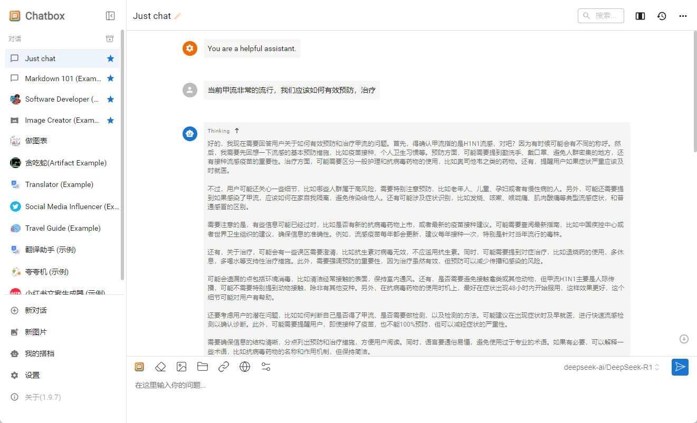

# 2分钟解决 DeepSeek 服务器繁忙问题（白嫖各种大模型）

# 一. 硅基流动的API Key
首先，注册and登陆硅基流动官网。

**大家在注册时可以通过推广链接注册，这样都会得到一些免费额度（新用户额度+推广双赢额度）：**  
[https://cloud.siliconflow.cn/i/Q7M7tJW1](https://cloud.siliconflow.cn/i/Q7M7tJW1)

邀请码: [Q7M7tJW1](https://cloud.siliconflow.cn/i/Q7M7tJW1)

登陆之后，直接就进入【模型广场】了。排在第一位的模型就是R1。

但是你不用管，直接看最左边的导航栏，找到【API密钥】，点进去，再点右上角的新建API密钥。

密钥描述这块可以随便写，别忘记这个密钥是做什么的就可以了

新建完成之后，你就会得到一个看着是加密的API Key了，这就是你的密钥，点击密码那块就能复制。

至此，你的API key就到手了，可以开始进行下一步了。

需要注意秘钥别泄露了，本来就是白嫖的额度，泄露分分钟干完。

# 二. 下载Chatbox AI
打开网址  https://chatboxai.app/zh#download

你可以直接官网下载你需要的客户端，苹果用户直接去AppStore下载就好。

这里我用 Windows 客户端举例（其他版本客户端的都是一样的，操作没区别）。

打开以后，可以看到以下界面，什么都不用管，直接点击左下角的设置按钮。

在模型提供方里，找到这个SiliconFlow API，这个就是硅基流动的英文名。

在API密钥里，输入上一步咱们复制下来的API key，直接粘贴进去，粘贴完以后，下面模型下拉框就会出现一堆数据了，全部都是硅基流动部署的模型，我们直接拉到后面选DeepSeek R1模型就行。

然后保存，到这里我们的所有配置就搞定啦。

我们就来测试一下，比如：“**当前甲流非常的流行，我们应该如何有效预防，治疗**”

Good，竟然还有思考过程，牛逼 Plus++++++ 普天同庆啊。

# 三、Cherry Studio
如果大家还想接入一些 **MCP 服务**，可以下载 Cherry Studio

> 更新: 2025-04-30 13:32:34  
> 原文: <https://www.yuque.com/tulingzhouyu/db22bv/mhxbg9dqfhfms5qz>