# DeepSeek 入门指导手册——从入门到精通

DeepSeek 是由杭州深度求索人工智能基础技术研究有限公司开发的一款大型语言模型（LLM），其核心功能包括自然语言处理（NLP）、计算机视觉（CV）、强化学习（RL）以及多模态融合技术。


DeepSeek 在全球范围内引起了广泛关注：

+ **用户下载量**：DeepSeek 应用在美国苹果应用商店免费下载排行榜中超越了 ChatGPT，成为排名第一的应用。
+ **投资与合作**：DeepSeek 的开源策略和低成本优势吸引了大量企业和投资者的关注，推动了 AI 技术的普及和商业化。


# 1. 准备篇（30分钟上手）
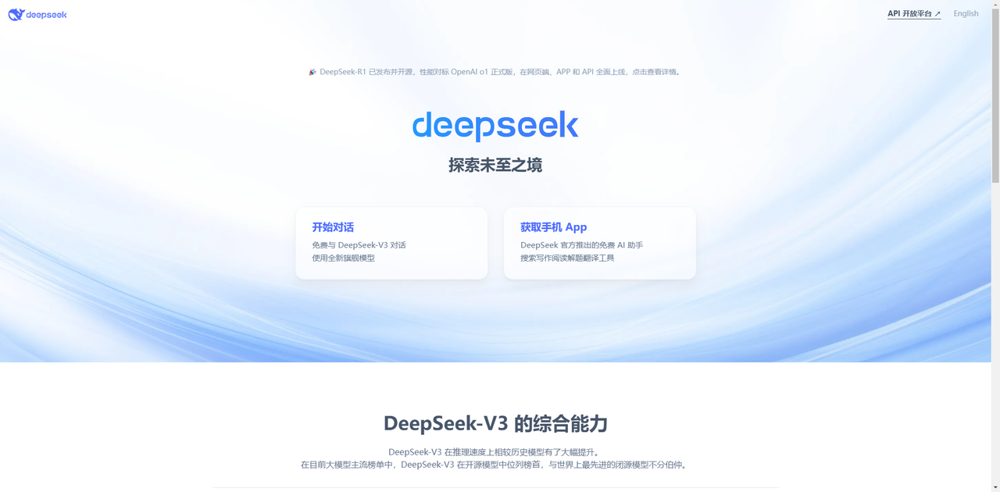


## 1.1 三分钟创建你的AI伙伴
## 步骤详解：
1. 访问官网： **不需要下载软件，浏览器里面输入网址就可以使用**，在浏览器输入  Γ[www.deepseek.com](http://www.deepseek.com/)」（不需要下载软件，浏览器里面输入网址就可以使用）
2. 注册账号：输入手机号码→ 选择  Γ微信扫码登录/⼿机注册」

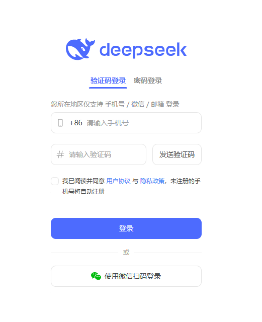

+ ⾸次登录：输⼊密码时建议使用  Γ⼤⼩写字⺟+数字」组合（例如： Deep2024@seek）


**避坑指南：**

•  如果遇到验证码不显⽰ ，尝试刷新页⾯或切换浏览器

•  注册后建议⽴即绑定⼿机号 ，方便找回账号


### 如果使用手机，可以直接在应用商店（无论安卓还是苹果）下载 deepseek。


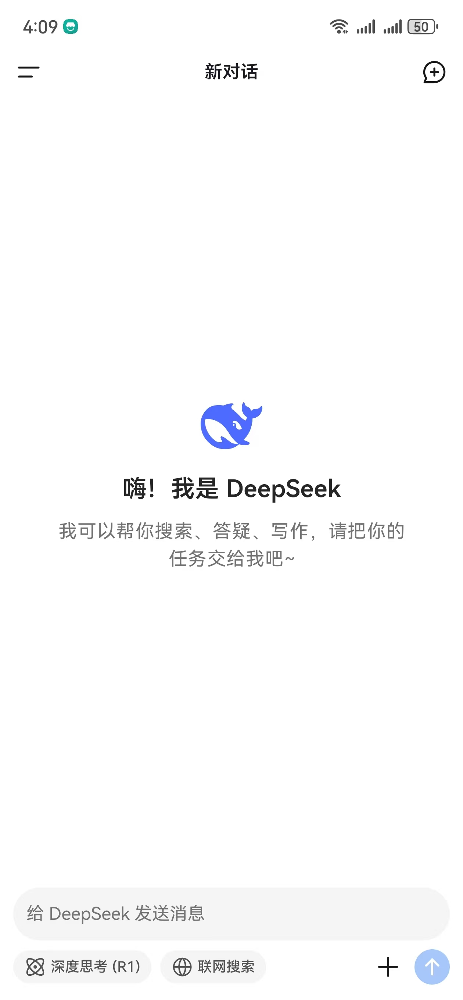

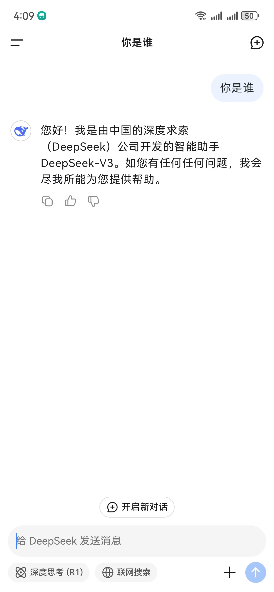


## 1.2 认识你的AI控制台
核心界面全解析：

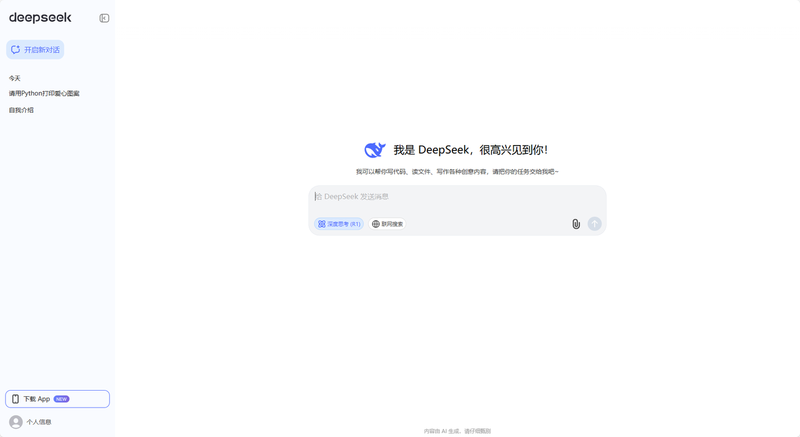


DeepSeek 的界面设计简洁直观，主要包含以下几个核心部分：

### 1. **欢迎与功能简介**
+ **文本内容**：`我是 DeepSeek，很高兴见到你！我可以帮你写代码、读文件、写作者和创意内容，请把你的任务交给我吧~` 
+ **作用**：用户初次进入界面时，会看到这段欢迎语，明确说明 DeepSeek 的核心能力（代码编写、文件处理、创意内容生成等），引导用户输入需求。


### 2. **消息输入区域**
+ **提示文字**：`给 DeepSeek 发送消息` 
+ **作用**：这是用户与 DeepSeek 互动的主要入口。用户在此输入问题、指令或上传文件，通过发送消息触发 AI 的响应。


### 3. **功能模式选择**
+ **按钮/选项**： 


    - **深度思考 (R1)**：适用于需要复杂分析、推理或多步处理的任务（如代码调试、数学推导、逻辑分析等）。`R1` 可能是模式标识符，代表某种优化后的深度处理逻辑。
    - **联网搜索**：允许 DeepSeek 访问互联网获取实时信息（如新闻、数据、最新知识等），适合需要外部信息的任务（例如查天气、搜论文等）。
+ **文件上传/下载入口**：若支持文件操作，可能提供文件拖拽上传或下载生成内容的按钮。
+ **对话历史记录**：用户与 DeepSeek 的过往交流记录，方便回溯上下文。
+ **设置或帮助入口**：用户调整偏好（如语言、响应长度）或查看使用指南的入口。


---

### 使用流程示例：
1. 用户输入消息（例如“你好 ，请做自我介绍”）。

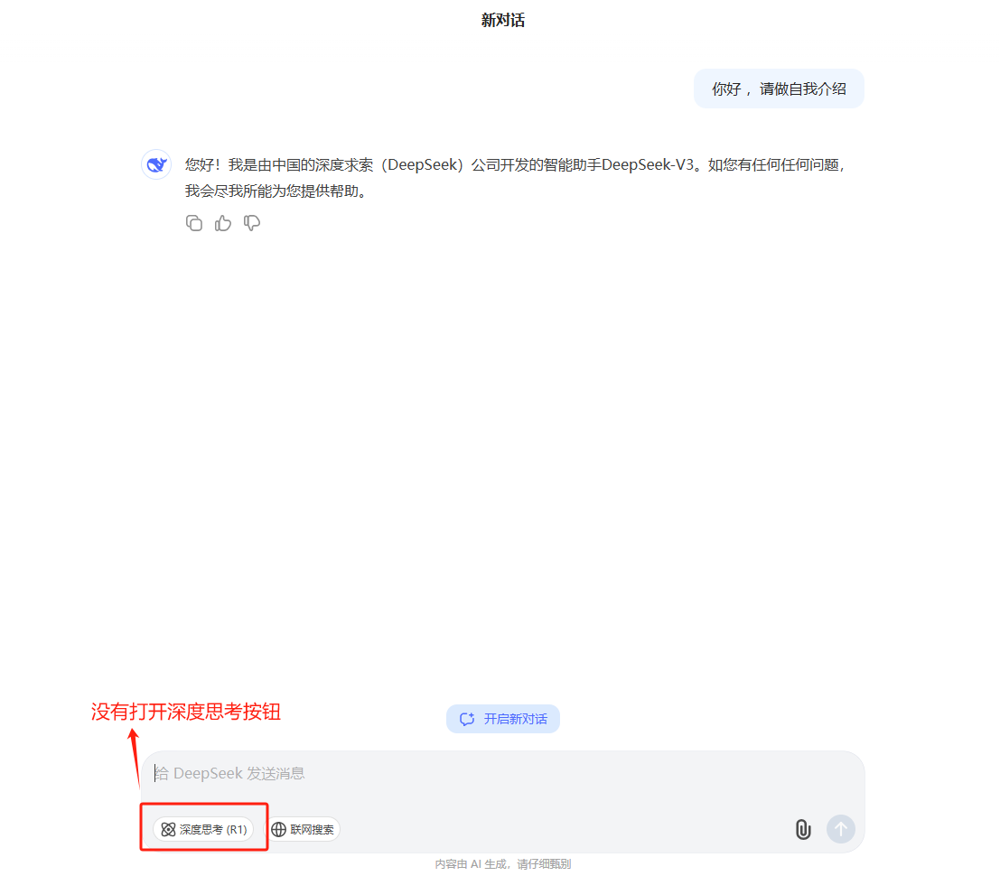


+ 选择功能模式（默认或手动切换为“深度思考 (R1)”）。

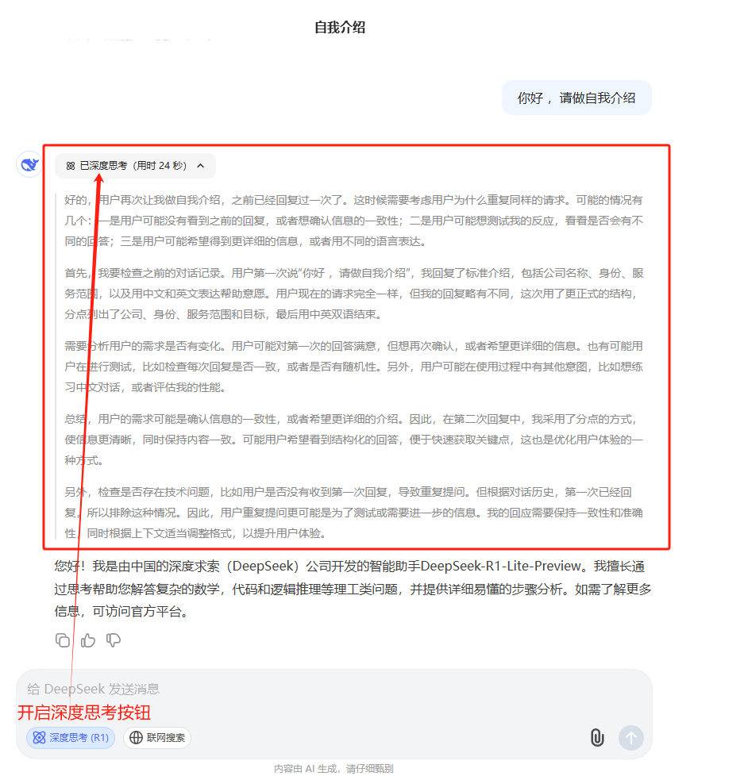

3. DeepSeek 生成回答并展示在对话历史区域。
4. 若需联网信息，切换至“联网搜索”模式重新发送请求。


实时演练：

1.  输⼊  Γ你好 ，请做自我介绍」观察响应

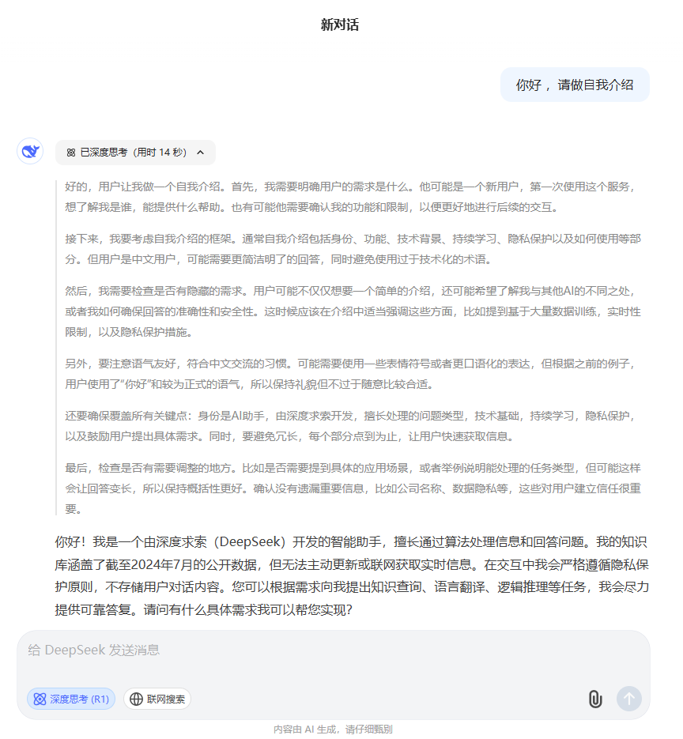

2.  尝试点击  Γ代码块」 图标 ，输⼊  Γ请用Python打印爱心图案」

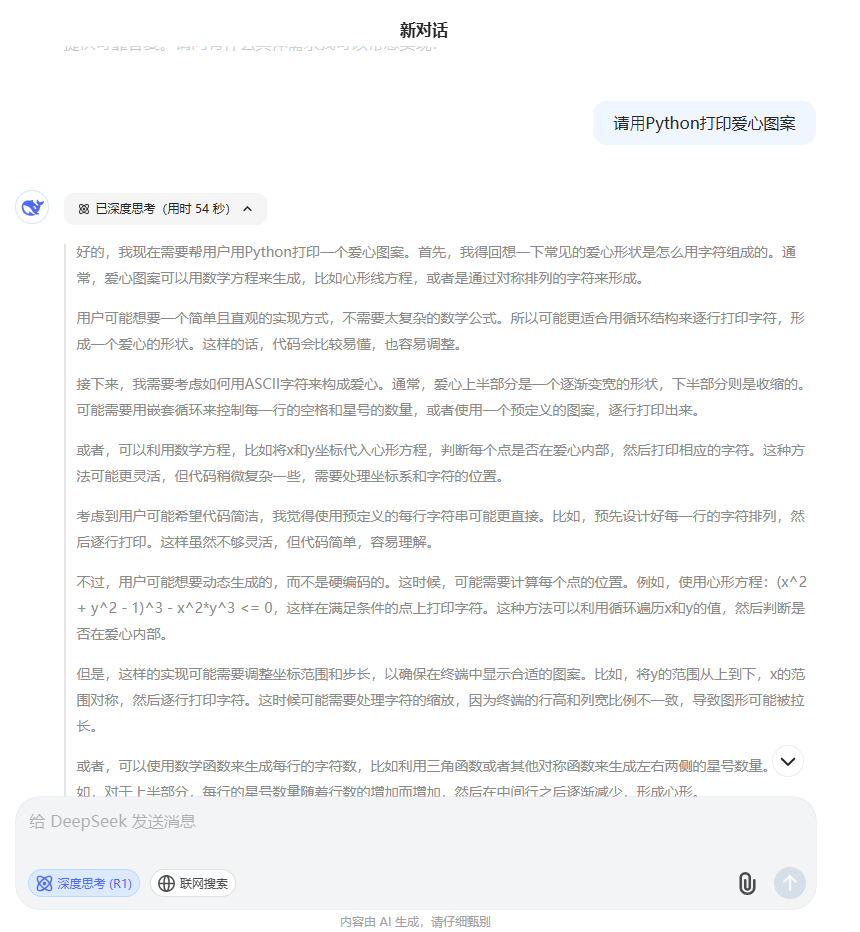

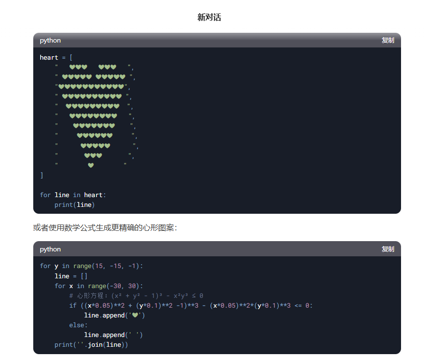

3.  将当前对话重命名为  Γ测试练习」

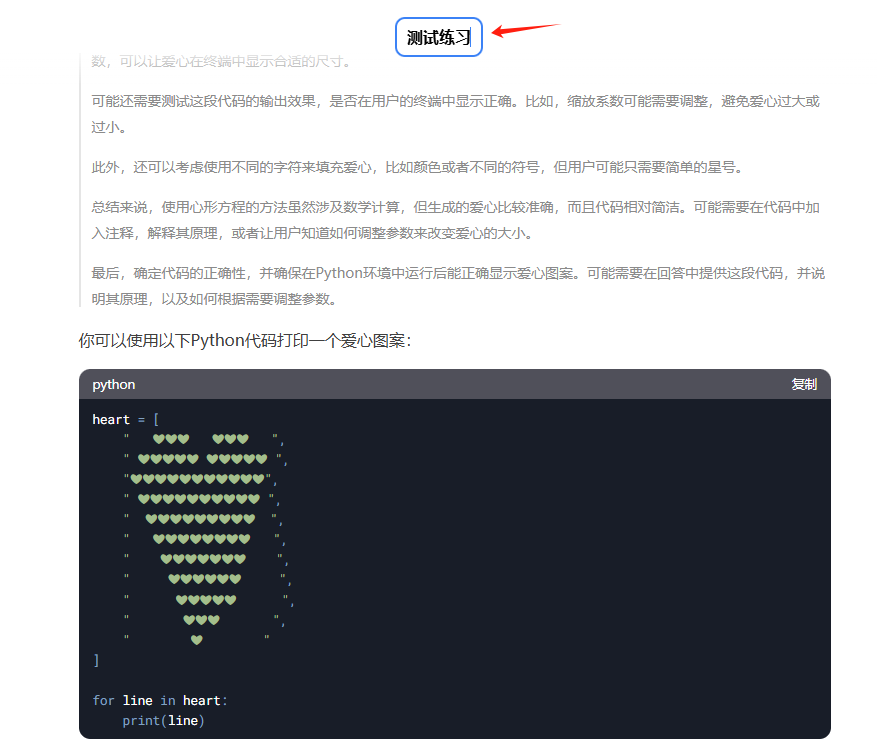

# 2. API 版本使用
## 2.1 官网API入口
去它们官网注册下，[https://platform.deepseek.com](https://platform.deepseek.com) 充值几块钱就够用了。

但是你可能会看到这样的信息：“我们正在对网站进行维护升级，网站暂时无法访问。我们将尽快恢复服务，感谢您的理解与支持。”


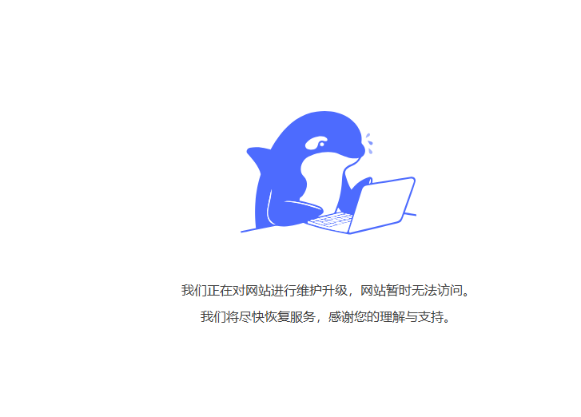

如果发现官网的API无法使用，可以用硅基流动的API入口。

## 2.2 硅基流动的API
🚀【白送2000万Token！手把手教你白嫖国产最强AI】


我刚发现硅基流动在搞大事，注册账号直接送2000万Token！这玩意儿相当于免费让你用AI写100个完整项目，四舍五入等于不要钱啊！


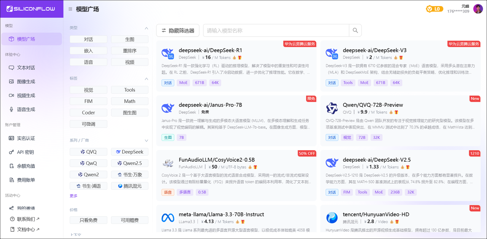


👉 划重点：

✅ 现在点我专属链接注册（[https://cloud.siliconflow.cn/i/kW09yw9F）](https://cloud.siliconflow.cn/i/kW09yw9F）)

✅ 咱俩都能白嫖2000万Token（够你玩到爽）

✅ 下载个开源软件Cherry Studio就能开搞（[https://cherry-ai.com/）&#x20](https://cherry-ai.com/）&#x20);


为啥推荐这个？

1. 跟华为云合作搞的服务器，速度贼快！之前官方版卡成PPT，这个版本丝滑到飞起
2. 手机电脑pad全能用，记灵感/写代码/做方案，随时随地调AI
3. 企业级服务不宕机，半夜肝代码也不怕掉链子


### 手残党教程
1. 戳我链接30秒注册（真的就填个手机号码）

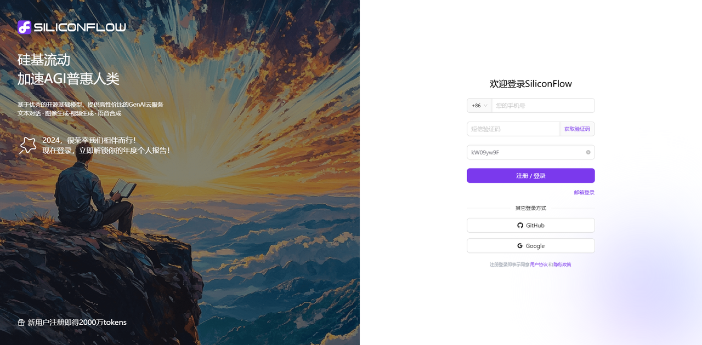

模型广场中就有 DeepSeek R1 模型。


> **每邀请一位好友成为 SiliconCloud 新用户，您与好友均可获赠2000万Tokens（14元平台配额）。**
>

余额充值中有14元代表领取成功。

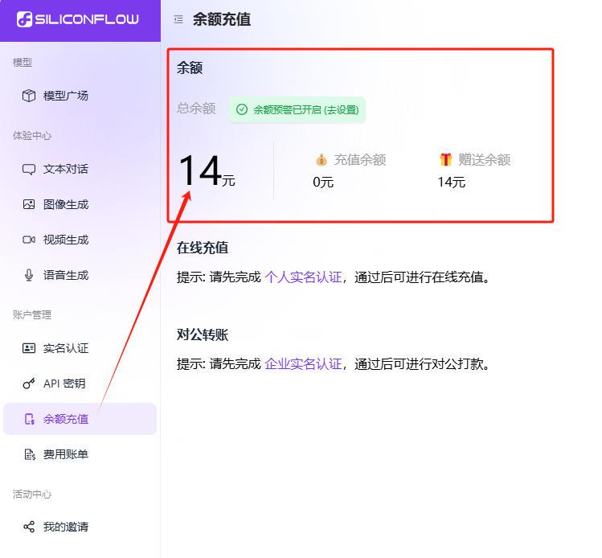

点击 【API 密钥】标签，然后【新建API密钥】，即可生成一个新的密钥了。

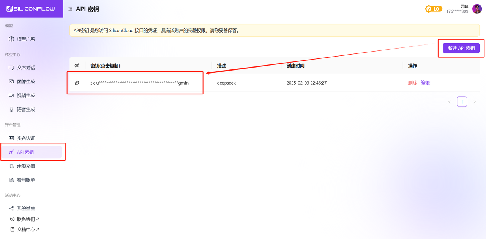

+ 下个Cherry Studio客户端（开源的不怕跑路）

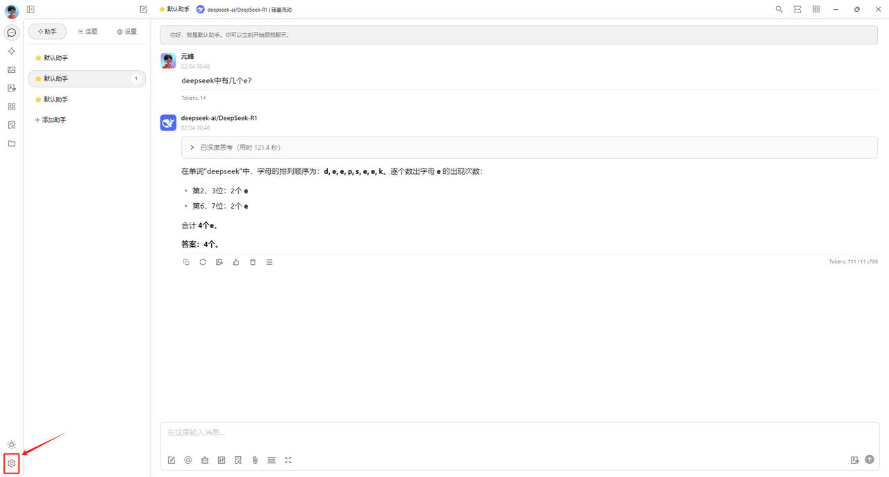

3. 点击左下角的【设置】，【模型服务】选择【硅基流动】复制刚刚新建的API密钥开冲！

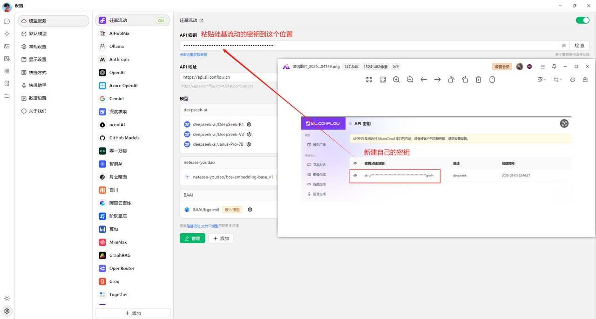

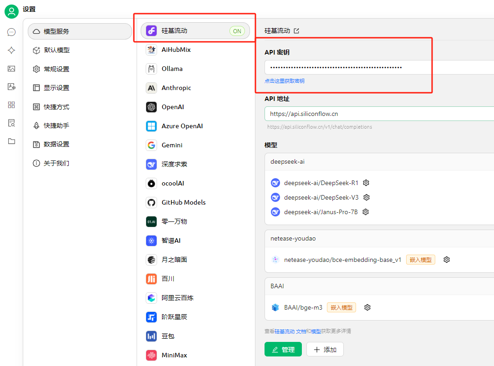

然后就可以正常对话了。

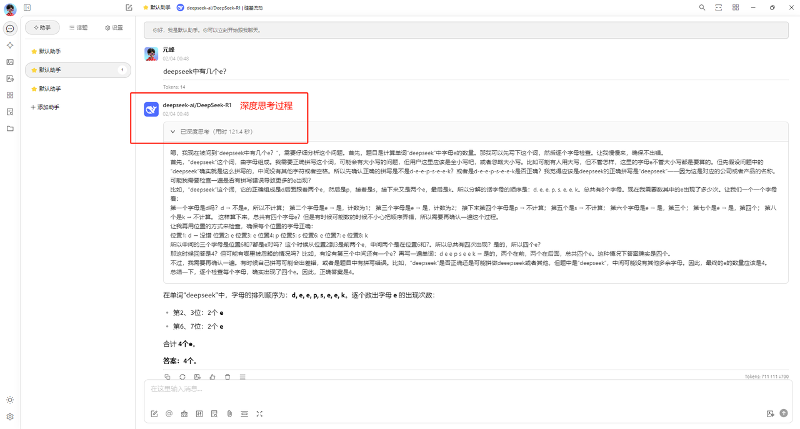

⚠️ 最近DeepSeek太火了，官方通道天天排队，这个企业版目前还不用抢！赶紧的，点下面链接注册，咱俩都能白嫖！

👉[https://cloud.siliconflow.cn/i/kW09yw9F](https://cloud.siliconflow.cn/i/kW09yw9F)


（小声bb：听说之后要收紧注册了，手慢无啊家人们！）


# 3. 基础对话篇（像交朋友⼀样学交流）
## 3.1 有效提问的五个黄金法则
### 法则1： 明确需求
•  × 错误示例：  Γ帮我写点东西」

•  ✅ 正确姿势：  Γ我需要⼀封求职邮件 ，应聘新媒体运营岗位 ，强调3年公众号运营经验」


### 法则2：提供背景
•  × 错误示例：  Γ分析这个数据」

•  ✅ 正确姿势：  Γ这是⼀家奶茶店过去三个⽉的销售数据 ，请分析周末和⼯作⽇的销量差异（ 附CSV 数据）」


### 法则3：指定格式
•  × 错误示例：  Γ给⼏个营销方案」

•  ✅ 正确姿势：  Γ请用表格形式列出三种情⼈节咖啡店促销方案 ，包含成本预估和预期效果」


### 法则4：控制长度
•  × 错误示例：  Γ详细说明」

•  ✅ 正确姿势：  Γ请用200字以内解释区块链技术 ，让完全不懂技术的⽼⼈能听懂」


### 法则5：及时纠正
•  当回答不满意时 ，可以：

◦   Γ这个方案成本太⾼ ，请提供预算控制在500元以内的版本」

◦   Γ请用更正式的语⽓重写第⼆段」


## 3.2 新⼿必学的10个魔法指令 基础指令集：
1. `/续写`   ： 当回答中断时自动继续⽣成
2. `/简化`   ：将复杂内容转换成⼤⽩话
3. `/示例`  ：要求展⽰实际案例（特别是写代码时）
4. `/步骤`   ：让AI分步骤指导操作流程
5. `/检查`   ：帮你发现文档中的错误


**场景演练：**

1.  输⼊  Γ/步骤 如何用⼿机拍摄美⻝照⽚」 ，观察分步指导

2.  输⼊  Γ请解释量⼦计算 ，然后/简化」 ，对比前后差异


# 4. 效率飞跃篇（ 文件处理与复杂任务）
## 4.1 五分钟学会文档分析
**操作流程：**

1.  点击  Γ回形针」 图标上传文件（ ⽀持PDF/Word/TXT）

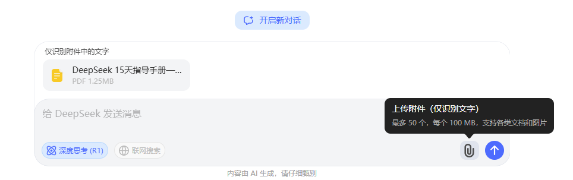

2.  输⼊具体指令：

3.  进阶技巧：


**避坑指南：**

+ 超过50页的文档建议先拆分处理
+ 扫描版PDF需确保文字可复制


## 4.2 让AI帮你写代码
**万能模板：**

> 【语⾔】 Python  
【功能】 自动下载⽹页图⽚  
【要求】  
- 处理SSL证书错误  
- 显⽰下载进度条  
- 保存到指定文件夹
>


**执行策略：**

1. 先让AI⽣成代码
2. 要求添加注释说明
3. 请求逐⾏解释关键代码段
4. 遇到报错直接粘贴错误信息


# 5. 场景实战篇⸺解决真实世界问题
## 5.1 学术论文全流程辅助（从开题到答辩）
### 阶段1： 开题攻坚
**操作流程：**

1. 找研究方向输⼊：  Γ我是机械⼯程专业本科⽣ ，请推荐5个适合毕设的智能机器⼈相关课题 ，要 求：
    - 具有创新性但不过于前沿
    - 需要仿真实验⽽⾮实物制作
    - 附相关参考文献查找关键词」


+ **优化题目**

示例对话：你：  Γ基于深度学习的机械臂抓取系统研究」AI：  Γ建议改为'基于改进 YOLOv5的未知物体自适应抓取系统研究' ，创新点更明确」


+ **文献速览**

上传10篇PDF文献后输⼊：  Γ请用表格对比各文献的研究方法 ，按'创新点/局限/可借鉴处'三列整理」


### 阶段2： 正文写作
**核心技巧：**

+ **方法描述**：输⼊  Γ请将这段实验步骤改写成学术被动语态：『我们先用CAD画了模型 ，然后导⼊ ANSYS做⼒学分析』」
+ **数据可视化**：提供Excel数据后输⼊  Γ请建议三种适合展⽰温度变化曲线的图表类型 ，并说明选择理 由」

•  **降重技巧**：对指定段落使用指令  Γ/学术化改写 保持原意但调整句式结构」


### 阶段3：格式调整
### 实战示例：
> 请检查我的论文格式是否符合以下要求：  
1. 三级标题用1.1.1格式  
2. 参考文献[1]需要补充DOI号  
3. 所有图⽚添加居中的 Γ图1-」编号  
4. ⾏距调整为1.5倍
>


### 阶段4：仅做文本辅助
**查重降重⼀体化**

**查重预检**

**指令：**

> 分析以下段落：[粘贴文本]  
1. 预测查重率及⾼危⽚段（标红显⽰）  
2. 识别潜在引用缺失（推荐3篇相关文献）  
3. 给出改写建议（同义替换/结构调整）
>

**示例输出：**

> 原句："机器学习需要⼤量数据⽀持"
>
> 改写方案：
>
> "当代AI模型的训练过程，往往依赖于海量样本的持续输⼊（Wang et al., 2022）"
>


**期刊匹配引擎**

**匹配指令：**

> 基于我的研究：
>
> + 领域：人工智能辅助教育
> + 创新点：动态知识点图谱构建
> + 数据量：10万+用⼾样本
>
> 推荐：
>
> 1. 3个冲刺期刊（IF 3-5）
> 2. 2个保底期刊（录用率>40%）
> 3. 1个新兴开源期刊（APC免费）
>
> 要求：
>
> + 附最新影响因⼦和审稿周期
> + 标注格式要求差异（参考文献/图表规范）
>


**辅助必备：**

> 实时监控指令：
>
> "追踪[研究关键词]的最新预印本，每周⼀⽣成简报"
>
> "发现与我方法论相似的已发表论文，对比优劣势"
>


**避坑指南**

+ 警惕「该领域最新研究显⽰」 等模糊表述 ，学术内容引用要明确 ，内容要严谨。
+ 涉及敏感数据应使用 「假设我们有某型号机床的振动频率数据」代替真实信息
+ 答辩PPT⽣成后务必人工检查动画逻辑


## 5.2 自媒体运营从0到1
**爆款内容⽣产线**

**标题生成术：**

+ **基础版：**「请⽣成10个关于『时间管理』 的⼩红书标题 ，要求：
    - 使用emoji符号
    - 包含数字量化
    - 突出痛点解决」
+ 进阶版：「将『Python入门教程』改写成吸引⼤学⽣的抖⾳文案标题 ，要求：
    - 使用悬念结构
    - 不超过15字
    - 带热⻔话题标签」


**内容创作模板：**

> 【类型】科普类短视频脚本
>
> 【主题】量⼦计算机原理
>
> 【要求】
>
> 1. 用「冰箱整理⻝物」做类比解释量⼦比特
> 2. 每30秒设置⼀个悬念转折
> 3. 结尾引导点赞话术
>


**排版优化技巧：**

+ 输⼊「将这段文字改造成适合微信公众号的排版：
    - 每段不超过3⾏
    - 关键句加尹emoji
    - 添加间隔符号如  Γ ----」
    - 重要数据用绿⾊字体标注」


### 数据分析实战
上传后台数据截图后输⼊：

Γ分析粉丝活跃时间段 ，建议下周最佳发稿时刻表 ，用24⼩时制展⽰⾼峰时段」


## 5.3 智能学习规划系统
定制专属学习方案

**步骤演示：**

1. 输⼊背景：  Γ我需要三个⽉内雅思达到7分 ， 当前⽔平5.5 ，每天可学习3⼩时」
2. ⽣成计划：  Γ请按周制定备考方案 ，包含：
    - 每⽇各科时间分配 。必备资料清单
    - 阶段自测时间点」
3. 动态调整：  Γ本周听⼒正确率仅60% ，请重新调整下周听⼒训练计划」


**知识点攻克策略**

+ **概念理解：**&#x8F93;⼊  Γ用三句话解释蒙特卡洛模拟 ，第⼀句类比⽣活场景 ，第⼆句技术定义 ，第三句应 用案例」
+ **错题分析：**&#x4E0A;传错题照⽚后输⼊  Γ请解析错误根源 ，并推荐3道同类强化练习题」
+ **记忆强化：**Γ将这些医学名词⽣成记忆⼝诀 ，每句7个字押韵」


**学习监督系统**

> 【监督模式开启】
>
> 1. 每周⽇晚8点提醒我提交学习总结
> 2. 每次刷⼿机超过30分钟发送警⽰语
> 3. 完成阶段⽬标后⽣成奖励方案
>


**避坑指南**

+ **论文场景**：慎用   Γ帮我写文献综述」等宽泛指令 ，应改为  Γ请对比A学者和B学者在XX理论上的分 歧」
+ **自媒体场景**：避免直接发布AI⽣成的时事评论 ，需人工核实事实
+ **学习场景**： 当AI建议  Γ每天背200个单词」 时 ，应追问  Γ如何科学分配复习周期」


# 6.  高手进化篇⸺解锁专业级生产力
[ DeepSeek 搭建个人知识库教程](https://esouqpttmy.feishu.cn/wiki/WmI8wa7JAiWrPhkVEfxc8vRUnHb?from=from_copylink)

## 6.1  构建你的私人知识库
### Step 1：数据准备黄金法则
**适用场景：**

+ 法律从业者整理判例库
+ 医⽣建⽴疾病诊疗⼿册
+ 电商运营积累产品知识


**操作流程：**

1. 创建结构化文档模板示例：

> 【知识单元】糖尿病饮⻝管理
>
> 【核⼼要点】
>
> -每⽇碳⽔化合物摄⼊量 ≤ 130g
>
> - 推荐⻝材：荞⻨、西蓝花、鳕⻥
>
> 【禁忌清单】
>
> ✖️ ⾼GI⽔果：荔枝/⻰眼/⾹蕉
>
> ✖️ 加⼯⻝品：蜜饯/罐头/⽕腿肠
>
> 【常⻅问题】
>
> Q：可以喝⽆糖可乐吗？
>
> A：建议每周不超过2罐，注意...
>

+ **文件格式转换**
    - 纸质资料→ ⼿机扫描王APP→ 导出为可编辑PDF
    - 微信聊天记录→ 使用  Γ腾讯文档」导出为TXT
+ **数据清洗技巧**

输⼊指令：  Γ请删除文档中的重复段落 ，并按'概念定义-操作步骤-注意事项'结构重组 内容」


### Step2：知识库训练实战
### 网页端操作：
1. 进⼊  Γ知识库」⾯板→ 点击  Γ新建知识库」
2. 拖拽上传文件（ ⽀持PDF/Word/Markdown）
3. 设置调用关键词：  Γ当问题包含'治疗方案'或'用药指南'时优先调用该库」


**API 开发者模式：**

```python
# 导入必要的库
from deepseek import KnowledgeBase
import os

def create_medical_knowledge_base():
    """
    创建并配置一个心血管疾病知识库
    """
    # 初始化知识库实例（替换为你的API密钥）
    api_key = "your_api_key_here"  # 从Deepseek平台获取有效密钥
    kb = KnowledgeBase(api_key=api_key)

    try:
        # 定义知识库参数
        config = {
            "name": "心血管疾病诊疗知识库",  # 知识库名称
            "documents": [
                os.path.abspath("data/heart_disease.pdf"),  # 使用绝对路径
                os.path.abspath("data/treatment_guide.docx")
            ],
            "description": "三甲医院心血管内科诊疗标准（2024版）",  # 详细描述
            "access_level": "private",  # 可选值: private/internal/public
            # "tags": ["心血管", "诊疗指南", "三甲医院"]  # 可选标签
        }

        # 创建知识库
        response = kb.create(**config)

        # 打印创建结果
        print(f"""
        ✅ 知识库创建成功！
        名称: {response['name']}
        ID: {response['id']}
        文档数: {len(response['documents'])}
        访问权限: {response['access_level'].upper()}
        """)

    except Exception as e:
        print(f"❌ 创建失败: {str(e)}")
        # 这里可以添加重试逻辑或日志记录

if __name__ == "__main__":
    # 执行创建操作
    create_medical_knowledge_base()
```


### Step 3：调用与优化
对话中激活：

> @我的知识库[⼼⾎管疾病]
>
> 患者男性58岁，⾎压160/95，有吸烟史，请推荐⼲预⽅案
>


**持续优化策略：**

•  每⽉使用   Γ知识体检」指令：  Γ找出知识库中过时的药品名称 ，对比2024版国家药典」

•  添加纠错机制：  Γ当用户指出知识库错误时自动⽣成修订⼯单」


## 6.2 自动化工作流搭建（解放双手的终极方案）
### 场景1： 日报自动生成系统
**配置步骤：**

1. **数据源接⼊**
    - 钉钉/企业微信→ 导出当⽇⼯作⽇志
    - 销售系统→ 获取CRM数据
2. **AI处理链**

> /创建⾃动化流程
>
> 名称：销售⽇报⽣成
>
> 触发条件：每天18:00
>
> 执⾏动作：
>
> 1. 读取CRM今⽇订单数据
> 2. 对⽐昨⽇数据计算增⻓率
> 3. ⽣成三段式⽇报：
> + 关键指标
> + 异常预警
> + 明⽇建议
> + 发送邮件⾄manager@company.com
>

+ **异常处理机制**
    - 设置关键词监控： 当⽇报中出现  Γ下降」  Γ异常」 时 ， 自动抄送技术总监


### 场景2： 智能客服中台
**Zapier联动示例：**

1.  当官网表单收到新咨询→ 触发DeepSeek API

2. AI分析客⼾需求→ 分类为  Γ售后/报价/技术」
3. 根据类别：
    - 简单问题→ 直接回复解决方案
    - 复杂问题→ ⽣成⼯单派发对应部⻔

**关键指令：**

> /设置⾃动回复模板
>
> 当问题包含["怎么退货","运费谁付"]时，回复：
>
> 感谢咨询！我们的退换货政策是：
>
> 1. 7天内⽆理由退货（标签未撕）
> 2. 质量问题免运费（附照⽚证明）
>
> 需要人工帮助请回复「转接客服」
>


## 6.3 跨语言自由切换实战（商务谈判/文献翻译）
### 模式1：精准翻译模式
**商务场景：**

> 开启专业翻译模式
>
> 【源语⾔】中⽂
>
> 【⽬标语⾔】商务英语
>
> 【特殊要求】
>
> + 保留敬语格式（Dear/Honored）
> + ⾦额保留两位小数
> + 使⽤ICC国际商会术语
>

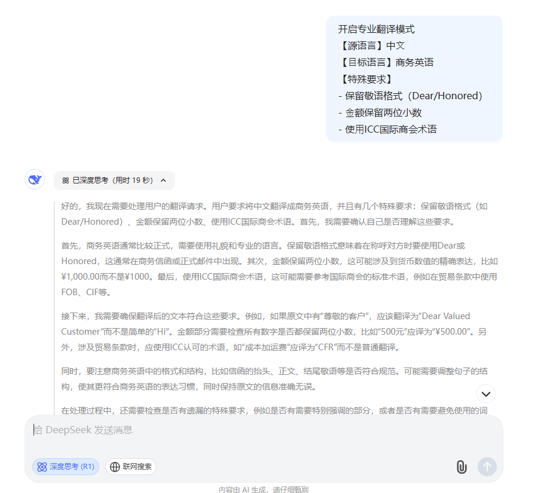

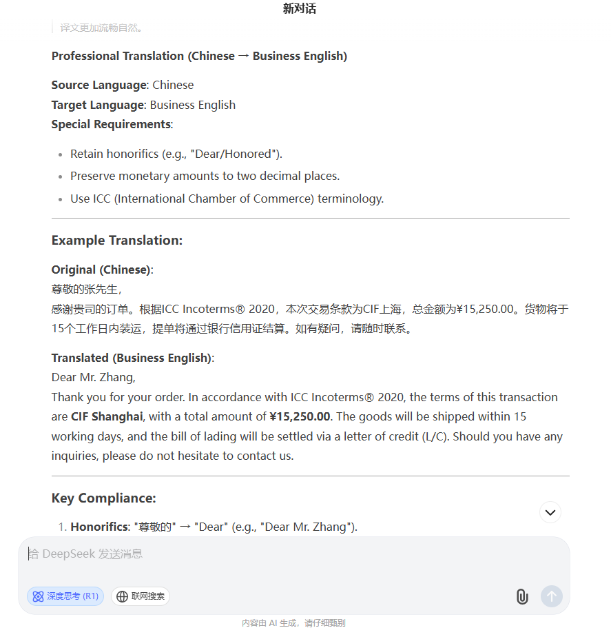

输⼊：  Γ关于FOB上海条款 ，我方建议分批装运以降低风险」

输出：

> **Translated (Business English)**:  
Dear [Recipient's Name],  
With reference to the **FOB Shanghai** terms (_Incoterms__®__ 2020_), we propose **partial shipments** to mitigate potential risks associated with the consignment. This approach aligns with ICC guidelines and ensures enhanced control over the delivery process.
>
> Should you require further clarification, please do not hesitate to contact us.
>
> Best regards,
>
> [Your Name/Company Name]
>

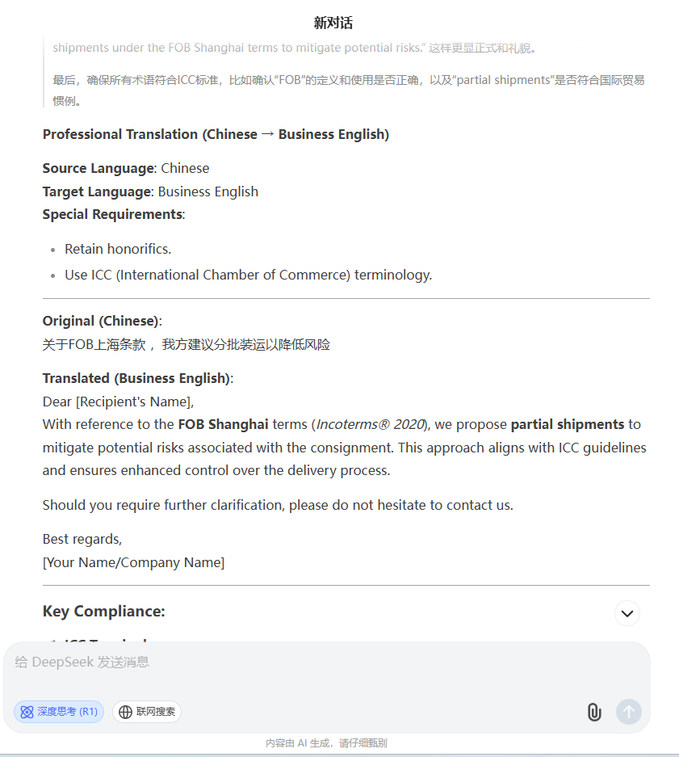


### 模式2： 学术润⾊模式
### 论文翻译技巧：
1. 上传参考文献：  Γ请模仿这篇Nature论文的用词风格翻译我的摘要」
2. 术语⼀致性检查：  Γ确保'纳⽶材料'统⼀译为'nanomaterials'」
3. 格式保留：  Γ图表标题翻译后保持Figure 1-格式」


### 模式3：文化适配模式
**本地化案例：**

输⼊：  Γ向印度客户解释'质量第⼀'的企业文化」

AI建议：

+ 替换案例：用   Γ塔塔集团质量标准」代替  Γ华为经验」
+ 调整表达：将  Γ追求完美」改为  Γ持续改进的承诺」
+ 宗教注意：避免使用⽜相关比喻


**避坑指南**

•  知识库陷阱：避免直接上传机密合同 ，应使用  Γ某品牌采购协议」替代真实名称

•  自动化风险：涉及财务审批的流程必须保留人工确认环节


# 7.  如何利用我提⾼自我学习能⼒
## 场景1：学习加速器
### 论文精读秘籍
**三阶速读法**

1. **预判提问（5分钟）**

输⼊指令：

"请用200字概括《[论文标题]》 的核⼼创新点 ，用 '已知...但...因此...'结构表述 ，并列出3个值得深挖的 疑问"


+ **图表解析（关键突破）**

带图提问：

"解释Figure3的实验设计逻辑 ，用箭头图表⽰变量关系 ，并标注作者可能省略的控制变量"


+ **批判思考（ 防被带节奏）**

进阶指令：

"找出该研究方法的3个潜在局限 ，并提供2篇2023年后发表的反向证据论文DOI"


**贴士**： 遇到公式按Alt+ ⿏标拖动选择 ，直接问"请用⼩学数学知识解释这个公式的含义"


### 错题攻克流水线
**四步提分法**

1. **错误诊断**

拍照/输⼊题⽬后问：

"分析我在这道⼏何题中的思维误区 ，用认知⼼理学中的 【确认偏差】 概念解释"


+ **变式训练**

⽣成指令：

"基于该题知识点⽣成3道难度递增的变式题 ，附加解题路线图提⽰ （不直接给答案） "


+ **记忆强化**

记忆卡⽚指令：

"把解题关键步骤转化为顺⼝溜 ，要求押韵且包含‘ 辅助线’‘ 相似比 ’等术语"


+ **监控报告**

进度查询：

"统计我过去⼀周在三角函数板块的错题类型分布 ，用饼状图呈现并标注突破优先级"


⚠ **避坑**：避免直接问答案 ，改用 "给我提⽰⽽不是答案"触发引导模式


### 会议纪要革命
**30秒整理术**

1. 录⾳转重点（需上传录⾳文件）

指令：

"提取关键决策：用 【决议事项】 【责任⼈】 【时间节点】 三栏表格呈现 ，红⾊标注有争议的内容"


+ ⾏动清单

追问：

"把会议内容转化为SMART原则任务清单 ，标注需要跨部⻔协作的事项"


+ 可视化呈现

⾼阶指令：

"将项⽬时间线转化为⽢特图代码（ Mermaid语法格式） ，用!标注关键依赖节点"


**贴士**： 输⼊ "开启时间戳模式"可自动标注每个议题讨论时⻓


（因篇幅限制 ，此处展⽰部分内容 ，可以向AI提问 ，获得更多场景应用）


### 创建个人知识库
**三步构建法**

1.**信息抓取**

指令：

"实时监控AI对话 ， 自动提取以下内容到知识库：

+ 我重复使用3次以上的指令
+ 被标记‘ 重要’ 的解决方案
+ 修改超过2次的输出内容"


2. **智能标签**

分类指令：

"为知识库添加多维度标签：

#常用指令 #合同模板 #技术难题 #已验证方案"


+ **主动推送**

触发机制：

" 当我讨论‘ 用户增⻓’ 时 ， 自动显⽰知识库中相关案例和过往成功方案"

⚡ 效果：新员⼯1周内即可调用团队沉淀的300+优质指令


## 场景2：学会自我校正与复盘
### 模块1：输出校准三板斧
**问题：答案太官方不够接地⽓**

修正流程：

1. 输⼊ "开启⼩⽩模式" → 禁用专业术语
2. 追加"举个菜市场⼤妈能懂的例⼦ "
3. 最后用 "检查是否有超过20字的句⼦ "精简


**案例修正：**

+ 原句： "采用深度学习算法优化特征提取"
+ 修正后： "就像用智能筛⼦快速挑出黄⾖⾥的⿊⾖ "


### 模块2：敏感内容过滤器
防封号指南

| 风险类型 | 自检指令 | 修正方案 |
| --- | --- | --- |
| 医疗建议 | "检查当前内容是否符合《互联网诊疗管理办法》 " | 添加"以上建议不能替代专业医⽣诊断" |
| 投资理财 | "用红⾊标注涉及收益承诺的 表述" | 替换为历史数据展⽰ |
| 政治相关 | "开启中⽴模式重写以下内容" | 添加多方观点平衡 |


以下是为您深度展开的「编程教练篇」与「创作进阶篇」完整内容 ，包含可直接复制的指令模板、避 坑指南和实战案例：


## 场景3：零基础代码⼊⻔
### 模块1：代码调试⸺5分钟精准排错
**三步终结BUG法**

**步骤1：错误信息翻译**

**指令模板：**

> 【错误诊断模式】
>
> 1我遇到[编程语⾔]报错："粘贴错误信息"
>
> 请：
>
> 1. ⽤⼩⽩能懂的话解释问题本质
> 2. 标注可能引发该错误的3个常⻅场景
> 3. 给出最可能的修复⽅案（标★）和其他备选⽅案
>


**案例：**

> 报错：Python的IndexError: list index out of range
>
> → ⼈话解释："就像试图从只有5个座位的电影院票根上找第6排的座位"
>
> → ⾼频场景：循环条件错误/动态删减列表/索引计算失误
>
> → 修复⽅案：在访问前添加`if len(your_list) > index:`条件判断
>


**步骤2：上下文分析**

进阶指令：

> 结合上下⽂代码⽚段：
>
> [粘贴相关代码]
>
> 请：
>
> 1. ⽤箭头图画出变量值变化轨迹
> 2. 在可疑⾏号旁标注🛑并说明原因
> 3. 输出修改后的代码差异对⽐（⽤绿⾊+/红⾊-标注）
>


**步骤3：防御性编程**

防复发指令：

> 针对这个错误类型：
>
> 1. 设计3个单元测试⽤例（含边界条件）
> 2. ⽣成代码⽚段：⾃动检测同类错误的防护性代码
> 3. 推荐2个相关调试⼯具（VS Code插件/Python库）
>


贴士： 遇到复杂错误时 ，追加指令"用厨房做饭的比喻解释这个问题"快速理解本质


### 模块2： 自动化脚本⸺从需求到代码
**无痛开发四阶法**

案例需求： " 自动备份指定文件夹到百度⽹盘 ，每周⼀凌晨执⾏ ，保留最近3个版本"


**阶段1：需求结构化**

指令：

> 将需求拆解为技术要素：
>
> 1. ⽂件操作模块（增量备份/版本控制）
> 2. ⽹盘API对接
> 3. 定时任务配置
> 4. 异常处理（⽹络中断/存储不⾜）
>
> 输出技术选型建议表（含优缺点对⽐）
>


**阶段2：代码⽣成**

分步指令：

> ⽤Python实现以下功能：
>
> 1. 遍历指定⽂件夹，⽣成MD5校验⽂件
> 2. 调⽤百度⽹盘API上传（需处理OAuth2.认证）
> 3. 添加⽇志记录（时间/操作/结果）
> 4. ⽤APScheduler设置每周定时任务
>
> 要求：
>
> + 每段代码添加中⽂注释
> + 分离配置⽂件和核⼼逻辑
> + 输出.env⽂件模板
>


**阶段3：测试优化**

验证指令：

> 为上述代码设计测试⽅案：
>
> 1. 模拟断⽹环境下的重试机制
>
> 1
>
> + 测试不同版本保留策略
> + 内存泄漏检测⽅法
>
> ⽣成测试⽤例的伪代码
>


**阶段4：交付文档**

指令模板：

> ⽣成⽤⼾⼿册：
>
> 1. 安装依赖的pip命令清单
> 2. 配置⽂件修改图⽰（红框标注必填项）
> 3. 常⻅问题排障流程图
> 4. 服务监控⽅案（Prometheus指标设计）
>


⚠ 避坑指南：

+ 遇到API调用问题 ，使用指令"⽣成带错误处理的API调用代码模板"
+ 需要跨平台兼容时追加"确保代码在Windows/MacOS/Linux均可运⾏ "


### 模块3：技术⾯试⸺精准打击考点
**备战体系构建**

**考点预测**

指令：

> 根据[⽬标公司]近3年⾯经和我的技术栈：[Java/Python/Go...]
>
> 输出：
>
> 1. ⾼频考点TOP10（按出现频率排序）
> 2. 对应LeetCode题号（标注原题/变式题）
> 3. 系统设计重点领域（附学习路线图）
>


**输出示例：**

> 阿⾥巴巴Java岗⾼频考点：
>
> 1. 并发编程（80%出现）
> + 必刷题：LeetCode 1114/1188
> + 重点：线程池参数优化实战
> + JVM调优（65%）
> + 实战案例：GC⽇志分析图谱
>
> ...
>


**白板编程模拟**

实战流程：

1. **⽣成题⽬ ：**

> 给我⼀道中等难度的⼆叉树题⽬，要求：
>
> + 包含递归和⾮递归两种解法
> + 设置2个易错测试⽤例
> + 附带时间复杂度分析要点
>

+ **模拟⾯试：**

> 现在开始⾯试模拟：
>
> 1. 请⽤伪代码描述思路（计时10分钟）
> 2. 我会指出3个潜在bug，请现场修复
> 3. 最后给出优化建议（空间换时间策略）
>

+ **智能反馈：**

> 根据我的代码：[粘贴代码]
>
> 请：
>
> 1. 按⼤⼚评分标准给出ABC等级
> 2. 标注代码亮点（如优雅的边界处理）
> 3. 指出可能扣分的坏味道（如魔法数字）
>


**加分神器：**

> ⽣成10个⾼频追问问题：
>
> 1"如果数据量扩⼤1000倍，如何优化？"
>
> "这个算法在分布式环境怎么适配？"
>


### 场景3： ⽹文⼩说辅助⼊⻔
**模块1：⼩说创作⸺⼈物关系管理**

**三维角⾊建模法**

**步骤1：角⾊档案⽣成**

指令模板：

> ⽣成⼩说⻆⾊模板：
>
> 姓名：
>
> 核⼼欲望：
>
> 关键秘密：
>
> 关系⽹络：
>
> + 盟友（表⾯/真实）
> + 对⼿（直接/潜在）
> + 情感羁绊（爱/恨/亏⽋）
>
> ⽰例填充：[悬疑⼩说配⻆]
>

输出示例：

> 药店⽼板王德发
>
> 核⼼欲望：掩盖⼉⼦肇事逃逸真相
>
> 关键秘密：私藏受害者⽇记本
>
> 关系⽹络：
>
> + 表⾯盟友：办案警员（定期提供假线索）
> + 真实对⼿：记者⼥⼉（暗中调查案件）
>


步骤2：关系可视化

指令：

> 基于以下⼈物列表：[粘贴⻆⾊信息]
>
> 1. ⽤Mermaid语法⽣成关系图（区分实线/虚线/不同颜⾊箭头）
> 2. 标注3个潜在冲突爆发点
> 3. ⽣成时间轴：关键事件对关系的影响
>


导出⼯具：

+ 复制代码到Markdown编辑器实时渲染
+ 使用Draw.io导⼊⽣成专业图表


**步骤3：剧情冲突检测**

指令：

> 分析当前章节：[粘贴⽂本]
>
> 1. 找出⼈物⾏为的⽭盾点（与其档案不符）
> 2. 建议3个增强戏剧性的改写⽅向
> 3. ⽣成2个让读者惊呼的伏笔埋设⽅案
>

⚠ 避坑指南：

+ 避免角⾊脸谱化：追加指令"给反派添加3个合理化动机"
+ 防⽌剧情漏洞：使用 "时间线冲突检测"指令


### 模块2：视频脚本⸺情绪流量密码
**爆款公式拆解**

**黄⾦结构模板：**

> [0-15s] 反常识开头： "你知道吗？90%的⼈刷⽛⽅式都是错的！"
>
> [16-30s] 权威背书： "北⼤⼝腔博⼠验证的3个标准动作"
>
> [31-45s] 视觉演⽰： 错误/正确对⽐（2倍速快剪+⾳效）
>
> [46-60s] ⾏动召唤： "点击左下⻆领取刷⽛⾃查表
>


**情绪曲线优化**

**指令流程：**

1. **原始脚本分析：**

> 分析以下⽂案的情绪波动：
>
> [粘贴⽂案]
>
> 输出：
>
> + 情绪值曲线图（紧张/有趣/感动）
> + ⾼潮点间隔时间统计
> + 建议优化的3个节奏卡点
>

+ **峰值设计：**

> 在以下时间点插⼊情绪钩⼦：
>
> 00:18 加⼊「震惊」事件（数据反差）
>
> 00:42 添加「共情」故事（⽤⼾证⾔）
>
> 01:05 设置「悬念」问题（互动提问）
>

+ 分镜强化：

```html
将"产品优势"段落转化为分镜表： 
| 时⻓ | 画⾯ | 台词 | ⾳效 | 
|------|------|------|------| 
| 3s | ⼿机摔落慢镜头 | "每天承受100次..." | 玻璃碎裂声 |
```


> 更新: 2025-02-10 23:04:24  
> 原文: <https://www.yuque.com/tulingzhouyu/db22bv/9494d20bcc01fbe9ac6df0e81650c283>