# DeepSeek本地部署教程

deepseek最近非常火，有时很卡顿，用不了，**那么本地部署的需求也随之而来，很多人是有这个需求的。**

其实很简单，几分钟就可以安装完。

  
**🚀**** 十分钟搞定！Windows电脑玩转DeepSeek本地部署**

  
**🌈**** 步骤一：安装灵魂工具Ollama**  
▌官网下载直通车：👉 https://ollama.com  

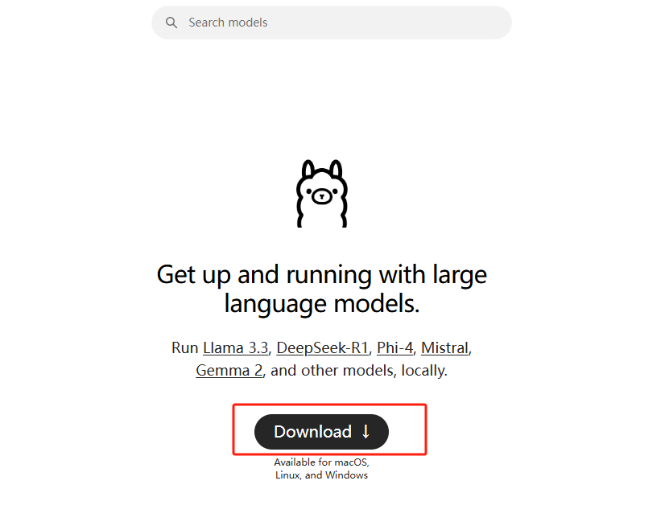

操作就像安装QQ一样简单，点击Download

1. 双击下载的.exe安装包
2. 狂点「下一步」直到完成

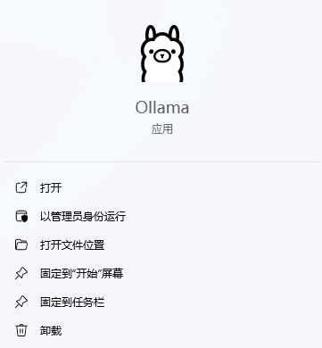

  
🌈** 步骤二：回到ollama的官网，搜索框里搜索deepseek-r1，选择要安装的模型**

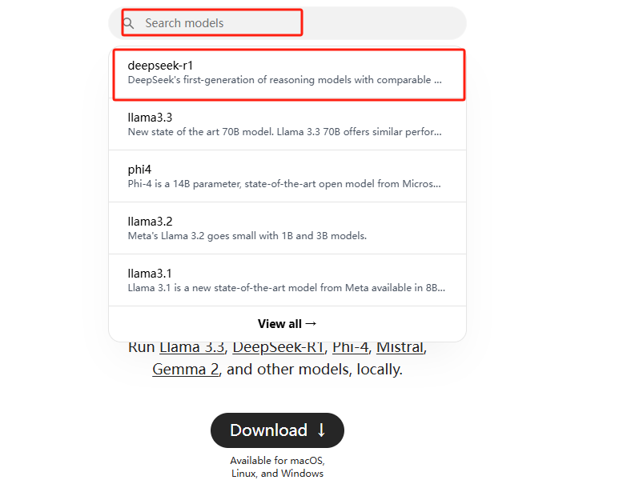  

点击下拉框，可以看到多个版本，区别是参数不一样，数字越大，代表参数越多，性能就越强，但也对计算机的性能要求较高。

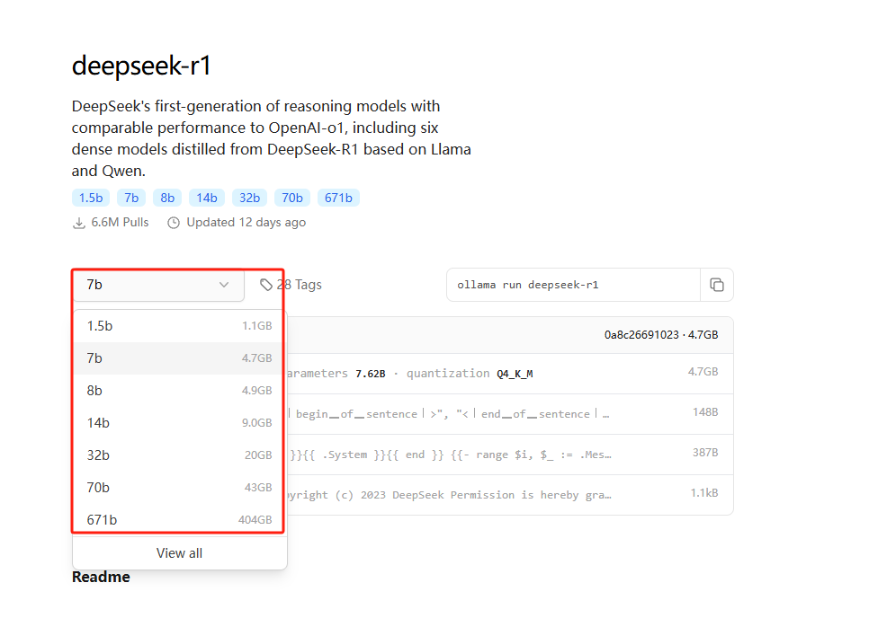

  
模型版本怎么选？电脑配置不行的，建议选择1.5B版本，这个模型有15亿参数，属于最轻量的Deepseek版本，电脑配置好点的，可以选择7b以上的。

  
**🌈**** 步骤三：复制右边的这串代码“ollama run deepseek-r1:1.5b”**

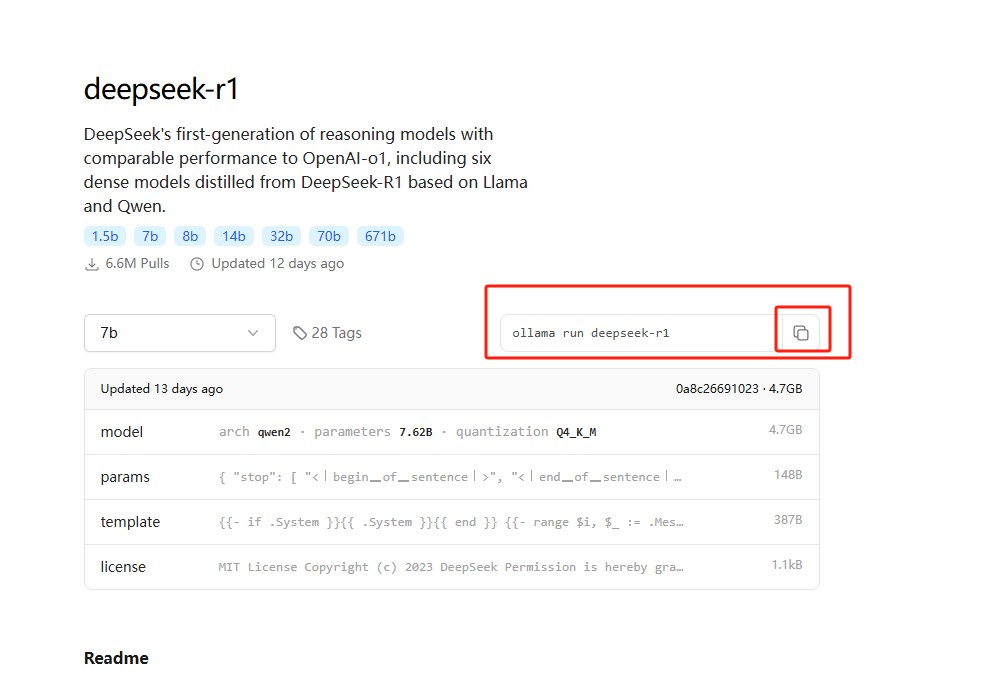

  
**🌈**** 步骤四：安装模型**

按下键盘上的win+R，调出运行窗口，输入cmd回车，调出命令行窗口。

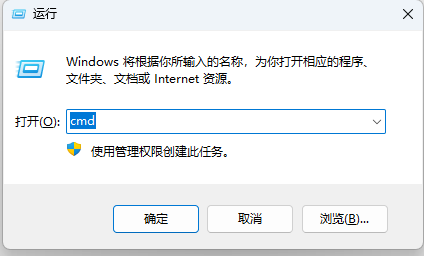  

**把复制的代码“ollama run deepseek-r1:1.5b”粘贴到命令行中，再点击回车，如下图所示。**

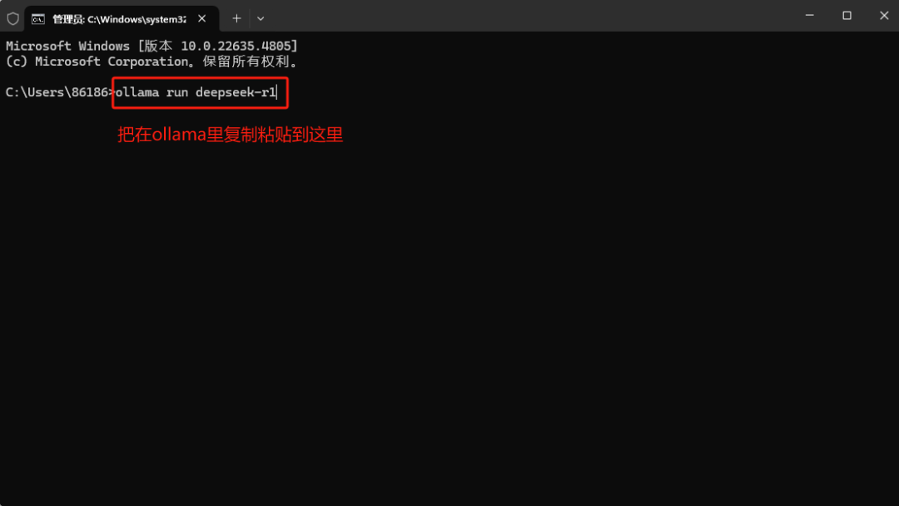

按回车键之后，就会开始安装，会有百分比的进度条，如下图所示

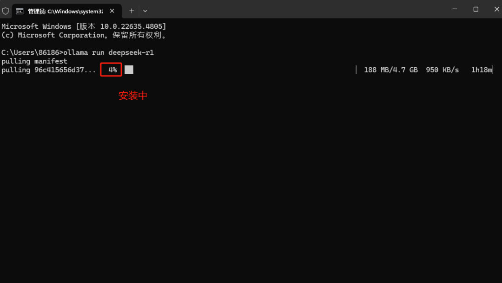

跑到了100%之后，就代表安装完成了，就可以和他对话了。

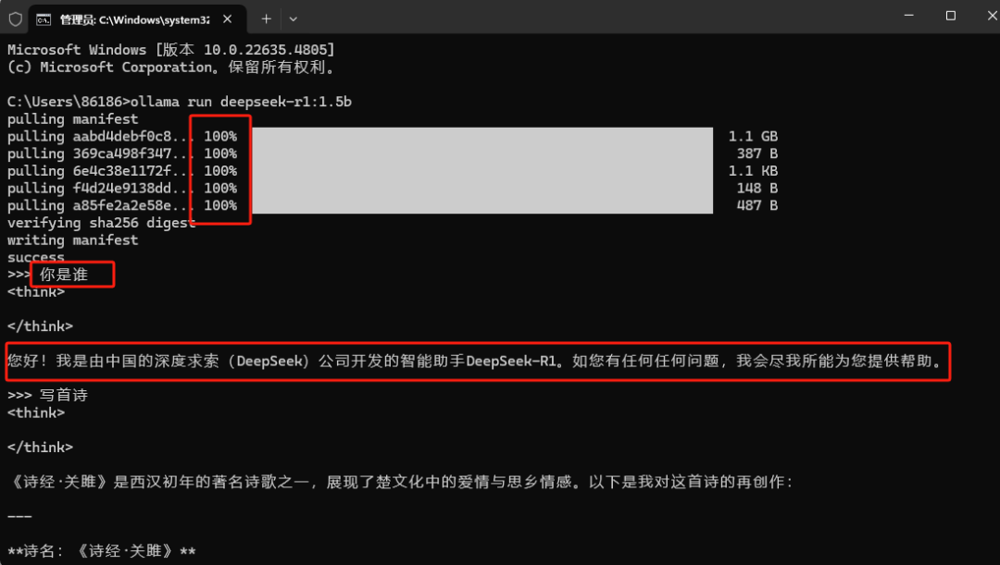

  
**🌈**** 步骤四：安装可视化工具：chatbox**

是时候告别黑乎乎的窗口了！咱们请出颜值担当：

🔥 ChatBox客户端  
▌官网直达：https://chatboxai.app

安装姿势：

1. 点击免费下载后，解压后双击ChatBoxSetup.exe
2. 自定义安装路径（别放C盘！建议装D盘）
3. Chatbox安装好后，打开后，选择“使用自己的 API Key 或本地模型”。

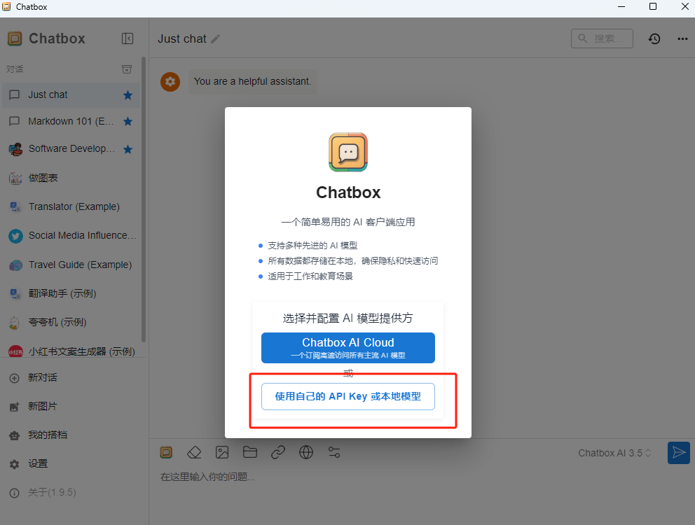

  
点击右下角的设置，设置好模型，选择Ollama API，最后选择已经安装好的模型就可以了。

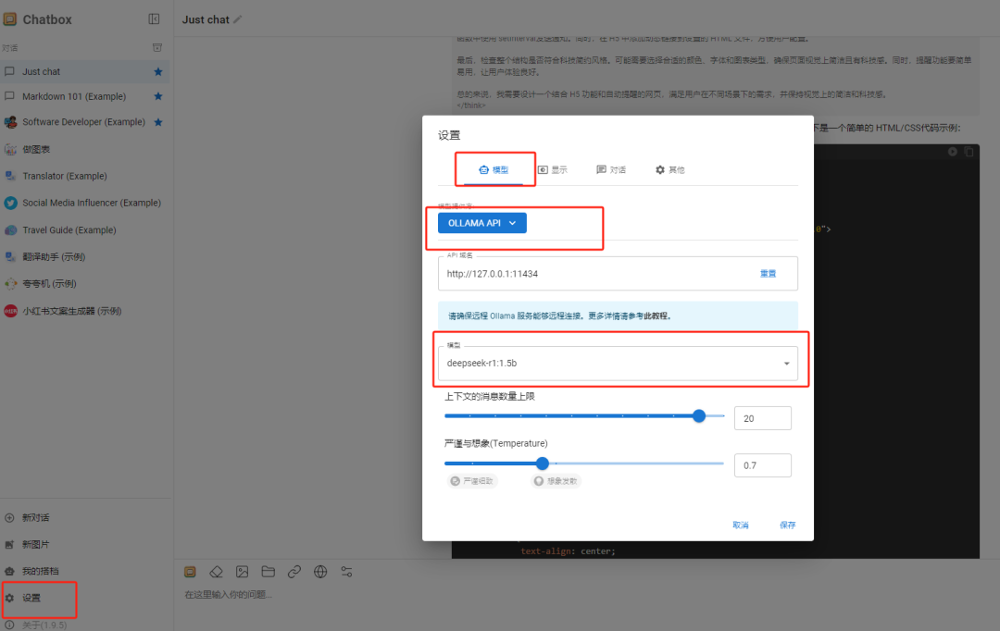

> 更新: 2025-02-05 17:13:44  
> 原文: <https://www.yuque.com/tulingzhouyu/db22bv/pgswxy26zlgb4eq9>