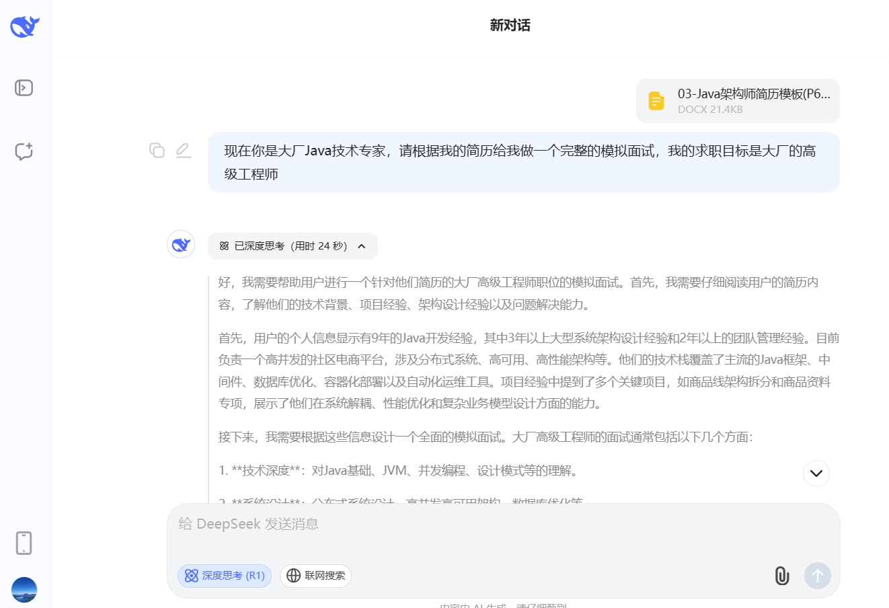

# Deepseek辅助Java程序员模拟面试

Deepseek是可以充当面试官来辅助程序员模拟面试，这是我做的一个例子供大家参考，简历如下：

[附件: Java资深工程师.docx](./attachments/ZZZZk89Vmb9lwKn8/Java资深工程师.docx)

:::info
提示词：  
现在你是大厂Java技术专家，请根据我的简历给我做一个完整的模拟面试，我的求职目标是大厂的高级工程师

:::

已深度思考（用时 24 秒）

好，我需要帮助用户进行一个针对他们简历的大厂高级工程师职位的模拟面试。首先，我需要仔细阅读用户的简历内容，了解他们的技术背景、项目经验、架构设计经验以及问题解决能力。

首先，用户的个人信息显示有9年的Java开发经验，其中3年以上大型系统架构设计经验和2年以上的团队管理经验。目前负责一个高并发的社区电商平台，涉及分布式系统、高可用、高性能架构等。他们的技术栈覆盖了主流的Java框架、中间件、数据库优化、容器化部署以及自动化运维工具。项目经验中提到了多个关键项目，如商品线架构拆分和商品资料专项，展示了他们在系统解耦、性能优化和复杂业务模型设计方面的能力。

接下来，我需要根据这些信息设计一个全面的模拟面试。大厂高级工程师的面试通常包括以下几个方面：

1. **技术深度**：对Java基础、JVM、并发编程、设计模式等的理解。

2. **系统设计**：分布式系统设计、高并发高可用架构、数据库优化等。

3. **项目经验**：具体项目的挑战、解决方案及个人贡献。

4. **问题解决**：实际工作中遇到的技术难题及其解决方法。

5. **行为面试**：团队合作、领导能力、学习能力等软技能。

需要注意的是，用户的目标是高级工程师职位（P6+或P7），因此问题需要更偏向于系统设计和技术深度，同时考察其在复杂项目中的领导能力和决策能力。此外，用户简历中提到的具体技术如Dubbo、Spring Cloud、分布式事务、Redis集群等，需要在面试问题中深入探讨。

在模拟面试设计时，应结合用户的实际项目经验，提出具体的场景问题，例如如何设计一个高并发的电商系统，如何处理分布式事务，如何优化数据库性能等。同时，需要评估用户对技术原理的理解深度，如是否熟悉框架源码、设计模式的应用等。

另外，用户简历中提到了多个实际问题的解决案例，如优化MySQL主库CPU使用率、Redis迁移等，这些可以作为案例分析的重点，考察用户的问题分析和解决能力。

最后，需要确保面试问题覆盖全面，既有技术深度的问题，也有系统设计和行为面试的问题，帮助用户全面准备大厂的高级工程师面试。

### **模拟面试：大厂高级工程师（Java方向）**
---

#### **一、技术深度考察**
1. **Java基础与JVM**
    - 请解释`volatile`关键字的作用，以及它在并发编程中的使用场景。
    - 如果线上服务频繁发生Full GC，你会如何排查和优化？请结合JVM内存模型和GC算法详细说明。
    - 你在简历中提到“JVM内存管理及调优”，能否举例说明你实际优化过的案例（如堆大小、GC策略调整等）？
2. **并发编程与框架源码**
    - 你在项目中使用了Netty，能否解释其Reactor线程模型？Netty如何实现零拷贝？
    - 你提到“对Dubbo、Spring Cloud源码有深入研究”，能否对比两者的服务治理机制（如负载均衡、熔断降级）？
    - 如果Dubbo服务调用出现超时，你会如何定位问题？请结合源码设计排查思路。
3. **分布式事务**
    - 你提到TCC事务和可靠消息最终一致性，能否通过一个支付场景的案例，说明这两种方案的适用场景及实现细节？
    - 在TCC事务中，如果Confirm阶段失败，如何保证数据一致性？

---

#### **二、系统设计能力**
1. **高并发架构设计**
    - 你负责的社区电商平台日活300万，高峰期并发10万，假设现在需要设计一个秒杀系统，你会如何设计？
    - 请详细说明以下环节的实现：
        * 流量削峰（如队列、令牌桶）
        * 库存扣减的原子性（Redis+Lua vs 数据库乐观锁）
        * 如何防止超卖？
2. **分布式系统设计**
    - 你在项目中提到“基于ElasticSearch+Kafka自研Trace系统”，能否解释其核心设计（如日志采集、链路追踪、性能统计）？
    - 如果ElasticSearch集群出现性能瓶颈（如写入延迟高），你会如何优化？
3. **数据库与缓存**
    - 你在“商品线架构拆分”中提到了分库分表，假设现有单表数据量达到10亿级，如何设计分片策略？
    - 如果Redis集群出现数据倾斜（某个节点负载过高），如何排查和解决？

---

#### **三、项目经验与问题解决**
1. **项目深挖**
    - 在“商品资料专项”中，你提到“重新定义表结构，整合业务”，能否举例说明旧模型的痛点和新模型的设计（如领域驱动设计DDD的应用）？
    - 在“会员端接口请求缓慢”的优化案例中，你提到“建立本地缓存”，如何保证缓存与数据库的一致性？
2. **技术难点与决策**
    - 你在解决“MySQL主库CPU使用率46%”时，提到“优化前十大SQL”，能否具体说明你是如何分析慢查询的（如Explain执行计划、索引优化）？
    - 在“公共Redis迁移”中，使用阿里云redis-shake工具迁移后，如何验证数据的完整性和一致性？

---

#### **四、行为面试与软技能**
1. **团队协作与领导力**
    - 你提到有2年以上团队管理经验，能否举例说明你如何推动技术方案落地（如遇到团队成员反对时如何处理）？
    - 在跨团队协作中（如与物流部门对接商品模型），如何确保需求理解一致并高效交付？
2. **学习与成长**
    - 你提到“阅读过Zookeeper、Spring等框架源码”，最近一次深入研究的技术是什么？如何应用到实际项目中？
    - 面对新技术（如云原生、Service Mesh），你的学习路径是怎样的？

---

#### **五、反问环节**
+ 你有什么问题想了解我们团队或业务？

---

### **面试评估要点**
1. **技术深度**：是否对底层原理（如JVM、框架源码）有透彻理解。
2. **系统设计**：能否结合业务场景设计高可用、高性能的架构，并权衡技术选型。
3. **问题解决**：逻辑是否清晰，能否从现象定位到根因并提出有效方案。
4. **软技能**：沟通是否简洁有力，能否体现技术领导力和团队协作能力。

建议针对以上问题提前准备案例（STAR法则：背景、任务、行动、结果），并重点复习分布式事务、高并发设计、源码原理等高频考点。

> 更新: 2025-02-06 17:14:14  
> 原文: <https://www.yuque.com/tulingzhouyu/db22bv/hui27uxgygih3oq8>