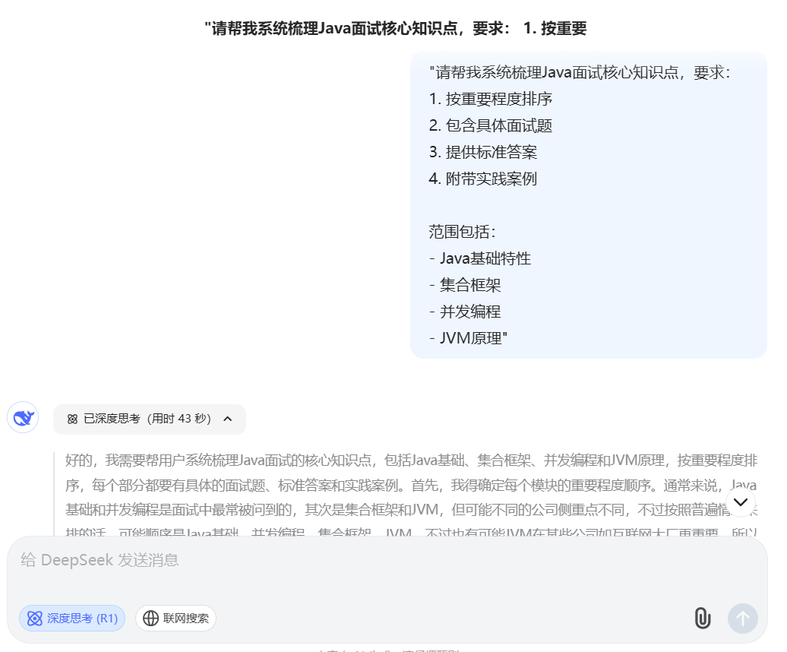

# Deepseek辅助Java程序员面试复习最佳实践

## <font style="color:rgba(6, 8, 31, 0.88);">一、基础知识复习</font>
### <font style="color:rgba(6, 8, 31, 0.88);">1. Java核心知识点梳理</font>
```java
// 示例提示词：  
"请帮我系统梳理Java面试核心知识点，要求：  
1. 按重要程度排序  
2. 包含具体面试题  
3. 提供标准答案  
4. 附带实践案例  

范围包括：  
- Java基础特性  
- 集合框架  
- 并发编程  
- MySQL"  
```



### 2. 框架知识复习
```plain
// 示例提示词：  
"请帮我准备Spring框架相关面试题，要求：  
1. 覆盖Spring核心概念  
2. 包含高频面试题  
3. 提供详细答案  
4. 结合实际项目案例"  

"请帮我准备Spring cloud框架相关面试题，要求：  
1. 覆盖Spring cloud核心概念  
2. 包含高频面试题  
3. 提供详细答案  
4. 结合实际项目案例"  

"请帮我准备Redis框架相关面试题，要求：  
1. 覆盖Redis核心概念  
2. 包含高频面试题  
3. 提供详细答案  
4. 结合实际项目案例"  

"请帮我准备RocketMQ框架相关面试题，要求：  
1. 覆盖RocketMQ核心概念  
2. 包含高频面试题  
3. 提供详细答案  
4. 结合实际项目案例"  
```


## 二、项目经验准备  
PS：这部分可以上传Deepseek你的简历，然后再输入下面的提示词

### 1. 项目介绍模板 
```plain
// 示例提示词：  
"请帮我准备XX项目经验介绍，要求：  
1. 结构完整  
2. 重点突出  
3. 技术亮点  
4. 问题解决能力展示"  
```

### 2. 技术亮点准备
```plain
// 示例提示词：  
"请帮我准备XX项目技术亮点和难点的回答，要求：  
1. 技术深度  
2. 解决方案完整性  
3. 性能提升量化  
4. 经验总结"  
```

### 3. 性能优化亮点准备
```plain
// 示例提示词：  
"请准备一个XX项目关于性能优化的亮点分析，包括：  
1. 问题描述  
2. 分析过程  
3. 解决方案  
4. 优化效果"  
```

### <font style="color:rgba(6, 8, 31, 0.88);">4. 故障处理类问题</font>
```plain
// 示例提示词：  
"请准备一个XX项目线上故障处理案例，包括：  
1. 故障现象  
2. 排查过程  
3. 解决方案  
4. 经验总结"  
```

### <font style="color:rgba(6, 8, 31, 0.88);">5. DevOps实践</font>
```plain
// 示例提示词：  
"请提供一个完整的DevOps实践方案，包括：  
1. CI/CD流程  
2. 自动化测试  
3. 监控告警  
4. 应急响应"  
```

### 6.开放系统设计题
```plain
// 示例提示词：  
"请提供一个开放性的系统设计面试问题的解答模板，要求：  
1. 涵盖设计各个环节  
2. 包含具体案例  
3. 提供评分要点  
4. 常见问题及解决方案"  
```

### 7.技术管理实践
```plain
// 示例提示词：  
"请提供技术团队管理的经验分享，包括：  
1. 团队建设  
2. 项目管理  
3. 技术决策  
4. 效能提升"  
```


## <font style="color:rgba(6, 8, 31, 0.88);">三、系统架构设计</font>
### <font style="color:rgba(6, 8, 31, 0.88);">架构设计原则</font>
```plain
// 示例提示词：  
"请解释关键的架构设计原则及实践，包括：  
1. 高可用设计  
2. 可扩展性  
3. 安全性  
4. 性能优化"  
```

### <font style="color:rgba(6, 8, 31, 0.88);">高并发系统设计</font>
```plain
// 示例提示词：  
"请提供一个高并发秒杀系统设计的完整方案，包括：  
1. 架构设计  
2. 技术选型  
3. 核心代码  
4. 性能保障"  
```

### <font style="color:rgba(6, 8, 31, 0.88);">分布式系统设计</font>
```plain
// 示例提示词：  
"请帮我准备分布式系统设计相关的面试题，包括：  
1. 分布式事务  
2. 一致性问题  
3. CAP理论  
4. 实践案例"  
```

### <font style="color:rgba(6, 8, 31, 0.88);">微服务架构设计</font>
```plain
// 示例提示词：  
"请提供一个完整的微服务架构设计方案，包括：  
1. 服务拆分  
2. 通信机制  
3. 监控方案  
4. 部署策略"  
```

### <font style="color:rgba(6, 8, 31, 0.88);">DDD架构实践</font>
```plain
// 示例提示词：  
"请提供一个基于DDD的系统设计方案，包括：  
1. 领域模型设计  
2. 聚合根定义  
3. 领域事件  
4. 实践案例"  
```

### <font style="color:rgba(6, 8, 31, 0.88);">云原生架构实践</font>
```plain
// 示例提示词：  
"请提供一个云原生架构转型方案，包括：  
1. 容器化改造  
2. 服务网格  
3. 可观测性  
4. 最佳实践"  
```


## 四、面试模拟训练
### 模拟面试流程
```plain
// 示例提示词：  
"请模拟一个Java高级开发工程师面试过程，要求：  
1. 面试官和候选人的对话形式  
2. 循序渐进的提问方式  
3. 包含技术深度探讨  
4. 考察解决问题能力"  
```

### <font style="color:rgba(6, 8, 31, 0.88);">2. 算法题训练</font>
```plain
// 示例提示词：  
"请提供一个算法面试训练计划，包括：  
1. 常见算法题类型  
2. 解题思路讲解  
3. 代码实现示例  
4. 复杂度分析"  
```

## <font style="color:rgba(6, 8, 31, 0.88);">这些主题的准备能帮助你在面试中展现：</font>
1. <font style="color:rgba(6, 8, 31, 0.88);">架构设计能力</font>
2. <font style="color:rgba(6, 8, 31, 0.88);">技术深度</font>
3. <font style="color:rgba(6, 8, 31, 0.88);">工程实践经验</font>
4. <font style="color:rgba(6, 8, 31, 0.88);">管理能力</font>

<font style="color:rgba(6, 8, 31, 0.88);">重要提示：</font>

+ <font style="color:rgba(6, 8, 31, 0.88);">结合实际项目经验</font>
+ <font style="color:rgba(6, 8, 31, 0.88);">准备具体的技术难点解决方案</font>
+ <font style="color:rgba(6, 8, 31, 0.88);">注重说明决策过程和考虑因素</font>
+ <font style="color:rgba(6, 8, 31, 0.88);">强调可量化的效果和收益</font>

<font style="color:rgba(6, 8, 31, 0.88);">这样的准备可以帮助你在高级技术面试中更好地展示自己的综合能力。</font>


> 更新: 2025-02-07 16:52:34  
> 原文: <https://www.yuque.com/tulingzhouyu/db22bv/rpssghgbyoepud6l>