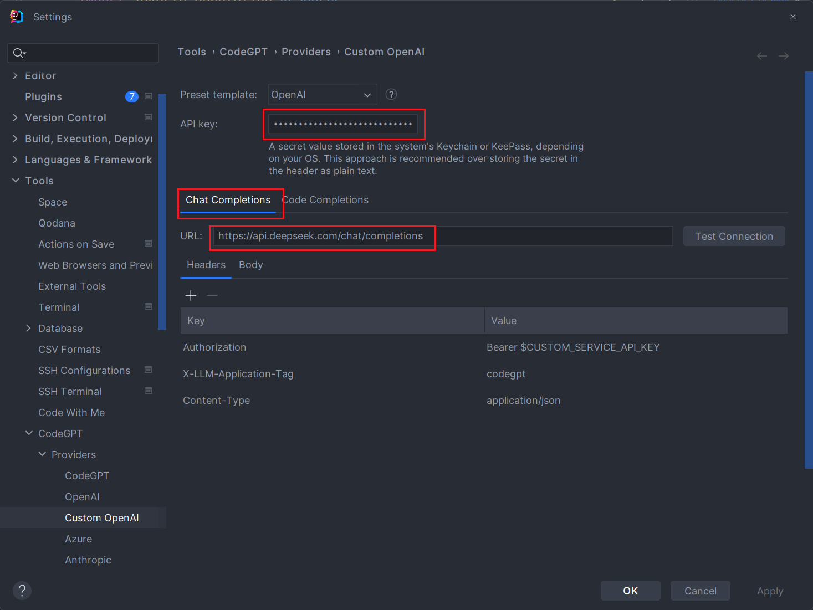

# IDEA集成满血DeepSeek，写代码比抄作业还快！

# 1、使用 Continue 插件
## 安装 Continue 插件：
首先在IDEA中点击`设置`-`插件`。搜索插件`continue`

安装完成后，在右侧便可以看到`continue`的图标。

## 添加配置 DeepSeek-R1 模型：

选择DeepSeek模型。下面选择`DeepSeek Coder`

## API key 来源：
至于 API key 的来源就容易了，到官网进行注册。www.deepseek.com

注册完成后，登录并创建API

复制KEY后，我们便可以使用了。在使用之前，我们需要`@`指定的文件。并说明想要实现的功能。

如：“这是一个 orc 的实现逻辑，请优化识别效率与正确率”

点击图标，代码自动插入。

**注意：由于恶意攻击，可能导致响应比较缓慢。**

# 2、使用 CodeGPT 插件
## 安装 CodeGPT 插件
首先在IDEA中点击`设置`-`插件`。搜索插件`codeGPT`

安装完成后，在右侧便可以看到 codeGPT 的图标。

## 修改 CodeGPT 配置：
在 settings 下面的 **CodeGPT--Providers-Custom OpenAI 下**的 URL 下修改为：

**API key：**填入 DeepSeek API key

**URL：** https://api.deepseek.com/chat/completions

参考配置文档https://api-docs.deepseek.com/zh-cn/   **将模型改为 R1 模型**

## API Key 来源：
重新申请一个

## 代码补全提示：
FIM template：选择**DeepSeek Coder**

URL：填入 **https://api.deepseek.com/beta/completions**  

参考配置文档[https://api-docs.deepseek.com/zh-cn/guides/chat_prefix_completion](https://api-docs.deepseek.com/zh-cn/guides/chat_prefix_completion)   **将模型改为 R1 模型**

修改完保存，测试：

“这是一个 orc 的实现逻辑，请优化识别效率与正确率”

> 更新: 2025-02-06 15:41:36  
> 原文: <https://www.yuque.com/tulingzhouyu/db22bv/mdm69mxldu64dfld>