# Ides + mcp 实现 Manus 效果

前段时间 Manus 爆火，当然后续暴雷了，不过 Manus 身上还是有一些可以学习的东西：  
1、显示地把计划列出来，然后一步一步执行，并同步修改进度  
2、信息采集，使用AI搜索与浏览器视觉识别结合的方式开展，这样一些页面效果的信息可以采集  
3、输出物，使用可视化输出的方式来输出

而当下正好 MCP 崛起了，我们可以自己借助 AI 开发工具 + MCP 服务来实现 manus 的效果。

## AI 开发工具
没什么好说：Windsurf、Cursor、Trae（国内国外版本暂时都不支持） 等等，那什么是 MCP 了？

## 什么是 MCP
<font style="color:rgba(6, 8, 31, 0.88);">对于熟悉</font><font style="color:rgba(6, 8, 31, 0.88);"> </font>**<font style="color:rgba(6, 8, 31, 0.88);">LangChain4j</font>**<font style="color:rgba(6, 8, 31, 0.88);"> </font><font style="color:rgba(6, 8, 31, 0.88);">以及</font><font style="color:rgba(6, 8, 31, 0.88);"> </font>**<font style="color:rgba(6, 8, 31, 0.88);">SpringAI</font>**<font style="color:rgba(6, 8, 31, 0.88);"> </font><font style="color:rgba(6, 8, 31, 0.88);">的小伙伴来说，理解这一点并不难。在对接大模型时，我们常常会遇到基础大模型无法直接给出答案的情况。</font>

<font style="color:rgba(6, 8, 31, 0.88);">比如一些简单却又常用的场景：</font>

+ <font style="color:rgba(6, 8, 31, 0.88);">获取当前时间</font>
+ <font style="color:rgba(6, 8, 31, 0.88);">查询当前天气</font>
+ <font style="color:rgba(6, 8, 31, 0.88);">获取股价或订单状态等动态信息</font>

<font style="color:rgba(6, 8, 31, 0.88);">这是因为大模型无法访问超出其训练数据时间戳范围的动态数据或实时信息，这些情况下，就需要开发者自己实现一套工具，帮助模型完成类似的信息获取。</font>

<font style="color:rgba(6, 8, 31, 0.88);">而 </font>**<font style="color:rgba(6, 8, 31, 0.88);">MCP（Model Context Protocol）</font>**<font style="color:rgba(6, 8, 31, 0.88);"> 可以理解为一个 AI 的标准化工具箱。它提供了一套标准化的协议，方便所有开发者将自定义的功能模块轻松对接到大模型中。</font>

### <font style="color:rgba(6, 8, 31, 0.88);">MCP 架构设计</font>
<font style="color:rgb(52, 52, 60);">MCP 遵循客户端-服务器架构（client-server），其中包含以下几个核心概念：</font>

+ <font style="color:rgb(52, 52, 60);">MCP 主机（MCP Hosts）：发起请求的 LLM 应用程序（例如 Claude Desktop、IDE 或 AI 工具）。</font>
+ <font style="color:rgb(52, 52, 60);">MCP 客户端（MCP Clients）：在主机程序内部，与 MCP server 保持 1:1 的连接。</font>
+ <font style="color:rgb(52, 52, 60);">MCP 服务器（MCP Servers）：为 MCP client 提供上下文、工具和 prompt 信息。</font>
+ <font style="color:rgb(52, 52, 60);">本地资源（Local Resources）：本地计算机中可供 MCP server 安全访问的资源（例如文件、数据库）。</font>
+ <font style="color:rgb(52, 52, 60);">远程资源（Remote Resources）：MCP server 可以连接到的远程资源（例如通过 API）。</font>

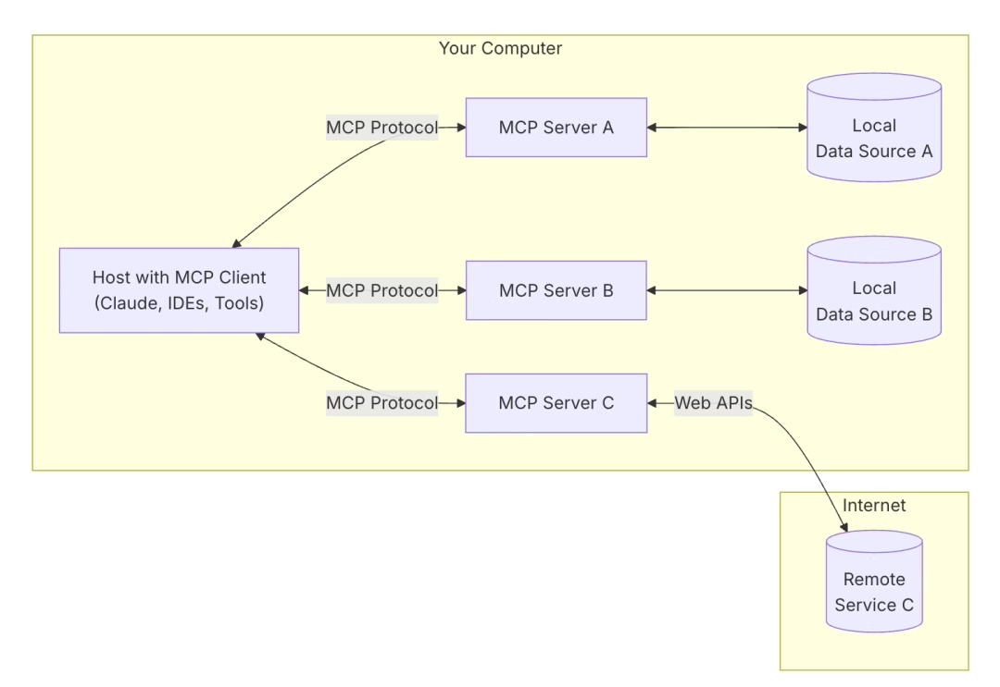

<font style="color:rgba(6, 8, 31, 0.88);">这样架构划分带来的好处显而易见：开发者无需为每次需求重新开发独立的功能模块，而是可以通过一次性开发实现全局复用，大幅降低开发成本。</font>

### <font style="color:rgba(6, 8, 31, 0.88);">MCP 工作流程</font>
<font style="color:rgba(6, 8, 31, 0.88);">当大模型识别到非自身原生能力的请求时，MCP 会自动将请求路由到对应的工具模块，执行任务并将结构化的结果返回给大模型，从而实现更高效的交互和扩展性。</font>

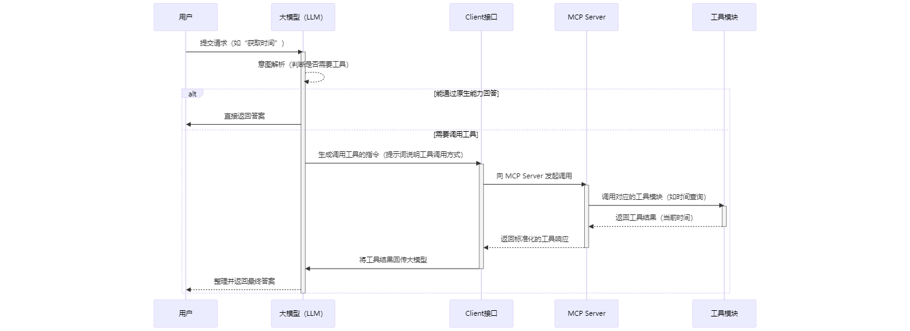

所以总结一句：MCP 是一个大模型能力扩展插件平台。

对 MCP 有了简单了解之后，我们就来实际操作

## 实现过程
想要实现 manus 的效果，除了借助 mcp 之外，还需要精确的提示词（规则），通过提示词大模型调用多个 mcp 工具。以下通过演示 windsurf 实现过程：

### windsurf 配置
**准备工作环境：**  
新建了一个文件夹“windsurf”当做工作空间

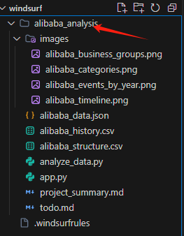

**设置规则**

具体的设置方式是：通过右下角的“Windsurf - Settings”，点击“Memories and Rules”，点击 Manage

同时在这里打开<font style="color:rgb(34, 34, 34);">自动化效果。</font>

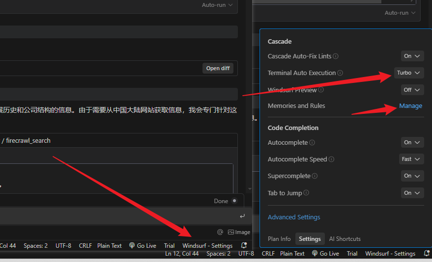

在弹出页面中，Edit workspace rules，来设置当前工作区的规则。  
此时，系统会自动打开一个叫做  .windsurfrules ，这个文件中的内容，就是每次交易执行过程中，会固定发送给模型的话语。

以下是一份效果很不错的 .windsurfrules 内容，你也可以根据自己的需要进行调整：

```json
{
  "rules": [
    "Speak in Chinese",
    "You are a assistant, when you get a task, you will do it step by step. you will generate a todo.md, and you will update it when you finish a step.",
    "If you get data analysis task, you will use Python-based data science",
    "Use Python 3.12 as the primary programming language",
    "Use NumPy for numerical computing and array operations",
    "Use Pandas for data manipulation and analysis",
    "Use uv for environment and package management",
    "Use Dash for web based report",
    "Use a seperated file to Generate a web based report, pretty, modern and interactive",
    "Run a web server And give me the url",
    "Use Website Preview and firecrawl to get web content",
    "Use a seperated file to store project summary",
    "Use a seperated file to store todo list",
    "Use a seperated directory to store all files from one task",
    "Store all process data in files under the task directory"
  ]
}
```

简单解释一下：

+ 首先确认让他说中文
+ 要求接到任务时，先整理一个 todo.md 文件，用于存放步骤的列表，然后一步一步执行，并且每执行一步都更新一下这个列表。
+ 特别地，如果一个数据分析任务，要求使用 python 语言来编写数据分析程序
+ 接着规划 python 的版本以及一些库
+ 使用 uv 作为 python 虚拟环境的管理（如果你是使用 conda 的，请对应更改，当然，大多数时候，windsurf 会自动帮你解决）
+ 接下来要求使用图形化的web方式输出结果
+ 每个任务独立存储数据文件和结果
+ 最重要的是，使用 firecrawl 来获取网络内容

**配置 firecrawl-mcp-server**

firecrawl 是一个 AI 友好的网络爬虫工具，他会读取指定URL的内容，并且返回为AI能够识别的 markdown 等格式。firecrawl的网址是 https://www.firecrawl.dev

你可以使用他的API服务，也可以自己在本地搭建。  
以下是我使用本地部署的方式，firecrawl的MCP配置方式是：

```json
{
  "mcpServers": {
    "github.com/mendableai/firecrawl-mcp-server": {
      "command": "cmd",
      "args": ["/c","npx","-y", "firecrawl-mcp"],
      "env": {
        "FIRECRAWL_API_URL": "http://localhost:3002",
        "FIRECRAWL_RETRY_MAX_ATTEMPTS": "5",
        "FIRECRAWL_RETRY_INITIAL_DELAY": "2000",
        "FIRECRAWL_RETRY_MAX_DELAY": "30000",
        "FIRECRAWL_RETRY_BACKOFF_FACTOR": "3",
        "FIRECRAWL_CREDIT_WARNING_THRESHOLD": "2000",
        "FIRECRAWL_CREDIT_CRITICAL_THRESHOLD": "500"
      },
      "disabled": false,
      "autoApprove": []
    }
  }
}
----------------------- windows 复制上面内容 ---------------------
{
  "mcpServers": {
    "github.com/mendableai/firecrawl-mcp-server": {
      "command": "npx",
      "args": [
        "-y",
        "firecrawl-mcp"
      ],
      "env": {
        "FIRECRAWL_API_URL": "http://localhost:3002",
        "FIRECRAWL_RETRY_MAX_ATTEMPTS": "5",
        "FIRECRAWL_RETRY_INITIAL_DELAY": "2000",
        "FIRECRAWL_RETRY_MAX_DELAY": "30000",
        "FIRECRAWL_RETRY_BACKOFF_FACTOR": "3",
        "FIRECRAWL_CREDIT_WARNING_THRESHOLD": "2000",
        "FIRECRAWL_CREDIT_CRITICAL_THRESHOLD": "500"
      },
      "disabled": false,
      "autoApprove": []
    }
  }
}
```

### 验证
输入提示词：

阿里巴巴集团发展史及当前集团公司结构  
填写到 windsurf 新建的 Cascade 模式中，模型使用 Claude 3.7 Sonnet （Thinking）  
效果如下：

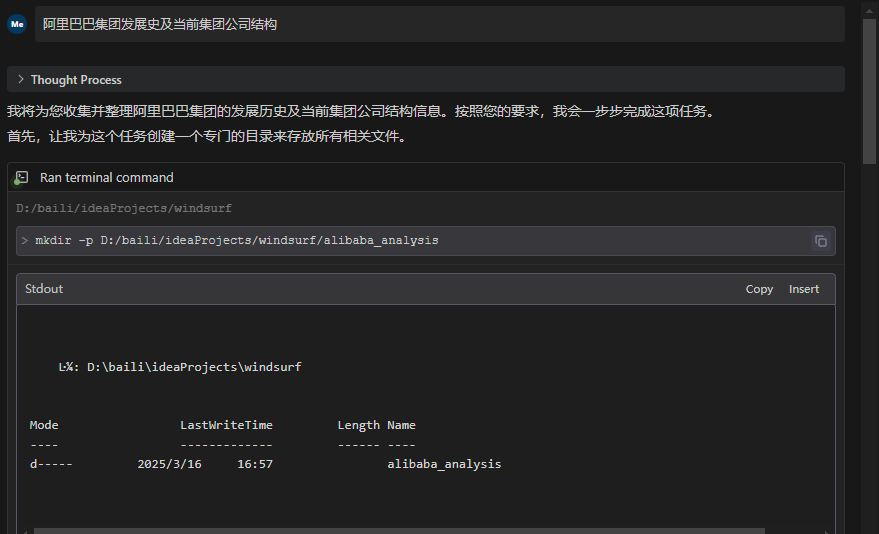

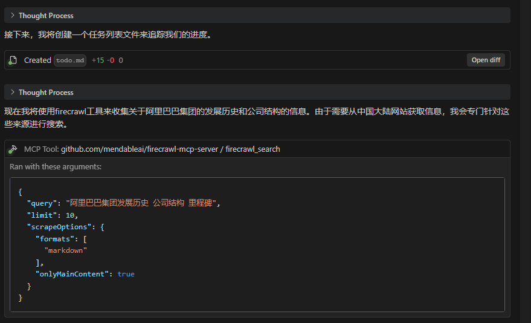

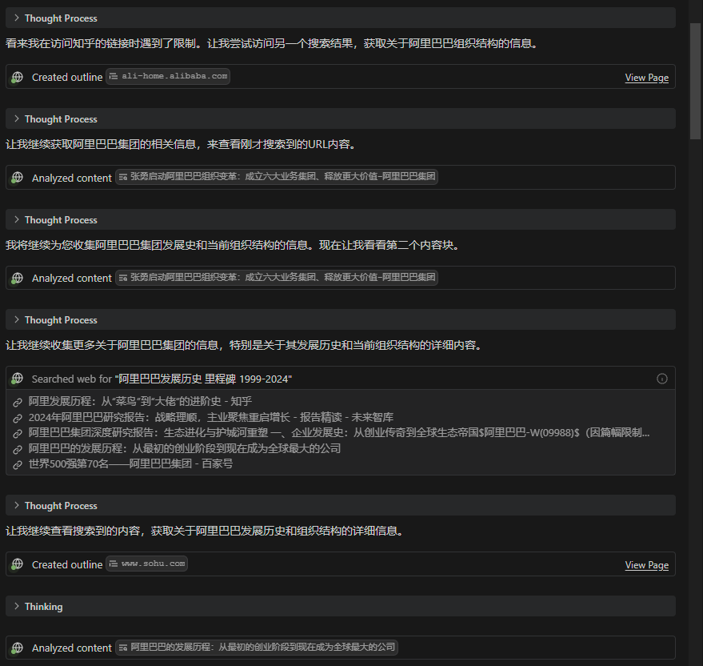

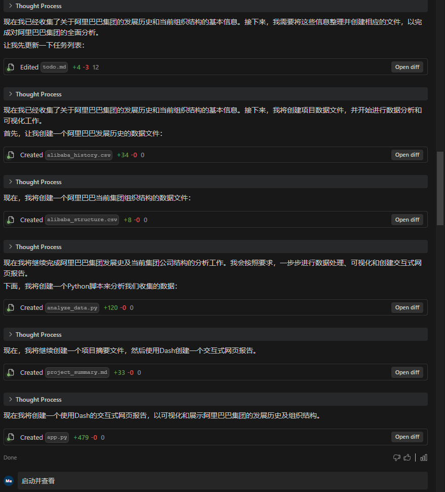  
在此期间，他自动解决了 虚拟环境问题，库依赖问题，代码错误等等。最终为效果如下：

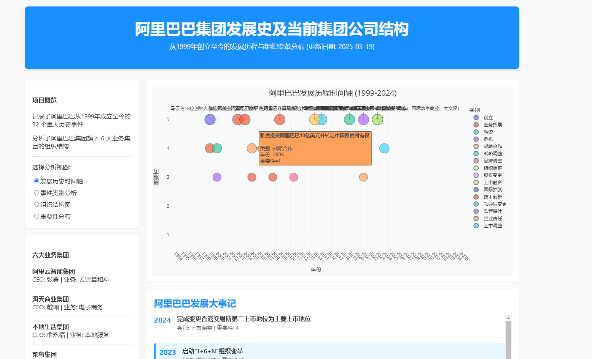

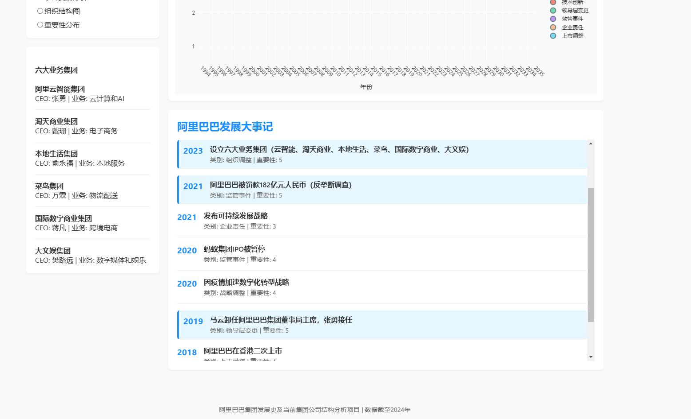

  
如果使用其他 AI 开发工具也能使用上述流程，以下是 cursor 实现的最终结果：  
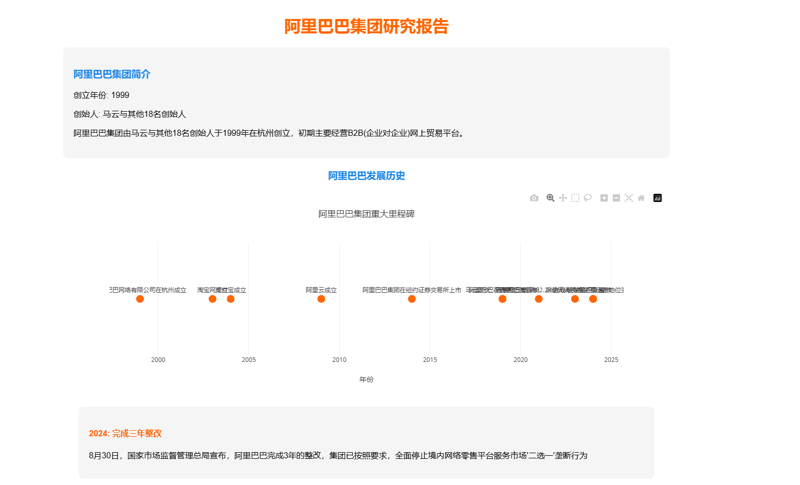


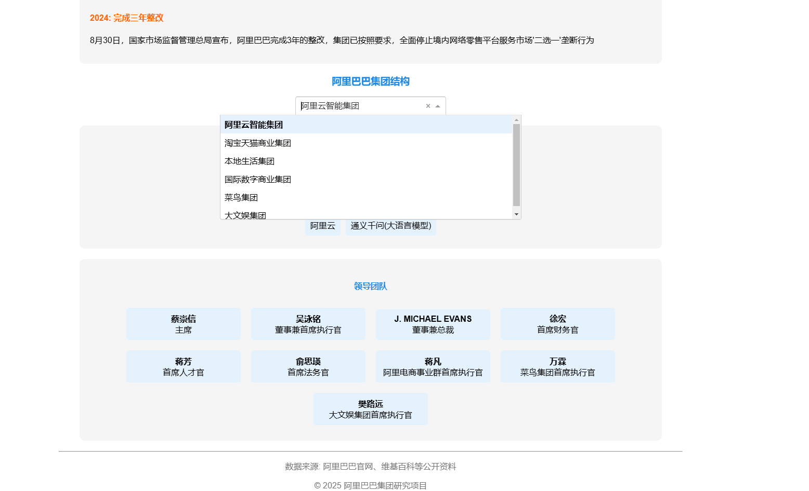=

### 本地 docker 部署 firecrawl-mcp-server
```java
// 拉取 FireCrawl 源代码
git clone https://github.com/mendableai/firecrawl.git

// 然后进入项目目录,构建并部署 Docker

docker compose build
docker compose up -d

// 耐心等几分钟,查看启动日志
docker compose logs -f

// 如果日志里没有“报错红字❌”,部署成功,测试 FireCrawl, 返回 Hello World
curl -X GET http://localhost:3002/test
```


> 更新: 2025-04-22 16:19:32  
> 原文: <https://www.yuque.com/tulingzhouyu/db22bv/yxh01c6ilrt7pq2y>