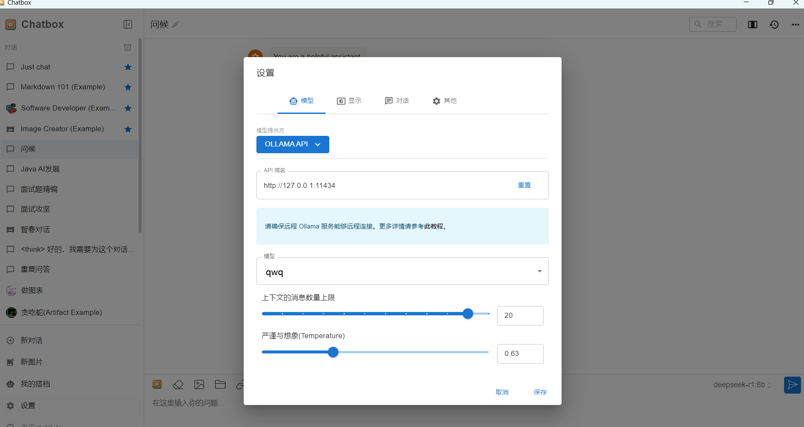

# QWQ-32B本地部署教程

deepseek国内大模型一哥的位置都没坐热， 阿里就推出了qwq-32b， 性能差不多，相比deepeseek满血版的6710亿参数， qwq-32b只有320亿参数， 成本降低了20倍，本地部署成本只需要一张消费级显卡RXT8090即可，**那么本地部署的需求也随之而来，很多人是有这个需求的。**

其实很简单，几分钟就可以安装完。

  
**🚀**** 十分钟搞定！Windows电脑玩转DeepSeek本地部署**

  
**🌈**** 步骤一：安装灵魂工具Ollama**  
▌官网下载直通车：👉 https://ollama.com  

操作就像安装QQ一样简单，点击Download

1. 双击下载的.exe安装包
2. 狂点「下一步」直到完成

  
🌈** 步骤二：回到ollama的官网，搜索框里搜索qwq，选择要安装的模型**

  
  
只有一个32b版本，  需要20G存储空间，  至少32G运行内存，  一张H100或者RXT8090即可

  
**🌈**** 步骤三：复制右边的这串代码“ollama run qwq”**

  
**🌈**** 步骤四：安装模型**

按下键盘上的win+R，调出运行窗口，输入cmd回车，调出命令行窗口。

  

**把复制的代码“ollama run qwq”粘贴到命令行中，再点击回车，如下图所示。**

按回车键之后，就会开始安装，会有百分比的进度条，如下图所示

跑到了100%之后，就代表安装完成了，就可以和他对话了。

  
**🌈**** 步骤四：安装可视化工具：chatbox**

是时候告别黑乎乎的窗口了！咱们请出颜值担当：

🔥 ChatBox客户端  
▌官网直达：https://chatboxai.app

安装姿势：

1. 点击免费下载后，解压后双击ChatBoxSetup.exe
2. 自定义安装路径（别放C盘！建议装D盘）
3. Chatbox安装好后，打开后，选择“使用自己的 API Key 或本地模型”。

  
点击右下角的设置，设置好模型，选择Ollama API，最后选择已经安装好的模型就可以了。

> 更新: 2025-03-06 22:34:28  
> 原文: <https://www.yuque.com/tulingzhouyu/db22bv/gtahqihnugqkn5g4>