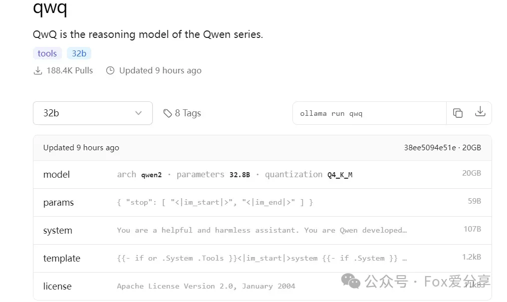

# Spring AI Alibaba整合阿里最新开源的QwQ-32B 模型，性能媲美DeepSeek R1，参数量仅用其1/20


<font style="color:rgb(34, 34, 34);">3月6日凌晨，阿里巴巴发布并开源全新的推理模型通义千问QwQ-32B。通过大规模强化学习，千问QwQ-32B在数学、代码及通用能力上实现质的飞跃，整体性能比肩DeepSeek-R1。在保持强劲性能的同时，千问QwQ-32B还大幅降低了部署使用成本，在消费级显卡上也能实现本地部署。</font>  


  
<font style="color:rgb(34, 34, 34);">目前，千问QwQ-32B已在魔搭社区、HuggingFace及GitHub等平台基于宽松的Apache2.0协议开源，所有人都可免费下载模型进行本地部署，或者通过阿里云百炼平台直接调用模型API服务。</font>  
具体链接如下：  
• https://huggingface.co/Qwen/QwQ-32B  
• https://modelscope.cn/models/Qwen/QwQ-32B  
• https://ollama.com/library/qwq  
  
**<font style="color:rgb(34, 34, 34);">如何实现本地部署QwQ-32B</font>**  
<font style="color:rgb(63, 63, 63);">如果想要快速本地部署尝试，可以借助Ollama快速部署</font>  




  
<font style="color:rgba(0, 0, 0, 0.9);">具体细节可以参考我之前的文章：</font>  
[三分钟轻松搞定！Windows本地部署DeepSeek-R1推理模型，小白也能快速上手！](https://mp.weixin.qq.com/s?__biz=MzU1ODk1NTQ0Mg==&mid=2247485207&idx=1&sn=d8ac478fa0d83edde16df959ef616c91&scene=21#wechat_redirect)  


**<font style="color:rgba(0, 0, 0, 0.9);">Spring AI Alibaba集成QwQ-32B实战</font>**  
**<font style="color:rgb(34, 34, 34);">通过阿里云百炼平台直接调用模型API服务</font>**  
https://bailian.console.aliyun.com/#/model-market  


  
<font style="color:rgba(0, 0, 0, 0.9);">模型调用</font><font style="color:rgba(0, 0, 0, 0.9);">限时免费</font>  


  
  
**<font style="color:rgba(0, 0, 0, 0.9);">开通阿里云百炼账号，获取API-KEY</font>**  


  


  
  
**<font style="color:rgba(0, 0, 0, 0.9);">SpringBoot接入</font>****<font style="color:rgba(0, 0, 0, 0.9);">QwQ-32B</font>****<font style="color:rgba(0, 0, 0, 0.9);">实战</font>**  
<font style="color:rgb(53, 56, 65);">使用 Spring AI Alibaba 开发应用与使用普通 Spring Boot 没有什么区别，只需要增加 </font><font style="color:rgba(0, 0, 0, 0.9);">spring-ai-alibaba-starter</font><font style="color:rgb(53, 56, 65);"> 依赖，将 </font><font style="color:rgba(0, 0, 0, 0.9);">ChatClient</font><font style="color:rgb(53, 56, 65);"> Bean 注入就可以实现与模型聊天了。</font>  
<font style="color:rgb(53, 56, 65);">注意：因为 Spring AI Alibaba 基于 Spring Boot 3.x 开发，因此本地 JDK 版本要求为 17 及以上。</font>  
**<font style="color:rgba(0, 0, 0, 0.9);">1</font>****<font style="color:rgba(0, 0, 0, 0.9);">添加依赖</font>**  
<font style="color:rgb(53, 56, 65);">首先，需要在项目中添加 </font><font style="color:rgba(0, 0, 0, 0.9);">spring-ai-alibaba-starter</font><font style="color:rgb(53, 56, 65);"> 依赖，它将通过 Spring Boot 自动装配机制初始化与阿里云通义大模型通信的 </font><font style="color:rgba(0, 0, 0, 0.9);">ChatClient</font><font style="color:rgb(53, 56, 65);">、</font><font style="color:rgba(0, 0, 0, 0.9);">ChatModel</font><font style="color:rgb(53, 56, 65);"> 相关实例。</font>

```plain
<dependency>
  <groupId>com.alibaba.cloud.ai</groupId>
  <artifactId>spring-ai-alibaba-starter</artifactId>
  <version>1.0.0-M5.1</version>
</dependency>
```

  
**<font style="color:rgba(0, 0, 0, 0.9);">2.配置 application.yml</font>**  
<font style="color:rgba(0, 0, 0, 0.9);">指定 API-KEY（可通过访问阿里云百炼模型服务平台获取，有免费额度可用）</font>

```plain
spring:
  application:
    name: qwq-demo

  ai:
    dashscope:
      api-key: ${AI_DASHSCOPE_API_KEY}
      chat:
        options:
          model: qwq-32b
```

  
**<font style="color:rgba(0, 0, 0, 0.9);">3.注入智能体代理 ChatClient</font>**  
<font style="color:rgb(53, 56, 65);">ChatClient 类似于应用程序开发中的服务层，它为应用程序直接提供 </font><font style="color:rgba(0, 0, 0, 0.9);">AI 服务</font><font style="color:rgb(53, 56, 65);">，开发者可以使用 ChatClient Fluent API 快速完成一整套 AI 交互流程的组装。</font>  
<font style="color:rgba(0, 0, 0, 0.9);">接下来，在普通 Controller Bean 中注入 ChatClient 实例，这样你的 Bean 就具备与 AI 大模型智能对话的能力了。</font>  


```plain
import org.springframework.ai.chat.client.ChatClient;
import org.springframework.web.bind.annotation.GetMapping;
import org.springframework.web.bind.annotation.RestController;
import reactor.core.publisher.Flux;

@RestController
    public class ChatController {

      private final ChatClient chatClient;

      public ChatController(ChatClient.Builder builder) {
        this.chatClient = builder.build();
      }

      @GetMapping(value = "/stream",produces = "text/html;charset=utf-8")
      public Flux<String> stream(String input) {
        return this.chatClient.prompt()
            .user(input)
            .stream()
            .content();
      }
    }
```


  
**<font style="color:rgba(0, 0, 0, 0.9);">4.启动服务后测试</font>**  


  
  


  


若有收获，就点个赞吧

  
 


> 更新: 2025-04-01 20:34:42  
> 原文: <https://www.yuque.com/tulingzhouyu/db22bv/uw8gzo7gpbbqvzil>