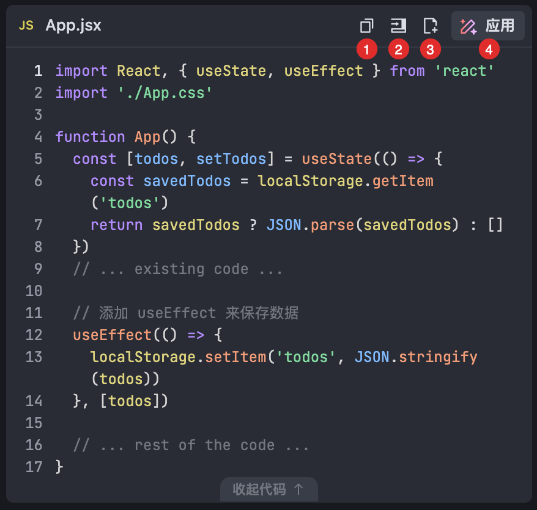
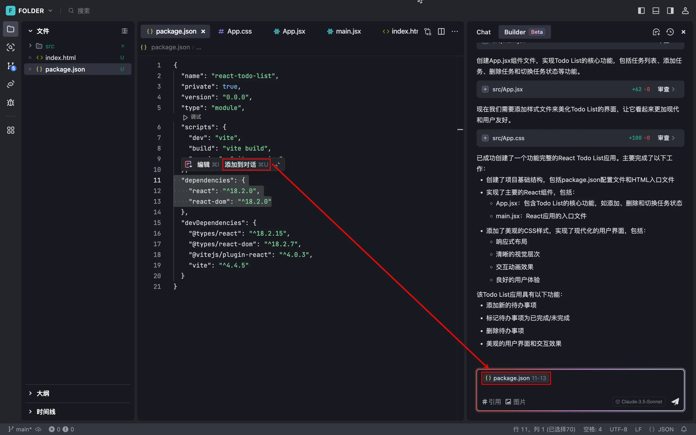
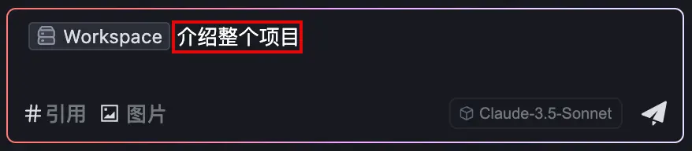
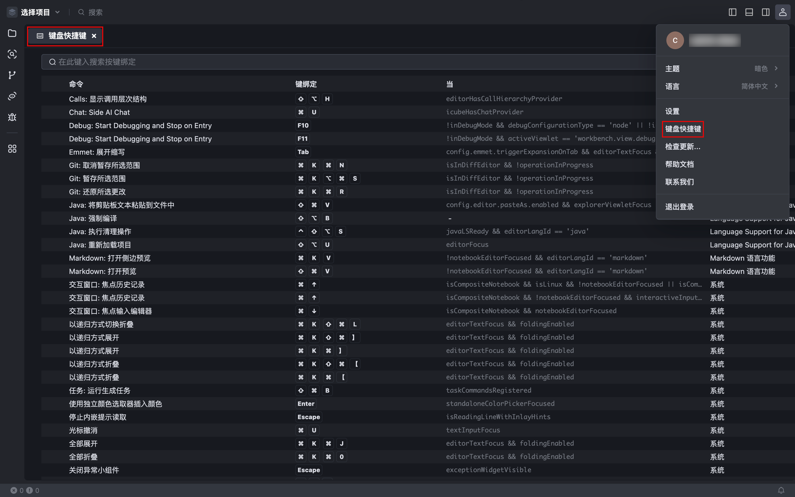

# 【免费无限GPT-4o】AI编程神器Trae详细上手教程

# 什么是 Trae？
Trae（/treɪ/）与 AI 深度集成，提供智能问答、代码自动补全以及基于 Agent 的 AI 自动编程能力。使用 Trae 开发项目时，你可以与 AI 灵活协作，提升开发效率。

**<font style="color:#DF2A3F;">需要注意</font>**现在 Trae 不能在国内使用，但是大家魔法一下就好了


# <font style="color:rgb(29, 33, 41);">安装 Trae 并完成初始设置</font>
## 第一步：安装并启动 Trae 
1. 前往 [Trae 的官网](https://www.trae.ai/)，将 Trae 安装至电脑。 
2. 启动 Trae。 

Trae 首次启动时，你会进入以下页面。 


1. 点击 **开始** 按钮。 

Trae 初始配置流程开始。 

## 第二步：选择主题和语言 
1. 选择主题。可选项为 **暗色**、**亮色** 和 **深蓝**。 
2. 选择显示语言。可选项为 **简体中文** 和 **English**。 

<font style="background-color:#f0f4ff;">若有需要，后续可以在设置中心修改主题和语言。 </font>

1. 点击 **继续** 按钮。 


## 第三步：从 VS Code 或 Cursor 中导入配置 
若你的电脑中已安装并配置 VS Code 或 Cursor，你可以点击 **从 VS Code 导入** 或 **从 Cursor 导入** 按钮。系统将会从对应的 IDE 中获取插件、IDE 设置、快捷键设置等信息并一键导入到 Trae 中，帮助你快速从其他 IDE 切换到 Trae。 


## 第四步：添加 Trae 相关的命令行 
添加 Trae 相关的命令行后，你可以在终端中使用命令行更快速地完成 Trae 相关的操作。例如： 

+ 使用 trae 命令快速唤起 Trae。 
+ 使用 trae my-react-app 命令在 Trae 中打开一个项目。 

点击 **安装 `trae` 命令** 按钮，然后完成授权流程。 


## 第五步：登录账号 
你需要登录 Trae 以使用 AI 能力。Trae 提供了三种登录方式，分别为 Google 账号登录、Github 账号登录、邮箱登录。若你没有账号，也可以新注册一个账号。 

点击 **登录** 按钮，然后根据页面引导完成登录流程。登录后，你将进入 IDE 界面，如下图所示。 


## 第六步：开始使用 Trae 
 在 Trae 中，开发你的项目，例如： 

+ 打开已有的项目或克隆 Git 仓库。
+ 使用 AI 助手从 0 到 1 创建一个新项目。

# <font style="color:rgb(29, 33, 41);">管理项目</font>
## 什么是 “工作空间”？ 
“工作空间” 通常为一个在 Trae 中打开的文件夹。若你的项目较为复杂，也可以将多个文件夹添加至一个 “工作空间”。 

## 创建项目 
Trae 提供三种创建项目的方式：导入本地文件夹、克隆 Git 仓库。 

### 方式一：导入本地文件夹 
1. 点击左侧面板中央的 **打开文件夹** 按钮，或在界面左上角点击 **选择项目** > **打开文件夹**。 


1. 选择文件夹并在 Trae 中将其打开。 

你将看到以下授权弹窗： 


1. 在 **是否信任此文件夹中的文件的作者？** 弹窗中： 
    1. (可选) 勾选 **信任父文件夹“Downloads”中所有文件的作者**。 

此后，在 Trae 中打开任何 “Downloads”（下载） 目录下的文件夹将不再弹出该授权窗口。 

    1. 点击 **是，我信任此作者**。 

文件夹已在 IDE 中打开。你可以开始编辑项目。 

### 方式二：从 GitHub 克隆仓库 
1. 点击左侧面板中央的 **克隆 Git 仓库** 按钮，或在界面左上角点击 **选择项目** > **克隆 Git 仓库**。 


1. 点击 **从 GitHub 克隆**。 


你将看到以下授权弹窗。 


1. 授权 GitHub 登录 Trae： 
    1. 点击 **允许**。 

你将看到以下展示授权码的弹窗： 


    1. 点击 **复制并继续访问 GitHub**。 

已复制授权码，然后你将看到以下弹窗： 


    1. 点击 **打开**。 

你将前往 GitHub 上的登录授权页面。 


    1. 根据页面提示，完成授权。 
1. 返回 Trae。 

弹框中展示可克隆的仓库列表。 


1. 直接从列表中选择一个仓库。 

或 

输入期望克隆的仓库名称，然后点击 **从 GitHub 克隆**。 

1. 在弹窗中，选择该仓库的存储位置，然后点击 **选择为存储库目标**。 

Trae 开始克隆该仓库。克隆完毕后，你会看到以下弹窗。 


1. 按需从以下操作中选择其一： 
    - 点击 **打开**，直接在 Trae 的当前窗口打开该仓库。 
    - 点击 **在新窗口中打开**，在 Trae 中用新窗口中打开该仓库。 

你将看到以下授权弹窗： 


1. 在 **是否信任此文件夹中的文件的作者？** 弹窗中： 
    1. (可选) 勾选 **信任父文件夹“Downloads”中所有文件的作者**。 

此后，在 Trae 中打开任何 “Downloads”（下载） 目录下的文件夹将不再弹出该授权窗口。 

    1. 点击 **是，我信任此作者**。 

仓库已在 IDE 中打开，你可以开始编辑项目。 

### 方式三：直接从 Git 仓库的 URL 克隆 
此方式无需授权 GitHub 登录 Trae，你可以直接使用目标仓库的 URL 来将其克隆至 Trae。 

1. 点击左侧面板中央的 **克隆 Git 仓库** 按钮，或在界面左上角点击 **选择项目** >**克隆 Git 仓库**。 
2. 在 URL 输入框中，输入目标 Git 仓库的 URL，然后点击 **存储库 URL {URL}**。 


1. 在弹窗中选择该仓库的存储地址，然后点击 **选择为存储库目标**。 

Trae 开始克隆该仓库。克隆完毕后，你会看到以下弹窗。 


1. 按需从以下操作中选择其一： 
    - 点击 **打开**，直接在 Trae 的当前窗口打开该仓库。 
    - 点击 **在新窗口打开**，在 Trae 中用新窗口中打开该仓库。 

你将看到以下授权弹窗： 


1. 在 **是否信任此文件夹中的文件的作者？** 弹窗中： 
    1. (可选) 勾选 **信任父文件夹“Downloads”中所有文件的作者**。 

此后，在 Trae 中打开任何 “Downloads”（下载） 目录下的文件夹将不弹出该授权窗口。 

    1. 点击 **是，我信任此作者**。 

该仓库已在 IDE 中打开。你可以开始编辑项目。 

## 切换项目 
当 Trae 中存在多个项目时，你可以切换不同的项目进行开发。 

1. 在界面左上角，点击当前项目的名称。 界面上显示如下面板，展示最近导入或使用的项目列表。 


2. 在 **最近** 列表中，选择需打开的项目。  Trae 打开一个新的窗口，加载并展示该项目。

# <font style="color:rgb(29, 33, 41);">管理插件</font>
## 安装插件 
你可以从 Trae 或 VS Code 的插件市场安装插件。 

### 从 Trae 的插件市场安装 
1. 在左侧导航栏中，点击 **插件市场** 图标。 

界面左侧显示 **插件市场** 面板。 


1. 搜索你想要的插件并在 **未安装** 列表中将其选中。 

界面上显示该插件的详情窗口，展示该插件的详细说明、变更日志等信息。 

1. 点击 **安装**。 

Trae 开始安装该插件。安装完成后，该插件会出现在 **已安装** 列表中。 


### 从 VS Code 的插件市场安装 
如果 Trae 的插件市场未提供你所需的插件，可以将 VS Code 插件市场中的插件安装至 Trae。 

1. 前往 [VS Code 的插件市场](https://marketplace.visualstudio.com/vscode)。 
2. 搜索你想要的插件，例如：Pylance。 


1. 在搜索结果中，点击你所需的插件。 

你会前往该插件的详情页。 

1. 在详情页中，点击 **Version History**。 
2. 结合插件页的 URL 和 Version History 中的信息，提取出以下信息（以 Pylance 为例）： 
    - itemName：URL Query 中的 itemName 字段，如截图中的 ms-python.vscode-pylance，并将小数点（.）前后的内容分成以下两个字段： 
        * fieldA：ms-python
        * fieldB：vscode-pylance
    - version：如截图中的 2025.1.102


1. 使用提取出来的 3 个字段的值替换下方 URL 中的同名字段。 

```plain
模板：
https://marketplace.visualstudio.com/_apis/public/gallery/publishers/${itemName.fieldA}/vsextensions/${itemName.fieldB}/${version}/vspackage


示例：
https://marketplace.visualstudio.com/_apis/public/gallery/publishers/ms-python/vsextensions/vscode-pylance/2025.1.102/vspackage
```

1. 在浏览器中输入修改后的 URL，然后按下回车键。 

浏览器开始下载该插件。 

1. 下载完成后，返回 Trae 并打开插件市场。 
2. 将下载的 .vsix 文件拖拽至 **插件市场** 面板中。 

Trae 开始自动安装该插件。安装完成后，该插件会出现在 **已安装** 列表中。 

## 禁用插件 
1. 在 Trae 中，打开插件市场。 
2. 在 **已安装** 列表中，找到需禁用的插件。 
3. 鼠标悬浮至列表中的插件，然后点击 **设置** > **禁用**  或   点击该插件以打开其详情窗口，然后点击 **禁用**。 


## 卸载插件 
1. 在 Trae 中，打开插件市场。 
2. 在 **已安装** 列表中，找到需卸载的插件。 
3. 鼠标悬浮至该插件，然后点击 **卸载**  或 点击该插件以打开其详情窗口，然后点击 **卸载**。 


## 常见问题 
### 暂不支持安装 VS Code 插件市场中某个版本的插件 
若 VS Code 插件市场中某个版本的插件依赖了新版 VS Code 中的某些接口，则可能会导致该插件与 Trae 不兼容。你可以查看该插件的 Version History，然后下载该插件的历史版本。 


# <font style="color:rgb(29, 33, 41);">Builder 模式（重要）</font>
Builder 模式可以帮助你从 0 到 1 开发一个完整的项目。你可以将它无缝融入到项目构建的流程中。 

在 Builder 模式下，AI 助手在回答时会根据需求调用不同的工具，包括分析代码文件的工具、编辑代码文件的工具、运行命令的工具等等。从而让回答更精确、更有效。 

## 系统要求 
对于 Windows 操作系统，须使用 PowerShell 6 或更高版本。安装说明参考[此文档](https://learn.microsoft.com/en-us/powershell/scripting/install/installing-powershell-on-windows?view=powershell-7.5)。 

## Builder 模式的工作流程 
Builder 模式下，AI 助手会主动读取当前项目中的文件内容，拆解任务并逐步执行，包括： 

+ 提取相关上下文 
+ 创建或修改文件 
+ 生成并运行终端命令 
+ 分析命令运行状态 

## 启用 Builder 模式 
1. 使用快捷键（macOS：Command + U；Windows：Ctrl + U）打开侧边对话框。 
2. 在侧边对话框的左上角，点击 **Builder**。 


## 探索 Builder 模式 
Builder 提供一系列实用的功能，精准且高效地助力你从 0 到 1 开发项目。 

### 添加上下文 
AI 助手可以理解当前项目中的上下文，包括代码、文件和文件夹，从而更精确地协助你完成开发需求。详情参考《[上下文](/docs/context)》。 

### 输入多模态内容 
你可以在会话中添加图片，例如报错截图、设计稿、参考样式等等，从而更加准确高效地表达需求。详情参考《[多模态输入](/docs/multimodal-input)》。 

### 生成并处理代码变更 
根据你的需求，AI 助手会自动创建新文件或编辑已有文件，并自动保存生成的代码。你可以选择接受或拒绝代码变更，包括： 

+ **处理多文件内的所有代码变更**：点击输入框上方待审查文件列表中的 **全部接受** 或 **全部拒绝** 按钮，批量接受或拒绝当前项目中的所有代码变更。 


+ **处理单文件内的所有代码变更**：在编辑器内打开文件，点击上方提示条中的 **接受** 按钮（快捷键：macOS 为 Command + Enter；Windows 为 Ctrl + Enter）或 **拒绝** 按钮（快捷键：macOS 为 Command + Backspace；Windows 为 Ctrl + Backspace），批量接受或拒绝当前文件内的所有代码变更。 


+ **处理单处代码变更**：点击编辑器内某个代码变更右上角的 **^Y** 按钮（快捷键：macOS 为 Control+Y；Windows 为 Alt + Y）或 **^N** 按钮（快捷键：macOS 为 Control + N；Windows 为 Alt + N），接受或拒绝该变更。 


### 生成并运行命令 
根据你的需求，AI 助手会适时推荐必要的 Shell 命令供你运行（以下图为例）。你可以选择运行或跳过某个命令，AI 助手会根据你的操作完成后续的工作。 


点击 **运行** 后，终端将运行该命令。命令运行后，AI 助手会自动读取并分析运行结果。如果运行异常，AI 助手会自动分析原因，并给出建议解决方案。 


若命令运行成功，你可以点击命令卡片右上角的 **终端** 按钮，然后在终端中查看该命令的运行日志。 


### 预览成果 
AI 助手完成开发需求后，会提供 **预览** 按钮。点击后，Trae 会打开 **Webview** 窗口，用于展示开发成果。 


预览过程中，若你继续与 AI 助手对话，修改需求，开发成果会在 **Webview** 窗中实时更新。 

在 **Webview** 窗口的右上角，点击 **在浏览器中打开** 按钮，可在浏览器中打开窗口，预览开发成果。 


### 回退版本 
你可以将项目回退到指定会话轮次发起前的版本。 

+ <font style="color:#DF2A3F;">回退操作不可撤销； </font>
+ <font style="color:#DF2A3F;">仅支持在最近活跃的 Builder 窗口中回退版本； </font>
+ <font style="color:#DF2A3F;">仅支持回退至最近 10 轮会话内的版本。 </font>

使用以下步骤回退项目的版本： 

1. 找到目标对话气泡。 
2. 点击左侧的 **回退** 按钮。 


对话框中展示本次回退会影响的文件。 


1. 点击文件名。 

编辑器内会打开该文件，显示即将发生的变更。 

1. 确认本次回退的影响范围。 
2. 若本次回退符合预期，点击 **确定**。 

Builder 开始回退项目。 

### 管理历史对话 
点击 **Builder** 窗口右上角的 **历史会话** 按钮后，左侧会显示 **历史记录** 窗口，展示 Chat 模式和 Builder 模式的所有对话记录。 


+ 若你需要查看某轮历史对话，点击该对话条目，你会跳转至该对话的位置。 
+ 若需要删除某轮对话，可以将鼠标悬浮至该对话，然后点击右侧的 **删除** 图标。 

# 智能问答
## <font style="color:rgb(29, 33, 41);">侧边对话（Chat 模式）</font>
侧边对话（Chat 模式）是编码过程中的全能 AI 伙伴，可以用来回答编码问题、讲解代码仓库、生成代码片段、修复错误等。 

### 打开 Chat 模式 
1. 使用快捷键（macOS：Command + U；Windows：Ctrl + U）打开侧边对话框。 
2. 在侧边对话框的左上角，点击 **Chat**。 


### 探索 Chat 模式 
#### 添加上下文 
AI 助手可以理解当前项目中的上下文，包括代码、文件、文件夹和整个工作空间，从而更精确地协助你完成开发需求。详情参考《[上下文](/docs/context)》。 

#### 输入多模态内容 
你可以在会话中添加图片，例如报错截图、设计稿、参考样式等等，从而更加准确高效地表达需求。详情参考《[多模态输入](/docs/multimodal-input)》。 

#### 生成并处理代码变更 
Chat 模式下，根据你的需求，AI 助手会自动创建新文件或编辑已有文件并自动保存生成的代码。你可以接受或拒绝变更，包括： 

<font style="background-color:#f0f4ff;">若你选择接受代码变更，AI 助手会新建文件或将代码变更应用于已有的文件。应用的代码会以 Diff 的形式展示。 </font>

+ **处理多文件内的所有代码变更**：点击输入框上方待审查文件列表中的 **全部接受** 或 **全部拒绝** 按钮，批量接受或拒绝当前项目中的所有代码变更。 


+ **处理单文件内的所有代码变更**：在编辑器内打开文件，点击上方提示条中的 **接受** 按钮（快捷键：macOS 为 Command + Enter；Windows 为 Ctrl + Enter）或 **拒绝** 按钮（快捷键：macOS 为 Command + Backspace；Windows 为 Ctrl + Backspace），批量接受或拒绝当前文件内的所有代码变更。 


+ **处理单处代码变更**：点击编辑器内某个代码变更右上角的** ^Y** 按钮（快捷键：macOS 为 Control + Y；Windows 为 Alt + Y）或 **^N** 按钮（快捷键：macOS 为 Control + N；Windows 为 Alt + N），接受或拒绝该变更。 


此外，对于对话中生成的代码块，你可以进行以下处理： 



| **编号** | **说明** |
| --- | --- |
| 1  | 点击 **复制** 按钮，复制代码块中的全部内容。  |
| 2  | 在编辑器内的文件中，点击目标区域，然后点击 **插入到光标处** 按钮，将代码块中的内容插入到文件内的光标处。  |
| 3  | 点击 **添加到新文件** 按钮，新建一个文件，并将代码块中的内容添加至该文件。  |
| 4  | 若为代码变更，则可以点击 **应用** 按钮，将变更后的代码应用至相应的文件。 <br/>_**提示**_：不支持应用和当前工作空间项目无关的代码。  |


#### 生成并运行命令 
Chat 模式下，根据你的需求，AI 助手会提供可一键运行的 Shell 命令。 


你可以按需进行以下操作： 

| **编号** | **说明** |
| --- | --- |
| 1  | 点击 **复制** 按钮，复制该命令。  |
| 2  | 点击 **添加到终端** 按钮，将命令添加至未被占用的终端。  |
| 3  | 点击 **运行** 按钮，在未被占用的终端中运行该命令。  |


#### 回退版本 
你可以将项目回退至指定会话轮次发起前的版本。 

+ <font style="background-color:#f0f4ff;">回退操作不可撤销； </font>
+ <font style="background-color:#f0f4ff;">仅支持在最近活跃的 Builder 窗口中回退版本； </font>
+ <font style="background-color:#f0f4ff;">仅支持回退至最近 10 轮会话内的版本。 </font>
1. 找到目标对话气泡。 
2. 点击左侧的 **回退** 按钮。 


对话框中展示本次回退会影响的文件。 


1. 点击文件名。 

编辑器内会打开该文件，显示即将发生的变更。 

1. 确认本次回退的影响范围。 
2. 若本次回退符合预期，点击 **确定**。 

AI 助手开始回退项目。

## <font style="color:rgb(29, 33, 41);">内嵌对话（重要）</font>
Trae 提供了内嵌在代码编辑器中的内嵌对话（Inline Chat）。你能够在编码的过程中随时唤起内嵌对话。使用内嵌对话可以让你在与 AI 助手对话的同时更好地保持编码心流。


### 唤起内嵌对话 
你可以通过以下两种方式唤起内嵌对话： 

+ 在编辑器内的光标处，使用快捷键（macOS：Command + I；Windows：Ctrl + I）。 
+ 在编辑器内，选中任意代码，然后使用快捷键（macOS：Command + I；Windows：Ctrl + I）或点击悬浮菜单中的 **编辑** 按钮。


### 开始问答 
在内嵌对话输入框中输入你的需求，包括为代码添加注释、解释选中的代码、优化选中的代码等等，然后点击右侧的 **发送** 按钮或敲击回车键。


### 处理结果
发送需求后，AI 助手生成的内容将以 Diff 的形式展示在编辑器内。你可以预览变更前后的代码，然后选择采纳或拒绝。 

+ 若你需要接受或拒绝所有内容，点击对话框左下角的 **接受** 按钮（快捷键：macOS 为 Command + Enter；Windows 为 Ctrl + Enter）或 **拒绝** 按钮（快捷键：macOS 为 Command + Backspace；Windows 为 Ctrl + Backspace）按钮。 
+ 若你需要接受或拒绝部分内容，点击内容片段右上角的 **^Y** 按钮（快捷键：macOS 为 Control + Y；Windows 为 Alt + Y）或 **^N** 按钮（快捷键：macOS 为 Control + N；Windows 为 Alt + N）。


### 重试对话
若 AI 助手生成的内容不符合你的要求，你可以点击对话框左下方的 **重试** 按钮，重新发起一轮同样的对话，让 AI 助手再次尝试回答。


# <font style="color:rgb(29, 33, 41);">上下文</font>
与 AI 助手对话时，你可以指定 Trae 中的内容（包括代码、文件、文件夹、工作空间）作为上下文供 AI 助手阅读和理解，从而确保 AI 助手的答复更符合你的要求。

本文介绍指定上下文的三种方式。

## 方式一：将编辑器内的内容作为上下文
当你的编辑器中存在正在编辑的代码文件时，AI 助手默认能够看到当前文件。你可以直接向 AI 助手提问与当前文件相关的问题。若期望对文件中的某一段代码进行提问，使用以下步骤： 

1. 选中代码。 
2. 点击悬浮菜单中的 **添加到对话** 按钮，将选中的内容作为上下文添加至侧边对话框。 

指定的上下文会显示在侧边对话底部的输入框。以下图为例，输入框内显示所选内容所属的文件名称，以及所选的代码行编号。



3. (可选) 继续添加编辑器中的其他内容片段，或同时添加其他来源的上下文。


4. 在上下文旁，输入你的问题，然后发送给 AI 助手。


## 方式二：将终端中的内容作为上下文 
若你希望对终端中的输出内容进行提问（如帮助你修复报错），使用以下步骤： 

1. 在终端中，点击输出内容片段。 
2. 在内容片段区域的右上角，点击 **添加到对话** 按钮，将选中的内容作为上下文添加至侧边对话框。 

指定的上下文会显示在侧边对话底部的输入框。以下图为例，输入框内显示上下文的来源以及行号。


3. (可选) 继续添加终端中的其他内容片段，或同时添加其他来源的上下文。


4. 在上下文旁，输入你的问题，然后发送给 AI 助手。


## 方式三：使用 # 键添加上下文 
在侧边对话的输入框中，你可以通过 # 符号添加多种类的上下文，包括代码、文件、文件夹和工作区。通常情况下，列表中将展示与编辑器中当前打开文件相关的内容作为推荐的上下文，但你仍然可以自行搜索所需的上下文并将其添加到输入框中。基于你的问题，你可以组合添加各种来源的相关上下文（例如同时添加代码和文件）。 

### #Code 
通过 #Code，你可以将函数或类的相关代码作为与 AI 助手对话的上下文。列表中默认展示当前编辑器内打开的文件中的函数或类。选择前，你可以预览列表中推荐的函数或类的相关代码。若推荐的内容非你所需，你可以通过关键词搜索所需的函数或类。

**<font style="color:#DF2A3F;background-color:#f0f4ff;">若 Trae 中不存在对应语言的 LSP，请提前安装，否则可能导致无法识别代码符号。 </font>**

1. 在输入框中输入 **#**，或直接点击输入框左下角的 **# 引用** 按钮。 

输入框上方显示上下文类型选择列表。


2. 在列表中选择 **Code**（或在 **#** 符号后手动输入 **Code**），然后按下回车键。 

列表将展示编辑器中当前打开的文件中存在的函数和类。将鼠标悬浮在列表中的某个条目后，左侧会展示该函数或类的代码内容，供你预览。


3. 若推荐的函数和类非你所需，在 **#Code:** 后输入你想要的函数或类的名称或关键词。 

AI 助手将在项目内搜索相关函数和类，并展示在列表中，你可以进行预览。


4. 从列表中选择需指定为上下文的函数或类。 
5. 在输入框的代码标识后，输入你的问题并发送。


### #File 
通过 #File，你可以将指定文件中的所有内容作为与 AI 助手对话的上下文。列表中默认展示近期在编辑器中打开过的文件。你可以预览这些文件所在的目录，以免因存在同名文件而导致错选。若展示的文件非你所需，你可以通过关键词搜索所需文件。 

1. 在输入框中输入 **#**，或直接点击输入框左下角的 **# 引用** 按钮。 

输入框上方显示上下文类型选择列表。


2. 在列表中选择 **File**（或在 **#** 符号后手动输入 **File**），然后按下回车键。 

列表展示近期在编辑器中打开过的文件。将鼠标悬浮在列表中的某个条目后，左侧会展示该文件所在的目录。


3. 若推荐的文件非你所需，在 **#File:** 后输入你想要的文件的名称或关键词。 

AI 助手将在项目内搜索相关文件并展示在列表中。


4. 从列表中选择需指定为上下文的文件。 
5. 在输入框的文件标识后，输入你的问题并发送。


### #Folder 
通过 #Folder，你可以将指定文件夹中的所有内容作为与 AI 助手对话的上下文。列表中默认展示与编辑器中当前所打开文件相关的文件夹。你可以预览这些文件夹所在的目录，以免因存在同名文件夹而导致错选。若展示的文件夹非你所需，你可以通过关键词搜索所需文件夹。

+ **<font style="color:#DF2A3F;">#Folder 依赖项目代码索引（Project Code Index）是否构建完全。若索引暂未构建完全，可能会影响文件夹内容召回的效果，从而导致 AI 助手的回答不够完整。提问时，若索引从未构建或正在构建中，References 位置将出现 “索引构建中” 或 “索引暂未构建” 的提示，你可以根据引导在设置页管理索引。</font>**
1. 在输入框中输入 **#**，或直接点击输入框左下角的 **# 引用** 按钮。 

输入框上方显示上下文类型选择列表。


2. 在列表中选择 **Folder**（或在 **#** 符号后手动输入 **Folder**），然后按下回车键。 

列表展示与编辑器中当前所打开文件相关的文件夹。将鼠标悬浮在列表中的某个条目后，左侧会展示该文件夹所在的目录。


3. 若推荐的文件夹非你所需，在 **#Folder:** 后输入你想要的文件夹的名称或关键词。 

AI 助手将在项目内搜索相关文件夹并展示在列表中。


4. 从列表中选择需指定为上下文的文件夹。 
5. 在输入框的文件夹标识后，输入你的问题并发送。


### #Workspace 
你可以使用 #Workspace 来向 AI 助手提出有关整个工作空间的问题，AI 助手将自动在工作空间中查找与你的问题最相关的内容作为上下文进行回答。遇到不熟悉的项目时，该功能可以帮助你全局了解该项目所实现的功能和代码，从而使你快速上手该项目的开发。

+ **<font style="color:#DF2A3F;">仅支持在 Chat 模式中使用。Builder 模式会自动将整个工作空间作为上下文。 </font>**
+ **<font style="color:#DF2A3F;">#Workspace 依赖项目代码索引（Project Code Index）是否构建完全。若索引暂未构建完全，可能会影响文件夹内容召回的效果，从而导致 AI 助手的回答不够完整。提问时，若索引从未构建或正在构建中，References 位置将出现 “索引构建中” 或 “索引暂未构建” 的提示，你可以根据引导在设置页管理索引。</font>**
1. 在输入框中输入 **#**，或直接点击输入框左下角的 **# 引用** 按钮。 

输入框上方显示上下文类型选择列表。


2. 在列表中选择 **Workspace**（或在 **#** 符号后手动输入 **Workspace**）。 
3. 在输入框的 Workspace 标识后，输入你的问题并发送。



# <font style="color:rgb(29, 33, 41);">多模态输入</font>
## 使用方式 
Builder 和 Chat 模式支持多种图片上传方式，包括： 

+ 将图片从外部拖入至对话输入框。 
+ 将图片从当前项目文件树中拖入至对话输入框。 
+ 在对话输入框内粘贴剪贴板中的图片。 
+ 点击输入框左下角的 **图片** 按钮，然后从本地选择图片


# <font style="color:rgb(29, 33, 41);">代码自动补全</font>
Trae 内置原生的 AI 代码补全功能，无需手动开启。在编辑器内编写代码时，AI 助手会阅读并理解已编写的代码，然后自动续写代码。 

## 自动补全代码 
在光标所在位置，敲击回车键换行，AI 助手会阅读并理解当前代码，然后自动补全后续代码。 


将鼠标悬浮至自动补全的代码区域后，你可以按下 Tab 键，接受所有自动补全的代码，或使用 **Ctrl** + **→** 快捷键，逐字接受代码。 

## 根据代码注释补全代码 
在对应位置添加注释，然后敲击回车键换行。AI 助手会阅读并理解代码注释，然后生成相关代码。 


将鼠标悬浮至自动补全的代码区域后，你可以按下 Tab 键，接受所有自动补全的代码，或使用 **Ctrl** + **→** 快捷键，逐字接受代码。

# <font style="color:rgb(29, 33, 41);">源代码管理</font>
在 Trae 中，你可以使用源代码管理功能（Source Control）来管理项目中的代码变更。 

## 激活源代码管理功能 
1. 在 Trae 中打开你的项目。 
2. 从左侧的导航栏中，选择 **源代码管理**。 

界面上显示 **源代码管理** 面板。 


1. 激活源代码管理功能。根据实际需求，从以下方式中选择： 
    - 若当前打开的文件夹中没有 Git 仓库，点击 **初始化仓库** 按钮以初始化一个仓库。 

初始化完成后，该项目便激活了源代码管理功能。 

    - 点击 **发布到 GitHub** 按钮，直接将此文件夹发布到 GitHub 仓库。 

发布完成后，该项目便激活了源代码管理功能。

# IDE 设置
## <font style="color:rgb(29, 33, 41);">常规设置</font>
在设置中心，你可以修改通用设置，包括修改主题和语言、从 VS Code 或 Cursor 导入配置、修改编辑器设置和快捷键设置等 

1. 在界面右上角，点击头像。 
2. 在快捷菜单中，选择 **设置**。


Trae 打开 **设置** 窗口，默认展示 **通用** 设置部分。


3. 在 **通用** 设置部分，按需设置以下内容： 
    - 在 **主题** 处，修改 Trae 的主题。 
    - 在**语言** 处，修改 Trae 的界面语言。 
    - 在 **导入配置** 处，从 VS Code 或 Cursor 导入配置至 Trae。 
    - 在 **Editor 设置** 处，点击 **去设置** 按钮，然后在 **Editor 设置** 窗口中修改编辑器相关设置，包括字体、word-wrap、窗口配置等。


    - 在 **快捷键设置** 处，点击 **去设置** 按钮，然后在 **键盘快捷键** 窗口中修改快捷键相关设置。


## <font style="color:rgb(29, 33, 41);">AI 设置</font>
### 进入 Trae AI 设置部分 
1. 在界面右上角，点击头像。 
2. 在快捷菜单中，选择 **设置**。 


Trae 打开 **设置** 窗口。 

1. 从左侧导航栏中，选择 **Trae AI**。 

你已进入 AI 设置部分。 


### 设置 AI 对话语言 
在 **AI 会话语言** 处，选择 AI 回答时所用的语言。可选项如下： 

+ **Auto 自动**：按用户提问时所用的语言回答。若无法从提问中判断语言，则根据用户历史对话中使用的语言或 Trae 的语言进行回答。 
+ **中文**：若用户未指定语言，则使用中文回答。 
+ **English**：若用户未指定语言，则使用英语回答。 


### 管理代码索引 
Trae AI 可以为项目构建索引。构建索引后，用户通过 #Workspace 或 #Folder 方式与 AI 助手对话时，AI 助手能够理解用户当前打开的项目并使用整个项目作为上下文进行回答，从而提供更加精准的回答。 

若未构建索引或索引构建不完全，在使用 #Workspace 或 #Folder 方式与 AI 助手对话时，可能会导致无法召回完整的上下文，进一步导致回答不完整。此时，AI回答处将出现 “索引建构中” 或 “索引暂未建构” 的提示。 


在 **代码索引管理** 处，你可以管理索引构建的状态和产物。 

| **操作** | **说明** |
| --- | --- |
| 开始索引  | + 针对文件数量小于等于 5000 的项目，Trae 将在打开项目时自动构建代码索引。 <br/>+ 若项目内的文件数大于 5000 且你期望项目级的回答更准确，此时可以点击 **开始构建** 按钮，为当前项目构建代码索引。 <br/> |
| 停止索引  | 若代码索引构建过程中出现了异常情况，你期望停止构建，则可以点击 **取消构建 **按钮，本地索引构建将被暂停。 <br/> |
| 重新构建  | 若你期望重启构建，则可以点击 **重新构建 **按钮，继续上一次的构建。 <br/> |
| 删除索引  | 若你期望清空代码索引，则可以点击 **清空** 按钮。 <br/> |


### 设置 AI 快捷键 
Trae AI 提供了许多默认快捷键，若与你的个人使用习惯冲突，则可以点击 **快捷键设置** 处的 **去设置** 按钮，然后在 **键盘快捷键** 窗口中修改快捷键。

## <font style="color:rgb(29, 33, 41);">快捷键设置</font>
通过使用快捷键，你可以提高使用 Trae 的效率。 

## 常用快捷键 
此部分罗列 Trae 支持的常用默认快捷键**。**

### 文本编辑 
| **动作** | **快捷键（macOS）** | **快捷键（Windows）** |
| --- | --- | --- |
| Edit a new line  | Command + Enter  | Ctrl + Enter  |
| Copy a line (no need to select)  | Command + C  | Ctrl + C  |
| Cut a line (no need to select)  | Command + X  | Ctrl + X  |
| Paste a line  | Command + V  | Ctrl + V  |
| Select a line (or next line)  | Command + L  | Ctrl + L  |
| Undo action  | Command + Z  | Ctrl + Z  |
| Redo action  | Command + Shift + Z  | Ctrl + Shift + Z  |
| Comment out a line  | Command + /  | Ctrl + /  |
| Invoke search box  | Command + F  | Ctrl + F  |
| Search next item  | Enter  | Enter  |
| Search previous item  | Shift + Enter  | Shift + Enter  |
| Rename symbol  | F2 or Enter  | F2  |
| Go to definition  | Command + F12  | Ctrl + F12  |
| Trigger code auto-completion  | Ctrl + Space  | Ctrl + Space  |


### 全局设置 
| **动作** | **快捷键（macOS）** | **快捷键（Windows）** |
| --- | --- | --- |
| Open command palette  | Command + Shift + P  | Ctrl + Shift + P  |
| Open file navigator  | Command + P  | Ctrl + P  |
| Open global search  | Command + Shift + F  | Ctrl + Shift + F  |
| Open settings  | Command + ,  | Ctrl + ,  |


### AI 对话 
| **动作** | **快捷键（macOS）** | **快捷键（Windows）** |
| --- | --- | --- |
| Open side AI chat box  | Command + U  | Ctrl + U  |
| Open inline AI chat box  | Command + I  | Ctrl + I  |


## 管理快捷键 
此部分介绍如何管理 Trae 提供的默认快捷键。 

1. 在界面右上角，点击 **头像** > **键盘快捷键**。 

Trae 打开 **键盘快捷键** 窗口。 



2. 在列表中，右击某一快捷键条目。 

界面上显示快捷菜单。 


3. 根据实际需求，从菜单中选择一个选项，完成对应操作，包括修改快捷键组合、添加快捷键组合、删除快捷键组合等。


> 更新: 2025-02-18 14:21:56  
> 原文: <https://www.yuque.com/tulingzhouyu/db22bv/thnro65tussqiu38>