# 三步构建自然语言查询数据库：SQLChat + Ollama + OneAPI 实战指南

## <font style="color:rgba(0, 0, 0, 0.9);background-color:rgb(252, 252, 252);">引言：从SQL到自然语言的进化</font>
<font style="color:rgba(0, 0, 0, 0.9);background-color:rgb(252, 252, 252);">在传统数据分析中，SQL（结构化查询语言）是开发者与数据库交互的核心工具。然而，SQL的学习门槛较高，非技术人员往往需要依赖开发者或BI团队才能完成数据查询。随着大语言模型（LLM）的快速发展，</font>**<font style="color:rgba(0, 0, 0, 0.9);background-color:rgb(252, 252, 252);">自然语言查询数据库（NLQ-to-SQL）</font>**<font style="color:rgba(0, 0, 0, 0.9);background-color:rgb(252, 252, 252);"> </font><font style="color:rgba(0, 0, 0, 0.9);background-color:rgb(252, 252, 252);">成为解决这一痛点的关键技术。用户只需输入“上个月销售额最高的产品是什么”，系统即可自动生成SQL语句并返回结果，彻底降低了数据访问的门槛。</font>

<font style="color:rgba(0, 0, 0, 0.9);background-color:rgb(252, 252, 252);">本文将介绍如何通过 </font>**<font style="color:rgba(0, 0, 0, 0.9);background-color:rgb(252, 252, 252);">SQLChat</font>**<font style="color:rgba(0, 0, 0, 0.9);background-color:rgb(252, 252, 252);">、</font>**<font style="color:rgba(0, 0, 0, 0.9);background-color:rgb(252, 252, 252);">Ollama</font>**<font style="color:rgba(0, 0, 0, 0.9);background-color:rgb(252, 252, 252);"> </font><font style="color:rgba(0, 0, 0, 0.9);background-color:rgb(252, 252, 252);">和 </font>**<font style="color:rgba(0, 0, 0, 0.9);background-color:rgb(252, 252, 252);">OneAPI</font>**<font style="color:rgba(0, 0, 0, 0.9);background-color:rgb(252, 252, 252);"> </font><font style="color:rgba(0, 0, 0, 0.9);background-color:rgb(252, 252, 252);">三个开源工具，快速搭建一个支持自然语言查询的数据库交互系统，并结合本地化部署的大模型能力，实现高效、安全的数据服务。</font>

---

## <font style="color:rgba(0, 0, 0, 0.9);background-color:rgb(252, 252, 252);">技术栈核心组件解析</font>
1. **<font style="color:rgba(0, 0, 0, 0.9);background-color:rgb(252, 252, 252);">SQLChat：自然语言转SQL的智能网关</font>**<font style="color:rgba(0, 0, 0, 0.9);background-color:rgb(252, 252, 252);">  
</font>**<font style="background-color:rgb(252, 252, 252);">SQLChat</font>**<font style="color:rgba(0, 0, 0, 0.9);background-color:rgb(252, 252, 252);"> </font><font style="color:rgba(0, 0, 0, 0.9);background-color:rgb(252, 252, 252);">是一个开源的、基于Web的自然语言转SQL工具，支持连接多种数据库（如MySQL、PostgreSQL等）。其核心功能是接收用户输入的自然语言问题，调用大模型生成对应的SQL语句，执行查询并返回可视化结果。</font>
    - **<font style="color:rgba(0, 0, 0, 0.9);background-color:rgb(252, 252, 252);">优势</font>**<font style="color:rgba(0, 0, 0, 0.9);background-color:rgb(252, 252, 252);">：轻量级、支持私有化部署、可自定义提示词（Prompt Engineering）。</font>
    - **<font style="color:rgba(0, 0, 0, 0.9);background-color:rgb(252, 252, 252);">应用场景</font>**<font style="color:rgba(0, 0, 0, 0.9);background-color:rgb(252, 252, 252);">：数据分析、报表生成、企业内部数据问答。</font>
2. **<font style="color:rgba(0, 0, 0, 0.9);background-color:rgb(252, 252, 252);">Ollama：本地运行大模型的利器</font>**<font style="color:rgba(0, 0, 0, 0.9);background-color:rgb(252, 252, 252);">  
</font>**<font style="background-color:rgb(252, 252, 252);">Ollama</font>**<font style="color:rgba(0, 0, 0, 0.9);background-color:rgb(252, 252, 252);"> </font><font style="color:rgba(0, 0, 0, 0.9);background-color:rgb(252, 252, 252);">是一个支持在本地运行大模型（如Llama 3、Mistral、CodeLlama等）的开源框架。通过Ollama，用户无需依赖OpenAI等云端服务，即可在本地部署LLM，保障数据隐私和查询效率。</font>
    - **<font style="color:rgba(0, 0, 0, 0.9);background-color:rgb(252, 252, 252);">关键能力</font>**<font style="color:rgba(0, 0, 0, 0.9);background-color:rgb(252, 252, 252);">：</font>
        * <font style="color:rgba(0, 0, 0, 0.9);background-color:rgb(252, 252, 252);">支持模型量化（如4-bit精度），降低硬件资源需求。</font>
        * <font style="color:rgba(0, 0, 0, 0.9);background-color:rgb(252, 252, 252);">提供API接口，便于与其他工具集成。</font>
3. **<font style="color:rgba(0, 0, 0, 0.9);background-color:rgb(252, 252, 252);">OneAPI：统一管理多模型服务的API网关</font>**<font style="color:rgba(0, 0, 0, 0.9);background-color:rgb(252, 252, 252);">  
</font>**<font style="background-color:rgb(252, 252, 252);">OneAPI</font>**<font style="color:rgba(0, 0, 0, 0.9);background-color:rgb(252, 252, 252);"> </font><font style="color:rgba(0, 0, 0, 0.9);background-color:rgb(252, 252, 252);">是一个开源的API管理平台，支持聚合多种大模型服务（如OpenAI、Azure、本地部署的Ollama等），并提供统一的访问接口和权限控制。</font>
    - **<font style="color:rgba(0, 0, 0, 0.9);background-color:rgb(252, 252, 252);">核心功能</font>**<font style="color:rgba(0, 0, 0, 0.9);background-color:rgb(252, 252, 252);">：</font>
        * <font style="color:rgba(0, 0, 0, 0.9);background-color:rgb(252, 252, 252);">路由不同模型请求，实现负载均衡。</font>
        * <font style="color:rgba(0, 0, 0, 0.9);background-color:rgb(252, 252, 252);">统计API使用情况，控制成本和访问频率。</font>

## <font style="color:rgba(0, 0, 0, 0.9);background-color:rgb(252, 252, 252);">架构设计与实现步骤</font>
在部署之前大家还需要准备 docker + MySQL 环境，本次演示 docker 采用 Windows 桌面端，MySQL 版本为 8.0 并运行在宿主机，非服务器，非 docker。

如果大家不了解 MySQL，可以参考该链接，包教包会：<font style="color:rgb(38, 38, 38);">https://www.yuque.com/tulingzhouyu/db22bv/bkgyx9eokguvv3tm?singleDoc# 《</font><font style="color:rgb(38, 38, 38);">👍</font><font style="color:rgb(38, 38, 38);"> 一小时快速入门MySQL+傻瓜式安装教程》 </font>

### <font style="color:rgba(0, 0, 0, 0.9);background-color:rgb(252, 252, 252);">部署Ollama并加载模型</font>
**<font style="color:rgba(0, 0, 0, 0.9);background-color:rgb(252, 252, 252);">目标</font>**<font style="color:rgba(0, 0, 0, 0.9);background-color:rgb(252, 252, 252);">：在本地服务器运行相关模型（如 deepseek-r1、SQLCoder）。</font>

#### <font style="color:rgba(0, 0, 0, 0.9);background-color:rgb(252, 252, 252);">安装 ollama（基于 Windows 演示）</font>
访问 ollama 官网：https://ollama.com/ ，下载对应操作系统安装包  

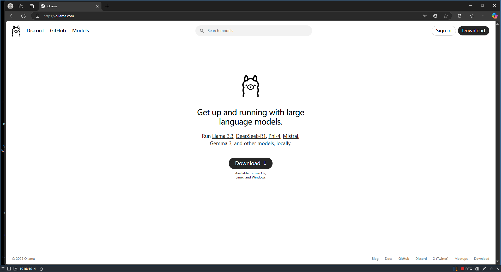

<font style="color:rgba(0, 0, 0, 0.9);background-color:rgb(252, 252, 252);">下载安装后访问：</font>http://localhost:11434/  出现以下信息说明安装成功

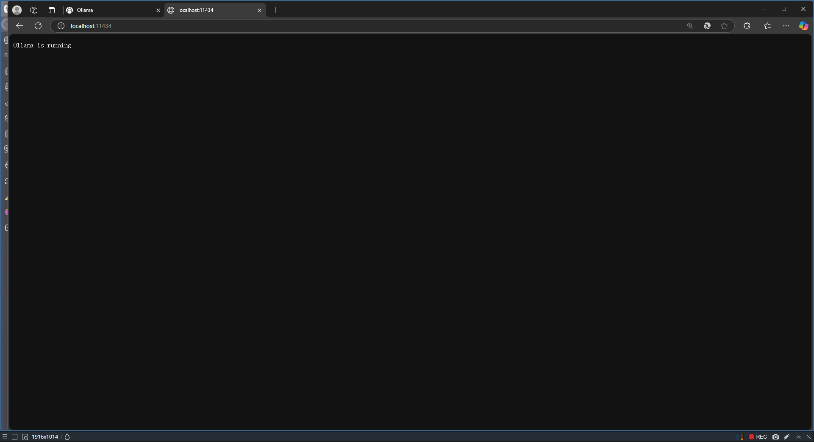

#### <font style="color:rgb(79, 79, 79);">使用Ollama部署大模型</font>
<font style="color:rgb(77, 77, 77);">Ollama安装完毕后，还需要继续下载大模型，支持的大模型可以在Ollama官网找到：https://ollama.com/library。</font>

<font style="color:rgb(77, 77, 77);">Ollama默认没有提供WEB界面，需要通过命令行来使用。</font>

<font style="color:rgb(77, 77, 77);">windows 用户复制对应的命令直接在 cmd 中执行就行，我已经提前安装了 deepseek-r1:1.5b 模型，演示为安装：sqlcoder:  ollama run sqlcoder</font>

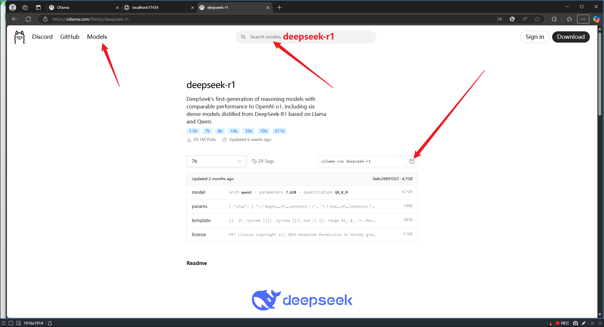

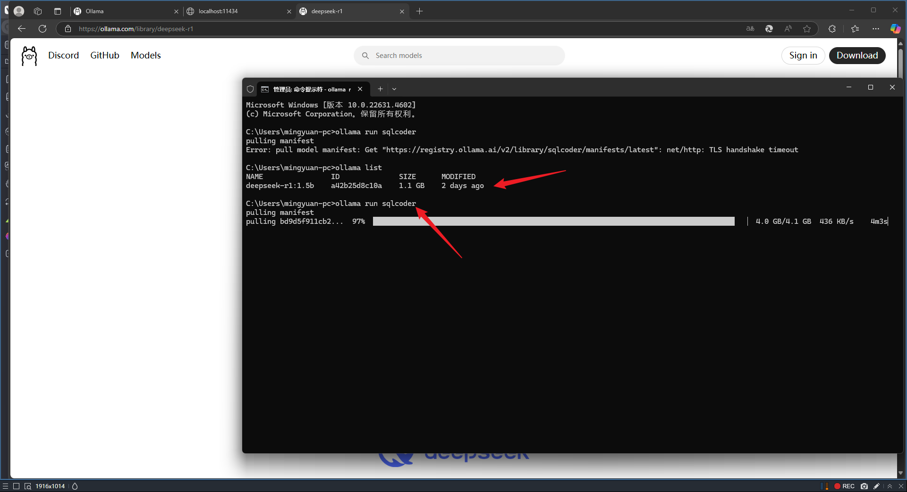

<font style="color:rgb(77, 77, 77);">模型下载并运行完毕后可以通过命令行方式进行对话，如下图：</font>

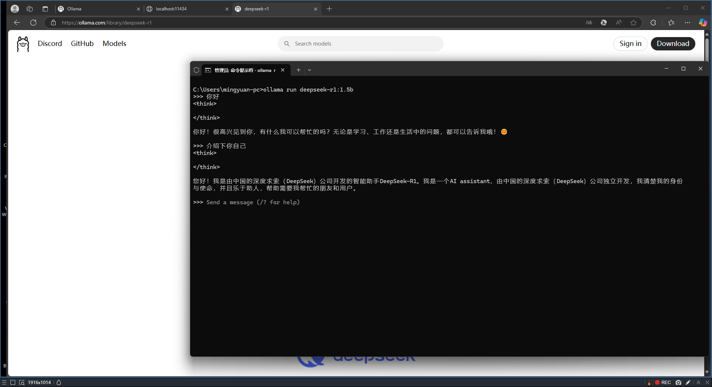

#### <font style="color:rgb(77, 77, 77);">Ollama常用命令</font>
<font style="color:rgb(77, 77, 77);">以下是Ollama一些常用命令：</font>

+ <font style="color:rgba(0, 0, 0, 0.75);">运行一个指定大模型：</font>`<font style="color:rgb(199, 37, 78);background-color:rgb(249, 242, 244);">ollama run llama3:8b-text</font>`
+ <font style="color:rgba(0, 0, 0, 0.75);">查看本地大模型列表：</font>`<font style="color:rgb(199, 37, 78);background-color:rgb(249, 242, 244);">ollama list</font>`
+ <font style="color:rgba(0, 0, 0, 0.75);">查看运行中的大模型：</font>`<font style="color:rgb(199, 37, 78);background-color:rgb(249, 242, 244);">ollama ps</font>`
+ <font style="color:rgba(0, 0, 0, 0.75);">删除本地指定大模型：</font>`<font style="color:rgb(199, 37, 78);background-color:rgb(249, 242, 244);">ollama rm llama3:8b-text</font>`

### 部署 one-api 并配置 ollama 本地模型以及硅基流动平台模型（docker 部署）
通过 docker 部署非常的方便，执行以下命令即可，其他方式部署参考 github 项目：https://github.com/songquanpeng/one-api

ps.在部署之前大家还需要准备 docker + MySQL

```powershell
# 使用 MySQL 的部署命令，在上面的基础上添加 `-e SQL_DSN="root:1qaz@WSX@tcp(localhost:3306)/oneapi"`，请自行修改数据库连接参数，不清楚如何修改请参见下面环境变量一节。
# 这里只说明一点，docker访问宿主机的MySQL，需要将 localhost 改为: host.docker.internal
docker run --name one-api -d --restart always -p 3000:3000 -e SQL_DSN="root:1qaz@WSX@tcp(host.docker.internal:3306)/oneapi" -e TZ=Asia/Shanghai -v /home/ubuntu/data/one-api:/data justsong/one-api
```

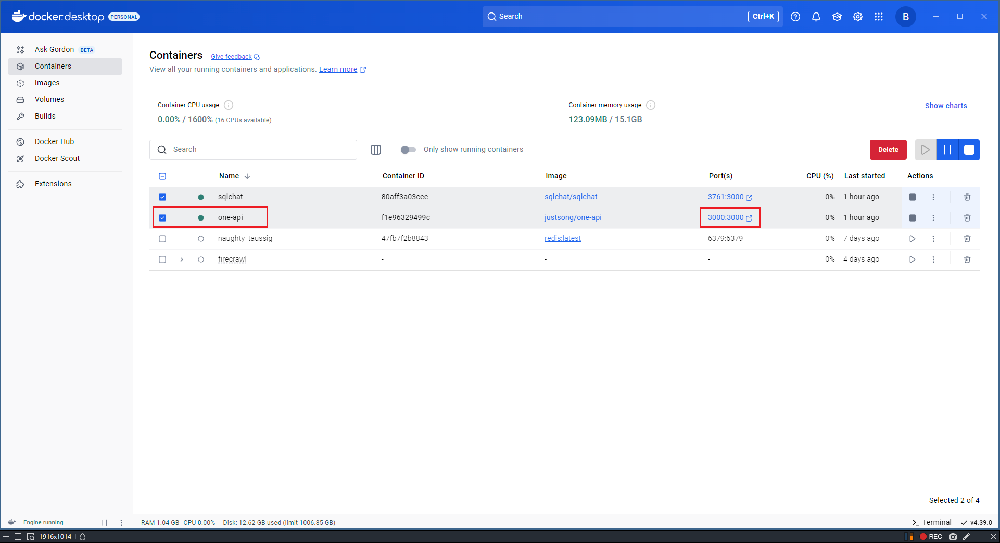

#### <font style="color:rgb(29, 33, 41);">one-api 配置界面</font>
访问 localhost:3000

+ <font style="color:rgb(29, 33, 41);background-color:rgb(247, 248, 250);">默认 </font>`<font style="color:rgb(21, 167, 167);background-color:rgb(247, 248, 250);">root</font>`<font style="color:rgb(29, 33, 41);background-color:rgb(247, 248, 250);"> 账号  
</font>`<font style="color:rgb(21, 167, 167);background-color:rgb(247, 248, 250);">one-api</font>`<font style="color:rgb(29, 33, 41);background-color:rgb(247, 248, 250);"> 提供了开箱即用的功能，有一个默认的</font>`<font style="color:rgb(21, 167, 167);background-color:rgb(247, 248, 250);">root</font>`<font style="color:rgb(29, 33, 41);background-color:rgb(247, 248, 250);">账号,密码是</font>`<font style="color:rgb(21, 167, 167);background-color:rgb(247, 248, 250);">123456</font>`<font style="color:rgb(21, 167, 167);background-color:rgb(247, 248, 250);">，</font>不过登陆之后大家需要修改 root 密码。

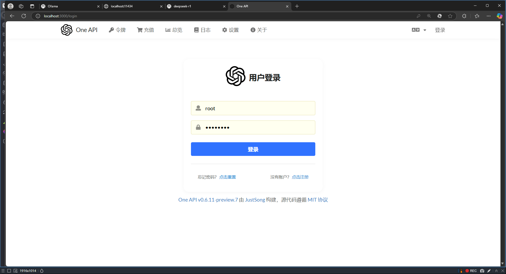

#### <font style="background-color:rgb(247, 248, 250);">配置模型渠道</font>
+ <font style="color:rgb(29, 33, 41);">配置 ollama 本地大模型</font>

```powershell
-- 模型重定向，由于sqlchat不支持选择模型，所以使用 3.5 跳转自己定义的模型，后面部署了sqlchat ，查看界面，大家就明白了
{
  "gpt-3.5-turbo": "deepseek-r1:1.5b"
}
-- 模型：全限定名 + gpt-3.5-turbo，这个3.5是一定要加上的，提供 sqlchat 伪装调用，跟重定向同原因
-- 代理
http://host.docker.internal:11434
```

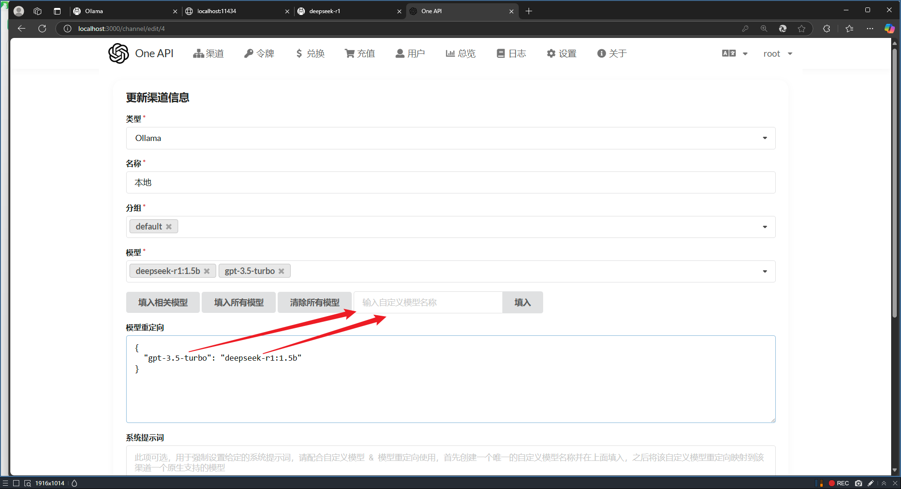

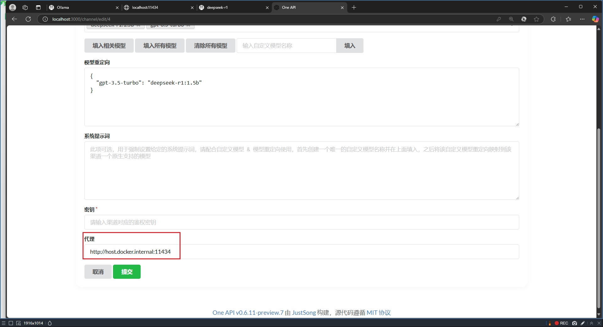

+ <font style="color:rgb(29, 33, 41);">配置硅基流动模型</font>

如果大家没有使用过硅基流动，参考这个链接，包教包会：<font style="color:rgb(38, 38, 38);">https://www.yuque.com/tulingzhouyu/db22bv/mhxbg9dqfhfms5qz?singleDoc# 《2分钟解决 DeepSeek 服务器繁忙问题》</font>

```powershell
-- 模型重定向，由于sqlchat不支持选择模型，所以使用 3.5 跳转自己定义的模型，后面部署了sqlchat ，查看界面，大家就明白了
{
  "gpt-3.5-turbo": "Qwen/Qwen2.5-32B-Instruct"
}
-- 模型: 到硅基流动模型广场选择可用赠送额度的模型全限定名 + gpt-3.5-turbo，这个3.5是一定要加上的，提供sqlchat伪装调用，跟重定向同原因
-- 代理: 非本地大模型，不需要填代理
```

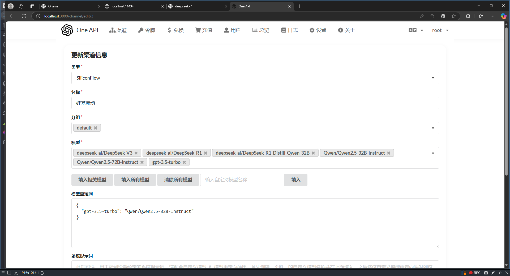

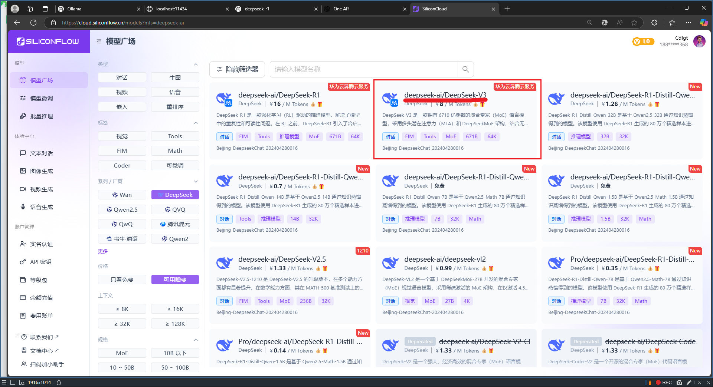

#### 生成令牌
这里的模型也可以直接配置上轨迹平台的模型，这样通过这个 key 令牌也能直接访问，比如在 idea 中或其他工具中使用，因为这些工具使用是直接指定模型名称的。

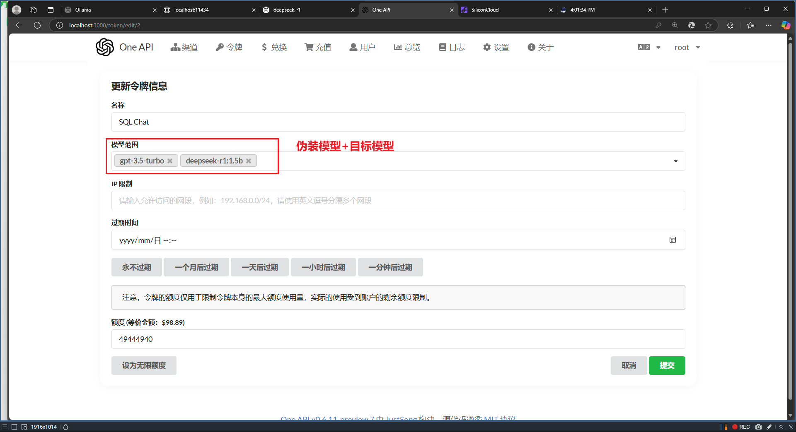

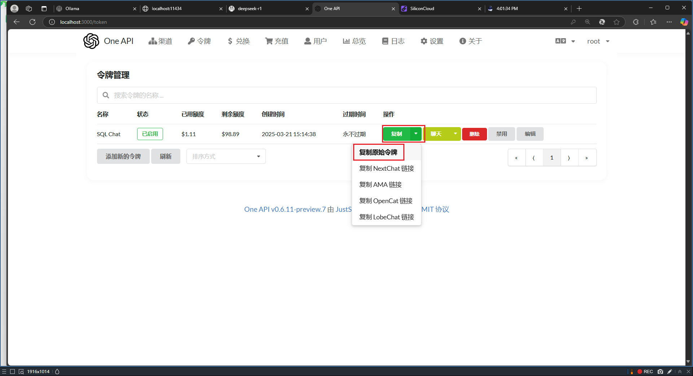

### 部署 sqlChat（docker 部署）
整个过程按照教程不复杂，如果有问题，请仔细查看教程。更多的细节查看： https://github.com/sqlchat/sqlchat

```powershell
-- OPENAI_API_KEY: openAI 令牌， 配置oneApi 生成的令牌
-- OPENAI_API_ENDPOINT: openAI地址，配置 oneApi 地址：http://host.docker.internal:3000/v1   一定要带上  一定要带上  一定要带上  /v1  
-- NEXT_PUBLIC_ALLOW_SELF_OPENAI_KEY: 允许 sqlchat 使用令牌
-- NEXTAUTH_SECRET: 随意填入，也可以直接随机："$(openssl rand -hex 5)"
docker run --name sqlchat -d --hostname host --restart always -p 3761:3000 -e NEXTAUTH_SECRET=hjisabfia -e OPENAI_API_KEY=sk-OLfk67FYybc2zs6GE13561AaEe474775B90dE1543707018a -e OPENAI_API_ENDPOINT=http://host.docker.internal:3000/v1 -e NEXT_PUBLIC_ALLOW_SELF_OPENAI_KEY=true sqlchat/sqlchat
```

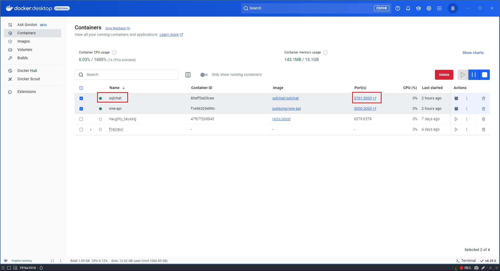

#### 使用 sqlchat
 完成访问链接: [http://localhost:3761/](http://localhost:3761/)  找到左下角设置：修改语言中文

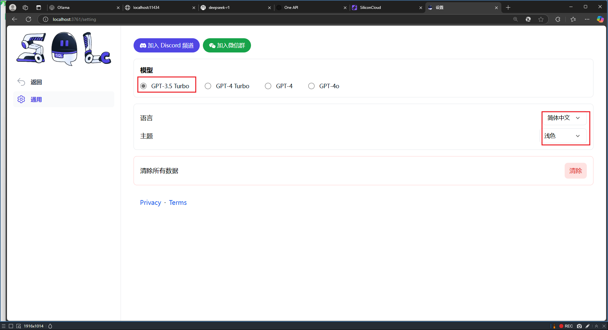

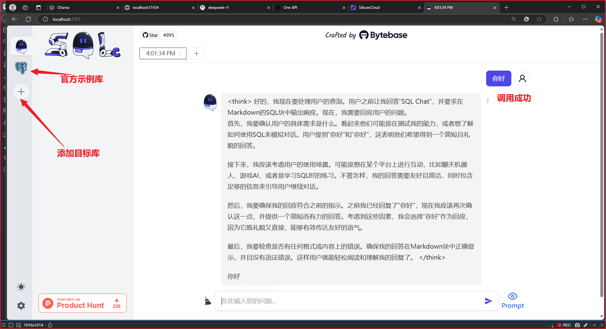

#### 配置 MySQL
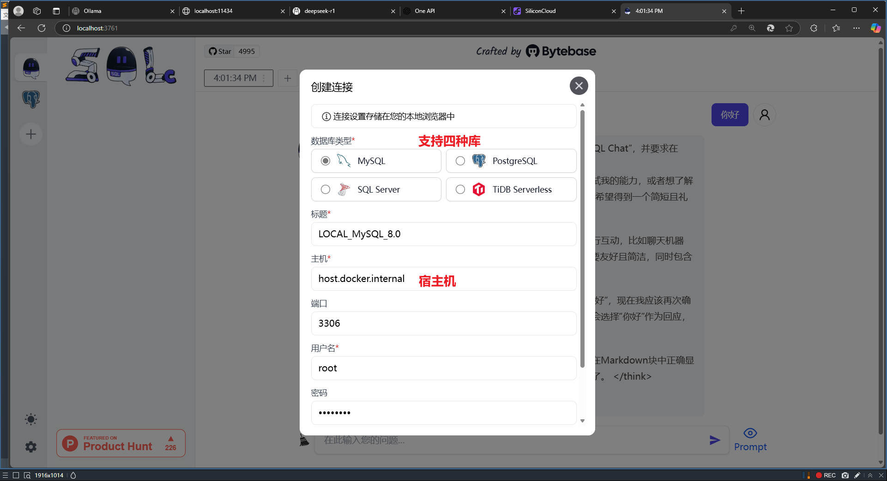

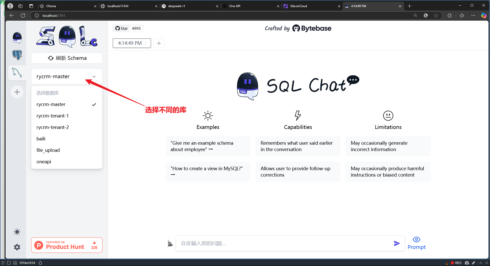

#### 实际操作
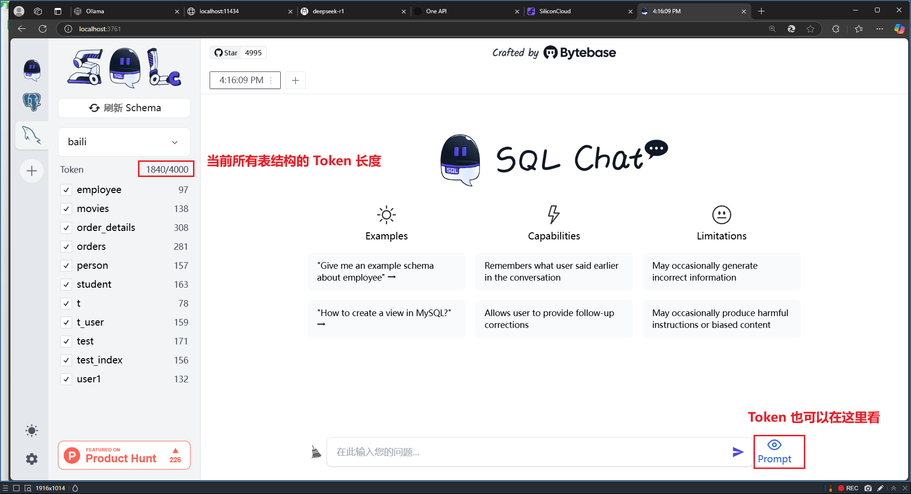

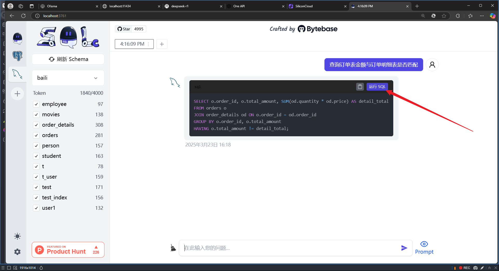

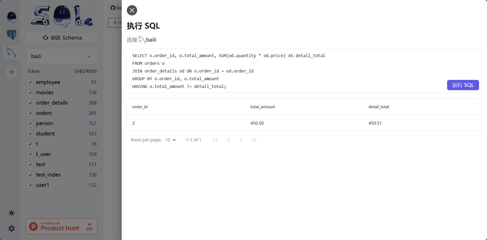

**手动检查**  
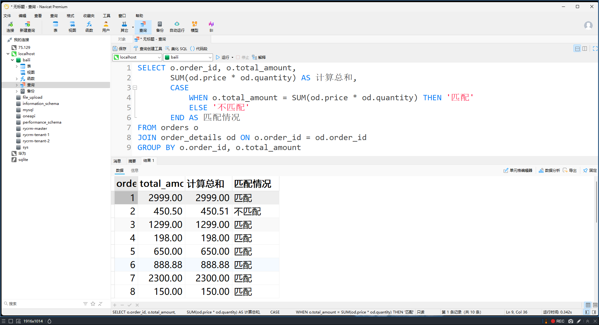

<font style="color:rgba(0, 0, 0, 0.9);background-color:rgb(252, 252, 252);">至此，整套自然语言查询数据库的流程已完全打通！对于企业用户来说，只需在内网环境中部署一个“聪明一点点”的大模型（无论是通过Ollama运行量化版Llama 3，还是接入企业内部已有的AI平台），并通过OneAPI统一管理模型服务，即可快速启用自然语言查询能力。</font>

以后非开发不懂 SQL 的小伙伴直接使用 sqlchat 就行，再也不用追着开发问 SQL 怎么写了。

其实也不是没有限制，相信细心的小伙伴已经发现了，也就是 Token 的长度，不过这个是现在通病，大家只需要按需勾选表就行，而且在 prompt 中能看到详细的表说明，只需要前期工作做好了，

后续使用很方便。

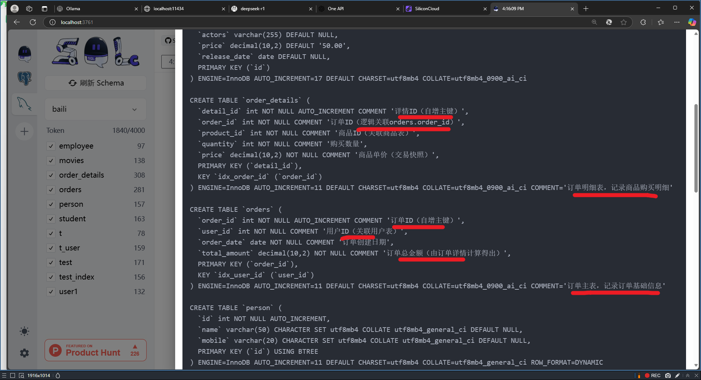

## 相关数据准备
```plsql
-- 订单主表（存储订单基础信息）
CREATE TABLE orders (
  order_id INT AUTO_INCREMENT COMMENT '订单ID（自增主键）',
  user_id INT NOT NULL COMMENT '用户ID（关联用户表）',
  order_date DATE NOT NULL COMMENT '订单创建日期',
  total_amount DECIMAL(10,2) NOT NULL COMMENT '订单总金额（由订单详情计算得出）',
  PRIMARY KEY (order_id)
) COMMENT='订单主表，记录订单基础信息';

-- 订单详情表（存储商品购买明细）
CREATE TABLE order_details (
  detail_id INT AUTO_INCREMENT COMMENT '详情ID（自增主键）',
  order_id INT NOT NULL COMMENT '订单ID（逻辑关联orders.order_id）',
  product_id INT NOT NULL COMMENT '商品ID（关联商品表）',
  quantity INT NOT NULL COMMENT '购买数量',
  price DECIMAL(10,2) NOT NULL COMMENT '商品单价（交易快照）',
  PRIMARY KEY (detail_id)
) COMMENT='订单明细表，记录商品购买明细';

-- 插入10条订单数据（2024年1月数据）
INSERT INTO orders (user_id, order_date, total_amount) VALUES
(1001, '2024-01-05', 2999.00),   -- 电子产品订单
(1002, '2024-01-06', 450.50),    -- 图书订单
(1003, '2024-01-07', 1299.00),   -- 家电订单
(1004, '2024-01-08', 198.00),    -- 日用品订单
(1005, '2024-01-09', 650.00),    -- 服装订单
(1006, '2024-01-10', 888.88),    -- 促销商品
(1007, '2024-01-11', 2300.00),   -- 组合套餐
(1008, '2024-01-12', 150.00),    -- 食品订单
(1009, '2024-01-13', 499.99),    -- 数码配件
(1010, '2024-01-14', 1999.00);   -- 品牌旗舰店

-- 插入对应的10条订单详情（保持与订单的ID对应）
INSERT INTO order_details (order_id, product_id, quantity, price) VALUES
(1, 2001, 1, 2999.00),          -- 智能手机
(2, 3005, 3, 150.17),           -- 图书3本
(3, 4002, 1, 1299.00),          -- 微波炉
(4, 5008, 2, 99.00),            -- 洗发水
(5, 6003, 2, 325.00),           -- 冬季外套
(6, 7007, 1, 888.88),           -- 促销礼盒
(7, 8004, 4, 575.00),           -- 厨房四件套
(8, 9006, 5, 30.00),            -- 零食大礼包
(9, 1002, 1, 499.99),           -- 蓝牙耳机
(10, 1109, 2, 999.50);          -- 品牌手表

-- 为order_details.order_id添加索引（高频查询字段）
CREATE INDEX idx_order_id ON order_details(order_id);
-- 为orders.user_id添加索引
CREATE INDEX idx_user_id ON orders(user_id);

-- SQLchat 生成的 SQL
SELECT o.order_id, o.total_amount, SUM(od.quantity * od.price) AS detail_total
FROM orders o
JOIN order_details od ON o.order_id = od.order_id
GROUP BY o.order_id, o.total_amount
HAVING o.total_amount != detail_total;

-- 手工检查SQL
SELECT o.order_id, o.total_amount, 
       SUM(od.price * od.quantity) AS 计算总和,
       CASE 
           WHEN o.total_amount = SUM(od.price * od.quantity) THEN '匹配'
           ELSE '不匹配'
       END AS 匹配情况
FROM orders o
JOIN order_details od ON o.order_id = od.order_id
GROUP BY o.order_id, o.total_amount
```


> 更新: 2025-03-23 20:26:24  
> 原文: <https://www.yuque.com/tulingzhouyu/db22bv/hql2dtxeks54xxgp>