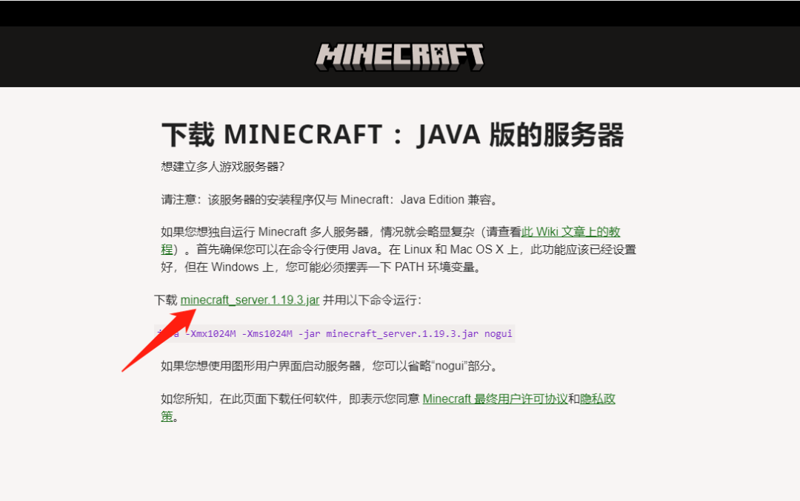
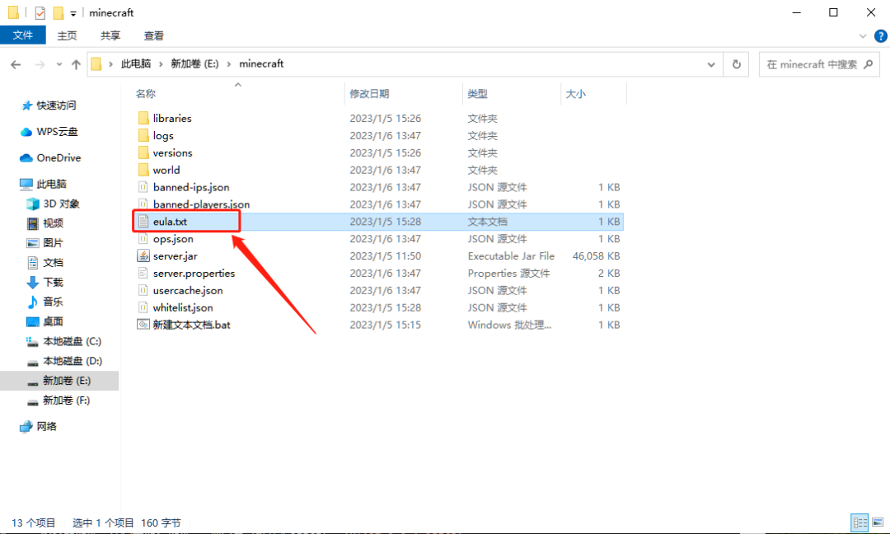
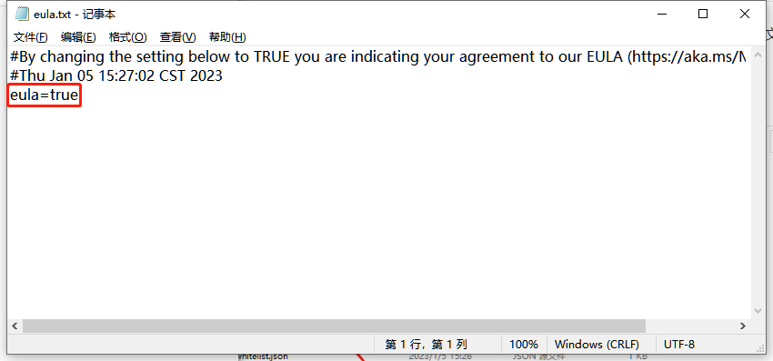
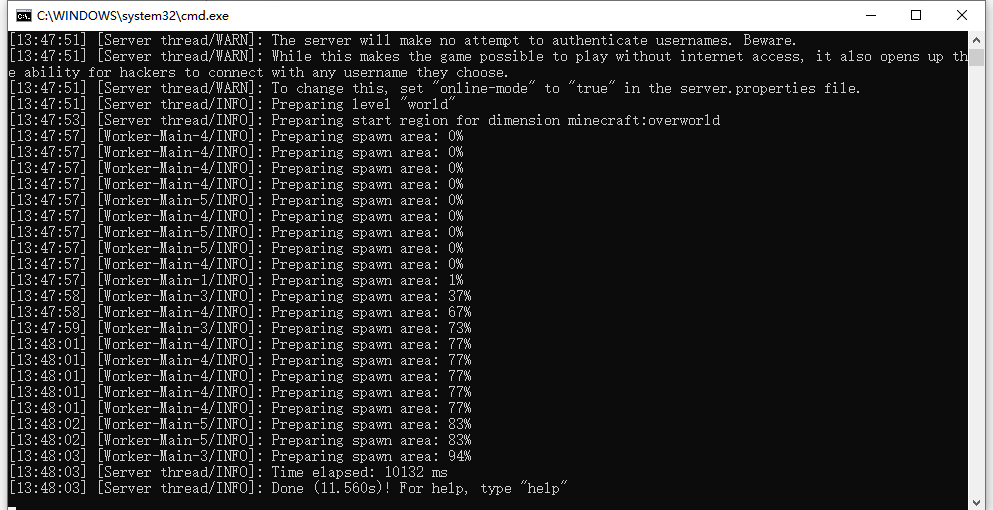
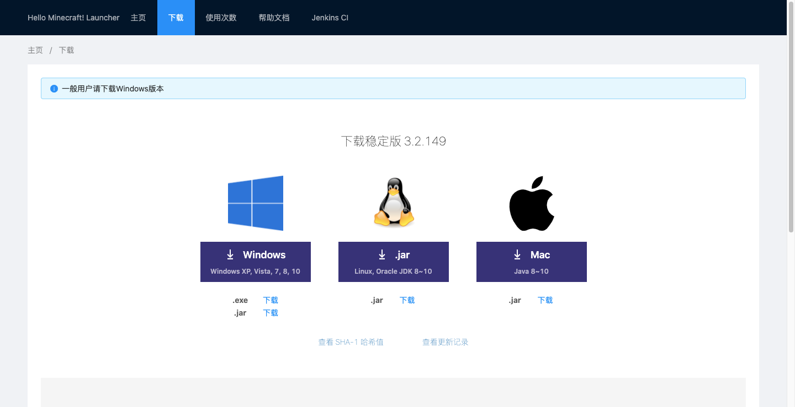

# 在自己的电脑上搭建我的世界Java版服务器

很多朋友，喜欢玩Minecraft，也希望搭建一个服务器，用于和小伙伴联机；

并且，拥有服务器后，即使所有玩家都下线，“世界”依旧在运行，玩家可以随时参与其中，说不定一上线，你的好友已经悄悄给你早了一个世界。

<font style="color:rgb(77, 77, 77);">本次教程将在Windows本地搭建Java版的MC服务器，并用cpolar内网穿透突破局域网限制，实现在公网环境下跟小伙伴远程联机，超简单配置，无需公网IP，也不用设置路由器。</font>

<font style="color:rgb(77, 77, 77);">如果你的服务器已经搭建成功，并可以正常在局域网内联机，可以直接跳到第三步，在本地配置cpolar内网穿透，创建隧道映射25565端口，实现异地远程联机。</font>

## <font style="color:rgb(79, 79, 79);">配置服务端</font>
<font style="color:rgb(77, 77, 77);">下载MC服务端，最新版的服务器端可以官网下载</font>



### Minecraft服务器下载地址：
1. [Minecraft 官方版本：https://www.minecraft.net/zh-hans/download/server](https://www.minecraft.net/zh-hans/download/server)
2. [Minecraft Forge版本：http://files.minecraftforge.net/](http://files.minecraftforge.net/)
3. [Minecraft Spigot版本：https://www.spigotmc.org/](https://www.spigotmc.org/)
4. [Minecraft Farbic：http://fabricmc.net/](http://fabricmc.net/)
5. [城通网盘镜像站：https://url57.ctfile.com/d/26158157-38513858-513480；访问密码：6146](https://url57.ctfile.com/d/26158157-38513858-513480)
6. [博客镜像站：https://tool.mintimate.cn/data/Minecraft_Mirror](https://tool.mintimate.cn/data/Minecraft_Mirror)


## 运行服务端
```java
java -Xmx1500M -Xms512M -jar server.jar nogui
```

第一次启动以后<font style="color:rgb(77, 77, 77);">，你会看到文件夹有多出来一些文件，找到eula.txt这个文件并打开，将eula=false改为eula=true，然后保存。</font>





<font style="color:rgb(77, 77, 77);">打开</font>`<font style="color:rgb(77, 77, 77);">server.properties</font>`<font style="color:rgb(77, 77, 77);">文件，做如下改动：</font>`<font style="color:rgb(77, 77, 77);">online-mode=false</font>`<font style="color:rgb(77, 77, 77);">（关闭正版验证），其他改动可以按照自己的喜好。至此服务器已经配置完毕，服务器的设置详情都在</font>`<font style="color:rgb(77, 77, 77);">server.properties</font>`<font style="color:rgb(77, 77, 77);">。</font><font style="color:#000000;background-color:#FBDE28;">再次执行服务端启动命令即可 </font><font style="color:rgb(77, 77, 77);">。</font>



## 客户端下载
<font style="color:rgb(44, 62, 80);">我个人推荐用官方启动器或者HMCL启动器；其他第三方启动器，不好说，如果服务器建好，端口也放行，但是连接不上，建议用HMCL或者官方启动器。</font>  


### 下载地址
+ <font style="color:rgb(44, 62, 80);">官方启动器：</font>[https://minecraft.net/](https://minecraft.net/)
+ <font style="color:rgb(44, 62, 80);">HMCL启动器下载：</font>[https://hmcl.huangyuhui.net/download](https://hmcl.huangyuhui.net/download)
+ <font style="color:rgb(44, 62, 80);">官方和HMCL的公网有可能进不去，为提供镜像下载：</font>[https://url57.ctfile.com/d/26158157-39233167-4af7b9](https://url57.ctfile.com/d/26158157-39233167-4af7b9)<font style="color:rgb(44, 62, 80);">（访问密码：6146）</font>

## 常见问题
### 登入失败:无效会话(请尝试重启游戏及启动器)
<font style="color:rgb(44, 62, 80);">原因很简单：你并没有用Minecraft的正版账号登录。解决方法很简单：正版账号登录游戏或服务器关闭正版账号验证：将</font>**<font style="color:rgb(44, 62, 80);">online-mode:true</font>**<font style="color:rgb(44, 62, 80);">的true改为false，然后保存退出。</font>

### 如何替换服务器上地图存档
<font style="color:rgb(44, 62, 80);">如何替换服务器上的地图存档为自己本地的地图存档呢？其实很简单，将本地Minecraft的</font><font style="color:rgb(232, 62, 140);">.minecraft</font><font style="color:rgb(44, 62, 80);">内的</font><font style="color:rgb(232, 62, 140);">saves</font><font style="color:rgb(44, 62, 80);">内的地图文件，重命名为</font><font style="color:rgb(232, 62, 140);">world</font><font style="color:rgb(44, 62, 80);">，并上传到Minecraft目录内，替换掉原本的</font><font style="color:rgb(232, 62, 140);">world</font><font style="color:rgb(44, 62, 80);">文件并重启Minecraft服务器即可。你也可以直接上传到Minecraft根目录，然后修改</font><font style="color:rgb(232, 62, 140);">server.properties</font><font style="color:rgb(44, 62, 80);">内</font><font style="color:rgb(232, 62, 140);">level-name</font><font style="color:rgb(44, 62, 80);">字段后的</font><font style="color:rgb(232, 62, 140);">world</font><font style="color:rgb(44, 62, 80);">为你上次的存档文件夹。</font>

### server.properties如何配置
<font style="color:rgb(232, 62, 140);">server.properties</font><font style="color:rgb(44, 62, 80);">文件如何配置呢？  
</font><font style="color:rgb(44, 62, 80);">大家感兴趣可以看看Minecraft的Wiki：</font>[https://minecraft.fandom.com/zh/wiki/Server.properties?variant=zh](https://minecraft.fandom.com/zh/wiki/Server.properties?variant=zh)

<font style="color:rgb(44, 62, 80);">修改后，记得重启MC服务器!!!</font>  


  


<font style="color:rgb(44, 62, 80);">  
</font>


> 更新: 2023-10-06 19:48:41  
> 原文: <https://www.yuque.com/tulingzhouyu/db22bv/zctu2dzi2mdimegg>