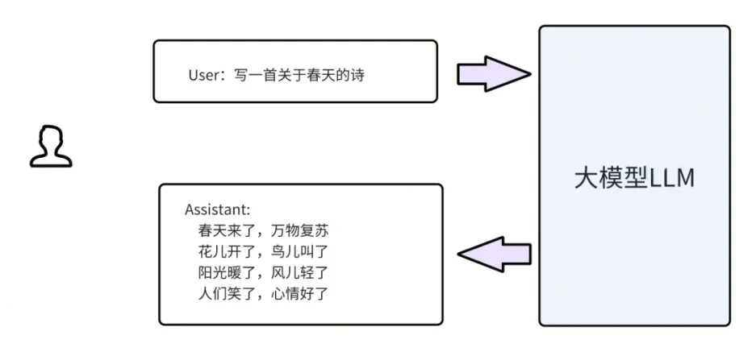

# 大模型平台接入最佳实践

# 大模型平台接入最佳实践
**目录**  
一、背景  
二、业务系统接入大模型的三种方式  
三、直接PROMPT(提示语)方式接入  
1. PROMPT的常用技巧  
1.1 Zero-Shot, One-Shot, Few-Shot  
1.2 链式思维  
1.3 任务分解  
2. 如何在PROMPT提示语中嵌入业务知识  
四、通过RAG(检索增强)方式接入  
1. RAG的实现  
1.1 RAG的流程  
1.2 知识检索如何实现  
2. 业务接入RAG检索的例子  
五、通过Fine-tuning(微调训练)方式接入  
1. 微调训练的方式有哪些  
2. KubeAI大模型平台上如何进行Fine-tuning  
3. 一些Fine-tuning微调的例子  
六、业务系统接入大模型的最佳路径  
渐进式接入大模型  
七、总结与展望  
**一**  
**背景**  
**最近经常收到内部业务方的咨询，他们想知道"如何让我们的业务系统接入大模型提效"。****为了回答这个问题，我们梳理了 KubeAI 大模型平台对接的一些业务实践与一些业界经典案例分享给大家。**  
OpenAI的第一次开发者大会的主题为 Maximizing LLM Performance，提出业务系统可以通过三种方式接入大模型，PROMPT（直接给大模型输入提示词），RAG（通过检索增增强来提升大模型的能力），Fine-tuning（通过微调训练来提升大模型的能力）。  
本文借鉴 OpenAI 的观点，结合具体实践例子分别介绍这三种接入方式，最后建议业务可以通过渐进（PROMPT，RAG，Fine-tuning）的方式接入大模型，从而达到最佳的收益效果。  
**二**  
**业务系统接入大模型的三种方式**  

  
前面我们简单提过，目前业务系统接入大模型一共有三种方式，分别是 PROMPT（直接给大模型输入提示语），RAG（通过检索增强来提升大模型的能力），Fine-tuning（通过微调训练来提升大模型的能力）。下面我们对这三种方式先给出简单的示例解释。  
●PROMPT（直接给大模型输入提示语）  
通过 PROMPT 方式接入大模型是最简单最直接的方式。即我们拿到开源大模型后，直接推理部署运行起来。然后通过给大模型发送提示语的方式，让大模型解决你的问题返回答案。比如可以直接让大模型对一篇文章生成总结等。  
●RAG（通过检索增强大模型的能力）  
通过 RAG 的方式接入大模型，是一种利用检索增强生成（Retrieval Augmented Generation）技术，让大语言模型（Large Language Model，LLM）能够参考相关的知识，从而提高生成质量和准确性的方法。  
RAG 的核心思想是，先通过向量数据库（Vector Database）检索出与用户提问最相关的文档或知识，然后将这些文档或知识融入到大模型的输入（Prompt）中，让大模型在生成答案时能够参考这些信息。从而让大模型更加了解业务相关知识。  
●Fine-tuning（通过训练增加大模型的能力）  
Fine-tuning 的方式是指在一个已经预训练好的大模型的基础上，用业务特定的数据集对模型的部分或全部参数进行微调，以适应特定的任务或领域。通过 Fine-tuning，可以让大模型更了解业务的需求和特点，提高模型在业务场景中的表现。  
接下来我们会结合 KubeAI 大模型平台对接的业务实践或一些业界经典案例，继续详细阐述业务系统如何通过上面三种方式接入大模型。  
**三**  
**直接PROMPT(提示语)方式接入**  

  
所谓 PROMPT 方式接入大模型，是指给大模型设计合适的提示语（Prompt）让大模型产生对应的输出，从而完成各种任务。最简单的 PROMPT 比如上面的例子，让大模型写一首关于春天的诗，然后大模型会产生对应的输出。  
在复杂业务场景下，PROMPT 的设计往往非常复杂。因此专门研究如何设计 PROMPT 的"PROMPT 工程"应运而生。PROMPT 工程是一门利用大语言模型（Large Language Model, LLM）的内在能力，通过设计合适的提示语（Prompt）来完成各种任务的学科。其目的是找到最优的提示语，使模型的性能和效率达到最高。  
以下关于 PROMPT 的梳理参考了 Prompt Engineering Guide(https://www.promptingguide.ai/zh)，openai-cookbook(https://github.com/openai/openai-cookbook/tree/main)里提到的相关内容与论文，感兴趣的同学可以去深入了解下。  
**PROMPT的常用技巧**  
**目前大模型的输入上下文长度一般为 4K 或 16K，最近有些大模型支持 32K 或 128K，为 Promopt 的设计留下了比较大的发挥空间。**  
**Zero-Shot, One-Shot, Few-Shot**  
OpenAI 关于 GPT-3 的论文"Language Models are Few-Shot Learners"，这篇论文详细介绍了 GPT-3，一个强大的自然语言处理（NLP）模型。其中的亮点之一便是 Few-Shot Learning。  
●Zero-Shot 学习：就是让模型在没有任何相关数据的情况下，直接用自然语言指令来完成一个新任务。比如，你可以告诉模型“把这段英文翻译成中文”，然后模型就会尝试做出翻译，而不需要给它任何翻译的例子。这种方法最方便，但也最有挑战，因为有些任务可能很难用自然语言指令来清楚地描述。  
●One-Shot 学习：就是让模型在只有一个相关数据的情况下，用自然语言指令和一个例子来完成一个新任务。比如，你可以告诉模型“把这段英文翻译成中文”，然后给它一个英文句子和它的中文翻译作为例子，然后模型就会尝试根据这个例子来做出翻译。这种方法比 Zero-Shot 更容易让模型理解任务的内容或格式，因为有一个例子可以参考。  
●Few-Shot 学习：就是让模型在有少量相关数据的情况下，用自然语言指令和几个例子来完成一个新任务。比如，你可以告诉模型“把这段英文翻译成中文”，然后给它几个英文句子和它们的中文翻译作为例子，然后模型就会尝试根据这些例子来做出翻译。这种方法比 One-Shot 更能提高模型的准确性和稳定性，因为有更多的例子可以参考。  
在以上三种情况下，Prompt（提示语）就是用来提供自然语言指令和少量例子的语句，以便引导模型完成任务。  
**链式思维**  
链式思维（Chain of thoughts）解决问题的方法是把复杂问题拆分成很多环环相扣的步骤，逐步解决问题。这种逐步解答示例可以帮助模型更好地理解和解决需要多步骤推理的复杂问题。  
●相关论文链接：Large Language Models are Zero-Shot Reasoners(https://arxiv.org/abs/2205.11916)  
●提示语设计:  
作者发现，通过在每个答案之前简单添加“让我们逐步思考（Let's think step by step）”，大模型可以成为出色的零样本推理者。将这个简单的技巧应用于 MultiArith 数学数据集，作者发现 Let's think step by step 使准确度翻了四倍，从 18% 到 79%！  
●举例：  
下面是在 text-davinci-003 模型上的实验：错误答案如下：Q：一个杂耍者可以抛 16 个球。球的一半是高尔夫球，而高尔夫球中又有一半是蓝色的。有多少个蓝色的高尔夫球?A：8 个蓝色的高尔夫球。加了链式思维提示后，得到了正确的答案：Q：一个杂耍者可以抛 16 个球。球的一半是高尔夫球，而高尔夫球中又有一半是蓝色的。有多少个蓝色的高尔夫球?让我们一步一步思考A：首先，一个杂耍者可以抛 16 个球，所以一共有 16 个球。其次，其中一半是高尔夫球，所以有 8 个高尔夫球。最后，高尔夫球中又有一半是蓝色的，所以有 4 个蓝色的高尔夫球。下面是作者论文中的例子：

  
**任务分解**  
任务分解是当一个任务比较复杂时，往往是将一个复杂的任务分解成更小、更容易处理的子任务的过程。经典的例子，比如 AB 两个城市之间搬运货物，需要分三个步骤，A 城市装货，AB 城市之间运输，B 城市卸货。  
前期比较火爆的浙大 & 微软研究院提出的 HuggingGPT 工程，就是任务分解的典型应用。  
●相关论文链接：HuggingGPT: Solving AI Tasks with ChatGPT and its Friends in HuggingFace(https://arxiv.org/abs/2303.17580)  
●提示语设计：  
HuggingGPT 会把一个多模态任务拆分成多个子任务，然后再以此执行每个子任务，从而实现多模态的功能。  

  
HuggingGPT 的任务拆分是通过 PROMPT 提示大模型来实现的。下面看下 HuggingGPT 的一个 PROMOT 的具体内容(已经翻译成中文)：  
用户请求内容如下：  
HuggingGPT 给大模型的提示如下：  

  
这些 Prompt 后面还会增加一些请求返回的示例，也就是 Few-Shot，让大模型对这些 Prompt 理解更加精确，这个我们在前面的**Few-Shot** 部分有讲到。  
大模型的返回如下：  
由此可见，基于任务拆解 PROMOPT，完全让大模型具备任务拆解的功能，把一个复杂的多模态任务拆分成一个个简单的 task，然后 HuggingGPT 会依据 GPT 返回的 task，去一步一步执行，返回给用户最后结果。  
**如何在PROMPT提示语中嵌入业务知识**  

  
在为大模型设计 PROMPT 时，通常可以将其分为四个可选部分，以指导模型的响应和行为：  
●用户指令：明确告诉大模型需要执行的具体任务，例如扮演特定角色，生成某些内容等。  
●对话上下文：提供之前的对话内容，帮助大模型理解当前对话的背景，从而生成更相关的回应。  
●附加内容：补充额外信息，如基础库的细节或特定业务知识，以丰富大模型的知识库和回答质量。  
●输出要求：指定期望的输出格式，输出内容限制等。  
这四个部分并非都必须包含在每个 PROMPT 中，可以根据实际需求灵活选择。  
从上图的 PROMPT 四要素中可以看出，业务知识可以嵌入到 PROMPT 的附加内容中，业务场景对话可以嵌入到 PROMPT 的对话上下文中。  
下面是 KubeAI 大模型平台对接的"AI画原型"项目的一个 PROMPT 写法(简单版本)，该项目的目的是用户写完产品描述后，让大模型基于产品描述生成满足标准的前端页面。我们来拆解下他的 PROMPT。  

  
这样的 PROMPT 设计允许业务知识通过附加内容部分嵌入到提示语中。可见按照 PROMPT 四要素的原则去设计，可以把业务相关知识比较容易嵌入到提示语中。  
**四**  
**通过RAG(检索增强)方式接入**  
**虽然通过 PROMPT 的方式直接接入大模型比较简单，但是直接 PROMPT 对接会面临两个挑战：**  
●PROMPT 直接咨询大模型的时候，大模型并不了解你的业务知识，有时还会产生幻觉，导致回答质量不佳。  
●PROMPT 里嵌入的业务知识需要随着业务的变化而不断更新。  
为了克服这些挑战，RAG 技术应运而生。RAG 技术是一种利用大语言模型（LLM）的应用方案，它的全称是检索增强生成（Retrieval Augmented Generation）。它的核心思想是通过检索获取相关的知识，并将其融入到大模型的输入中，让大模型能够参考这些知识来给出合理的回答或生成内容。  
大模型 RAG 技术有很多优势，例如：  
●它可以解决大模型自身知识不足、幻觉问题、数据安全性等问题。  
●它可以利用私域数据或实时数据，提高大模型的时效性和专业。  
**RAG的实现**  
  
**RAG的流程**  

  
上图展示了 RAG 的一个典型流程，我们来逐步分析这个流程。RAG 的主要步骤如下：  
●用户根据自己的需求输入指令，例如：公司 IT 的电话是多少？  
●知识检索器根据用户的指令，从业务知识存储池(向量数据库)中检索(向量搜索)出相关的知识。例如：在向量数据库中找到公司 IT 的电话号码等业务知识。  
●将用户的指令和业务知识组合成大模型的 PROMPT，例如组合后的结果为：基于如下内容回答：公司 IT 的电话是多少？。内容：公司的 IT 电话是 XXXX。  
●向大模型发出 PROMPT，并得到大模型的回答。  
**知****识检索如何实现**  

  
知识检索可以从互联网直接获取知识，也可以先在企业内部存储业务知识，再进行检索。由于企业内部知识存储的应用较为广泛，我们这里只介绍这种实现方式。  
业务知识检索主要包括两个环节，分别是业务知识的录入和检索。我们来逐一分析这两个环节的具体步骤。  
业务知识录入：  
●用户将业务知识文档通过工具切分成若干片段。  
●对于每个文档片段，利用 Embedding Model 计算其对应的向量表示。  
●将文档片段和向量表示一起存储到向量数据库中。  
业务知识检索：  
●用户输入检索指令，利用 Embedding Model 计算其对应的向量表示。  
●在向量数据库中查找与检索指令向量最相似的文档片段向量。  
●返回检索结果，即与检索指令最匹配的业务知识。  
**业务接入RAG检索的例子**  
**下面以 KubeAI 大模型平台对接的数仓指标智能分析为例，讲解下一个具体业务如何通过 RAG 的方式接入大模型。**  

  
该项目能够根据用户的自然语言描述，直接生成用户可视化的数据展示。其简单 RAG 推理流程如下：  
●Agent 接收到用户的咨询问题，立即访问向量数据库，找出需要用到的数仓指标。  
●Agent 利用用户的咨询和指标，调用大模型，由大模型产生相应的查询指令。  
●Agent 运行查询指令，获得数据结果，将结果返回并呈现给用户。  
**五**  
**通过Fine-tuning(微调训练)接入**  
**微调训练的方式有哪些**  

  
上图展示了一个完整的大型模型训练过程，从大型模型的预训练到应用于业务场景，通常包括三个阶段：  
●预训练  
定义：在大规模的无标注文本上，使用自监督学习的方法，训练一个通用的语言模型，使其能够捕捉语言的统计规律和语义知识。预训练是为了建立一个通用的语言理解基础。  
数据例子：  
  
●指令调优  
定义：在预训练的基础上，使用一些有标注的（指令，输出）对模型进行微调，使其能够根据人类给定的指令，生成期望的输出。指令调优是为了提高模型的可控性和可解释性，使其能够按照用户的意图执行不同的任务。  
数据例子：  
●RLHF  
定义：在指令调优的基础上，使用强化学习的方法，利用人类的反馈作为奖励信号，对模型进行进一步的优化，使其能够生成更符合人类偏好的输出。RLHF 是为了提高模型的质量和安全性，使其能够避免一些不合理或不道德的生成结果。  
**KubeAI大模型平台上如何进行Fine-tuning**  

  
在 KubeAI 大模型平台上，用户可以按照以下步骤迅速启动大型模型训练并进行自动部署：  
●选择大模型，基于之前提到的大模型选择原则，在大型模型平台上选择您需要的大模型。  
●上传训练数据，按照上述数据准备方法，将您准备好的数据上传到大型模型平台。  
●配置训练参数，通常情况下，选择默认配置参数，如Lora即可。这些参数通常经过优化以获得最佳的训练效果可。  
●训练，点击相应按钮，启动训练过程。大型模型平台将自动处理训练任务，以便您专注于业务应用的开发和部署。  
**一些Fine-tuning微调的例子**  
**我们以训练一个某业务领域的智能客服机器人为例，讲解下如何通过 Fine-tuning 的方式构建一个智能客服机器人。**  

  
训练的目的是构造一个熟悉某业务领域知识的智能客服机器人。  
●数据准备。  
○准备业务领域知识，可以是文档，过往客服解决问题的聊天记录等。  
○数据清洗，主要目的是提升数据质量。最常见的操作比如，数据分类后进行去重，过滤，补充等方式。  
○构造客服聊天数据，基于上一步清洗好的数据，构造一问一答形式的客服聊天数据，可以调用其他大模型通过 PROMPT 的方式直接构造。  
●微调大模型。  
○基础大模型选型，选型考虑大模型的大小， 各项指标的评分等。模型参数越大越聪明，但是推理速度会变慢。所以最好的方式是可以多选几个大模型，做实验去评测。  
○微调大模型，可以选择一下开源框架直接微调大模型，比如大部分情况直接通过 Lora 的方式微调出一个 Lora Adapter 参数模型即可。  
**六**  
**业务系统接入大模型的最佳路径**  
**渐进式接入大模型**  

  
前面介绍了业务如何通过 PROMPT（提示语），RAG（检索增强），Fine-tuning（微调训练）三种方式接入大模型。OpenAI 的开发者大会 Maximizing LLM Performance 提出的业务接入大模型的方式，我们理解应该是渐进式接入，其流程如下。  
●第一步，业务先用 PROMPT 方式接入大模型。这一步很简单，只需编写 PROMPT，并建立基本的调用逻辑，测试效果。  
●第二步，业务在第一步的基础上，可以用 RAG 的方式接入。通过 RAG，可以改变 PROMPT 的内容，加入更多业务相关的知识。当然如果业务有充足的训练数据，这一步也可以省略，直接进入第三步的 Fine-tuning 方式。  
●第三步，业务用 Fine-tuning 方式接入大模型，可以让大模型更好地理解业务的知识。这一步需要有足够的高质量的数据，数据可以用第二步的 RAG 生成的数据，或其他来源的数据。Fine-tuning 相比于 RAG，可以提高大模型的推理准确性和速度。  
**七**  
**总结与展望**  
**本文介绍了业务系统接入大模型的三种方式：PROMPT、RAG和Fine-tuning。我们通过具体的实践案例，展示了这三种方式在不同场景下的效果和优势，以及如何根据业务需求和数据情况选择合适的方式。最后建议业务接入大模型的最佳实践，渐进式的接入，即 PROMPT，RAG，Fine-tuning，这个也是借鉴 OpenAI 开发者大会提出的接入方式。**  
大模型是未来业务创新的重要驱动力，可以帮助业务提升效率、质量和用户体验。建议业务可以通过渐进的方式接入大模型，从 PROMPT 开始，逐步尝试 RAG 和 Fine-tuning，以达到最佳的收益效果。也期待与更多的业务部门合作，共同探索大模型的更多可能性。

> 更新: 2025-02-06 17:24:28  
> 原文: <https://www.yuque.com/tulingzhouyu/db22bv/mnd1elg90vn4iyns>