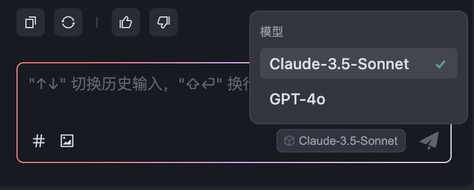
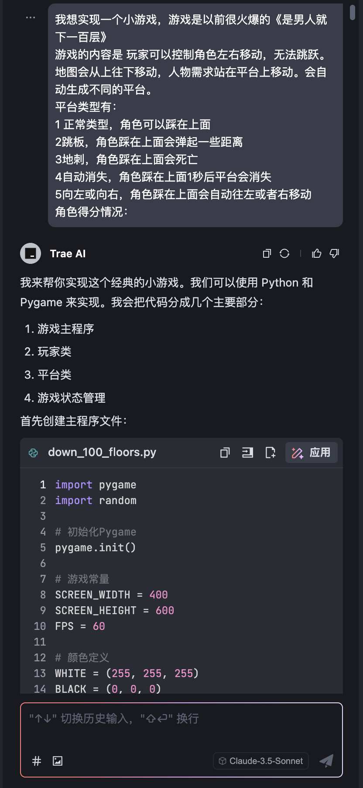
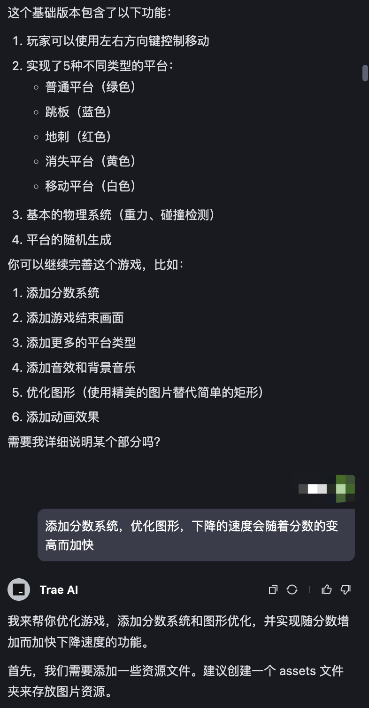
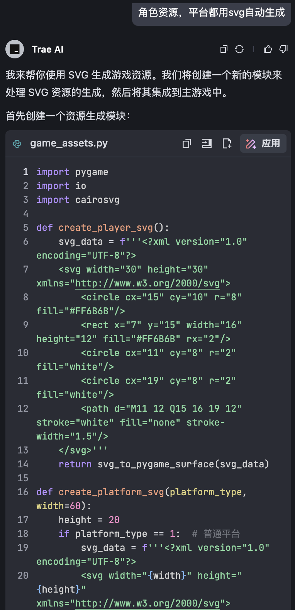
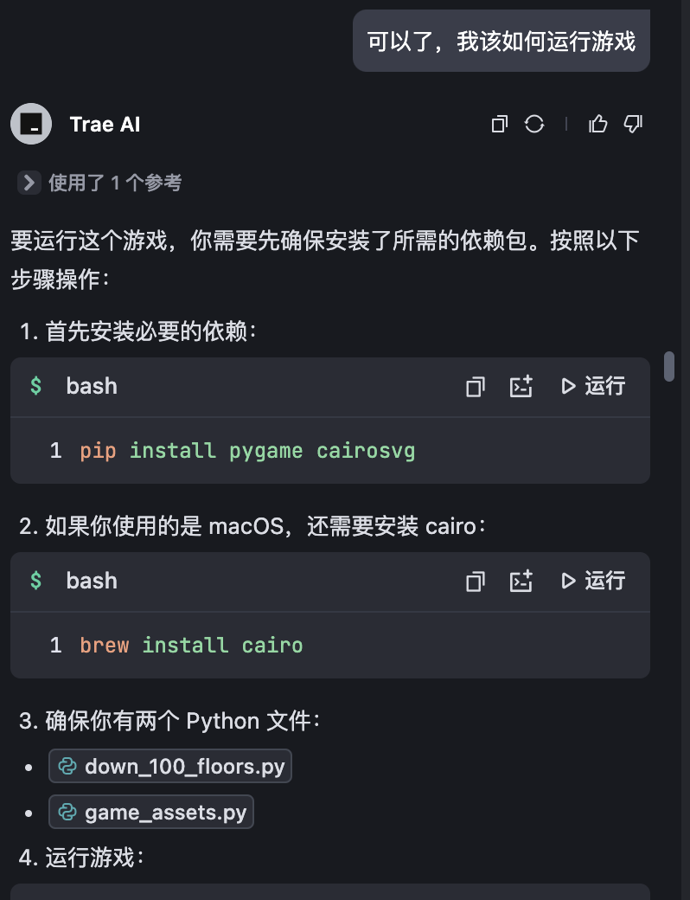
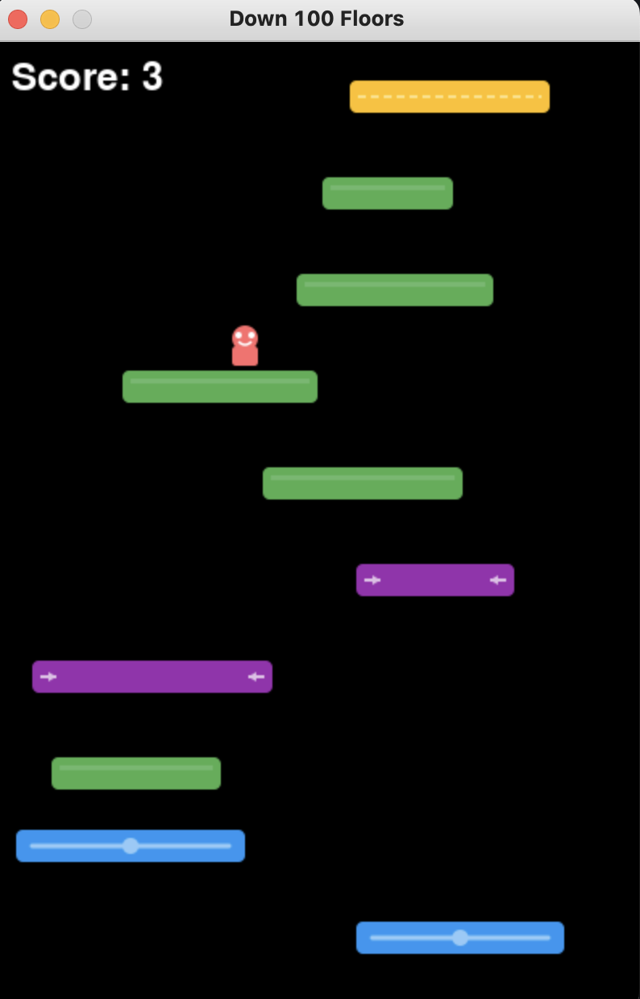
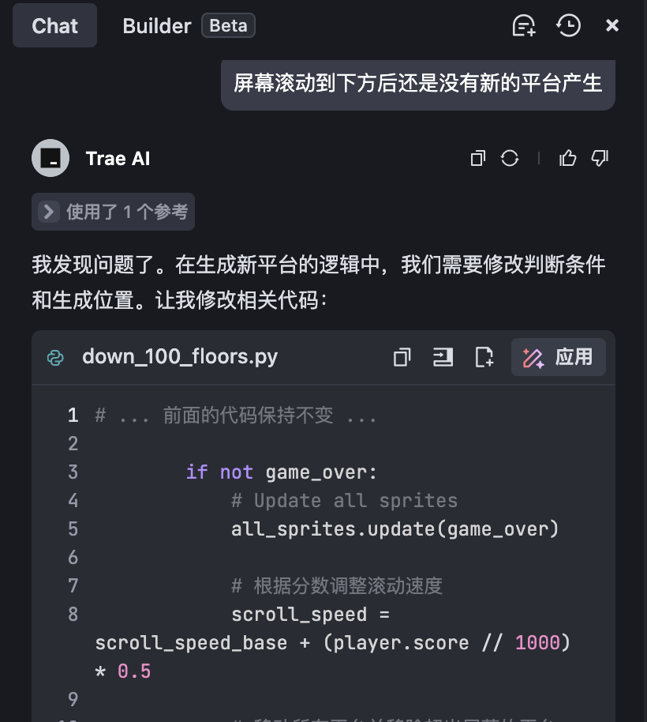
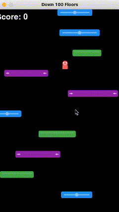

# 字节最强AI编程Trae实战(吊打Cursur)

**AI编程的发展**

近年来，AI编程技术发展迅猛，从最初的编程插件到如今的全流程智能化工具，正在以惊人的速度改变开发者的工作方式。

最早，AI编程的落脚点主要体现在嵌入开发工具中的各种插件。例如，Copilot、豆包MarsCode等，这些工具能够自动提示代码、查找Bug、优化代码结构，极大地提升了编程效率。在开发过程中可以快速理解开发者的需求并提供实时建议，成为开发过程中的“智能助手”。

随着深度学习技术的突破，AI编程领域迎来了更高层次的突破。以Cursor和Windsurf为代表的新一代工具，不再仅仅局限于代码优化和错误校验，而是将用户体验和代码生成提升到一个新高度。

这些工具支持与用户的自然语言交互——开发者只需通过对话提出需求，AI就能生成相应的代码模块或解决方案。从功能实现到逻辑完善，这类工具几乎覆盖了软件开发的完整生命周期，进一步降低了编程的门槛。

在这样的技术背景下，字节跳动发布了新一代AI编程工具——Trae IDE。在对标国际顶尖产品的同时，为中文开发者提供了更自然的开发体验。

**  
****什么是Trae？**

Trae集成了业界领先的大语言模型Claude 3.5和 GPT-4o ，提供了强大的代码生成和智能优化能力。目前该工具处于免费开放阶段，为广大开发者提供了绝佳的尝鲜机会。

所以无论是专业开发者还是新手开发者，都可以来体验 Trae 带来的效率提升。

Trae目前提供两种核心工作模式：

Chat模式：提供实时的代码理解和分析能力，支持智能问答交互，并能在编辑器中提供实时的代码建议。AI助手可以深度理解当前项目上下文，为开发者提供精准的技术建议。

Builder模式：通过自然语言需求描述，自动完成从项目初始化到功能实现的全流程构建。支持多种项目模板和架构范式，大幅提升开发效率。

## **实战体验：从零开始的游戏开发**  
首先从官网直接进行下载：[https://www.trae.ai/](https://www.trae.ai/)
暂时只支持Mac，windows听说很快会跟上，下载之后进行安装就会发现可以选择中文和主题。

当然，如果你之前有使用过Cursor或者VS Code也可以直接导入配置。

按照提示配置完成之后就可以进入主页面了。在主界面后，我们可以选择打开一个空的文件夹，在里面实现我们需求的功能。

在对话输入框中，可以看到我们选中的模型，点击可以进行切换。

现在我们尝试实现一个小时候爆火的《是男人就下100层》的小游戏。由于是从零开始，所以我们可以直接选择Builder模式来进行对话。

先简单写一下我们想要的功能：

甚至，一些我没有提到的点，Ai也会自动帮我来进行改进优化。

由于这是我们用来练手的，所以我不打算使用比较精细的游戏模型图标，于是直接让它用svg给我生成。

需求提完之后，大体的代码和功能模块都有了。然后就可以开始测试体验了。还有一点比较贴心，由于是使用python实现的，而我的电脑很多python依赖其实是没有的，它都可以直接帮我们生成好指令，我们只需要点击运行指令即可。告别了新手最厌烦的各种环境配置。

运行python指令之后，游戏界面就已经有了，还可以实现左右移动。

当然，效果肯定不是100%满足我们需求的，在游戏中我发现屏幕移动后小平台不会自动生成，所以还得一步步指导Trae帮我调试修改。这里我发现了一个小问题，在Builder模式中，虽然能自动完成0到1的构建，但是对修改某一些细节代码的处理上不如Chat来的精确，在Builder中我尝试让Trae修复bug，效果不是很理想，切换到Chat后，针对指定文件，Bug得到有效的修改。

在Chat模式对话中，我们对修改的对话，需要点击应用来确认替换。修改之后我陆续又向它提出了一些优化小建议，比如计分系统，碰撞判定等，最终完成了一个小时候喜欢玩的小游戏。下面看看演示效果：

怎么样，通过一步步的对话，Trae成功实现了这个小游戏的功能。大家也来尝试一下吧。

## **体验与反馈**
在实际开发过程中，Trae展现出了显著的优势：

中文语义理解：针对中文开发者优化的自然语言处理能力，提供更精准的代码生成。

智能化程度：从环境配置到代码生成的全流程智能支持。

开发体验：简洁的界面设计和流畅的交互体验。

需要加强优化：

模式互补：Builder模式适合快速原型开发，Chat模式更擅长精细化调优（Builder还是Beta阶段，功能可能不够完善，需要用户来结合Chat手动调整适配）

## **未来展望**
通过之前的尝试，我觉得Trae的功能还是很强大的，特别是对中文的支持，可以更好的理解中文语义，也可以提供我没有想到的一些问题。

在Cursor、Windsurf盛行的当下，这款Ai IDE也是有很大的舞台的，从功能上来看，它也有着自己的优点。特别是当下它可以免费使用。当然也有潜力成为更加理解中文的开发工具，所以未来可期。

如果你已经使用过其他的类似工具，比如Cursor，欢迎来试试这一款，无论是专业开发者还是新手开发或者产品，都能来体验Trae带来的效率提升。

> 更新: 2025-02-07 14:51:36  
> 原文: <https://www.yuque.com/tulingzhouyu/db22bv/uvea9x6gz6akkuh3>