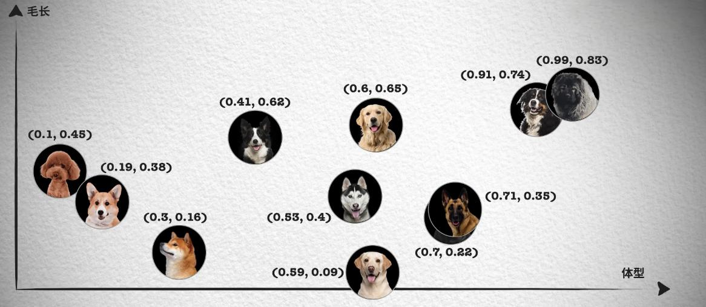
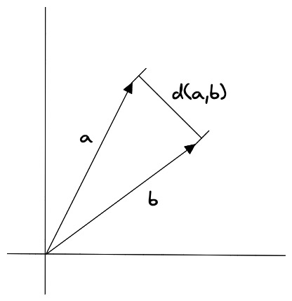
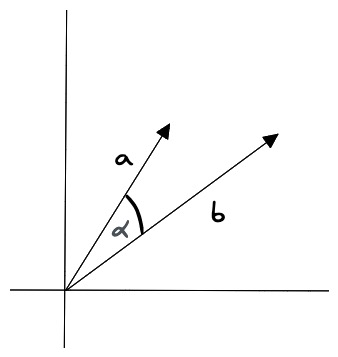

# 13.为什么选择向量数据库，而不是传统数据库

### 答题思路
在面试中回答“为什么选择向量数据库而非传统数据库”时，建议从以下几个核心角度切入，结合大模型应用开发的场景需求，突出向量数据库的独特价值和行业趋势：

一、本质差异：数据结构与处理能力的适配性

二、技术优势：性能与扩展性

三、应用场景与大模型落地的关键支撑

四、行业趋势与生态成熟度

### **一、本质差异：数据结构与处理能力的适配性**
1. **数据类型兼容性**  
传统数据库（如MySQL、Oracle）擅长处理结构化数据（表格、字段），但大模型应用中大量涉及非结构化数据（文本、图像、音频、视频）。  
向量数据库通过Embedding技术将非结构化数据转化为高维向量，直接存储向量表示，天然适配AI模型的数据处理需求。例如，将一段文本转化为768维向量后，传统数据库无法有效存储和检索，而向量数据库能直接处理这类数据。
2. **相似性搜索的高效性**  
传统数据库依赖精确匹配（如`WHERE`语句），而大模型应用常需基于语义相似性检索（如“推荐相似商品”“查找相关文档”）。  
向量数据库通过近似最近邻（ANN）算法（如HNSW、IVF-PQ），支持快速计算向量间的余弦相似度或欧氏距离，实现毫秒级响应。例如，用户提问“如何优化代码性能”，向量库能快速匹配“代码优化技巧”“性能调优案例”等语义相近内容，传统数据库则无法做到。

**特征和向量**

虽然向量数据库的核心在于相似性搜索 (Similarity Search)，但在深入了解相似性搜索前，我们需要先详细了解一下特征和向量的概念和原理。

我们先思考一个问题？为什么我们在生活中区分不同的物品和事物？

如果从理论角度出发，这是因为我们会通过识别不同事物之间不同的特征来识别种类，例如分别不同种类的小狗，就可以通过体型大小、毛发长度、鼻子长短等特征来区分。如下面这张照片按照体型排序，可以看到体型越大的狗越靠近坐标轴右边，这样就能得到一个体型特征的一维坐标和对应的数值，从 0 到 1 的数字中得到每只狗在坐标系中的位置。

然而单靠一个体型大小的特征并不够，像照片中哈士奇、金毛和拉布拉多的体型就非常接近，我们无法区分。所以我们会继续观察其它的特征，例如毛发的长短。

这样每只狗对应一个二维坐标点，我们就能轻易的将哈士奇、金毛和拉布拉多区分开来，如果这时仍然无法很好的区分德牧和罗威纳犬。我们就可以继续再从其它的特征区分，比如鼻子的长短，这样就能得到一个三维的坐标系和每只狗在三维坐标系中的位置。

在这种情况下，只要特征足够多，就能够将所有的狗区分开来，最后就能得到一个高维的坐标系，虽然我们想象不出高维坐标系长什么样，但是在数组中，我们只需要一直向数组中追加数字就可以了。

实际上，只要维度够多，我们就能够将所有的事物区分开来，世间万物都可以用一个多维坐标系来表示，它们都在一个高维的特征空间中对应着一个坐标点。

那这和相似性搜索 (Similarity Search) 有什么关系呢？你会发现在上面的二维坐标中，德牧和罗威纳犬的坐标就非常接近，这就意味着它们的特征也非常接近。我们都知道向量是具有大小和方向的数学结构，所以可以将这些特征用向量来表示，这样就能够通过计算向量之间的距离来判断它们的相似度，这就是相似性测量。

相似性测量 (Similarity Measurement)，上面我们讨论了向量数据库的不同搜索算法，但是还没有讨论如何衡量相似性。在相似性搜索中，需要计算两个向量之间的距离，然后根据距离来判断它们的相似度。

而如何计算向量在高维空间的距离呢？有三种常见的向量相似度算法：欧几里德距离、余弦相似度和点积相似度。

**欧几里得距离**

欧几里得距离（Euclidean Distance）是用于衡量两个点（或向量）之间的直线距离的一种方法。它是最常用的距离度量之一，尤其在几何和向量空间中。可以将其理解为两点之间的“直线距离”。

其中，A 和 B 分别表示两个向量，_n_ 表示向量的维度。

欧几里得距离算法的优点是可以反映向量的绝对距离，适用于需要考虑向量长度的相似性计算。例如推荐系统中，需要根据用户的历史行为来推荐相似的商品，这时就需要考虑用户的历史行为的数量，而不仅仅是用户的历史行为的相似度。

**余弦相似度**

余弦相似度（Cosine Similarity）是一种用于衡量两个向量之间相似度的指标。它通过计算两个向量夹角的余弦值来判断它们的相似程度。其值介于 -1 和 1 之间，通常用于文本分析和推荐系统等领域。

 

### **二、技术优势：性能与扩展性**
1. **高维数据处理能力**  
大模型生成的向量维度常达数百甚至数千（如BERT输出768维），传统数据库的索引结构（如B树）在高维空间下效率急剧下降（“维度灾难”）。  
向量数据库专为高维数据设计，通过量化、降维等技术优化存储和计算，如Faiss支持GPU加速，Milvus支持分布式架构，可处理十亿级向量数据集。
2. **实时性与资源效率**  
传统数据库在处理非结构化数据时需额外ETL流程（如文本→向量→存储），导致延迟和资源浪费。  
向量数据库支持端到端向量化处理，直接与模型推理层对接，减少中间环节。例如，用户上传一张图片，模型实时生成向量并存入向量库，后续检索无需重复计算。

---

### **三、应用场景与大模型落地的关键支撑**
1. **大模型的“长期记忆”扩展**  
大模型本身存在上下文窗口限制（如GPT-4的128k tokens）和静态知识截止问题。向量数据库可作为外部知识库，存储实时更新数据（如行业报告、用户日志），通过检索增强生成（RAG）技术动态注入上下文，解决幻觉问题并提升回答准确性。
2. **多模态与复杂任务支持**  
在跨模态场景（如“以图搜文”“语音问答”）中，向量数据库可统一存储文本、图像、语音的向量表示，实现跨模态语义检索。例如，用户用语音描述需求，系统通过向量相似性匹配图文内容，传统数据库难以实现此类跨模态关联。
3. **成本与运维优化**  
传统数据库处理AI任务时需频繁全表扫描或复杂JOIN操作，计算开销大。向量数据库通过预计算和高效索引，显著降低CPU/内存消耗。例如，电商推荐场景下，传统方案需关联用户表、商品表、行为表，而向量库仅需一次相似性搜索即可返回结果。

---

### **四、行业趋势与生态成熟度**
1. **AI基础设施的必然选择**  
资本和技术巨头（如Meta、Google、阿里云）已重点布局向量数据库（Faiss、Vertex AI Vector Search、Milvus），开源生态和云服务日趋成熟。例如，Pinecone提供全托管服务，开发者无需关注底层运维，专注业务逻辑。
2. **与传统数据库的融合互补**  
向量数据库并非完全替代传统数据库，而是与其协同工作（如OceanBase支持向量插件）。结构化数据（用户信息、交易记录）仍存于关系型数据库，非结构化数据由向量库处理，两者通过唯一标识关联，形成混合存储方案。

---

### **五、回答示例（结构化表达）**
“我选择向量数据库的核心原因在于它解决了大模型应用中的三个关键问题：  

1. **数据类型适配**：直接处理非结构化数据的向量化表示，无需复杂ETL；  
2. **高效语义检索**：通过近似最近邻算法实现毫秒级相似性搜索，支撑RAG等核心技术；  
3. **系统扩展性**：支持分布式架构与多模态数据，满足十亿级数据实时处理需求。  
此外，向量数据库已成为AI基础设施的重要组件，结合传统数据库的混合架构，能最大化发挥结构化与非结构化数据的协同价值。”

### **补充建议**
+ **结合项目经验**：如提到实际使用过Milvus优化推荐系统响应速度，或通过Faiss+PostgreSQL插件降低推理延迟。  
+ **提及局限性**：客观说明向量数据库的不足（如事务支持较弱、数据同步复杂性），体现技术选型的全面思考。  
+ **关联行业案例**：例如“Meta用Faiss支撑社交推荐，阿里云PolarDB集成向量能力支持淘宝搜索”，增强说服力。

通过以上逻辑，既能展现技术深度，又能体现对行业趋势的理解，符合大模型工程师岗位的考察重点。

### **总结回答**
首先，需要理解向量数据库和传统数据库的主要区别，以及为什么在大模型应用中向量数据库更有优势。

根据摘要1，向量数据库专门处理非结构化数据，如文本、图像、音频，转化为向量存储，支持高效的相似性搜索。传统数据库如关系型数据库适合结构化数据，但处理高维非结构化数据效率低。摘要2提到向量数据库为AI设计，提高处理效率，适合大模型的数据管理。摘要3列出不同向量数据库的特点，说明它们在性能、扩展性等方面的优势。摘要5强调向量数据库处理多维数据的能力，基于语义搜索的优势。摘要7指出向量数据库作为大模型的外接存储，提供实时数据更新，但存在数据一致性等问题。

可能希望回答涵盖以下几点：处理非结构化数据的能力、高效的相似性搜索、适合AI和大模型的需求、与传统数据库的对比（如效率、数据结构、扩展性等）。还需要提到应用场景，比如推荐系统、NLP、图像识别等，以及行业趋势，如资本投入、技术发展等。

可能需要结构化的回答，先总述原因，再分点详细说明，结合参考内容中的关键点。比如分为数据类型的适配性、查询效率、AI支持、行业趋势等部分。同时需要避免过于技术化，保持清晰易懂，适合面试场合。

> 更新: 2025-07-14 15:45:37  
> 原文: <https://www.yuque.com/tulingzhouyu/db22bv/htpcfes6uxlhdsnf>