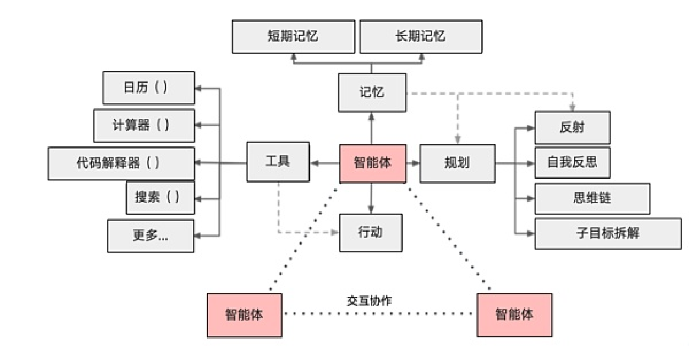

# 2.Agent如何搭建?可以用那些框架

### 答题思路
在面试中回答“Agent如何搭建，可以使用哪些框架”时，需结合Agent的核心逻辑、开发流程和主流技术栈，体现对AI Agent技术生态的深度理解。以下是结构化回答框架：


首先，拆解问题：“Agent如何搭建，可以用哪些框架？”这个问题分为两部分：搭建Agent的方法论和可用的框架。因此，回答需要涵盖这两个方面。

在搭建Agent部分，应该包括核心要素，比如定义任务、选择模型、设计工作流、集成工具、处理数据等。同时，需要考虑实际开发中的挑战，比如稳定性、效率、可扩展性等。这部分需要结构化，分步骤说明，让面试官看到系统性的思考能力。

在框架部分，需要列举当前流行的框架，如LangChain、LlamaIndex、AutoGPT、Microsoft Guidance、Hugging Face Transformers Agents等，每个框架的特点、适用场景，以及可能的优缺点。同时，可以提到开源项目如BabyAGI、SuperAGI，展示对生态的了解。

另外，面试官可能希望回答中有实际案例，比如电商客服Agent的例子，来说明如何应用这些框架和方法论。此外，加分项比如结合开发经验或对前沿技术的了解，能够提升回答的深度，但大家可能没有实际经验，所以可以建议如何在没有经验的情况下，通过项目练习或学习来弥补。

需要确保回答逻辑清晰，层次分明，技术点准确，并且符合大模型应用开发工程师的岗位要求，即不仅懂理论，还要有工程化思维，能够实际搭建系统。同时，语言要简洁，适合面试场景，避免冗长但覆盖关键点。

总结回答结构：定义Agent，核心要素分点说明，搭建步骤，可用框架分点介绍，案例，挑战与解决，加分项。这样既全面又有重点，能够展示系统性和实战能力。


### **1. Agent的核心定义**
**AI Agent** 是一个能通过感知环境、自主决策、调用工具完成复杂任务的智能体，其核心能力包括：

+ **任务拆解**（将用户目标分解为子任务）
+ **工具调用**（API、搜索、代码执行等）
+ **记忆与状态管理**（上下文记忆、长期记忆存储）
+ **自我迭代**（反思错误、优化策略）


### **2. Agent搭建的核心要素**


#### **（1）任务定义与规划**
+ **目标解析**：通过自然语言理解用户意图（如“帮我分析新能源汽车市场趋势” → 拆解为数据爬取、清洗、分析、可视化等步骤）
+ **规划方法**：链式（Chain-of-Thought）、树状（Tree-of-Thought）、图状（Graph-of-Thought）任务分解
+ **工具选择**：根据子任务类型选择工具（如爬虫工具、Pandas、Matplotlib）

#### **（2）模型层**
+ **核心模型**：选择基础大模型（如GPT-4、Claude、LLAMA 2）作为推理引擎
+ **角色设定**：通过System Prompt定义Agent角色（如“你是一个资深数据分析师”）
+ **微调需求**：是否需要领域微调（如医疗、金融场景）

#### **（3）工具库集成**
+ **内置工具**：代码解释器、数学计算、文件读写
+ **外部API**：搜索引擎（SerpAPI）、数据库（SQLAlchemy）、云服务（AWS S3）
+ **自定义工具**：业务特定工具（如内部CRM系统接口）

#### **（4）记忆系统**
+ **短期记忆**：上下文窗口管理（如GPT-4的8k/32k Token限制）
+ **长期记忆**：向量数据库（Pinecone、Milvus）存储历史交互
+ **优先级策略**：关键信息提取与缓存（如用户偏好、任务历史）

#### **（5）安全与可控性**
+ **权限控制**：限制敏感工具调用（如删除文件、支付接口）
+ **输出审核**：敏感词过滤、事实性校验（如调用FactCheck API）
+ **失败回退**：错误重试、人工接管机制

---

### **3. Agent开发框架推荐**
#### **（1）LangChain**
+ **特点**：模块化设计，支持Chain/Agent/Memory/Tools组件
+ **适用场景**：快速构建工具调用型Agent（如文档问答、数据分析）
+ **代码示例**：

```python
from langchain.agents import initialize_agent
agent = initialize_agent(tools, llm, agent="zero-shot-react-description")
```

#### **（2）AutoGPT（开源项目）**
+ **特点**：自主目标驱动，支持长期记忆和互联网访问
+ **适用场景**：自动化研究、多步骤任务执行（如市场调研报告生成）

#### **（3）Microsoft Guidance**
+ **特点**：基于模板的高精度输出控制，支持推理过程约束
+ **适用场景**：需要严格格式要求的场景（如JSON生成、代码补全）

#### **（4）Hugging Face Transformers Agents**
+ **特点**：与Hugging Face模型/数据集生态深度集成
+ **适用场景**：结合自定义微调模型的Agent（如医疗诊断助手）

#### **（5）开源项目**
+ **BabyAGI**：轻量级任务驱动型Agent（适合学习原理）
+ **SuperAGI**：支持可视化编排的企业级框架
+ **MetaGPT**：面向软件开发的Agent（自动生成PRD/代码/测试）

---

### **4. 搭建流程示例（以电商客服Agent为例）**
1. **需求定义**：处理用户退货、订单查询、推荐商品
2. **工具集成**：
    - 内部API：订单数据库查询接口
    - 外部工具：物流信息API（如快递100）
    - 自定义工具：退货政策检查器
3. **提示词设计**：

```latex
Role: 你是XX电商客服助手，语气亲切专业。
Steps:
1. 确认用户订单号
2. 根据问题类型调用对应工具
3. 若问题复杂，转接人工客服
```

4. **测试优化**：
    - 使用LangChain的AgentExecutor进行对话流测试
    - 通过A/B测试比较不同提示词版本的解决率

---

### **5. 回答示例**
“搭建Agent需要围绕任务规划、工具调用、记忆管理三个核心模块。例如在电商场景中，我们可以用LangChain初始化一个客服Agent：通过System Prompt设定角色，集成订单查询API作为工具，用Milvus向量库存储历史对话。开发中需重点解决工具调用的稳定性——比如处理API超时重试，以及通过Guidance模板约束输出格式。主流框架如LangChain适合快速原型开发，而SuperAGI等开源项目提供可视化编排，适合复杂任务流。”

---

### **6. 加分项**
+ **强调工程挑战**：如“Agent的延迟优化（并行工具调用）、工具错误处理（API降级策略）”
+ **结合项目经验**：如“在XX项目中用AutoGPT+SerpAPI实现竞品数据自动采集，准确率提升40%”
+ **前沿技术**：提及对AI Agent新兴方向的理解（如Meta的CICERO模型、多Agent协作框架AutoGen）

此回答既体现技术深度，又展现工程化思维，符合大模型应用工程师岗位要求。


> 更新: 2025-07-14 15:45:38  
> 原文: <https://www.yuque.com/tulingzhouyu/db22bv/dnuo9oxonwmgdkos>