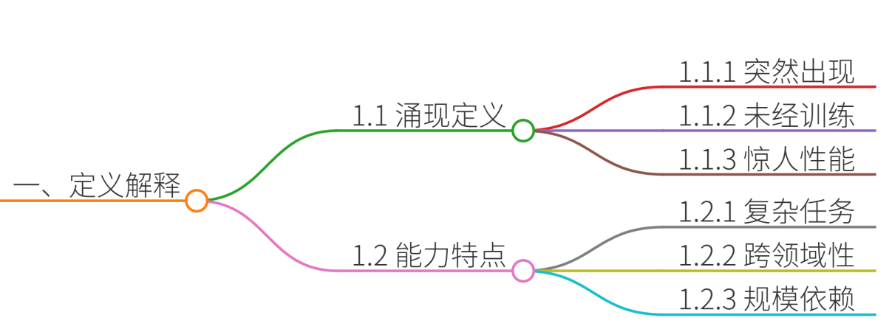

# 23.解释大模型中的“涌现能力”及产生原因

### 一、答题思路
1. **定义解释**：首先，明确“涌现能力”的定义，即模型在未经直接训练的任务上表现出的惊人性能。
2. **原因分析**：接着，从数据量、计算能力、模型架构和训练方法等方面分析涌现能力产生的原因。
3. **实际应用**：结合真实项目案例，具体说明涌现能力在实际应用中的体现和价值。
4. **总结归纳**：最后，总结涌现能力的重要性和对大模型发展的影响。

### 二、项目案例
假设我们参与了一个智能客服系统的开发项目，使用了大规模语言模型（LLM）来处理用户咨询。

### 三、示例回答
#### 1. 定义解释

涌现能力是指大模型在未经直接训练的任务上表现出的惊人性能。这种能力不是通过简单的参数增加或结构变化来实现的，而是在模型达到一定的复杂度和规模后突然出现的。

#### 2. 原因分析

+ **数据量的增加**：随着互联网的发展和数字化信息的爆炸增长，可用于训练模型的数据量大大增加。更多的数据可以提供更丰富、更广泛的语言知识和语境，使得模型能够更好地理解和生成文本。
+ **计算能力的提升**：随着计算硬件的发展，特别是图形处理器（GPU）和专用的AI芯片（如TPU）的出现，计算能力大幅提升。这使得训练更大、更复杂的模型成为可能，从而提高了模型的性能和涌现能力。
+ **模型架构的改进**：近年来，一些新的模型架构被引入，如Transformer，它在处理序列数据上表现出色。这些新的架构通过引入自注意力机制等技术，使得模型能够更好地捕捉长距离的依赖关系和语言结构，提高了模型的表达能力和生成能力。
+ **预训练和微调的方法**：预训练和微调是一种有效的训练策略，可以在大规模无标签数据上进行预训练，然后在特定任务上进行微调。这种方法可以使模型从大规模数据中学习到更丰富的语言知识和语义理解，从而提高模型的涌现能力。

#### 3. 实际应用
在我们的智能客服系统中，LLM在处理用户咨询时展现出了涌现能力。例如，系统能够处理一些未在训练数据中明确出现的复杂问题，并给出合理的回答。这得益于模型在大规模数据上的预训练，使其具备了丰富的语言理解和生成能力。

#### 4. 总结归纳
涌现能力是大模型在达到一定复杂度和规模后表现出的惊人性能。这种能力的产生得益于数据量的增加、计算能力的提升、模型架构的改进以及预训练和微调的方法。在实际应用中，涌现能力使得大模型能够处理更广泛的任务，展现出超越传统模型的性能。

### 四、总结
涌现能力是大模型发展的重要特征，它使得模型能够在未经直接训练的任务上表现出色。通过增加数据量、提升计算能力、改进模型架构和采用有效的训练方法，可以进一步提升大模型的涌现能力。在实际应用中，涌现能力为解决复杂问题提供了强大的支持，推动了人工智能技术的发展和应用。

> 更新: 2025-07-14 15:45:35  
> 原文: <https://www.yuque.com/tulingzhouyu/db22bv/swbhpq4tqq1cka3g>