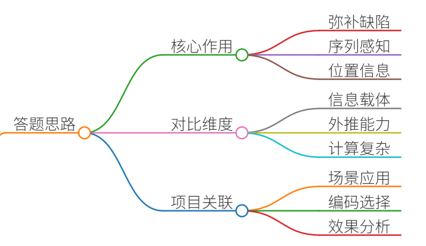
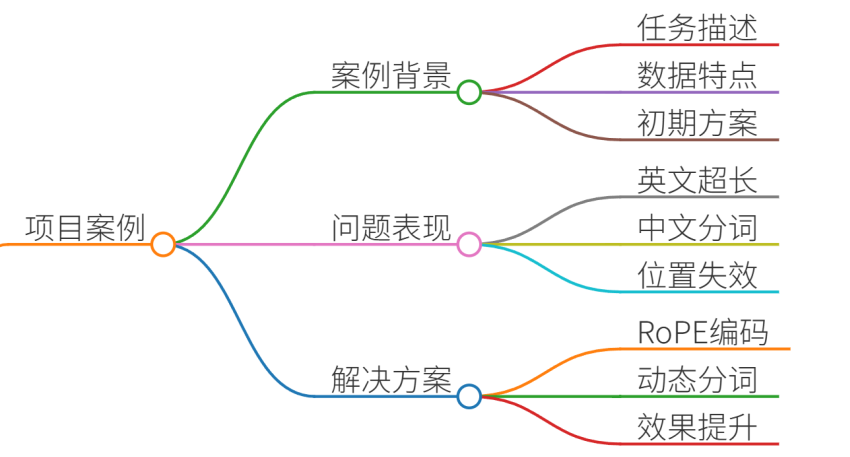
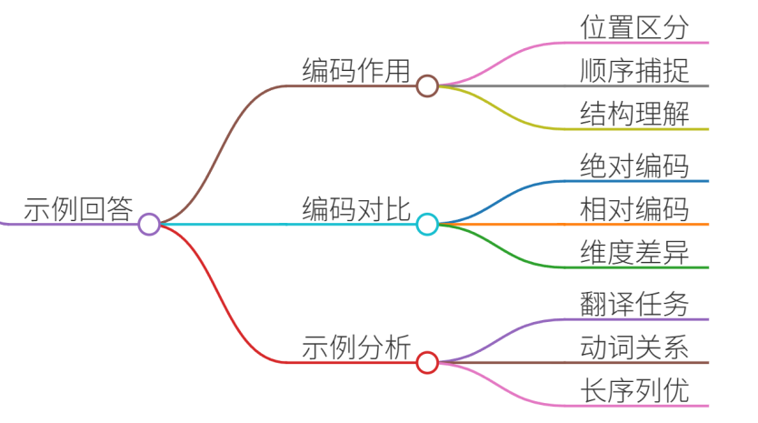
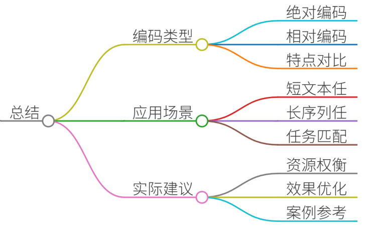

# 24.Transformer中位置编码的作用

### 一、答题思路

位置编码是Transformer模型中解决序列顺序感知的关键设计。需从以下角度展开：

1. **核心作用**：弥补Transformer自注意力机制无法捕捉位置信息的缺陷。
2. **对比维度**： 
    - **信息载体**：绝对编码直接绑定位置，相对编码关注距离变化。
    - **外推能力**：绝对编码依赖固定映射，相对编码更适应长序列。
    - **计算复杂度**：绝对编码实现简单，相对编码需额外参数或计算。
3. **项目关联**：结合实际场景（如机器翻译、文本生成）说明不同编码的适用性。

### 二、项目案例

**案例背景**：在跨境电商的商品评论情感分析任务中，需处理多语言长文本（最长512词）。初期使用BERT的绝对位置编码，但在处理超长评论时效果下降。

**问题表现**：

+ 英文评论超过512词时，模型无法区分后续位置的语义差异。
+ 中文评论因分词粒度不同，固定位置编码导致跨词依赖断裂。

**解决方案**：

1. **切换至RoPE编码**：利用旋转矩阵编码相对位置，支持外推到1024词。 
2. **动态分词优化**：结合SentencePiece分词，减少跨词位置编码冲突。

---

### 三、示例回答

**位置编码的作用**   
位置编码通过为序列中的每个token附加位置信息，使Transformer模型能够区分不同位置的token，从而捕捉序列的顺序依赖关系。例如，在句子“猫吃鱼”中，“猫”和“鱼”的位置编码差异帮助模型理解主谓宾结构。

**绝对 vs 相对位置编码**

| **维度** | **绝对位置编码** | **相对位置编码** |
| --- | --- | --- |
| **信息载体** | 每个位置绑定固定向量（如Sinusoidal编码） | 关注位置间的相对距离（如RoPE旋转矩阵）  |
| **外推能力** | 依赖训练长度（如512词），超长时失效 | 通过相对距离计算，支持更长序列（如2048词） |
| **计算复杂度** | 低（仅需位置索引计算） | 高（需额外参数或矩阵运算） |
| **适用场景** | 短文本分类（如情感分析） | 长文本生成（如机器翻译、摘要） |

**示例**  
在机器翻译任务中：

+ **绝对编码**：德语句子“Der Hund frißt Fisch”中，“Der”位置编码固定，模型可能误判长距离动词支配关系。
+ **RoPE编码**：通过相对位置调整注意力权重，更精准捕捉“Hund”与“frißt”的主谓关系，即使句子扩展至1024词仍保持性能。

---

### 四、总结

位置编码是Transformer处理序列任务的核心机制：

+ **绝对编码**：简单高效，适合短文本任务（如BERT）。
+ **相对编码**：灵活适应长序列，推荐用于生成类任务（如GPT、LLaMA）。  
实际应用中需权衡任务需求与计算资源，例如在电商评论分析中，结合RoPE编码与动态分词可显著提升长文本建模效果。

> 更新: 2025-07-14 15:45:35  
> 原文: <https://www.yuque.com/tulingzhouyu/db22bv/fmu5ezr6ob4q9u8a>