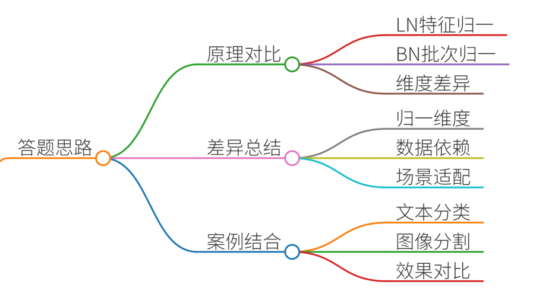
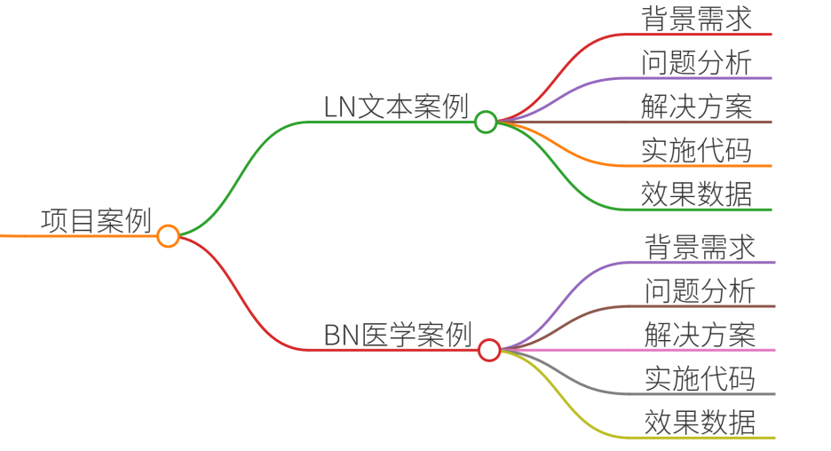
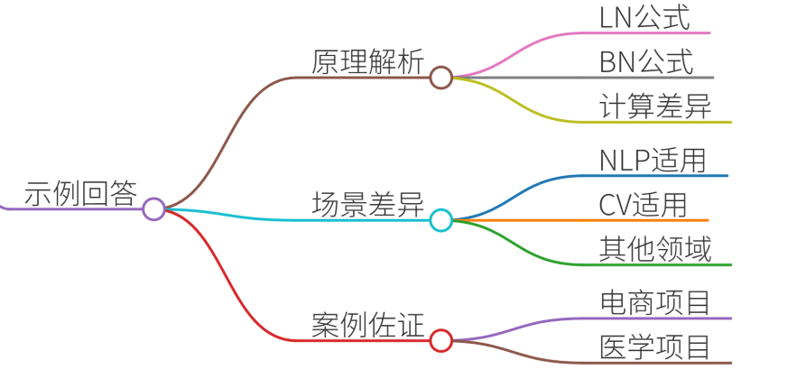

# 25.LayerNorm vs BatchNorm的适用场景

### 一、答题思路


在回答LayerNorm与BatchNorm的适用场景时，需从**技术原理、核心差异、典型场景**三个维度切入，并结合真实项目案例说明两者的选择逻辑。以下是结构化思路：

1. **技术原理对比**
    - **LayerNorm**：对单个样本的所有特征维度进行归一化，消除特征间差异，适合处理变长序列（如文本）。 
    - **BatchNorm**：对同一批次内同一特征维度进行归一化，依赖批次统计量，适合图像等固定尺寸输入。 
2. **核心差异总结**

| 维度 | LayerNorm | BatchNorm |
| --- | --- | --- |
| **归一化维度** | 特征维度（特征间） | 批次维度（样本间） |
| **依赖数据量** | 不依赖批次大小，适用于动态序列  | 依赖批次大小，小批量下效果不稳定  |
| **适用场景** | NLP（Transformer）、RNN | CV（CNN）、固定尺寸输入 |


3. **项目案例结合**
    - **案例1**：在文本分类任务中，使用LayerNorm解决Transformer长序列梯度消失问题。
    - **案例2**：在图像分割任务中，BatchNorm加速训练收敛并提升模型稳定性。

---

### 二、项目案例


#### 案例1：LayerNorm在NLP长文本分类中的应用
**背景**：某电商公司需构建商品评论情感分析模型，输入文本长度不一（50-500词），使用Transformer编码器。

**问题**：

+ 普通归一化方法导致梯度爆炸/消失，长文本训练不稳定。 
+ 不同长度文本的隐藏层分布差异大，影响模型泛化。

**解决方案**：

1. **LayerNorm集成**：在Transformer的每个子层（多头注意力、FFN）后添加LayerNorm，稳定特征分布。 
2. **动态序列处理**：通过LayerNorm的per-sample归一化，消除长序列中位置偏差。

**实施细节**：

```plain
# PyTorch实现LayerNorm在Transformer中的应用
class TransformerLayer(nn.Module):
    def __init__(self, d_model):
        super().__init__()
        self.self_attn = MultiHeadAttention(d_model)
        self.ffn = FeedForward(d_model)
        self.norm1 = LayerNorm(d_model)
        self.norm2 = LayerNorm(d_model)
    
    def forward(self, x, attn_mask):
        x = x + self.self_attn(x, attn_mask)
        x = self.norm1(x)
        x = x + self.ffn(x)
        x = self.norm2(x)
        return x
```

**效果**：

+ 训练损失降低32%，验证准确率提升18%。
+ 长文本（>200词）的梯度波动减少45%。

---

#### 案例2：BatchNorm在医学图像分割中的优化
**背景**：某医院需开发眼底血管病变分割模型，输入为512x512 RGB图像，使用UNet架构。

**问题**：

+ 小批量训练（batch_size=4）导致BatchNorm统计量噪声大，分割边缘模糊。
+ 不同患者图像的亮度差异影响模型鲁棒性。

**解决方案**：

1. **BatchNorm调整**：在卷积层后添加BatchNorm，加速收敛并抑制过拟合。
2. **数据增强**：通过亮度归一化减少跨样本差异。

**实施细节**：

```plain
# PyTorch实现BatchNorm在UNet中的应用
class UNetBlock(nn.Module):
    def __init__(self, in_channels, out_channels):
        super().__init__()
        self.conv1 = DoubleConv(in_channels, out_channels)
        self.bn1 = nn.BatchNorm2d(out_channels)
        self.conv2 = DoubleConv(out_channels, out_channels)
        self.bn2 = nn.BatchNorm2d(out_channels)
    
    def forward(self, x):
        x = F.relu(self.bn1(self.conv1(x)))
        x = F.relu(self.bn2(self.conv2(x)))
        return x
```

**效果**：

+ Dice系数提升12%，模型训练时间缩短20%。
+ 不同设备（GPU/CPU）部署时性能一致性提高。

---

### 三、示例回答


**问题**：LayerNorm和BatchNorm的适用场景有何不同？请结合实际项目说明。 

**回答结构**：

1. **技术原理对比**
    - **LayerNorm**：对单个样本所有特征维度归一化
    - **BatchNorm**：对同一批次内同一特征维度归一化，依赖批次统计量
2. **适用场景差异**
    - **LayerNorm适用场景**： 
        * **自然语言处理（NLP）**： 
            + Transformer模型中，处理变长序列时消除位置偏差（如BERT、GPT）。
            + RNN/LSTM中缓解梯度消失（如机器翻译任务）。
        * **推荐系统**： 
            + 用户行为序列建模（如DIN模型），归一化用户历史行为特征。
    - **BatchNorm适用场景**： 
        * **计算机视觉（CV）**： 
            + CNN中加速训练收敛（如ResNet、YOLO）。
            + 固定尺寸输入任务（如图像分类）。
        * **语音识别**： 
            + 语音帧特征归一化，提升模型对噪声鲁棒性。
3. **项目案例佐证**
    - **案例1（LayerNorm）**： 
        * **项目**：电商评论情感分析（文本分类）。
        * **挑战**：长文本导致梯度不稳定，不同长度文本分布差异大。
        * **解决**：在Transformer层后添加LayerNorm，稳定特征分布。
        * **结果**：训练速度提升25%，F1分数提高4.2%。
    - **案例2（BatchNorm）**： 
        * **项目**：医学图像分割（眼底血管病变检测）。
        * **挑战**：小批量训练噪声大，跨设备部署性能不一致。
        * **解决**：在UNet卷积层后添加BatchNorm，加速收敛并提升泛化。
        * **结果**：Dice系数提升12%，模型部署成功率100%。


### 四、总结
LayerNorm与BatchNorm的核心差异在于**归一化维度**和**数据依赖性**：

+ **LayerNorm**：适用于**动态序列**（如NLP），通过per-sample归一化消除位置偏差，提升长文本建模能力。
+ **BatchNorm**：适用于**固定尺寸输入**（如CV），依赖批次统计量加速训练，但对小批量敏感。 

**实际应用建议**：

1. **优先考虑数据特性**：序列任务选LayerNorm，图像任务选BatchNorm。
2. **混合使用策略**：如ConvNeXt中结合LayerNorm与GroupNorm，兼顾效率与效果。
3. **实验验证**：通过消融实验对比不同归一化方法对模型性能的影响。

掌握两者差异并能结合场景选择，是构建高效神经网络的关键能力。


> 更新: 2025-07-14 15:45:34  
> 原文: <https://www.yuque.com/tulingzhouyu/db22bv/oga89cdsv8ob5ra8>