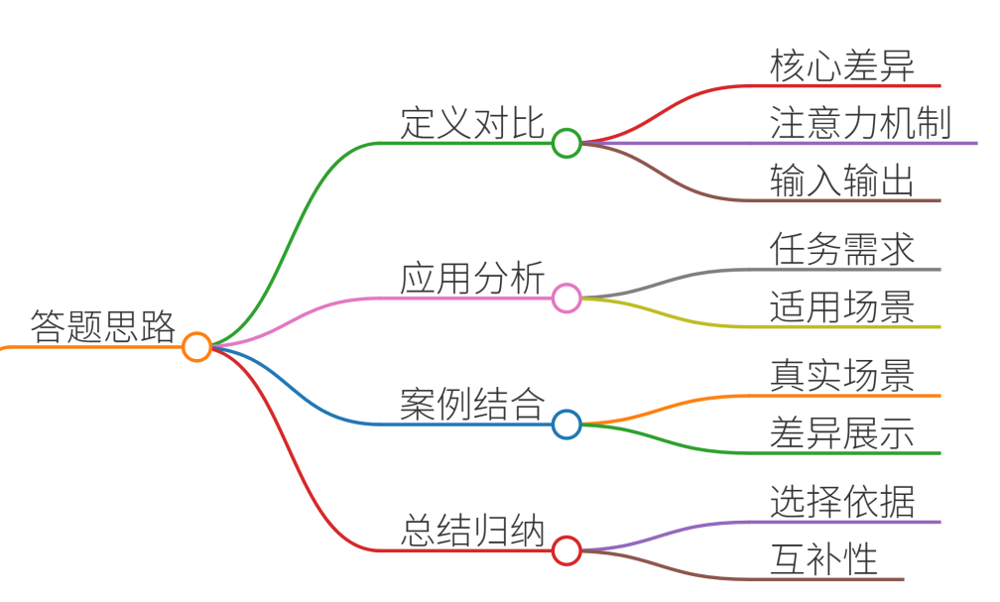
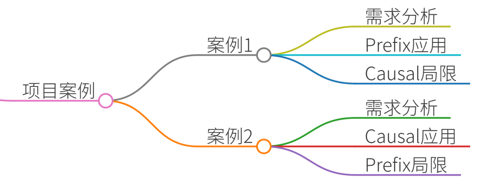
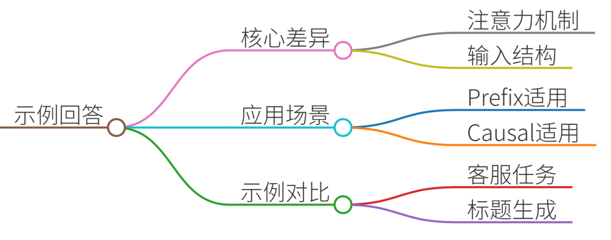

# 26.解释Prefix LM与Causal LM的区别

### 一、答题思路


1. **定义对比**：明确Prefix LM和Causal LM的核心差异（注意力机制、输入输出方式）。 
2. **应用场景分析**：结合具体任务需求（如生成、理解、多轮对话）说明两者适用性。
3. **项目案例结合**：通过真实场景（如智能客服、文本生成）展示差异。
4. **总结**：归纳选择依据及互补性。


### 二、项目案例


#### 案例1：智能客服多轮对话系统
+ **需求**：需理解用户历史对话，生成连贯回复。
+ **Prefix LM应用**： 
    - **输入结构**：将历史对话作为前缀输入，生成回复时可见上下文。
    - **优势**：支持多轮上下文依赖，避免重复提问或信息遗漏。
    - **示例**：

```plain
# 输入前缀（历史对话）  
prefix = "用户：我的订单编号是12345，什么时候发货？\n客服：您的订单预计明天发货。"  
# 模型生成回复时可见前缀  
response = model.generate(prefix)
```

+ **Causal LM局限性**：无法直接利用历史对话信息，需依赖外部状态管理。

#### 案例2：新闻标题生成
+ **需求**：根据文本内容自动生成简洁标题。
+ **Causal LM应用**： 
    - **输入结构**：仅输入正文内容，按顺序生成标题。
    - **优势**：无需上下文干扰，专注生成目标内容。
    - **示例**：

```plain
# 输入正文  
text = "科学家发现新型量子材料，导电效率提升200%。"  
# 模型自回归生成标题  
title = causal_lm.generate(text)
```

+ **Prefix LM不适用**：标题生成仅需当前内容，前缀会引入冗余信息。

---

### 三、示例回答


**Prefix LM与Causal LM的区别及应用场景**

1. **核心差异**
    - **Prefix LM**： 
        * **注意力机制**：输入层双向注意力（可访问前缀信息），输出层单向注意力。
        * **输入结构**：输入包含前缀（如历史对话、文档标题），生成时可见前缀。
    - **Causal LM**： 
        * **注意力机制**：严格自回归，输出仅依赖已生成内容。
        * **输入结构**：输入仅为当前任务内容（如单段文本）。
2. **应用场景**
    - **Prefix LM适用场景**： 
        * **多轮对话系统**：需结合历史对话生成连贯回复（如客服机器人）。
        * **文档摘要**：需理解全文上下文生成摘要（如法律文书摘要）。
    - **Causal LM适用场景**： 
        * **文本生成任务**：独立生成内容（如诗歌、故事续写）。
        * **机器翻译**：按顺序生成目标语言（如中译英）。
3. **示例对比**

| 任务 | Prefix LM | Causal LM |
| --- | --- | --- |
| 智能客服回复 | 输入历史对话，生成上下文相关回复 | 不适用（需外部状态管理） |
| 新闻标题生成 | 不适用（需避免前缀干扰） | 输入正文，自回归生成标题 |
| 文档翻译 | 输入原文前缀，生成目标语言 | 按原文顺序逐句生成目标语言 |


---

### 四、总结
+ **选择依据**： 
    - 若任务依赖上下文（如多轮对话、长文档理解），优先选择**Prefix LM**。
    - 若任务仅需自回归生成（如文本创作、翻译），选择**Causal LM**更高效。
+ **互补性**： 
    - 在复杂系统（如文档问答）中，可结合两者：Prefix LM处理上下文理解，Causal LM生成答案。 
+ **实际建议**：根据数据特点和任务需求灵活选择，必要时通过模型微调优化性能。


> 更新: 2025-07-14 15:45:34  
> 原文: <https://www.yuque.com/tulingzhouyu/db22bv/dlrtel78p76hf258>