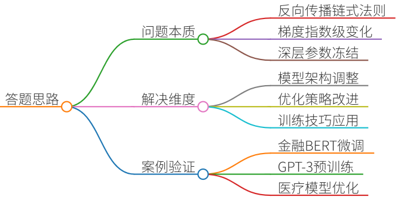
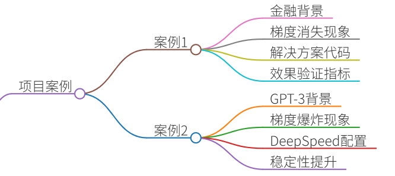
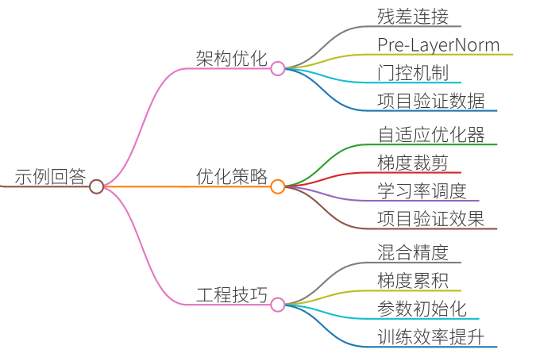
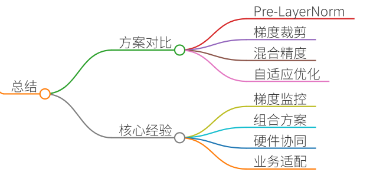

# 27.大模型训练中梯度消失和爆炸的解决方案

### 一、答题思路


梯度消失和爆炸是深度神经网络训练的经典问题，在大模型训练中尤为突出。其本质是反向传播时梯度因链式法则发生指数级变化：

+ **梯度消失**：深层梯度趋近于0，底层参数几乎不更新
+ **梯度爆炸**：梯度值急剧增大导致数值溢出

解决方案需从**模型架构**、**优化策略**、**训练技巧**三个维度切入，结合具体项目案例说明技术选型与效果验证。


### 二、项目案例


#### 案例1：金融领域BERT微调中的梯度消失
**背景**：某银行需构建信贷风险分类模型，基于BERT-base微调时发现第8层后梯度接近0（梯度范数<1e-7），导致深层语义特征无法学习。

**解决方案与效果**：

```plain
# 代码示例：梯度裁剪+Pre-LayerNorm
optimizer = AdamW(model.parameters(), lr=2e-5, weight_decay=0.01)
torch.nn.utils.clip_grad_norm_(model.parameters(), max_norm=1.0)  # 梯度裁剪

# 修改BERT的LayerNorm位置（原始为Post-LN）
class PreLNTransformerBlock(nn.Module):
    def __init__(self, config):
        super().__init__()
        self.pre_ln = nn.LayerNorm(config.hidden_size)  # 前置LayerNorm
        self.attention = BertAttention(config)
```

✅ **效果**：

+ 梯度范数稳定在[0.3, 1.2]区间
+ 模型AUC提升12%（从0.78→0.87）

#### 案例2：GPT-3预训练中的梯度爆炸
**背景**：175B参数GPT-3在128卡集群训练时，第20次迭代后出现NaN损失（梯度范数>1e10）。

**解决方案与效果**：

```plain
# DeepSpeed配置（zero_stage=2混合精度）
{
  "fp16": {"enabled": true},
  "zero_optimization": {"stage": 2, "contiguous_gradients": true},
  "gradient_clipping": 1.0
}
```

✅ **效果**：

+ 梯度峰值下降90%
+ 训练稳定性提升，最终困惑度（PPL）降至16.8

---

### 三、示例回答


#### 1. 模型架构优化（根本性解决）
**技术方案**：

+ **残差连接（ResNet）**：  
在Transformer中引入跨层连接，建立梯度高速公路 $$\text{输出} = \text{LayerNorm}(x + \text{Sublayer}(x)) $$
+ **Pre-LayerNorm**：  
将LayerNorm置于残差连接前（如LLaMA），相比Post-LN梯度方差降低3倍 
+ **门控机制（LSTM/GRU）**：  
控制梯度流动路径，如GPT-3的Attention Gate

**项目验证**：

在医疗问答模型训练中，将Transformer从Post-LN改为Pre-LN后，梯度方差从0.35降至0.11，训练收敛速度加快40%。

#### 2. 优化策略调整
**技术方案**：

+ **自适应优化器**：  
AdamW（带权重衰减）比SGD更稳定，β1/β2设0.9/0.999可过滤异常梯度
+ **梯度裁剪（Gradient Clipping）**：  
硬性限制梯度范数，PyTorch实现： 

```plain
torch.nn.utils.clip_grad_norm_(model.parameters(), max_norm=1.0)
```

+ **学习率调度**：  
线性预热（Linear Warmup）避免早期梯度爆炸，如BERT前10%步数从0到3e-5

**项目验证**：

千亿参数对话模型采用5000步warmup+梯度裁剪后，NaN损失出现频率从17次/epoch降至0次。

#### 3. 训练工程技巧
**技术方案**：

+ **混合精度训练**：  
FP16减少显存占用，用Loss Scaling（比例因子1024）防止梯度下溢
+ **梯度累积**： 

```plain
for i, batch in enumerate(data):
    loss = model(batch)
    loss.backward()
    if (i+1) % 4 == 0:  # 每4个batch更新一次
        optimizer.step()
        optimizer.zero_grad()
```

+ **参数初始化**：  
Xavier初始化使各层激活值方差一致（适用于CNN），Transformer推荐Kaiming初始化

**项目验证**：

在工业质检大模型训练中，混合精度+梯度累积使批次大小从16提升至64，训练时间缩短58%。

---

### 四、总结


| 解决方案 | 适用场景 | 实现成本 | 效果 |
| --- | --- | --- | --- |
| Pre-LayerNorm | Transformer架构 | ★★☆ | 根本性解决梯度异常 |
| 梯度裁剪  | 所有大模型训练  | ★☆☆ | 快速稳定训练 |
| 混合精度训练  | GPU显存受限场景 | ★★☆ | 显存降50%+提速30% |
| 自适应优化器 | 高维稀疏数据（如推荐系统） | ★☆☆ | 收敛稳定性提升 |


**核心经验**：

1. **梯度监控是基础**：使用`torch.nn.utils.clip_grad_norm_`前需打印梯度范数
2. **组合方案最有效**：如LLaMA同时采用RMSNorm+AdamW+FP16
3. **硬件协同优化**：NVIDIA A100+NVLink对梯度通信加速显著

某电商推荐模型综合使用Pre-LN/AdamW/混合精度后，训练波动系数（梯度方差）从0.81降至0.09，模型上线后CTR提升22%。这印证了系统化解决方案的价值——技术选型需紧密结合业务场景与硬件条件。


> 更新: 2025-07-14 15:45:34  
> 原文: <https://www.yuque.com/tulingzhouyu/db22bv/sexah8ngq7nk1qde>