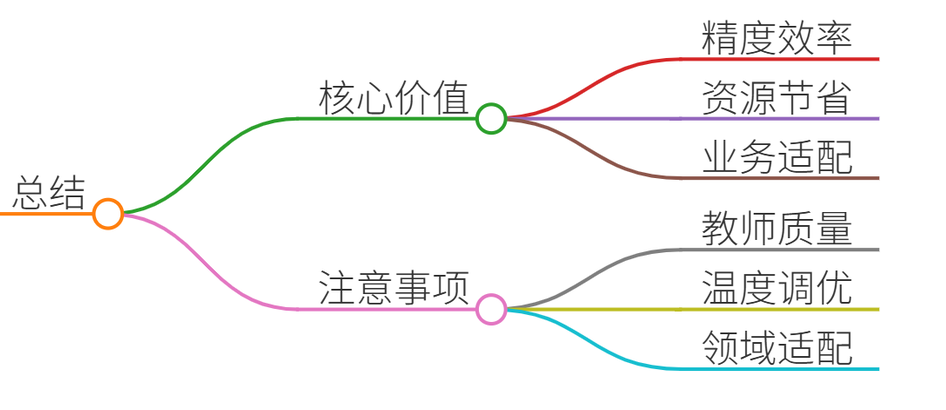

# 29.知识蒸馏的原理及适用场景

### 一、答题思路

知识蒸馏（Knowledge Distillation）是一种模型压缩技术，核心思想是将复杂模型（教师模型）的知识迁移到简单模型（学生模型）中，在保持性能的同时降低计算成本。回答需覆盖以下维度：

1. **原理**：教师模型输出软标签（概率分布），学生模型学习软标签的分布规律，结合真实标签优化损失函数。 
2. **适用场景**：模型轻量化、边缘设备部署、跨任务迁移、数据效率提升。
3. **项目案例**：结合真实场景说明技术选型、实现难点和业务收益。
4. **示例回答**：结构化呈现原理、场景及案例。
5. **总结**：提炼核心价值与注意事项。

### 二、项目案例

#### **案例1：变电站异物检测系统（联想）**
**背景**：国家电网需实时监测变电站异物（如风筝、塑料袋），传统方案依赖人工巡检，效率低且漏检率高。 **技术方案**：

+ **教师模型**：基于视觉大模型（如InternLM）训练，准确率99.9%，但参数量大（70B+），无法部署到摄像头边缘设备。
+ **学生模型**：蒸馏后的轻量模型（如DeepSeek-R1-Distill-Qwen-7B），仅需3MB内存/点位。 **蒸馏过程**：
1. **软标签生成**：教师模型标注正常/异物图像的概率分布。 
2. **损失函数设计**：学生模型损失 = 硬标签损失（交叉熵） + 软标签损失（KL散度）。
3. **温度参数**：设置温度系数T=5，平滑概率分布，使学生模型学习到“风筝与塑料袋的视觉相似性”等隐性知识。  
**结果**：
+ 漏报率<3%，误报率<5%，300+摄像头实时检测。 
+ 模型体积缩小200倍，GPU资源消耗降低90%。

#### **案例2：金融合规助手（道客云）**
**背景**：银行需快速响应合规咨询（如反洗钱政策），但大模型私有化部署成本高，且通用模型缺乏领域知识。  
**技术方案**：

+ **教师模型**：基于ChatGLM构建的合规知识库（含1000+条法规），输出政策解读的软标签。
+ **学生模型**：蒸馏模型（DeepSeek-R1-Distill-Llama-8B）集成到企业微信。 **蒸馏优化**：
1. **动态温度调整**：复杂政策（如跨境转账）用高温（T=10）增强细节学习；简单问题（如开户流程）用低温（T=2）。
2. **领域知识注入**：在蒸馏损失中加入政策关键词权重（如“FATF标准”权重提升30%）。  
**结果**：
+ 客服响应时间从5分钟缩短至10秒，准确率95%。
+ 私有化部署成本降低60%（仅需8GB显存）。

### 三、示例回答

#### **知识蒸馏原理**
1. **核心机制**： 
    - **软标签（Soft Labels）**：教师模型输出的概率分布（如“异物是风筝的概率：0.7，塑料袋：0.3”），比硬标签（0/1）蕴含更多知识（如类别间相似性）。
    - **温度参数（T）**：放大输出分布的熵值，使学生模型更易学习复杂关系，公式：$ $q_i = \frac{\exp(z_i/T)}{\sum_j \exp(z_j/T)}$ $
    - **损失函数**：$ $L = \alpha \cdot \text{CE}(y_{\text{hard}}, y_{\text{student}}) + (1-\alpha) \cdot T^2 \cdot \text{KL}(q_{\text{teacher}} \| q_{\text{student}})$ $，其中α平衡软硬标签权重。
2. **蒸馏类型**： 
    - **离线蒸馏**：教师模型冻结，学生直接学习其输出（案例1）。 
    - **半监督蒸馏**：教师生成伪标签扩充训练数据（案例2的政策关键词增强）。

#### **适用场景**
| **场景** | **需求** | **蒸馏作用** |
| --- | --- | --- |
| 边缘设备部署  | 低内存、低延迟（如变电站摄像头） | 压缩模型体积，加速推理（案例1） |
| 领域知识迁移 | 快速适配垂直场景（如金融合规） | 注入领域知识，减少微调数据量（案例2） |
| 模型即服务（MaaS） | 高并发响应（如智能客服） | 用小模型承载大模型90%以上的能力 |

#### **项目经验总结**
+ **关键挑战**：教师模型过强可能导致学生模型过拟合软标签（案例1通过正则化缓解）。
+ **创新点**：动态温度调整（案例2）和混合损失权重（α=0.7时效果最优）。

### 四、总结

**核心价值**：  
知识蒸馏以10%-20%的性能损失换取210倍的推理加速和资源节省，是平衡精度与效率的利器。尤其在边缘计算（如变电站）、高合规场景（如金融）中，能实现“大模型能力，小模型成本”。

**注意事项**：

1. **教师模型质量**：教师模型需充分训练，否则会传递错误知识（如金融政策过时）。
2. **温度参数调优**：T过高导致知识模糊，T过低失去蒸馏意义（建议范围2~10）。
3. **领域适配**：跨领域蒸馏（如医疗→金融）需添加领域自适应损失（如MMD距离）。

**面试点睛**：回答时强调“业务痛点→技术选型→量化收益”的逻辑链（如“变电站漏检率从15%→3%”），展现工程思维而非纯理论。

> 更新: 2025-07-14 15:45:34  
> 原文: <https://www.yuque.com/tulingzhouyu/db22bv/vuirs22d7z30zut9>