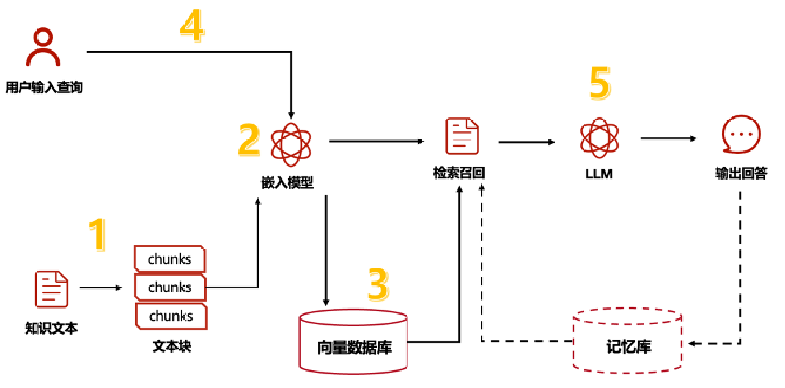
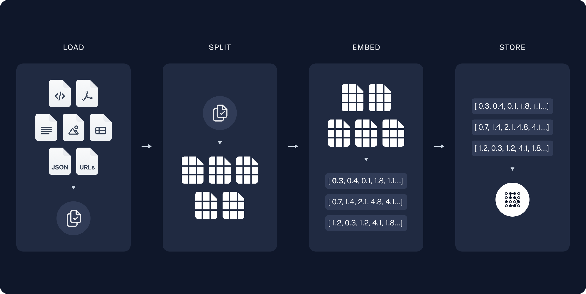
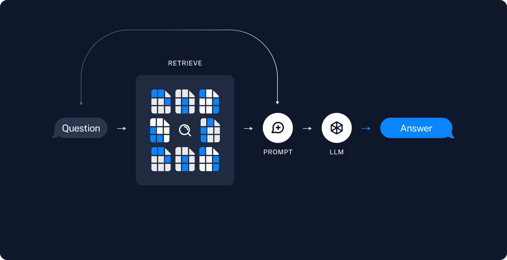

# 3.详细说下RAG的流程

### 答题思路
在面试中回答RAG（Retrieval-Augmented Generation）的流程时，建议从核心目标出发，结合具体步骤和技术细节，展现对整体架构和关键环节的理解。以下是分步说明：


首先，回忆一下RAG相关的知识，确保自己理解正确。RAG是Retrieval-Augmented Generation的缩写，也就是检索增强生成。它结合了检索和生成两种技术，用于提升模型生成回答的质量，特别是在需要外部知识的时候。

那么，RAG的基本流程应该包括几个步骤呢？首先，用户提出问题或输入一个查询，接下来系统需要从这个查询中提取关键信息，然后去检索相关的文档或数据，再把检索到的信息和原问题一起输入生成模型，最后生成回答。不过可能中间还有一些细节，比如预处理、检索策略、结果整合等。

通常RAG的流程可以分为三个主要阶段：检索阶段、增强阶段和生成阶段。或者可能更详细的分法。比如，用户输入处理、检索相关文档、文档处理、生成回答、后处理等。

在检索阶段，首先需要对用户的查询进行理解，可能包括关键词提取、实体识别、或者更复杂的语义分析，这样能更准确地检索相关文档。然后，系统会使用某种检索方法，比如基于密集向量的检索（如用BERT这样的模型生成嵌入向量），或者传统的BM25算法，从大型文档库中找到最相关的段落或文档。

接下来，在增强阶段，检索到的文档会被处理，可能包括去重、排序、截断，或者提取关键信息，然后和原问题一起输入到生成模型中。生成模型通常是像GPT这样的自回归模型，它根据原问题和检索到的信息生成最终的回答。

不过，可能还有一些步骤需要注意，比如在检索前对文档库的预处理，比如建立索引，这样检索的时候可以快速找到相关文档。另外，生成后的结果可能需要进行后处理，比如去除重复内容、格式化、或者验证事实准确性等。

有没有可能我遗漏了什么步骤？比如，用户输入的处理可能不仅仅是简单的关键词提取，还需要进行意图识别或者查询扩展，以提高检索效果。例如，当用户的问题比较模糊时，系统可能需要生成多个相关的查询来检索更多相关文档。

另外，在检索阶段，可能还会涉及多模态的数据，比如文本、图片等，但通常RAG主要处理文本信息。不过具体情况可能因应用而异。

生成阶段需要注意，如何将检索到的信息有效地整合到生成过程中。比如，可能需要对多个文档的信息进行综合，或者解决信息冲突的问题。此外，生成模型需要有足够的能力理解检索到的内容，并生成连贯、准确的回答。

在模型训练方面，RAG可能需要联合训练检索器和生成器，或者分别训练。比如，Facebook的原始RAG模型是联合训练的，但后来有些实现可能分开训练，比如用现成的检索模型和生成模型组合。

还需要考虑评估RAG系统的方法，比如如何衡量检索到的文档的相关性，生成回答的质量，以及整个系统的效率。不过这个问题可能不需要在流程中详细说明，但了解评估方法有助于理解流程的设计考虑。

现在，整理一下思路：

1. 用户输入处理：解析查询，可能进行意图识别、实体识别、查询扩展等。
2. 文档检索：使用检索方法从文档库中找到相关段落，可能需要预处理和索引。
3. 文档处理：对检索结果进行排序、去重、截断或摘要。
4. 信息整合：将处理后的文档和原查询结合，输入生成模型。
5. 生成回答：生成模型产生回答，可能包括多步推理。
6. 后处理：对生成的回答进行格式化、去重、事实校验等。

可能还需要提到各个步骤中的技术细节，比如检索使用的模型，生成模型的选择，如何处理多文档信息等。此外，可以举例子或者具体技术，比如用BERT做检索，用GPT-3生成，或者使用FAISS进行向量检索加速。

有没有可能漏掉了反馈循环？比如用户对生成的回答进行反馈，系统根据反馈优化检索或生成，但这可能属于系统迭代部分，不属于基础流程。

总结一下，RAG流程的核心是检索+生成，重点在于如何有效地从外部知识库中获取相关信息，并利用这些信息辅助生成模型产生更准确的回答。需要详细说明每个步骤的目的和常用技术，以及它们如何协同工作。


### **RAG流程详解**
RAG通过结合检索（从外部知识库获取信息）和生成（利用大模型生成回答）来提升模型输出的准确性和相关性。其流程可分为以下核心阶段：


<font style="color:rgb(0, 0, 0);">RAG是一种用额外数据增强大语言模型知识的技术。</font>

<font style="color:rgb(0, 0, 0);">大语言模型可以对广泛的主题进行推理，但它们的知识仅限于训练时截止日期前的公开数据。如果你想构建能够对私有数据或模型截止日期后引入的数据进行推理的人工智能应用，你需要用特定信息来增强模型的知识。检索适当信息并将其插入模型提示的过程被称为检索增强生成（RAG）。</font>

<font style="color:rgb(0, 0, 0);">LangChain有许多组件旨在帮助构建问答应用，以及更广泛的RAG应用。</font>




<font style="color:rgb(0, 0, 0);">一个典型的RAG应用有两个主要组成部分：</font>

**<font style="color:rgb(0, 0, 0);">索引(Indexing)</font>**<font style="color:rgb(0, 0, 0);">：从数据源获取数据并建立索引的管道(pipeline)。</font>_<font style="color:rgb(0, 0, 0);">这通常在离线状态下进行。</font>_

**<font style="color:rgb(0, 0, 0);">检索和生成(Retrieval and generation)</font>**<font style="color:rgb(0, 0, 0);">：实际的RAG链，在运行时接收用户查询，从索引中检索相关数据，然后将其传递给模型。</font>

<font style="color:rgb(0, 0, 0);">从原始数据到答案的最常见完整顺序如下：</font>

**<font style="color:rgb(0, 0, 0);">索引(Indexing) </font>**

1. **<font style="color:rgb(0, 0, 0);">加载(Load)</font>**<font style="color:rgb(0, 0, 0);">：首先我们需要加载数据。这是通过文档加载器</font>[<font style="color:rgb(0, 0, 0);">Document Loaders</font>](https://blog.frognew.com/library/agi/langchain/components/document-loaders.html)<font style="color:rgb(0, 0, 0);">完成的。</font>
2. **<font style="color:rgb(0, 0, 0);">分割(Split)</font>**<font style="color:rgb(0, 0, 0);">：文本分割器</font>[<font style="color:rgb(0, 0, 0);">Text splitters</font>](https://python.langchain.com/docs/concepts/#text-splitters)<font style="color:rgb(0, 0, 0);">将大型文档(</font>`<font style="color:rgb(0, 0, 0);">Documents</font>`<font style="color:rgb(0, 0, 0);">)分成更小的块(chunks)。这对于索引数据和将其传递给模型都很有用，因为大块数据更难搜索，而且不适合模型有限的上下文窗口。</font>
3. **<font style="color:rgb(0, 0, 0);">存储(Store)</font>**<font style="color:rgb(0, 0, 0);">：我们需要一个地方来存储和索引我们的分割(splits)，以便后续可以对其进行搜索。这通常使用向量存储</font>[<font style="color:rgb(0, 0, 0);">VectorStore</font>](https://blog.frognew.com/library/agi/langchain/components/vector-stores.html)<font style="color:rgb(0, 0, 0);">和嵌入模型</font>[<font style="color:rgb(0, 0, 0);">Embeddings model</font>](https://blog.frognew.com/library/agi/langchain/components/embedding-models.html)<font style="color:rgb(0, 0, 0);">来完成。</font>



**<font style="color:rgb(0, 0, 0);">检索和生成(Retrieval and generation) </font>**

4. **<font style="color:rgb(0, 0, 0);">检索(Retrieve)</font>**<font style="color:rgb(0, 0, 0);">：给定用户输入，使用检索器</font>[<font style="color:rgb(0, 0, 0);">Retriever</font>](https://blog.frognew.com/library/agi/langchain/components/retrievers.html)<font style="color:rgb(0, 0, 0);">从存储中检索相关的文本片段。</font>
5. **<font style="color:rgb(0, 0, 0);">生成(Generate)</font>**<font style="color:rgb(0, 0, 0);">：</font><font style="color:rgb(0, 0, 0);"> </font>[<font style="color:rgb(0, 0, 0);">ChatModel</font>](https://blog.frognew.com/library/agi/langchain/components/chat-models.html)<font style="color:rgb(0, 0, 0);">使用包含问题和检索到的数据的提示来生成答案。</font>




#### **1. 用户输入处理**
+ **目标**：解析并理解用户查询的意图和关键信息。
+ **关键技术**：
    - **查询解析**：提取关键词、实体识别（如NER）、语义解析（理解深层意图）。
    - **查询扩展**：通过同义词替换、上下文联想（例如，用户问“Transformer结构”时，补充“注意力机制”相关术语）增强检索效果。
    - **向量化**：将查询转换为向量表示（如使用BERT、Sentence-BERT等模型），便于后续向量检索。


#### **2. 文档检索**
+ **目标**：从外部知识库中快速找到与查询最相关的文档或段落。
+ **关键技术**：
    - **索引构建**：预处理知识库文档，构建高效的索引结构（如倒排索引、向量索引FAISS/HNSW）。
    - **检索算法**：
        * **稀疏检索**：基于词频的方法（如BM25），适合关键词匹配。
        * **密集检索**：基于语义相似度的向量匹配（如DPR、ANCE模型）。
    - **多路召回**：结合多种检索策略（如同时用BM25和向量检索），提升召回率。

---

#### **3. 文档后处理**
+ **目标**：优化检索结果，确保输入生成模型的信息质量。
+ **关键技术**：
    - **去重与排序**：根据相关性（如相似度分数）或多样性筛选结果。
    - **截断与分块**：处理长文本（如滑动窗口截断），适配生成模型的输入长度限制。
    - **上下文增强**：添加元信息（如文档来源、时间戳）供生成模型参考。


#### **4. 生成回答**
+ **目标**：基于检索结果和用户输入生成自然、准确的回答。
+ **关键技术**：
    - **提示工程**：将检索到的文档与用户查询拼接为生成模型的输入（Prompt），例如：

```plain
[查询]：量子计算的优势是什么？
[相关文档1]：量子计算利用量子比特实现并行计算...
[相关文档2]：量子算法在加密破解领域有潜在应用...
[生成任务]：请综合上述信息，回答用户的问题。
```

    - **生成模型选择**：使用预训练生成模型（如GPT-3、T5、BART）进行条件文本生成。
    - **可控生成**：通过Temperature调整、Top-k采样等控制生成结果的多样性和准确性。

---

#### **5. 后处理与验证**
+ **目标**：优化生成结果的格式和事实准确性。
+ **关键技术**：
    - **文本润色**：去除重复内容、语法纠错、调整句式。
    - **事实核验**：对比检索结果与生成内容，确保一致性（如使用NLI模型验证逻辑）。
    - **引用标注**：标明答案的来源文档（增强可信度）。

---

### **技术挑战与优化方向**
+ **检索质量**：如何平衡召回率与精度，处理长尾查询。
+ **生成与检索的协同**：联合训练检索器和生成器（如Facebook的原始RAG模型）以提升端到端效果。
+ **效率优化**：减少检索延迟（如使用近似最近邻搜索）、压缩生成模型规模。

---

### **示例场景**
用户提问：“如何解决深度学习模型过拟合？”

1. **检索阶段**：从知识库中找到相关文档（如“Dropout的作用”“数据增强方法”）。
2. **生成阶段**：模型综合检索结果，生成包含正则化、早停法等技术的回答，并引用来源。

---

### **总结回答**
在面试中，可以按以下结构回答：

1. **定义RAG**：强调其结合检索与生成的优势。
2. **分步拆解流程**：输入处理→检索→文档处理→生成→后处理。
3. **关键技术点**：密集检索、提示工程、联合训练等。
4. **结合实际案例**：简要举例说明流程如何运作。

通过清晰的逻辑和具体技术术语，展现对RAG的深入理解。


> 更新: 2025-07-14 15:45:38  
> 原文: <https://www.yuque.com/tulingzhouyu/db22bv/tw2aui3rewoqet4f>