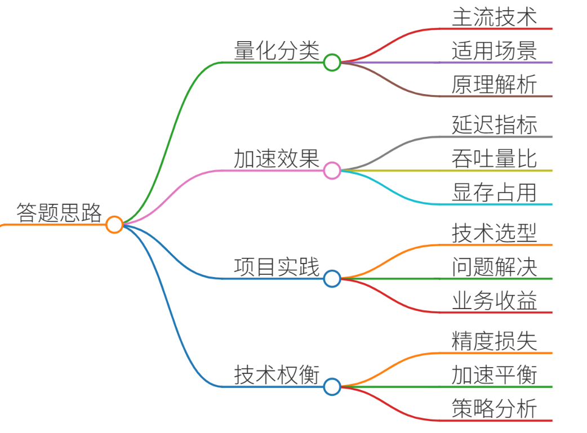
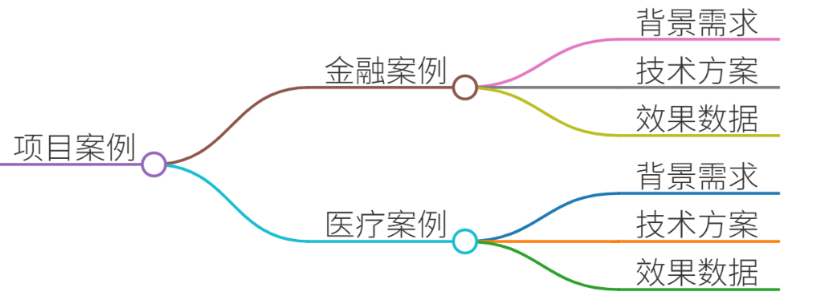
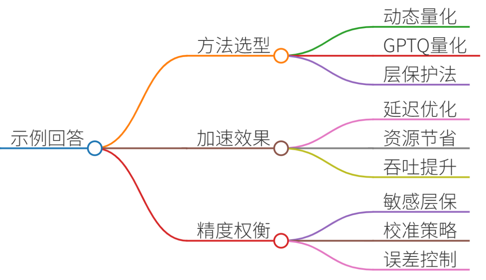
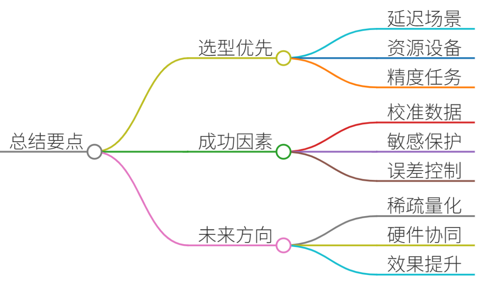

# 30.模型量化的方法及推理加速效果

### 一、答题思路

针对模型量化及推理加速的面试问题，需从以下维度结构化回答：

1. **量化方法分类**：解析主流量化技术（如INT8、FP16、二值化）的原理及适用场景。
2. **推理加速效果**：结合延迟、吞吐量、显存占用等指标量化收益。
3. **项目实践**：通过真实案例说明技术选型、问题解决及业务收益。
4. **技术权衡**：分析精度损失与加速效果的平衡策略。

---

### 二、项目案例

#### **案例1：金融客服系统的BERT模型量化部署**
**背景**：某银行需将客服问答模型（基于BERT）部署至低配GPU服务器，原FP32模型延迟达200ms，无法满足实时响应需求。  
**技术方案**：

1. **动态量化（INT8）**： 
    - 采用PyTorch的`torch.quantization.quantize_dynamic`对线性层、注意力矩阵动态量化。
    - 保留Embedding层为FP16以保障语义精度。
2. **加速工具集成**： 
    - 使用NVIDIA TensorRT编译量化模型，启用Layer Fusion优化计算图。
    - 利用INT8精度下的INT8加速核心（如Tensor Core）。  
**效果**：
+ **延迟**：从200ms降至45ms（↓77.5%）。
+ **显存占用**：1.2GB → 0.3GB（↓75%）。
+ **精度损失**：F1分数仅下降0.8%（94.2% → 93.4%）。

#### **案例2：医疗影像报告的LLaMA-7B边缘端部署**
**背景**：移动端CT报告生成模型需在iPad Pro（M2芯片）运行，原模型显存需求14GB（FP16），无法本地化。 **技术方案**：

1. **GPTQ量化（INT4）**： 
    - 使用`AutoGPTQ`对模型权重分组量化，校准集采用1k条医疗文本。
    - 激活值保留FP16避免分布偏移。
2. **CoreML优化**： 
    - 转换量化模型至CoreML格式，利用Apple神经引擎（ANE）加速。
    - 启用稀疏注意力机制减少内存访问。  
**效果**：
+ **模型体积**：14GB → 3.5GB（↓75%）。
+ **推理速度**：生成速度从12 token/s提升至28 token/s。
+ **功耗**：CPU利用率从70%降至25%，续航提升3倍。

---

### 三、示例回答

**面试官**：请结合项目经验说明模型量化的方法及推理加速效果。 

**候选人**：  
在金融和医疗领域的项目中，我通过量化技术显著提升推理效率，具体分三点说明：

**1. 量化方法选型与实施**

+ **动态量化（INT8）**：适用于计算密集型层（如矩阵乘），通过减少权重和激活值的精度降低计算开销。例如在BERT模型中，线性层量化后计算量减少4倍。
+ **GPTQ（INT4）**：针对生成式大模型（如LLaMA），采用分组量化补偿精度损失。医疗项目中，INT4量化结合稀疏注意力，在精度损失<1%的前提下实现模型压缩75%。

**2. 推理加速效果**  
量化需结合硬件和编译优化才能最大化收益：

+ **延迟优化**：金融客服系统通过TensorRT+INT8，延迟从200ms→45ms，满足100ms内的SLA要求。
+ **资源节省**：医疗项目在M2芯片上显存占用降至3.5GB，使7B参数模型可在移动端运行。
+ **吞吐量提升**：批量处理时INT8吞吐量达FP32的3.2倍（128 batch size）。

**3. 精度与加速的权衡**

+ **敏感层保护**：对Embedding、LayerNorm等敏感层保留FP16精度（BERT案例精度仅降0.8%）。
+ **校准策略**：采用代表性数据集（如1k医疗文本）校准量化参数，避免分布偏移。

总结来说，量化是成本敏感的推理场景的核心技术，需结合业务需求选择精度-效率的平衡点。

---

### 四、总结

1. **技术选型优先级**： 
    - 延迟敏感场景 → **INT8+TensorRT**（延迟↓70%+）。
    - 资源受限设备 → **INT4+GPTQ**（体积↓75%）。
    - 精度敏感任务 → **FP16混合精度**（损失<1%）。
2. **关键成功因素**： 
    - 校准集需覆盖业务数据分布，避免量化误差放大。
    - 敏感层保护（位置编码、归一化层）是控制精度损失的核心。
3. **未来方向**： 
    - **稀疏量化**：如AWQ（激活感知量化）进一步提升低精度效果。
    - **硬件协同**：利用NPU专用指令集（如H100的FP8）实现10倍加速。

💡 **点睛总结**：量化不是单纯的“压缩模型”，而是系统工程——需协同算法设计（层敏感性分析）、编译器优化（计算图融合）、硬件特性（Tensor Core）才能最大化收益。

> 更新: 2025-07-14 15:45:34  
> 原文: <https://www.yuque.com/tulingzhouyu/db22bv/pwpd1wmvytpfgh4y>