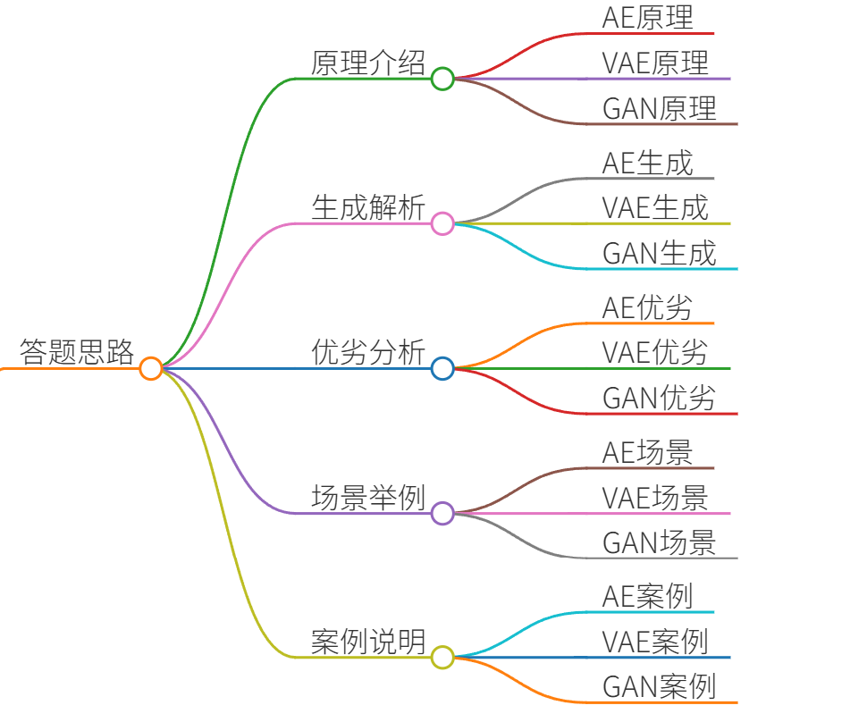
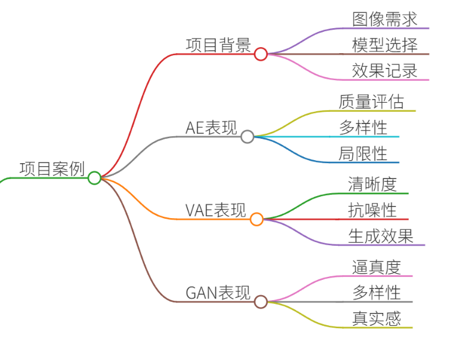
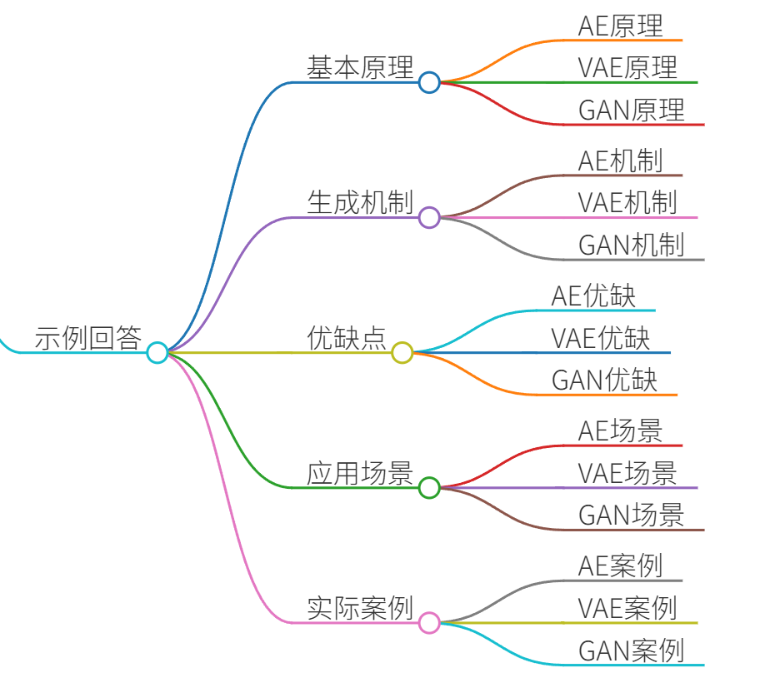
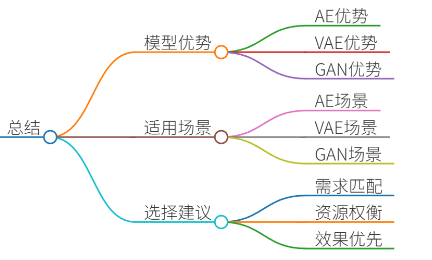

# 31.对比AE、VAE、GAN的生成机制

### 一、答题思路

在面试中被问到对比AE（自动编码器）、VAE（变分自动编码器）、GAN（生成对抗网络）的生成机制时，可以从以下几个方面进行回答：

1. **基本原理**：简要介绍每种模型的基本原理和工作机制。
2. **生成机制**：详细解释每种模型的生成过程和机制。
3. **优缺点**：分析每种模型的优缺点，包括生成质量、训练稳定性、计算复杂度等。
4. **应用场景**：举例说明每种模型在不同应用场景中的表现和适用性。
5. **实际案例**：结合真实项目案例，具体说明每种模型的应用和效果。

### 二、项目案例
假设我们在一个图像生成项目中，需要生成高质量的图像。我们尝试了AE、VAE和GAN三种模型，并记录了它们的表现和效果。

### 三、示例回答

#### 1. 基本原理
+ **自动编码器（AE）**：AE是一种无监督学习模型，主要用于数据的降维和特征提取。它由编码器和解码器两部分组成。编码器将输入数据压缩成一个低维的表示，解码器再将这个低维表示还原成原始数据。AE的目标是最小化输入数据和输出数据之间的重构误差。
+ **变分自动编码器（VAE）**：VAE是AE的一种扩展，它在编码器和解码器之间引入了概率分布。VAE不仅学习数据的表示，还学习数据的概率分布。编码器输出的是数据的均值和方差，解码器根据这些均值和方差生成新的数据。VAE的目标是最小化重构误差和KL散度（Kullback-Leibler divergence）。
+ **生成对抗网络（GAN）**：GAN由生成器和判别器两部分组成。生成器的任务是生成尽可能逼真的数据，判别器的任务是区分生成的数据和真实的数据。通过对抗训练，生成器不断改进生成的数据质量，直到判别器无法区分生成的数据和真实的数据。

#### 2. 生成机制
+ **AE的生成机制**：
    1. 输入数据通过编码器被压缩成一个低维的表示。
    2. 解码器将这个低维表示还原成原始数据。
    3. 通过最小化输入数据和输出数据之间的重构误差，AE学习到数据的有效表示。
+ **VAE的生成机制**：
    1. 输入数据通过编码器被压缩成一个低维的表示，这个表示包括均值和方差。
    2. 从均值和方差中采样得到一个潜在向量。
    3. 解码器根据这个潜在向量生成新的数据。
    4. 通过最小化重构误差和KL散度，VAE学习到数据的概率分布。
+ **GAN的生成机制**：
    1. 生成器生成假数据。
    2. 判别器判断生成的数据是真是假。
    3. 生成器和判别器通过对抗训练不断改进，直到生成器生成的数据无法被判别器区分。

#### 3. 优缺点
+ **AE的优点**：
    - 简单易懂，易于实现。
    - 可以用于数据的降维和特征提取。
    - 生成的数据具有一定的重构质量。
+ **AE的缺点**：
    - 生成的数据质量不高，容易出现模糊和失真。
    - 缺乏生成新数据的能力。
+ **VAE的优点**：
    - 生成的数据质量较高，具有一定的多样性。
    - 学习到数据的概率分布，可以进行采样生成新数据。
    - 具有一定的抗噪能力。
+ **VAE的缺点**：
    - 训练过程较为复杂，需要调节超参数。
    - 生成的数据质量有时不如GAN。
+ **GAN的优点**：
    - 生成的数据质量高，逼真度高。
    - 生成的数据具有多样性，可以生成新的数据。
    - 生成器和判别器的对抗训练机制使得模型具有很强的生成能力。
+ **GAN的缺点**：
    - 训练过程不稳定，容易出现模式崩溃。
    - 需要大量的计算资源和时间。
    - 生成的数据质量依赖于判别器的性能。

#### 4. 应用场景
+ **AE的应用场景**：
    - 数据降维和特征提取。
    - 图像去噪和修复。
    - 异常检测。
+ **VAE的应用场景**：
    - 图像生成和重建。
    - 数据生成和采样。
    - 异常检测和数据插补。
+ **GAN的应用场景**：
    - 图像生成和编辑。
    - 视频生成和编辑。
    - 数据增强和数据合成。

#### 5. 实际案例
在我们的图像生成项目中，我们尝试了AE、VAE和GAN三种模型，并记录了它们的表现和效果。

+ **AE的表现**：
    - 生成的数据具有一定的重构质量，但图像质量不高，容易出现模糊和失真。
    - 生成的数据缺乏多样性，无法生成新的图像。
+ **VAE的表现**：
    - 生成的数据质量较高，图像较为清晰，具有一定的多样性。
    - 生成的数据具有一定的抗噪能力，能够生成较为逼真的图像。
+ **GAN的表现**：
    - 生成的数据质量非常高，图像逼真度高，具有很强的多样性。
    - 生成的数据具有很高的真实感，能够生成高质量的图像。

### 四、总结

在对比AE、VAE和GAN的生成机制时，可以看出每种模型都有其独特的优势和适用场景。AE适用于数据的降维和特征提取，VAE适用于数据的生成和采样，GAN适用于高质量的图像和数据生成。在实际项目中，选择合适的模型需要根据具体的需求和场景进行权衡和选择。通过实际案例的分析，我们可以更好地理解每种模型的优缺点，从而在实际应用中做出更明智的决策。

> 更新: 2025-07-14 15:45:34  
> 原文: <https://www.yuque.com/tulingzhouyu/db22bv/zcyggxfpw1lz6178>