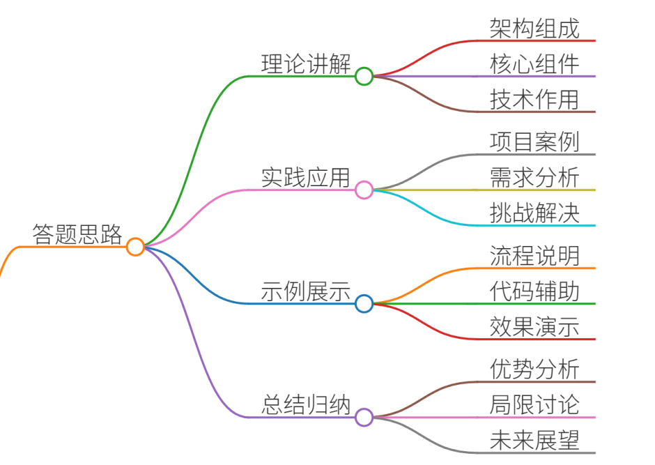
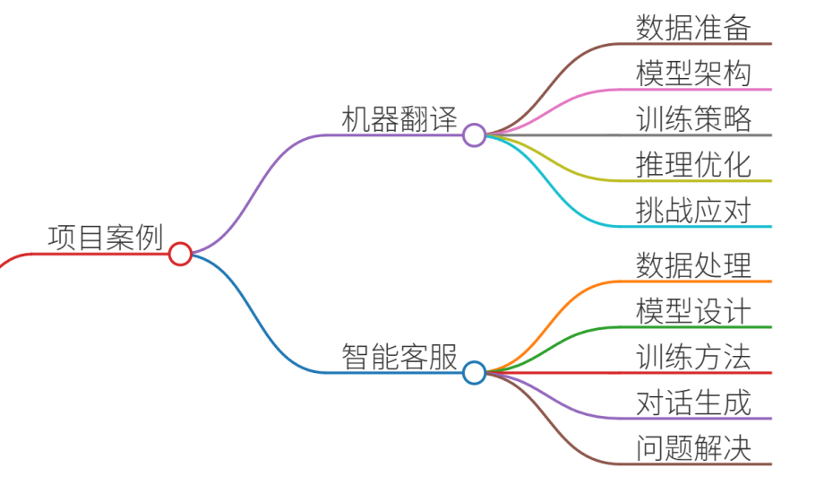
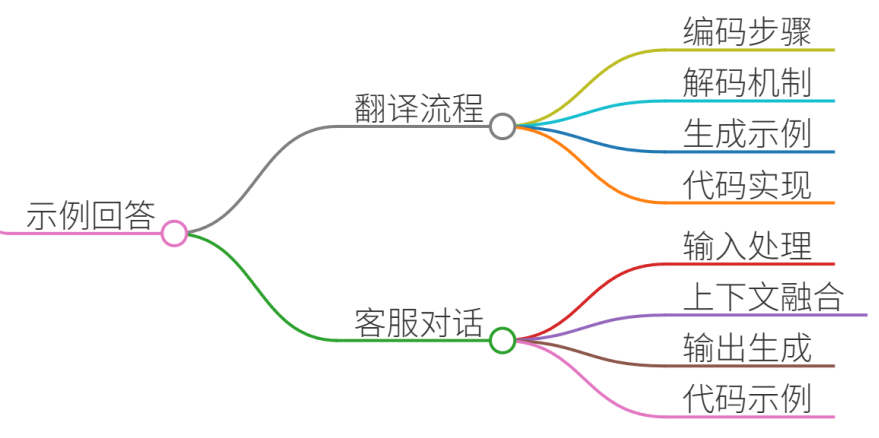
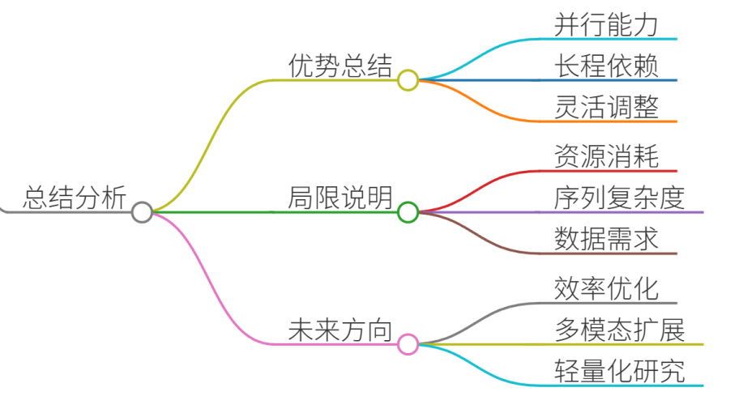

# 32.Transformer的编码器-解码器结构工作流程

### 一、答题思路


当面试官询问Transformer的编码器-解码器结构工作流程时，需要从理论到实践进行结构化回答。以下是答题的框架思路：

1. **理论部分**：
    - 解释Transformer的基本架构，包括编码器和解码器的组成。
    - 详细说明编码器和解码器的工作流程，包括自注意力机制、多头注意力、前馈神经网络等核心组件。
    - 强调位置编码、残差连接和层归一化等技术的作用。
2. **实践部分**：
    - 结合真实项目案例，说明如何在项目中应用Transformer的编码器-解码器结构。
    - 分析项目中的具体需求，以及如何通过调整模型参数和结构来满足这些需求。
    - 讨论项目中遇到的挑战和解决方案。
3. **示例回答**：
    - 提供一个具体的示例，展示编码器-解码器结构在实际项目中的应用。
    - 通过代码片段或流程图辅助说明。
4. **总结**：
    - 总结Transformer编码器-解码器结构的优势和局限性。
    - 展望未来可能的改进方向和应用场景。

### 二、项目案例


#### 案例背景：机器翻译系统
在一个机器翻译项目中，我们需要将英文翻译成中文。项目使用了Transformer的编码器-解码器结构，具体实现如下：

1. **数据准备**：
    - 收集并清洗了大量的英文-中文平行语料。
    - 对文本进行分词和编码，生成词嵌入。
2. **模型架构**：
    - 编码器：6层，每层包含多头自注意力机制和前馈神经网络。
    - 解码器：6层，每层包含掩码多头自注意力机制、编码器-解码器注意力机制和前馈神经网络。
    - 使用位置编码来捕捉序列中的顺序信息。
3. **训练过程**：
    - 使用交叉熵损失函数和Adam优化器。
    - 采用学习率预热和衰减策略。
    - 在训练过程中使用了标签平滑技术来防止过拟合。
4. **推理过程**：
    - 使用束搜索（beam search）来生成翻译结果。
    - 通过调整束宽和长度惩罚系数来优化生成质量。
5. **挑战与解决方案**：
    - **长序列处理**：通过增加位置编码的维度和调整注意力头数来提升长序列的处理能力。
    - **低资源语言**：通过迁移学习和数据增强技术来提升低资源语言的翻译质量。

#### 案例背景：智能客服系统
在另一个智能客服项目中，我们使用Transformer的编码器-解码器结构来实现多轮对话管理：

1. **数据准备**：
    - 收集了大量的客服对话数据，包括用户提问和客服回答。
    - 对对话数据进行清洗和标注，生成结构化数据。
2. **模型架构**：
    - 编码器：4层，专注于理解用户输入的语义。
    - 解码器：4层，生成连贯且符合上下文的回答。
    - 使用预训练的词嵌入来提升模型的表现。
3. **训练过程**：
    - 使用了联合训练策略，同时优化编码器和解码器。
    - 通过对抗训练来提升模型的鲁棒性。
4. **推理过程**：
    - 在生成回答时，结合了上下文信息和历史对话记录。
    - 使用温度参数（temperature）来控制生成结果的多样性。
5. **挑战与解决方案**：
    - **上下文依赖**：通过引入额外的注意力机制来捕捉长距离依赖。
    - **多轮对话一致性**：通过引入对话状态跟踪模块来保持对话的一致性。

### 三、示例回答


#### 示例：机器翻译系统中的编码器-解码器工作流程
1. **编码器工作流程**：
    - 输入：“The cat sat on the mat.”
    - 编码器将输入序列转换为词嵌入，并加上位置编码。
    - 通过多头自注意力机制计算每个词与其他词的关系权重。
    - 前馈神经网络进一步处理注意力输出，生成编码器的最终输出。
2. **解码器工作流程**：
    - 初始输入：起始标记`<s>`。
    - 解码器通过掩码多头自注意力机制处理当前生成的序列。
    - 编码器-解码器注意力机制将编码器的输出与解码器的当前状态结合，生成上下文向量。
    - 前馈神经网络处理上下文向量，生成下一个词的概率分布。
    - 通过束搜索选择最可能的词，例如“猫”。
3. **生成过程**：
    - 输入：“The cat sat on the mat.”
    - 生成步骤： 
        1. `<s>` → “猫”
        2. “猫” → “坐”
        3. “坐” → “在”
        4. “在” → “垫子”
        5. “垫子” → “上”
        6. “上” → `</s>`
    - 最终输出：“猫坐在垫子上。”
4. **代码片段**：

```plain
import torch
from transformers import Transformer, TransformerConfig

config = TransformerConfig(
    vocab_size=30000,
    max_position_embeddings=512,
    encoder_layers=6,
    decoder_layers=6,
    dim_model=512,
    dim_feedforward=2048,
    num_heads=8,
)
model = Transformer(config)

# 编码器输入
encoder_input = torch.tensor([[1, 2, 3, 4, 5, 6]])  # 假设1-6是"The cat sat on the mat"的编码
# 解码器输入（初始为起始标记）
decoder_input = torch.tensor([[0]])  # 假设0是起始标记

# 生成过程
for _ in range(10):
    encoder_output = model.encoder(encoder_input)
    decoder_output = model.decoder(decoder_input, encoder_output)
    next_token = torch.argmax(decoder_output[:, -1, :], dim=-1)
    decoder_input = torch.cat([decoder_input, next_token.unsqueeze(0)], dim=-1)
    if next_token.item() == 7:  # 假设7是结束标记
        break
print(decoder_input)
```

#### 示例：智能客服系统中的编码器-解码器工作流程
1. **编码器工作流程**：
    - 用户输入：“我的订单状态是什么？”
    - 编码器将输入转换为词嵌入，并提取关键信息（如“订单”、“状态”）。
2. **解码器工作流程**：
    - 结合用户输入和对话历史（如之前的对话中提到订单号）。
    - 生成回答：“您的订单正在配送中，预计明天送达。”
3. **生成过程**：
    - 输入：“我的订单状态是什么？”
    - 生成步骤： 
        1. `<s>` → “您的”
        2. “您的” → “订单”
        3. “订单” → “正在”
        4. “正在” → “配送”
        5. “配送” → “中”
        6. “中” → “，”
        7. “，” → “预计”
        8. “预计” → “明天”
        9. “明天” → “送达”
        10. “送达” → `</s>`
    - 最终输出：“您的订单正在配送中，预计明天送达。”
4. **代码片段**：

```plain
from transformers import GPT2LMHeadModel, GPT2Tokenizer

tokenizer = GPT2Tokenizer.from_pretrained("gpt2")
model = GPT2LMHeadModel.from_pretrained("gpt2")

# 模拟对话历史
context = "用户：我的订单号是12345。\n客服：好的，已收到您的订单信息。\n用户：我的订单状态是什么？"
input_ids = tokenizer.encode(context, return_tensors="pt")

# 生成回答
output = model.generate(
    input_ids,
    max_length=50,
    temperature=0.7,
    num_return_sequences=1,
)
print(tokenizer.decode(output[0], skip_special_tokens=True))
```

### 四、总结


#### 优势：
1. **并行计算**：Transformer的编码器-解码器结构支持并行计算，显著提升了训练和推理效率。
2. **长距离依赖**：自注意力机制能够有效捕捉长距离依赖关系，解决了传统RNN和LSTM的局限性。
3. **灵活性**：通过调整层数、头数和维度，可以灵活适应不同任务的需求。

#### 局限性：
1. **计算资源**：模型参数量大，训练和推理需要大量的计算资源。
2. **长序列处理**：虽然自注意力机制能够处理长序列，但随着序列长度的增加，计算复杂度呈平方级增长。
3. **数据依赖**：模型性能高度依赖训练数据的质量和数量。

#### 未来方向：
1. **高效注意力机制**：研究更高效的注意力机制，如稀疏注意力、线性注意力，以降低计算复杂度。
2. **多模态融合**：探索编码器-解码器结构在多模态任务（如图文生成、视频理解）中的应用。
3. **轻量化模型**：通过模型压缩、蒸馏等技术，减少模型参数量，提升推理速度。

通过结合理论分析和项目实践，Transformer的编码器-解码器结构在自然语言处理和其他领域展现出了强大的潜力。未来随着技术的进步，其应用场景将进一步扩展。


> 更新: 2025-07-14 15:45:34  
> 原文: <https://www.yuque.com/tulingzhouyu/db22bv/zi7s53s6ykd0gi6d>