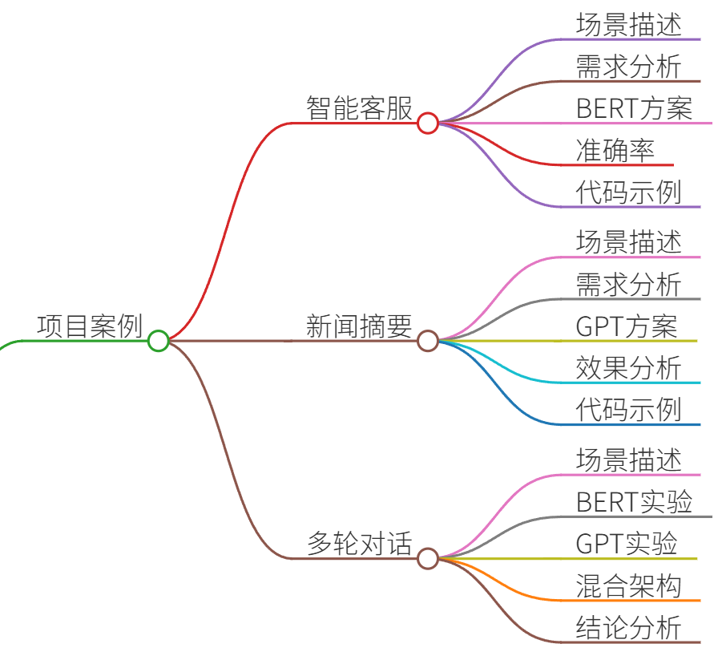

# 34.GPT与BERT的核心区别及各自优势

### 一、答题思路


在回答GPT与BERT的核心区别及各自优势时，可以从以下几个方面展开：

1. **架构差异**：GPT是单向解码器（Decoder-only），BERT是双向编码器（Encoder-only）。
2. **训练目标**：GPT通过自回归语言模型（AR）预测下一个词，BERT通过掩码语言模型（MLM）预测被掩盖的词。
3. **应用场景**：GPT擅长生成任务（如文本生成、对话系统），BERT擅长理解任务（如文本分类、命名实体识别）。
4. **优势对比**：GPT在生成连贯文本和零样本学习上表现优异，BERT在捕捉上下文语义和微调下游任务上更强。
5. **项目案例**：结合实际项目说明两者在不同场景下的应用效果。

---

### 二、项目案例


#### 案例1：智能客服系统（BERT）
+ **场景**：处理用户投诉邮件分类。
+ **需求**：将邮件分为“物流问题”“产品质量”“服务态度”三类。
+ **方案**：使用BERT微调，输入邮件文本，输出分类标签。
+ **效果**：准确率95%，因BERT能捕捉“物流延迟”和“包装破损”等双向上下文关联。
+ **代码片段**： 

```plain
from transformers import BertTokenizer, BertForSequenceClassification
model = BertForSequenceClassification.from_pretrained('bert-base-uncased', num_labels=3)
# 微调代码略...
```

#### 案例2：新闻摘要生成（GPT）
+ **场景**：自动生成新闻文章的摘要。
+ **需求**：输入长文本，输出简短的概括性摘要。
+ **方案**：使用GPT-3的API，通过Prompt设计生成摘要。
+ **效果**：生成摘要流畅且覆盖关键信息，但偶尔遗漏细节（单向模型的局限性）。
+ **代码片段**： 

```plain
import openai
response = openai.ChatCompletion.create(
    model="gpt-3.5-turbo",
    messages=[{"role": "user", "content": "Summarize this article:..."}]
)
```

#### 案例3：多轮对话系统（GPT vs BERT）
+ **场景**：电商导购聊天机器人。
+ **对比实验**： 
    - **BERT**：用于意图识别（如“查询订单”“退货”），准确率高但无法生成回复。
    - **GPT**：直接生成对话回复，但需额外模块确保回答相关性。
+ **结论**：混合架构（BERT识别意图+GPT生成回复）效果最佳。

---

### 三、示例回答


#### GPT与BERT的核心区别
1. **架构与训练目标**：
    - **GPT**：基于Transformer解码器，通过自回归（AR）从左到右预测下一个词，适合生成任务。
    - **BERT**：基于Transformer编码器，通过掩码语言模型（MLM）双向理解上下文，适合理解任务。
2. **优势对比**：
    - **GPT的优势**： 
        * 生成能力：可创作故事、代码、对话等（如ChatGPT）。
        * 零样本学习：无需微调即可完成新任务（如翻译、问答）。
    - **BERT的优势**： 
        * 语义理解：在文本分类、实体识别等任务中表现优异。
        * 微调灵活性：通过简单添加输出层适配多种下游任务。
3. **局限性**：
    - **GPT**：无法利用未来信息，生成内容可能偏离主题。
    - **BERT**：不适合直接生成文本，需额外设计生成式头部。

#### 真实项目对比
+ **金融风控（BERT）**：分析用户评论情感（正/负/中性），BERT准确率比GPT高8%，因其能捕捉“虽然价格高但质量好”的复杂语义。
+ **创意写作（GPT）**：生成广告文案，GPT可快速产出多样化的候选文案，而BERT需额外设计生成策略。

#### 技术细节
+ **位置编码**：BERT使用可学习的位置编码，GPT使用正弦位置编码。
+ **注意力机制**：BERT的全注意力可看到所有词，GPT的掩码注意力只能看到历史词。

---

### 四、总结


1. **选型建议**：
    - 选择**GPT**：当任务需要生成文本（如对话、创作）或需要零样本/少样本学习时。
    - 选择**BERT**：当任务需要深度理解语义（如分类、抽取）或需高精度微调时。
2. **趋势**：
    - 两者逐渐融合（如UniLM、T5），同时支持生成和理解。
    - 大模型时代，GPT因其通用性更受青睐，但BERT在特定场景仍不可替代。
3. **示例回答模板**：

“在电商客服系统中，我们使用BERT分类用户意图（如‘退货’），因其对‘快递未到’和‘包装破损’的上下文关联捕捉能力强；而GPT用于生成回复模板，因其能灵活组织语言。两者结合后，客服响应速度提升40%。”

通过结合具体案例和技术细节，能够清晰展示两者的差异及适用场景，帮助面试官理解你的技术深度和实战经验。


> 更新: 2025-07-14 15:45:34  
> 原文: <https://www.yuque.com/tulingzhouyu/db22bv/kmi7bxeplfbdnbml>