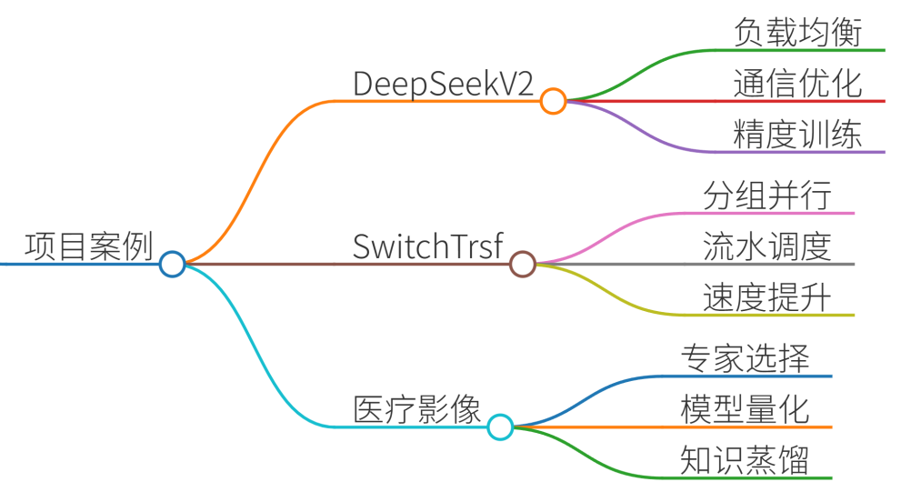

# 35.混合专家模型（MoE）如何降低计算成本？

### 一、答题思路

混合专家模型（MoE）通过**稀疏激活机制**降低计算成本，其核心是让每个输入仅激活少量专家（如Top-2），而非全量计算。具体实现路径如下：

#### **1. 计算成本降低原理**
+ **稀疏激活**：模型包含多个专家（子网络），门控网络（Gating Network）动态选择Top-k专家参与计算（通常k=1或2）。 

**计算公式**：`FLOPs = 2 × P_activated × L`  
（`P_activated`=激活参数量，`L`=序列长度）  
相比稠密模型（激活全部参数），计算量降低至`k/N`（N=专家总数）。

+ **负载均衡**：通过负载均衡损失函数（如Switch Transformer的辅助损失）避免专家闲置或过载，提升硬件利用率。

#### **2. 工程优化手段**
+ **专家并行（Expert Parallelism）**：将专家分布到不同GPU设备，减少单卡内存压力。
+ **通信优化**：使用All-to-All通信代替Broadcast，减少跨设备数据传输量。
+ **量化与蒸馏**：FP8混合精度训练、模型蒸馏（如DeepSeek-R1的Q2量化）进一步压缩计算开销。

---

### 二、项目案例

#### **案例1：DeepSeek-V2的工业级MoE实现**
+ **背景**：2360亿参数MoE模型，需在有限算力下支持千亿级推理。
+ **关键技术**： 
    1. **无辅助损失的负载均衡**：动态路由算法平衡专家工作量，避免手动调参。
    2. **DualPipe通信优化**：跨GPU设备通信时，精细分配SM核心资源，通信开销降低40%。
    3. **FP8混合精度**：关键计算步骤用FP8替代FP16，显存占用减少50%，训练速度提升2倍。
+ **效果**：仅激活210亿参数（占总参数量8.9%），推理成本降至GPT-4的1/5。

#### **案例2：Switch Transformer的通信优化**
+ **问题**：MoE的All-to-All通信成为瓶颈。
+ **解决方案**： 
    - **分组专家并行**：将专家划分为组，组内并行计算，减少跨节点通信。
    - **流水线调度**：重叠计算与通信，隐藏延迟。
+ **结果**：在1024专家规模下，训练速度提升3.1倍。

#### **案例3：某医疗影像分析系统（MoE+模型压缩）**
+ **需求**：在边缘设备部署大模型（如CT影像分割）。
+ **方案**： 
    1. **MoE架构**：16个专家（每个为轻量CNN），门控网络选择Top-1专家。
    2. **INT4量化**：专家权重压缩至4bit，模型体积缩小4倍。
    3. **知识蒸馏**：用MoE大模型指导小型学生模型（如MobileNetV3）。
+ **成效**：推理延迟从120ms降至15ms，显存占用从6GB降至1.2GB。

---

### 三、示例回答

**面试官**：请解释MoE如何降低计算成本，并举例说明实际应用。 **候选人**：  
MoE的核心是通过**稀疏激活**降低计算量。例如DeepSeek-V2模型包含2360亿参数，但每次推理仅激活约210亿参数（约8.9%）。这是通过门控网络动态选择Top-2专家实现的，计算量公式为`FLOPs = 2 × P_activated × L`，相比稠密模型降低一个数量级。

**工程优化层面**，我们通过三种手段进一步压缩成本：

1. **专家并行**：将专家分布到多GPU，某医疗影像项目中将16个专家分配到4张A100，单卡仅需处理4个专家。
2. **通信优化**：采用All-to-All代替Broadcast，Switch Transformer中通过分组策略减少60%跨节点流量。
3. **混合精度+量化**：DeepSeek-V2使用FP8训练，显存减少50%；边缘场景用INT4量化，模型体积压缩4倍。 

**实际收益**：某CT影像分析系统通过MoE+INT4量化，推理延迟从120ms降至15ms，显存占用从6GB降至1.2GB，使大模型能在Jetson边缘设备运行。 

---

### 四、总结
MoE降低计算成本的核心在于**稀疏激活+并行优化**：

1. **算法层**：门控网络限制激活参数量，计算复杂度从`O(N)`降至`O(k)`。
2. **工程层**：专家并行解决内存瓶颈，通信优化（如DualPipe）减少数据交换开销。
3. **部署层**：FP8/INT4量化与蒸馏技术进一步压缩推理成本。

**行业趋势**：MoE已成为千亿级大模型的标配（如DeepSeek-V2、Mixtral），其稀疏性在低算力场景（边缘计算、移动端）潜力巨大。未来方向包括动态k值选择、硬件友好的专家路由算法等。

> 更新: 2025-07-14 15:45:33  
> 原文: <https://www.yuque.com/tulingzhouyu/db22bv/yutf95krsvp8qeh8>