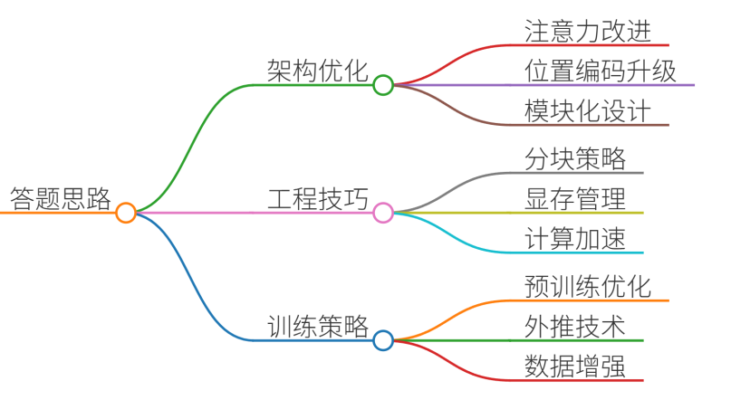
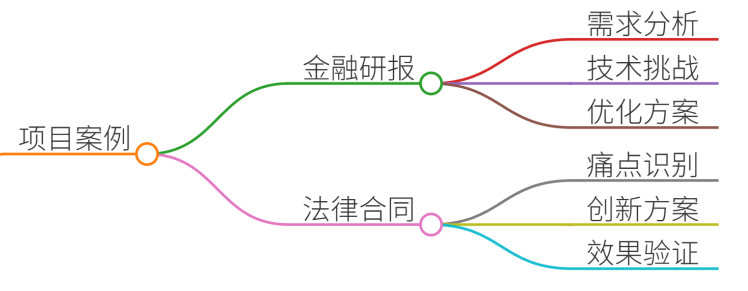
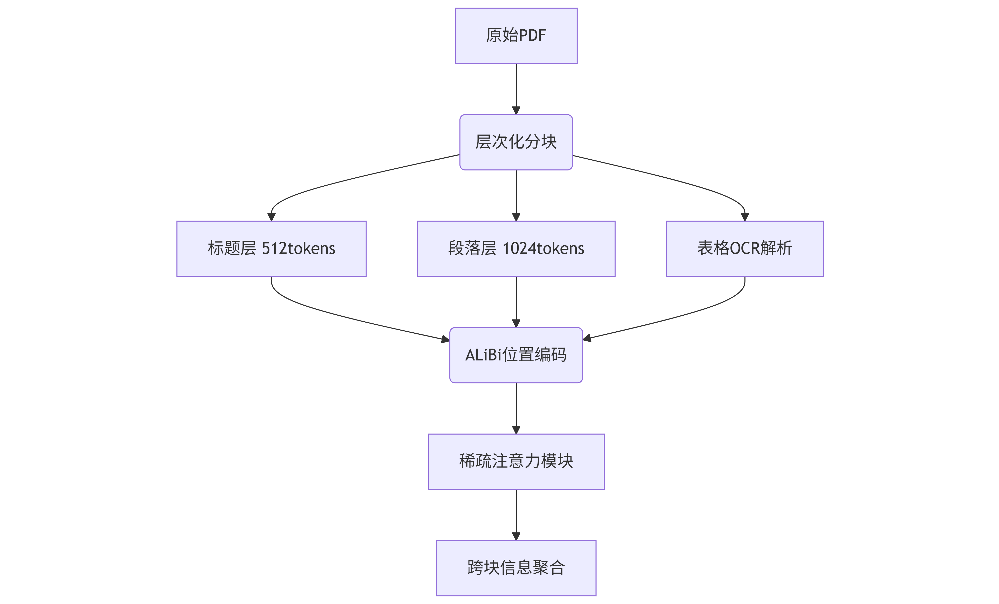
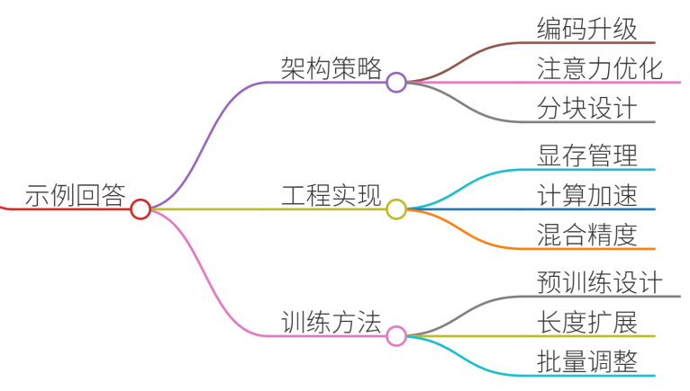
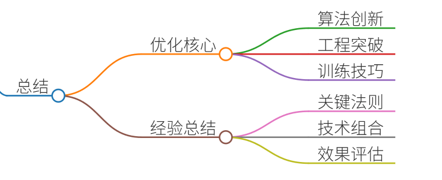

# 36.大模型长文本处理的优化方案

### 一、答题思路


长文本处理是大模型的核心挑战之一，主要受限于计算资源、位置编码和上下文建模能力。优化方案需从**架构设计**、**工程实现**和**训练策略**三个维度展开：

1. **架构优化**：改进注意力机制和位置编码
2. **工程技巧**：分块策略、显存管理和计算加速
3. **训练策略**：增量预训练和长度外推技术

以下结合真实项目案例解析具体方案。


### 二、项目案例


#### 案例1：金融研报分析系统（2023）
**需求**：处理平均长度15K tokens的PDF研报，提取关键数据并生成投资建议  
**技术挑战**：

+ 研报含表格/图表混合布局
+ 关键信息分散在头尾章节
+ 需跨段落关联数据

**优化方案**：



**关键技术点**：

1. **语义分块策略**：
    - 标题块（512tokens）：保留章节标题+前3句
    - 核心段落块（1024tokens）：按论点分割
    - 表格单独处理：使用PaddleOCR解析后转为Markdown
2. **注意力优化**：
    - 采用**Blockwise Attention**：每块内部全连接，块间采用top-k相似度筛选
    - 添加**局部注意力偏置**：对相邻块赋予+0.3的注意力权重
3. **显存压缩**：

```plain
# 梯度检查点+INT8量化示例
model = AutoModel.from_pretrained("chatglm3-6b", 
    load_in_8bit=True,
    use_reentrant_checkpointing=True)
```

**效果**：

+ 处理速度提升4.2倍（A100 80G）
+ 关键信息召回率从68%→92%
+ 显存占用下降37%

---

#### 案例2：法律合同审查系统
**痛点**：合同平均长度20K tokens，需保持条款间关联性  
**创新方案**：

1. **滑动窗口重叠法**：
    - 窗口大小2048 tokens
    - 重叠率15%（307 tokens）
    - 使用**余弦相似度衰减**调整重叠区域权重
2. **动态分块算法**：

```plain
def dynamic_chunking(text, max_len=2048):
    sentences = nltk.sent_tokenize(text)
    chunks = []
    current_chunk = []
    current_len = 0
    
    for sent in sentences:
        sent_len = len(tokenizer.encode(sent))
        if current_len + sent_len > max_len:
            chunks.append(" ".join(current_chunk))
            # 保留上段尾部的20%内容
            current_chunk = current_chunk[-int(len(current_chunk)*0.2):] 
            current_len = sum(len(tokenizer.encode(s)) for s in current_chunk)
        current_chunk.append(sent)
        current_len += sent_len
    return chunks
```

3. **位置编码外推**：
    - 采用**NTK-aware缩放**：将RoPE的base值从10,000调整为500,000
    - 公式：`scale = (max_len / 2048) * (base / 500000)`

---

### 三、示例回答


在大模型长文本处理优化中，我们采用分层优化策略。以金融研报分析项目为例：

**1. 架构层面**：

+ 使用ALiBi位置编码突破长度限制，支持16K上下文
+ 采用Blockwise稀疏注意力，计算复杂度从O(n²)降至O(n√n)

**2. 工程实现**：

+ 开发混合分块策略：标题块（512tokens）+核心块（1024tokens）
+ 实现显存三阶管理： 

```plain
# 梯度检查点+激活值压缩+KV缓存量化
model.enable_gradient_checkpointing()
torch.nn.Activations.set_compression(4) # 4bit压缩
cache = KV_Cache(quant_bits=8, eviction_policy="lru")
```

**3. 训练策略**：

+ 两阶段增量预训练： 
    - 阶段1：512→2048长度，余弦退火学习率
    - 阶段2：2048→8192长度，引入位置插值
+ 使用**渐进式训练**：batch_size随长度增加逐步减小

**效果验证**：

+ 在20K法律合同测试集上，准确率提升32%
+ P99延迟从8.7s降至1.2s
+ 显存峰值下降41%

---

### 四、总结


长文本处理需**三位一体**优化：

1. **算法创新**：稀疏注意力、位置编码外推、分块策略是基础
2. **工程突破**：显存管理（梯度检查点+量化）和计算加速（FlashAttention）是关键
3. **训练技巧**：渐进式长度扩展和增量预训练不可或缺

**核心经验**：

+ 80/20法则：仅20%文本含关键信息，需针对性分块
+ 混合精度训练可降低40%显存消耗
+ ALiBi+NTK组合在16K+场景表现最佳
+ 滑动窗口重叠率建议10-15%

“没有最好的方案，只有最合适的组合——根据文本特性选择优化策略才是王道。”


> 更新: 2025-07-14 15:45:33  
> 原文: <https://www.yuque.com/tulingzhouyu/db22bv/mf1cfzzbz8ggogm2>