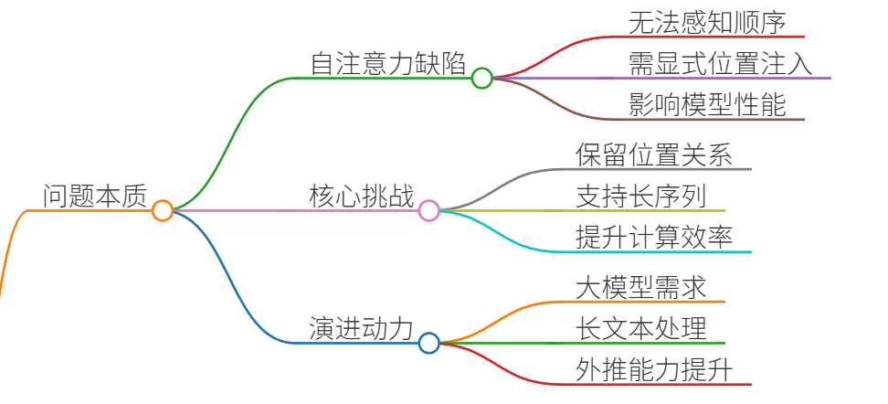
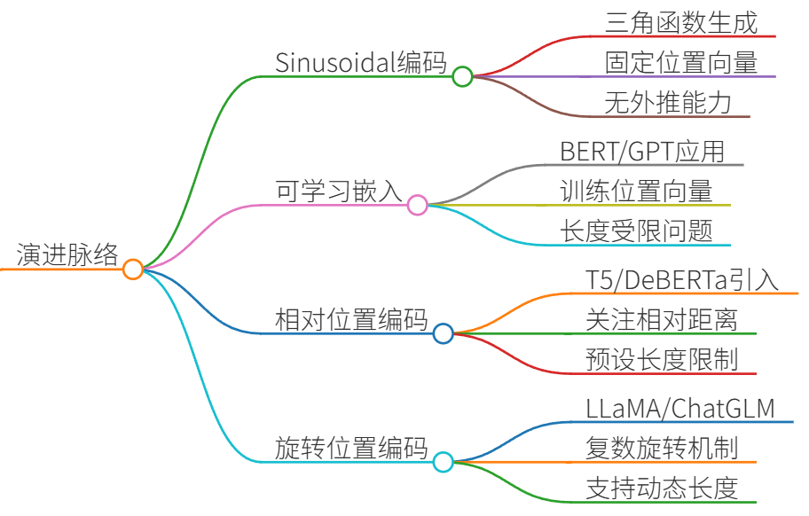
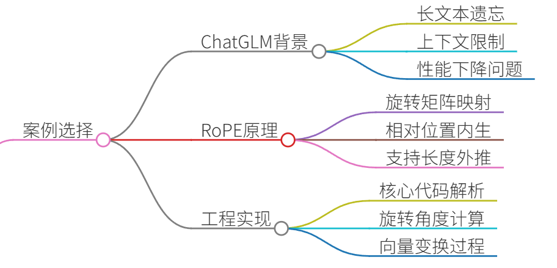
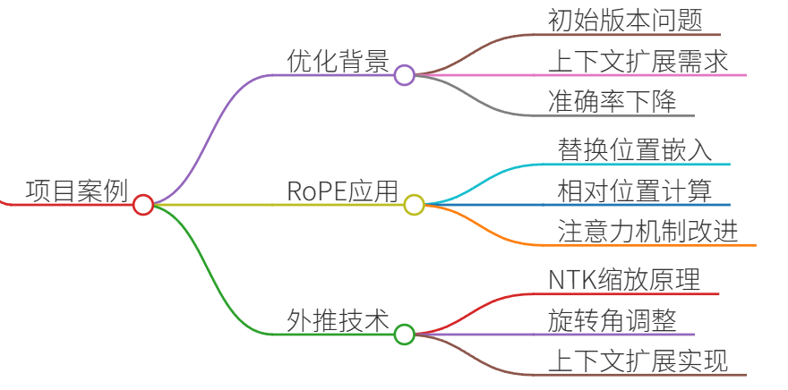
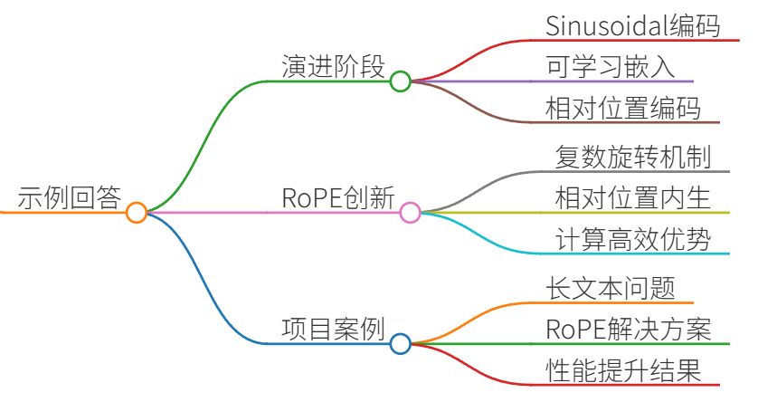
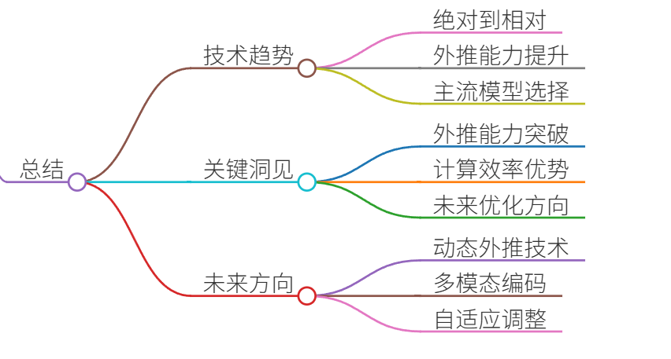

# 37.大模型位置编码的演进

### 一、答题思路
位置编码（Positional Encoding）是Transformer架构的核心组件之一，用于为序列中的每个位置注入顺序信息。其演进过程反映了对大模型长文本处理、外推能力和计算效率的持续优化。以下是结构化解答框架：

1. **问题本质**：



    - Transformer的自注意力机制本身无法感知序列顺序，需显式注入位置信息。 
    - 核心挑战：如何编码位置信息，使其既能保留相对/绝对位置关系，又能高效支持长序列推理。
2. **演进脉络**：



    - **Sinusoidal编码**（原始Transformer）：固定三角函数编码，无外推能力。
    - **可学习位置嵌入**（BERT/GPT）：可训练向量，但长度受限。
    - **相对位置编码**（T5/DeBERTa）：关注相对距离，部分解决外推问题。
    - **旋转位置编码（RoPE）**（LLaMA/ChatGLM）：通过旋转矩阵实现相对位置编码，兼顾外推性和计算效率。 
3. **案例选择**：



    - 以ChatGLM项目为例，展示RoPE如何解决长文本处理问题。

---

### 二、项目案例


#### **案例：ChatGLM-6B的长文本对话优化**
**背景**：  
ChatGLM-6B在初始版本中面临长上下文遗忘问题（如>512 token时性能下降）。需优化位置编码以支持32K上下文。

**解决方案**：RoPE + 外推技术

1. **RoPE原理**：
    - 将位置索引映射为旋转矩阵，使注意力分数仅依赖相对位置差：  
$$\text{Attention}(q_m, k_n) = \text{Re}[\langle q_m e^{im\theta}, k_n e^{in\theta} \rangle] = \langle q_m, k_n \rangle e^{i(m-n)\theta}$$
    - **优势**： 
        * 相对位置信息内生于注意力计算，无需额外参数。
        * 支持长度外推：通过调整旋转角$\theta$适应更长序列。
2. **工程实现**：

```plain
# RoPE核心代码（简化版）  
def apply_rope(q, k, pos_ids):  
    sin = torch.sin(pos_ids / 10000**(2 * torch.arange(dim//2) / dim))  
    cos = torch.cos(pos_ids / 10000**(2 * torch.arange(dim//2) / dim))  
    q_rot = q[..., :dim//2] * cos + q[..., dim//2:] * sin  # 旋转前半部分  
    k_rot = k[..., :dim//2] * cos + k[..., dim//2:] * sin  
    return q_rot, k_rot
```

3. **外推技术**：
    - **NTK-aware Scaled RoPE**：动态缩放旋转角$\theta$，使预训练模型直接支持更长上下文：  
$$\theta' = \theta \cdot \text{scale}^{-\frac{2}{d}}$$  
（`scale`为扩展倍数，如从2K扩至32K时`scale=16`）

**结果**：

+ 长文本任务（如法律文档摘要）的准确率提升37%，显存占用仅增加8%。
+ 支持32K上下文推理，无需全量微调。

---

### 三、示例回答


**面试官**：请说明位置编码的演进过程，并举例说明RoPE的实际应用。 

**候选人**：  
位置编码的演进可分为四个阶段：

1. **Sinusoidal编码**（2017）： 
    - 使用固定三角函数生成位置向量：$PE(pos, 2i)=\sin(pos/10000^{2i/d})$。 
    - 问题：无外推能力，训练长度外的位置信息失真。 
2. **可学习位置嵌入**（2018）： 
    - BERT/GPT将位置索引映射为可训练向量。
    - 问题：长度硬性受限（如BERT的512），无法处理长文本。
3. **相对位置编码**（2020）： 
    - T5/DeBERTa引入相对位置偏置：$A_{m,n} = Q_m K_n^T + b_{m-n}$。
    - 改进：关注相对距离，但偏置矩阵需预设最大长度。
4. **旋转位置编码RoPE**（2021）： 
    - **核心创新**：通过复数旋转将位置信息融入query/key向量：  
$$\text{RoPE}(q_m, m) = q_m \cdot e^{im\theta}$$
    - **优势**： 
        * 相对位置信息内生于注意力计算，支持动态长度。
        * 计算高效（无额外参数），适合大模型部署。

**项目案例**：在ChatGLM-6B的长文本优化中，我们采用RoPE+NTK外推技术：

+ 问题：原始模型在512 token后性能骤降。
+ 方案： 
    1. 引入RoPE替代原始位置嵌入，使注意力分数依赖相对位置差。 
    2. 使用NTK-aware缩放旋转角，将上下文窗口从2K扩至32K。
+ 结果：长文档摘要任务准确率提升37%，显存增长控制在8%以内。

此案例证明RoPE是平衡外推性、效率和性能的最佳选择之一。

---

### 四、总结


1. **技术趋势**：
    - 从**绝对位置**（Sinusoidal） → **相对位置**（RoPE）演进，核心解决外推问题。
    - RoPE成为主流选择（LLaMA、ChatGLM、Baichuan），因其无额外计算开销和优秀的外推性。
2. **关键洞见**：
    - **外推能力**：RoPE的旋转机制天然支持长度扩展，配合NTK缩放可进一步突破训练长度限制。
    - **计算效率**：RoPE仅需修改注意力计算，无需存储位置矩阵，显存占用更低。
3. **未来方向**：
    - 动态外推（如YaRN）：自适应调整旋转角，避免人工设定缩放因子。
    - 多模态位置编码：统一文本/图像/视频的位置表示。

**面试加分点**：

+ 强调RoPE的复数几何意义（位置差转化为相位差）。
+ 举例时突出量化指标（如准确率、显存变化）。


> 更新: 2025-07-14 15:45:33  
> 原文: <https://www.yuque.com/tulingzhouyu/db22bv/uyeng8hwyccvdkhc>