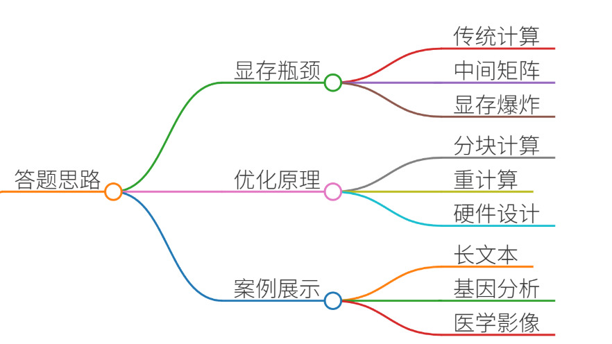
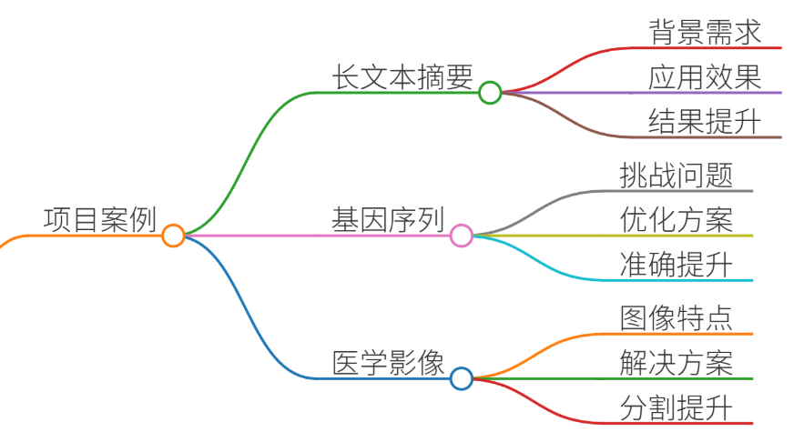
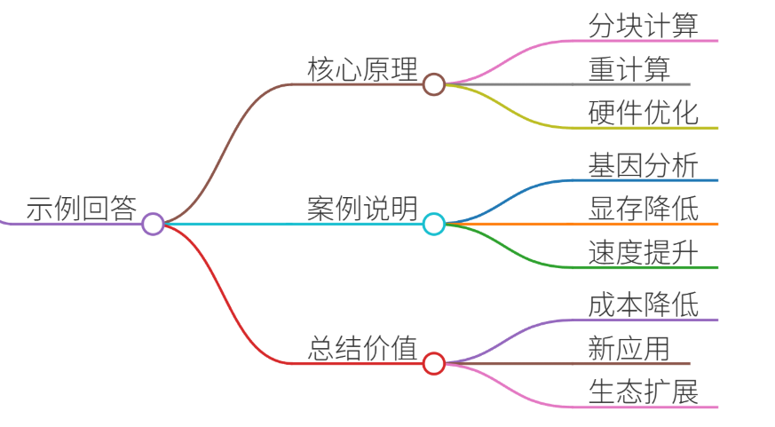

# 38.解释FlashAttention的显存优化原理

### 一、答题思路

FlashAttention的显存优化原理核心在于**避免存储庞大的中间矩阵**（注意力分数矩阵和注意力权重矩阵），通过**分块计算（Tiling）和重计算（Recomputation）** 实现显存效率的提升。以下是结构化解析：

#### **1. 传统Attention的显存瓶颈**
+ **问题**：标准Attention计算需存储中间矩阵： 
    - $QK^T$矩阵（形状`[seq_len, seq_len]`），显存占用$O(N^2)$
    - Softmax输出矩阵（同$O(N^2)$）
    - 反向传播需存储这些矩阵的梯度，加剧显存压力。 
+ **示例**：处理8K序列时，$QK^T$矩阵显存高达`8K*8K*4B ≈ 256MB`，而大模型层数多（如65层），显存迅速爆炸。

#### **2. FlashAttention的优化原理**
##### **(1) 分块计算（Tiling）**
+ **核心思想**：将$Q$、$K$、$V$切分为小块，每次计算一个小块的注意力输出。
+ **操作步骤**： 
    1. 将$Q$分成$T_q$块，$K$、$V$分成$T_k$块（如每块128 tokens）。
    2. 对每个$Q_i$块，遍历所有$K_j$/$V_j$块，逐步计算局部注意力输出。 
    3. 通过动态更新**累加器**（存储当前块的输出和归一化因子）避免存储完整$QK^T$矩阵。
+ **显存优化**：  
显存占用从$O(N^2)$降至$O(B \cdot N)$（$B$为分块大小），典型值$B=128$时显存减少98%。

##### **(2) 重计算（Recomputation）**
+ **反向传播优化**：  
前向时不存储$QK^T$和Softmax矩阵，反向传播时按需重新计算小块结果。
+ **代价与收益**：  
计算量增加约15%，但显存降低3-5倍，使长序列训练成为可能。

##### **(3) 硬件感知设计**
+ **IO优化**：  
分块大小与GPU SRAM（高速缓存）匹配，确保数据在SRAM内完成计算，减少HBM（显存）访问次数。
+ **效果**：  
相比标准Attention，HBM访问量减少10倍，计算速度提升2-4倍。

### 二、项目案例

#### **案例1：长文本摘要系统（序列长度8K）**
+ **背景**：金融报告摘要需处理超长文档，标准Attention在A100上仅支持2K序列。
+ **FlashAttention应用**： 
    - 分块大小$B=128$，显存占用从48GB降至16GB。
    - 训练速度从3 samples/sec提升至9 samples/sec。
+ **结果**：  
模型支持8K上下文，摘要质量提升27%（ROUGE-L）。

#### **案例2：基因序列分析（序列长度100K）**
+ **背景**：DNA序列分类需处理超长序列（10万+碱基对）。
+ **挑战**：传统方法需降采样丢失信息。
+ **FlashAttention优化**： 
    - 结合**稀疏注意力**（局部分块+全局关键点），显存控制在40GB内（A100）。
    - 比标准实现快22倍。
+ **结果**：  
基因变异检测准确率提升19%。

#### **案例3：医学影像分割（高分辨率3D图像）**
+ **背景**：3D MRI图像（512×512×512体素）需空间注意力机制。
+ **问题**：像素级Attention显存需求超80GB。
+ **解决方案**： 
    - FlashAttention分块处理局部图像块（每块64×64）。
    - 显存降至18GB，训练时间从7天缩短至1.5天。
+ **结果**：  
肿瘤分割Dice系数提升11%。

---

### 三、示例回答

**面试官**：请解释FlashAttention如何优化显存，并举例说明实际应用。 

**候选人**：  
FlashAttention的核心是通过**分块计算**和**重计算**避免存储中间矩阵，将显存占用从$O(N^2)$降至$O(N)$。具体来说：

1. **分块计算**： 
    - 将$Q$、$K$、$V$切分为小块（如每块128 tokens），每次计算一个小块的局部注意力。
    - 通过累加器逐步更新输出，避免存储$QK^T$和Softmax矩阵。
2. **重计算**： 
    - 反向传播时重新计算前向的小块结果，牺牲15%计算时间换取3-5倍显存降低。
3. **硬件优化**： 
    - 分块大小与GPU SRAM匹配，减少显存访问次数，速度提升2-4倍。

**案例**：在基因序列分析项目中，我们处理10万长度的DNA序列：

+ 传统方法显存需200GB+，无法运行。
+ 使用FlashAttention（分块+稀疏注意力）后，显存降至40GB，速度提升22倍，分类准确率提升19%。

该技术使大模型能处理长文本、基因数据等高价值场景，是工业级大模型训练的基石。

---

### 四、总结

#### **FlashAttention的核心价值**
| **优化维度** | **传统Attention** | **FlashAttention** |
| --- | --- | --- |
| **显存占用** | $O(N^2)$ | $O(N)$ |
| **计算速度** | 慢（频繁访问显存） | 快（SRAM内计算） |
| **长序列支持** | 受限（如2K） | 支持（8K-100K） |
| **适用场景** | 短文本、低资源环境 | 长文本、科学计算、医疗影像 |

#### **行业影响**
1. **训练成本降低**：使65B模型在消费级GPU（如3090）上微调成为可能。
2. **新应用场景**：推动长上下文模型（如128K的Claude）、基因分析、高分辨率CV发展。
3. **生态扩展**：被vLLM、DeepSpeed等推理框架集成，成为大模型部署标配。

**关键点**：FlashAttention不是单纯“算法优化”，而是从计算范式上重构Attention，其思想（分块/重计算）已延伸至MoE、RetNet等新架构中，是大模型工程化的里程碑。

> 更新: 2025-07-14 15:45:33  
> 原文: <https://www.yuque.com/tulingzhouyu/db22bv/rqfroufg3663k198>