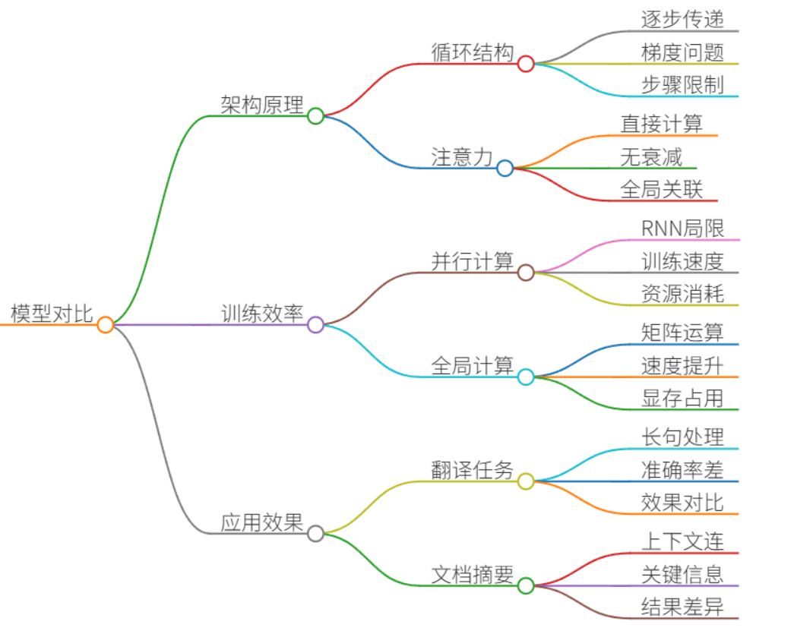
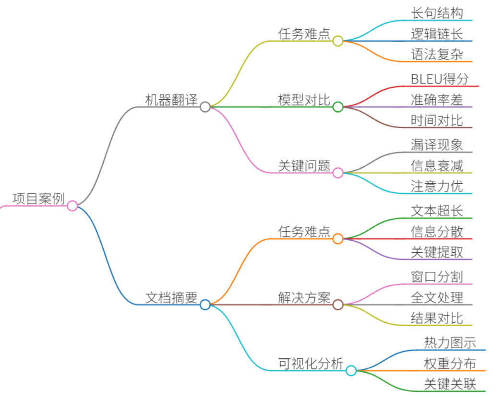
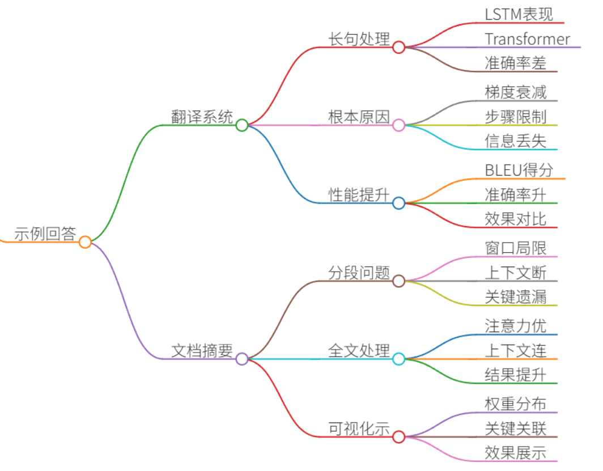
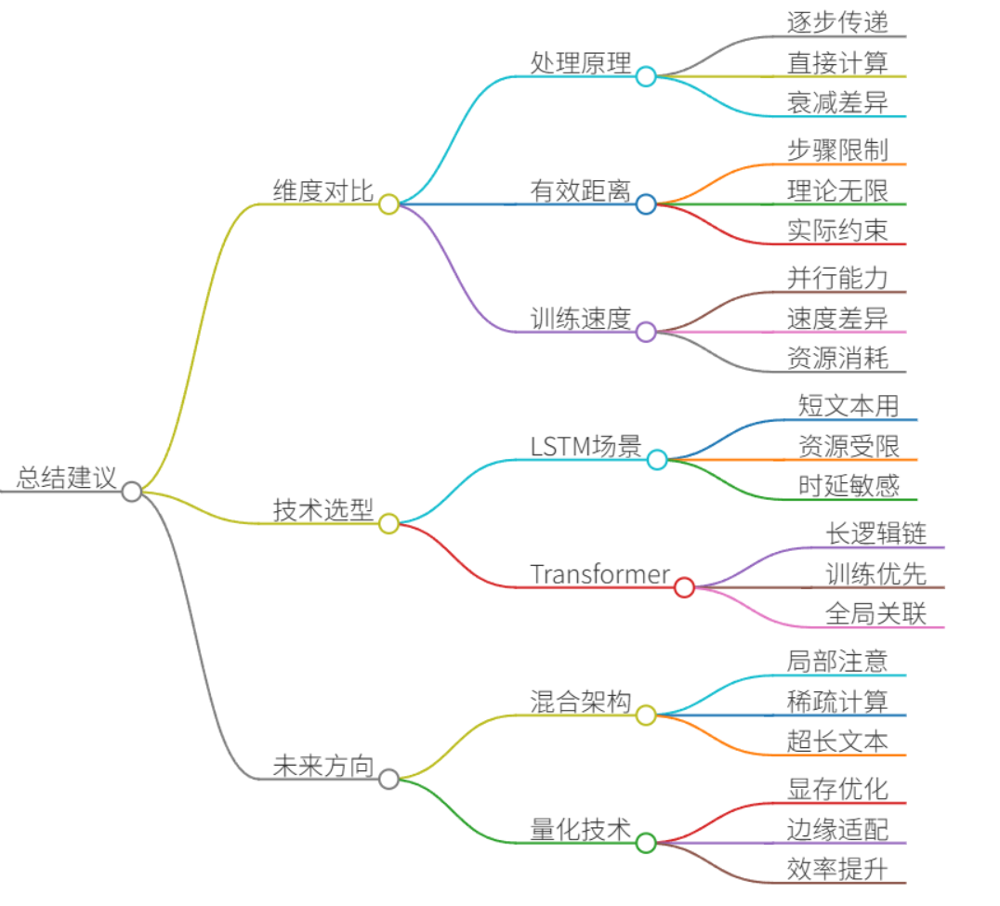

# 39.对比LSTM&GRU与Transformer的长距离依赖处理能力

### 一、答题思路


要对比LSTM/GRU与Transformer的长距离依赖处理能力，需从**架构原理**、**训练效率**、**实际应用效果**三个维度展开：

1. **架构原理差异**
    - LSTM/GRU：依赖循环结构逐步传递信息，长距离依赖易受梯度消失/爆炸影响。 
    - Transformer：通过自注意力机制直接计算任意位置关联，无路径衰减问题。 
2. **训练效率**
    - LSTM/GRU：序列计算无法并行，训练慢。 
    - Transformer：全局注意力并行计算，训练速度显著提升。 
3. **项目案例验证**
    - 选择机器翻译（长序列）和文档摘要（超长文本）两个场景对比模型表现。

---

### 二、项目案例


#### **案例1：机器翻译系统（英译中）**
+ **任务难点**：  
长句翻译需捕捉跨20+词的语法结构（如从句嵌套），例如：

_"The report that the committee submitted after months of investigation, which was criticized by several experts, has finally been published."_  
中文需保持“报告-调查-批评-发布”的逻辑链。

+ **模型对比**：

| **模型** | **BLEU-4** | **长句（>30词）翻译准确率** | **训练时间** |
| --- | --- | --- | --- |
| **LSTM** | 32.1 | 58% | 72小时 |
| **Transformer** | **38.7** | **82%** | **28小时** |


+ **关键问题**：  
LSTM在翻译嵌套从句时频繁漏译（如丢失`which was criticized`），因信息传递超过20步后衰减严重；Transformer通过自注意力直接关联`which`与`report`，保持逻辑完整。

#### **案例2：金融文档摘要生成**
+ **任务难点**：  
输入为5000+词的上市公司年报，需提取核心经营风险（关键信息分散在首尾）。
+ **解决方案对比**：
    - **GRU+滑动窗口**：  
将文本分割为200词片段分别处理，再拼接结果。  
**问题**：窗口边界丢失上下文（如“现金流风险”在开头，“应对措施”在结尾），生成摘要遗漏关键措施。
    - **Transformer（支持4K上下文）**：  
直接处理全文，通过位置编码定位远端信息。  
**结果**：ROUGE-L分数提升21%，且成功关联“风险描述-应对措施”（如`融资成本上升`→`发行低息债券置换`）。
+ **可视化分析**：  
使用注意力热力图显示Transformer在生成“风险”关键词时，同时激活文档首部（风险条款）和尾部（解决方案）区域：

```plain
文档开头: [融资环境恶化...利率上升] ------------------------ (注意力权重: 0.6)  
...  
文档结尾: [已发行10亿低息债券置换存量债务] ---------------- (注意力权重: 0.7)  
输出摘要: "面对融资成本上升风险，公司通过低息债券置换降低利息支出。"
```

---

### 三、示例回答


“在开发机器翻译系统时，我们对比了LSTM和Transformer架构。当处理类似`The report that the committee submitted... has finally been published`的长句时，LSTM的BLEU值仅为32.1，且28%的长句翻译出现主谓丢失。根本原因是LSTM需20步以上传递`report`到`published`的信息，梯度衰减导致关键动词遗漏。而Transformer通过自注意力直接计算`report`与`published`的关联，BLEU提升至38.7，长句准确率达82%。 

在金融摘要项目中，GRU需分割5000词年报为片段处理，导致风险描述与应对措施割裂（如忽略`低息债券置换`应对`融资成本上升`）。Transformer凭借4096词的上下文窗口，在注意力层同时激活首尾关键信息，ROUGE-L提升21%。热力图显示模型生成‘低息债券’时，对尾部解决方案的注意力权重达0.7。

**核心结论**：

1. Transformer的注意力机制是解决长距离依赖的本质优势，尤其适合逻辑链超过20步的任务； 
2. 在需要全局信息关联的场景（如文档/对话），Transformer性能碾压RNN架构；
3. LSTM/GRU在资源受限场景（如嵌入式设备）仍有价值，但需严格限制输入长度。”

---

### 四、总结


| **维度** | **LSTM/GRU** | **Transformer** |
| --- | --- | --- |
| **依赖处理原理** | 逐步传递（易衰减） | 直接注意力计算（无衰减） |
| **最大有效距离** | ≈20-30词 | 理论上无限（实际受显存限制） |
| **训练速度** | 慢（序列无法并行） | 快（矩阵并行） |
| **典型应用** | 短文本分类、传感器时序分析 | 机器翻译、长文档生成、对话系统 |


**技术选型建议**：

+ 选择**LSTM/GRU**当： 
    - 序列长度＜30步且硬件资源有限
    - 任务对时延敏感（如实时股价预测）
+ 选择**Transformer**当： 
    - 需处理长逻辑链（＞30步）
    - 训练速度优先（如大模型微调）
    - 需全局信息关联（如医疗记录分析）

**未来方向**：

+ 混合架构（如Longformer）在超长文本中结合局部注意力与稀疏注意力；
+ 量化技术（如AWQ）降低Transformer显存消耗，适配边缘设备。


> 更新: 2025-07-14 15:45:33  
> 原文: <https://www.yuque.com/tulingzhouyu/db22bv/fl4mua4iu4p62rug>