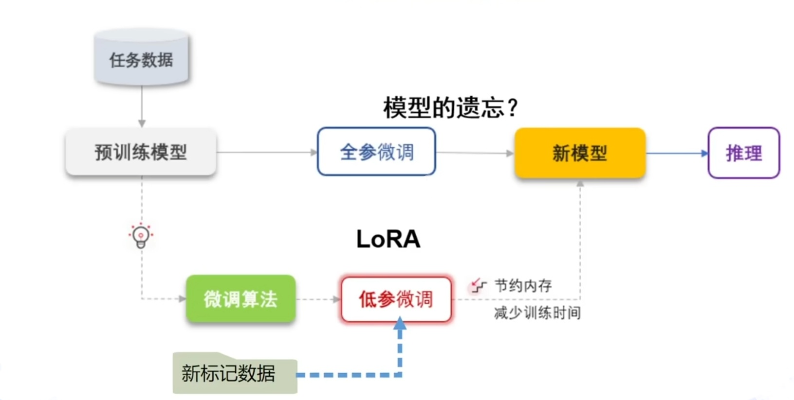
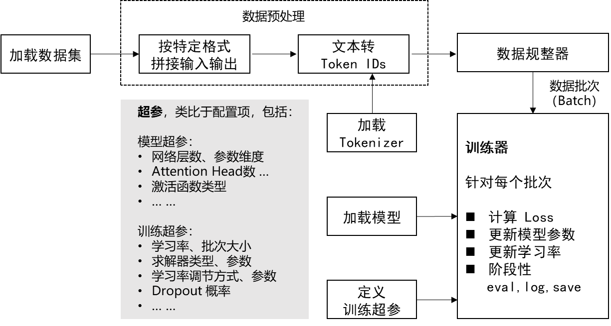

# 4.大模型微调流程是怎样的?

### 答题思路
首先，大模型微调（Fine-tuning）应该是指在预训练好的模型基础上，针对特定任务或领域的数据进行进一步训练，使模型适应新的任务。那流程大致包括几个步骤呢？

1. 确定任务和目标：首先需要明确微调的任务是什么，比如文本分类、问答系统等，以及希望模型达到什么样的效果。
2. 准备数据：收集和整理与任务相关的数据集，可能需要标注数据，然后划分训练集、验证集和测试集。
3. 数据预处理：将数据转换成模型可以接受的格式，比如tokenization、添加特殊标记（如[CLS]、[SEP]）等。
4. 选择预训练模型：根据任务选择合适的预训练模型，如BERT、GPT、T5等。
5. 调整模型结构：可能需要在预训练模型的基础上添加一些任务特定的层，比如分类任务加一个全连接层。
6. 设置训练参数：确定学习率、批次大小、训练轮数（epochs）、优化器（如AdamW）、权重衰减、学习率调度等超参数。
7. 训练过程：在训练数据上进行微调，同时监控验证集的损失和指标，防止过拟合。
8. 评估与验证：使用测试集评估模型性能，分析结果，可能需要调整超参数或数据。
9. 部署与应用：将微调后的模型部署到生产环境，持续监控性能，可能需要迭代优化。

大致梳理主线流程图如下：

不过过程中还有一些细节问题，比如数据预处理可能需要更详细的步骤，比如处理不平衡数据、数据增强等。另外，可能还需要考虑计算资源，比如使用GPU还是TPU，分布式训练等。

另外，微调的方法也有多种，比如全参数微调（full fine-tuning）和参数高效微调方法（如LoRA、Adapter、Prefix-tuning），这些可能在调整模型结构或训练参数时需要提到。

还有可能需要注意是否要冻结部分层，只训练特定层，这样可以减少计算量，但可能影响效果。这时候需要在调整模型结构时决定哪些层需要冻结。

此外，训练过程中可能需要早停（early stopping），根据验证集的表现来提前终止训练，避免过拟合。还有梯度裁剪（gradient clipping）来防止梯度爆炸。

在评估阶段，除了准确率、F1值等指标，可能还要考虑模型在不同子集上的表现，比如不同类别的数据，或者进行错误分析，找出模型在哪些情况下表现不佳。

部署阶段可能需要将模型转换为适合生产环境的格式，比如ONNX，或者使用特定的框架如TensorFlow Serving、TorchServe等。此外，还需要考虑模型的版本控制和监控日志等。

可能还需要提到持续学习或在线学习，但通常在微调中可能是一次性的，除非有持续的数据更新。

那在面试中，应该如何结构清晰地回答这个问题呢？应该按照步骤顺序，简明扼要地说明每个阶段的关键点，同时可以加入一些细节来展示自己的深度。

比如，当提到数据准备时，可以强调数据质量和多样性对微调效果的重要性；在模型选择时，说明不同模型架构的适用场景；在训练参数设置时，提到学习率通常较小，因为预训练模型已经在大规模数据上训练过，参数只需要微调；或者使用分层学习率，不同层的参数更新速度不同。

另外，可能还要提到一些常见的问题和解决方案，比如过拟合时可以通过增加正则化（如dropout）、数据增强、减少模型复杂度等；或者训练过程中的硬件限制，比如批次大小的调整、梯度累积等技巧。

现在，总结一下可能的回答框架：

1. 明确任务与数据准备
2. 数据预处理与划分
3. 选择并加载预训练模型
4. 调整模型结构以适应任务
5. 设置超参数与优化策略
6. 训练与验证监控
7. 模型评估与迭代优化
8. 部署与维护

在每一步中，需要具体说明做什么，为什么这样做，以及注意事项。例如，在数据预处理中，要确保输入格式符合模型要求，处理缺失值或噪声数据；在模型结构调整中，添加任务层或冻结部分层等。

可能还需要提到不同的微调方法，例如全参数微调与参数高效微调的区别，以及适用场景，比如当计算资源有限时使用LoRA等方法。

最后，可以结合实际案例，比如在文本分类任务中微调BERT模型的流程，这样可以让回答更具体，展示实际经验。

现在检查是否有遗漏的步骤，比如模型保存与版本管理，或者在部署后的模型监控和更新策略。此外，可能还需要考虑评估指标的选择，根据任务的不同选择合适的评估方法。

另外，在数据预处理阶段，可能需要数据增强，比如回译、随机删除、替换等，尤其是当训练数据不足时。或者使用领域自适应的方法，如果目标领域的数据分布与预训练数据不同。

在训练过程中，分布式训练和混合精度训练（如使用FP16）也是常见的加速训练的手段，可以在设置训练参数时提到。

还有，微调后的模型可能需要量化或剪枝以优化推理速度，特别是在资源受限的环境中，这可能在部署阶段需要考虑。

总之，回答时需要覆盖整个流程的关键步骤，同时根据时间限制选择是否深入某些技术细节，以展示自己的专业性和实践经验。

在面试中回答大模型微调流程时，建议采用结构化的方式，突出关键步骤和技术细节。以下是一个清晰且专业的回答框架：

### **大模型微调流程**
大模型微调（Fine-tuning）是在预训练模型的基础上，通过特定领域或任务的数据进行针对性训练，以提升模型在目标场景中的性能。其核心流程如下：

1. **任务定义与数据准备**  
    - **明确任务目标**：确定微调任务类型（如文本分类、实体识别、生成任务等），明确评估指标（如准确率、F1值、BLEU等）。  
    - **数据收集与标注**：收集与任务相关的数据，确保数据质量和多样性；对非监督任务可能需要标注（如分类标签、实体标签）。  
    - **数据划分**：将数据分为训练集、验证集和测试集（常用比例如80%-10%-10%），验证集用于调参，测试集用于最终评估。
2. **数据预处理与增强**  
    - **格式转换**：将数据转换为模型输入格式（如BERT的`[CLS]`+文本+`[SEP]`）。  
    - **分词（Tokenization）**：使用预训练模型的对应分词器（如BERT的WordPiece）。  
    - **数据增强**：在数据量不足时，采用回译、随机遮盖、同义词替换等方法扩充数据，提升泛化性。
3. **模型选择与结构调整**  
    - **选择预训练模型**：根据任务选择合适的基础模型（如BERT用于理解任务，GPT-3用于生成任务）。  
    - **调整模型结构**：  
        * **全参数微调**：直接更新所有参数，适用于数据充足且任务差异较大的场景。  
        * **参数高效微调**：如LoRA（低秩适应）、Adapter（插入适配层），仅训练少量参数，节省计算资源。  
        * **添加任务层**：例如在分类任务中，添加全连接层输出类别概率。
4. **训练超参数与优化策略**  
    - **学习率设置**：通常使用较小的学习率（如1e-5到5e-5），避免破坏预训练特征。  
    - **优化器选择**：常用AdamW，配合权重衰减（Weight Decay）防止过拟合。  
    - **训练技巧**：  
        * **分层学习率**：不同层设置不同学习率（底层参数更新更慢）。  
        * **梯度裁剪**：防止梯度爆炸。  
        * **早停（Early Stopping）**：根据验证集表现终止训练。  
        * **混合精度训练**：使用FP16加速训练，节省显存。
5. **训练与验证监控**  
    - **训练过程**：在训练集上迭代更新参数，同时监控训练损失和验证集指标。  
    - **防止过拟合**：通过Dropout、数据增强、正则化（L2）等手段提升泛化能力。

6. **模型评估与迭代优化**  
    - **测试集评估**：使用保留的测试集计算最终指标，确保模型未过拟合验证集。  
    - **错误分析**：分析模型在特定样本上的错误，针对性优化数据或模型结构。  
    - **超参数调优**：通过网格搜索或工具（如Optuna）优化学习率、批次大小等。
7. **模型部署与持续迭代**  
    - **模型导出**：将模型转换为生产格式（如ONNX、TensorRT）以提升推理效率。  
    - **监控与更新**：部署后监控线上表现，定期用新数据重新微调（持续学习）。  
    - **轻量化处理**：通过量化（Quantization）、剪枝（Pruning）压缩模型，适应边缘设备。

---

### **技术细节补充（可选）**
+ **参数高效微调**：可提及LoRA（冻结原模型，添加低秩矩阵）、Prefix-Tuning（在输入前添加可训练前缀）等方法。  
+ **领域自适应**：若目标领域数据分布与预训练数据差异大，可采用领域预训练（Domain-Adaptive Pretraining）后再微调。  
+ **多任务学习**：同时微调多个相关任务，共享底层参数，提升泛化性。

---

### **示例回答**
“大模型微调的流程通常从明确任务目标开始，例如分类或生成任务，接着收集和预处理相关数据。数据需要被分词并转换为模型输入格式，如添加特殊标记。之后，选择合适的预训练模型（如BERT或GPT），并根据任务调整结构，比如添加分类层。训练时采用较小的学习率和优化策略（如AdamW），同时监控验证集指标以防止过拟合。最后，通过测试集评估模型，并部署到生产环境，持续迭代优化。”

---

通过结构化表达和关键技术点（如参数高效微调、分层学习率）的提及，可以展示对微调流程的深入理解，同时结合实际场景（如数据不足时的增强方法）体现实践经验。

> 更新: 2025-07-14 15:45:38  
> 原文: <https://www.yuque.com/tulingzhouyu/db22bv/kyeirtcgm48qz8qn>