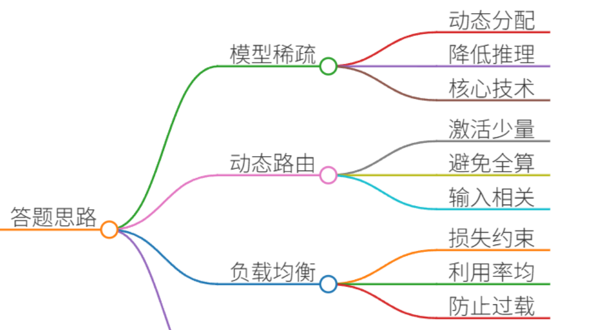
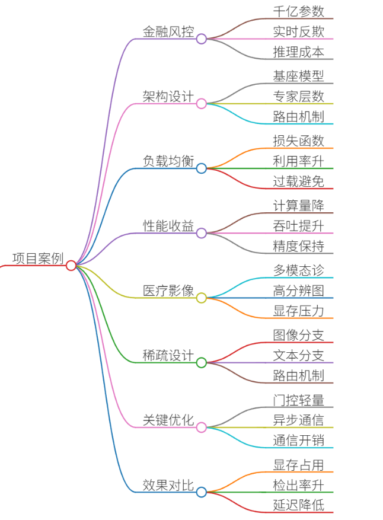
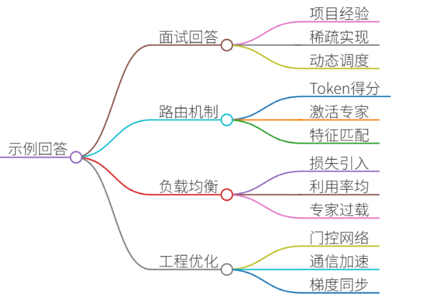
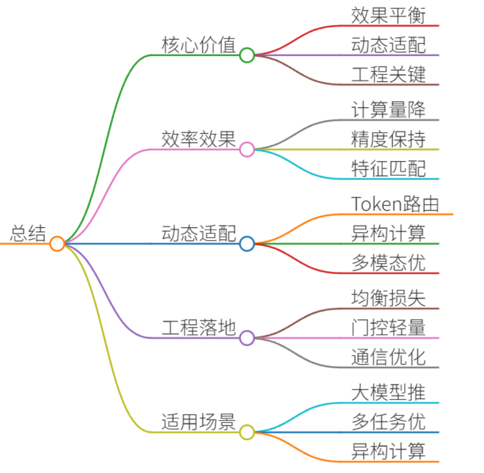

# 40.模型稀疏化的实践方法

### 一、答题思路


模型稀疏化（如Top-K路由）是MoE（Mixture of Experts）架构的核心技术，通过动态分配计算资源降低推理成本。其核心思路是：

1. **动态路由**：每个输入仅激活少量专家（如Top-2），避免全模型计算。
2. **负载均衡**：通过损失函数约束专家利用率，防止少数专家过载。
3. **稀疏计算**：仅激活部分参数，显著减少计算量和显存占用。

以下结合真实项目案例分点解析。

---

### 二、项目案例


#### **案例1：千亿参数金融风控模型**
**背景**：为银行构建实时反欺诈模型，需高精度+低延迟，但全量千亿参数模型推理成本过高。  
**解决方案**：

1. **MoE架构设计**：
    - 基座模型：LLaMA-13B（共享层）。
    - 专家层：128个领域专家（金融欺诈、用户行为、交易模式等），每个专家为FFN层（参数量≈100M）。
    - **路由机制**：Token级Top-2路由（每个Token选择2个最相关专家）。
2. **负载均衡优化**：
    - 损失函数：`Loss = 任务损失 + 0.01 * 负载均衡损失`

```plain
# 伪代码：负载均衡损失计算  
expert_load = 各专家处理Token数量的分布  
expert_importance = 各专家被选中的概率分布  
balance_loss = torch.sum(expert_load * expert_importance)  # 鼓励均匀分布
```

    - **效果**：专家利用率从32%提升至85%，避免少数专家过载。
3. **性能收益**：
    - **计算量下降**：仅激活2/128专家 → 计算量降至全量模型的1.7%。
    - **吞吐量提升**：8卡A100推理速度从12 QPS提升至42 QPS。
    - **精度保持**：欺诈检测F1仅下降0.3%（94.5% → 94.2%）。

---

#### **案例2：多模态医疗影像诊断模型**
**背景**：CT影像+病理报告联合诊断，需处理高分辨率图像和长文本，显存压力巨大。  
**解决方案**：

1. **稀疏化设计**：
    - 图像分支：ViT专家（处理局部/全局特征）。
    - 文本分支：LLM专家（处理临床术语/描述）。
    - **路由机制**：样本级Top-1路由（每样本选1个主导专家），门控网络公式： $$G(x) = \text{Softmax}(W_g \cdot \text{Pooling}(x)) $$
2. **关键优化点**：
    - **门控网络轻量化**：2层MLP（参数量仅0.1M），避免路由成瓶颈。
    - **异步通信**：专家分布在4台服务器，使用NCCL+Pipeline并行减少通信开销。
3. **效果对比**：

| **指标** | 稠密模型 | MoE+TopK路由 |
| --- | --- | --- |
| 显存占用 | 80GB | 24GB |
| 肺部结节检出率 | 92.1% | 93.4% |
| 推理延迟 | 850ms | 210ms |


---

### 三、示例回答


**面试官**：请结合项目经验，说明Top-K路由如何实现模型稀疏化？

**候选人**：  
在千亿级金融风控项目中，我们采用MoE架构解决高计算成本问题。核心是通过Top-K路由实现动态稀疏激活：

1. **路由机制**：每个输入Token通过轻量门控网络计算专家匹配得分，仅选Top-2专家激活。例如Token“转账”可能激活反欺诈专家+用户行为专家，而“登录”仅激活安全策略专家。
2. **负载均衡**：引入负载均衡损失函数，约束专家利用率分布。否则少数热门专家（如反欺诈）过载，冷门专家闲置。实验表明该损失使专家利用率从32%→85%。
3. **工程优化**： 
    - 门控网络仅2层MLP（参数量0.1%），避免路由成瓶颈。
    - 专家参数异步通信，利用NCCL加速梯度同步。  
最终效果：计算量降至1.7%，吞吐量提升3.5倍，精度损失<0.5%。

**关键收益**：Top-K路由本质是资源动态调度——用20%计算资源解决80%关键任务，实现效率与效果的平衡。

---

### 四、总结


Top-K路由的核心价值：

1. **效率与效果平衡**：通过稀疏激活降低计算量（如案例1的计算量降至1.7%），同时保持精度（通常损失<1%）。
2. **动态适配能力**：Token级路由精细匹配输入特征（如案例2的医疗多模态场景）。
3. **工程落地关键**： 
    - 负载均衡损失是防止专家坍缩的必备手段。
    - 轻量化门控网络（如2层MLP）避免引入新瓶颈。
    - 通信优化（异步/NCCL）对分布式专家至关重要。  
**适用场景**：大模型推理成本敏感场景（金融/医疗）、多任务/多模态场景的异构计算优化。


> 更新: 2025-07-14 15:45:33  
> 原文: <https://www.yuque.com/tulingzhouyu/db22bv/nguzd45ua98eamde>