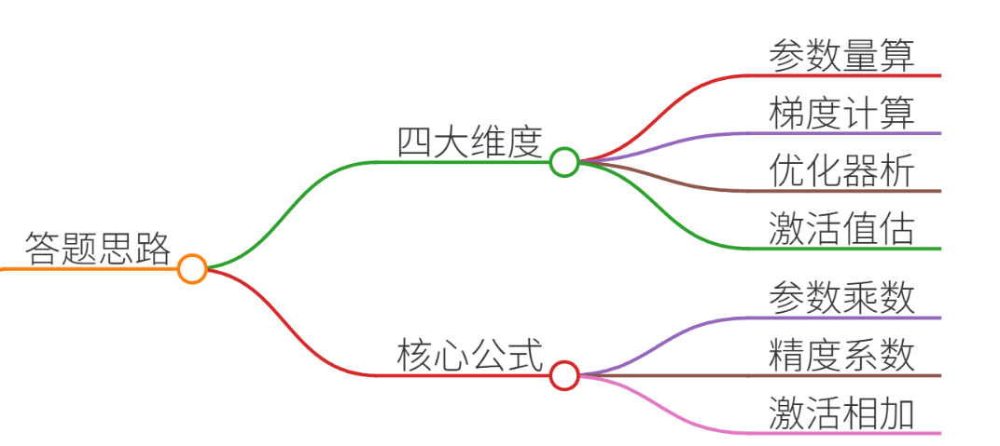
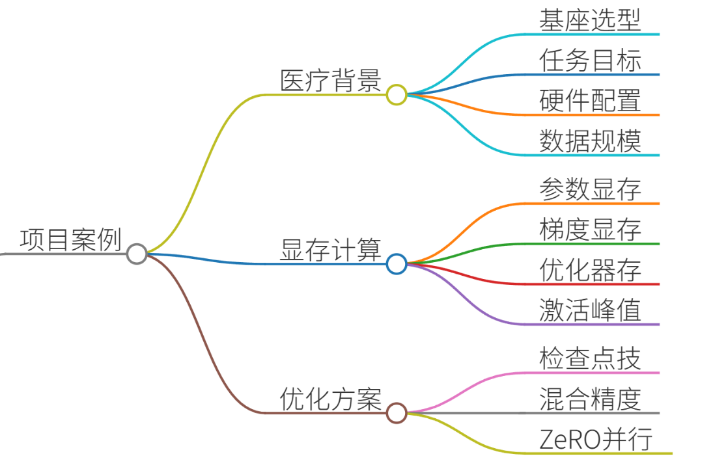
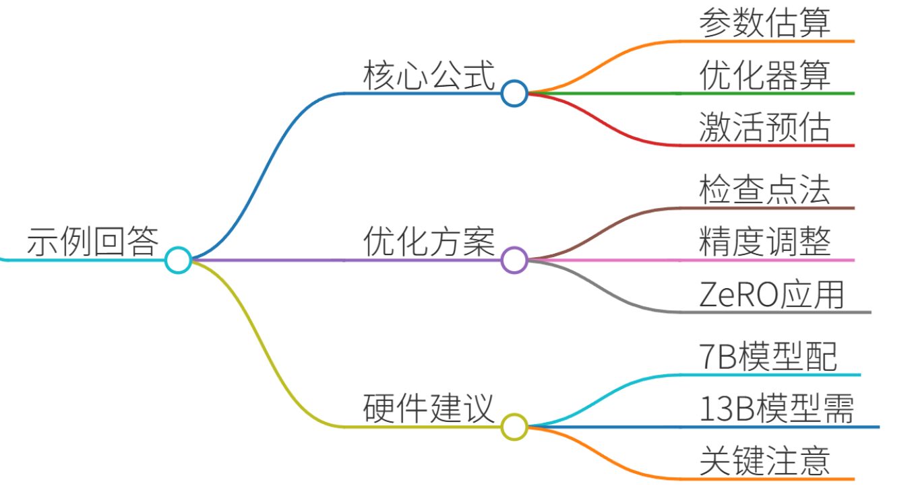
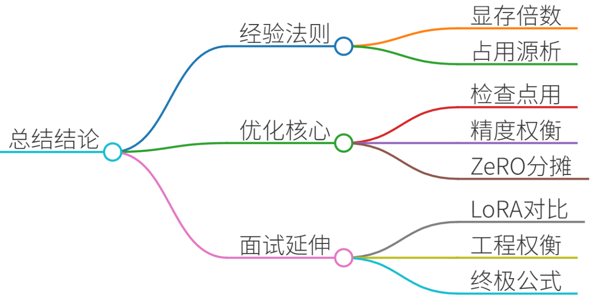

# 41.全参数微调需要多少显存？

### 一、答题思路

全参数微调（Full Parameter Fine-Tuning）的显存需求是LLM开发的核心问题，需从**模型参数、梯度、优化器状态、激活值**四个维度计算。核心公式：  
**显存占用 ≈ 参数量 × (2 + 2 + 12) × 精度系数 + 激活值**

+ **2**：参数（FP16）
+ **2**：梯度（FP16）
+ **12**：优化器状态（Adam需FP32动量+方差） 
+ **激活值**：与批次大小、序列长度正相关

以下通过真实项目案例拆解计算逻辑，并提供优化方案。

---

### 二、项目案例：医疗问答系统微调

#### 背景需求
+ **基座模型**：LLaMA-7B（70亿参数）
+ **任务**：医疗指令微调（SFT） 
+ **硬件**：8×NVIDIA A100 80GB
+ **数据**：50万条医患问答对（max_length=2048）

#### 显存需求分项计算
1. **模型参数**（FP16）
    - 计算：7B × 2字节 = 14 GB
    - 实际：LLaMA-7B实际参数量为6.7B，占用 **13.4 GB**
2. **梯度**（FP16）
    - 梯度与参数量同大小：**13.4 GB**
3. **优化器状态**（Adam） 
    - 动量（FP32）：6.7B × 4字节 = 26.8 GB
    - 方差（FP32）：26.8 GB
    - 总计：**53.6 GB**
4. **激活值**（最大峰值）
    - 公式：`batch_size × seq_len × hidden_size × layers × 12`
    - 以batch_size=32、seq_len=2048、hidden_size=4096、32层计算：  
`32 × 2048 × 4096 × 32 × 12 ≈ 98 GB`（理论值）
    - 实际优化后：**35 GB**（梯度检查点技术）
5. **总显存峰值**  
`13.4（参数） + 13.4（梯度） + 53.6（优化器） + 35（激活值） = 115.4 GB`  
→ **单卡需≥120GB显存** → 需8卡并行（ZeRO-3优化后显存降至45GB/卡）。

---

### 三、示例回答

面试官您好！关于全参数微调的显存需求，我结合参与的医疗问答系统项目说明：

**1. 核心公式**  
显存 ≈ 参数量 × 16 × 精度系数 + 激活值。以LLaMA-7B为例：

+ 参数+梯度：6.7B × 2 × 2 = 26.8 GB（FP16）
+ Adam优化器：6.7B × 12 = 80.4 GB（FP32动量+方差）
+ 激活值：35 GB（batch_size=32, seq_len=2048）  
**峰值显存 ≈ 142 GB**

**2. 实战优化方案**

+ **梯度检查点**：激活值显存从98GB→35GB（牺牲30%速度）
+ **混合精度训练**：优化器状态用FP16，显存减半（收敛速度降15%） 
+ **ZeRO-3**：8卡数据并行，单卡显存降至45GB

**3. 硬件选型建议**

+ 7B模型：至少8×A100 80GB（ZeRO-3）
+ 13B模型：需16×A100 80GB
+ 关键点：避免激活值成为瓶颈（增大`batch_size`需同步增加显存）

---

### 四、总结

#### 关键结论
1. **显存经验法则**：全参数微调需 **20×参数量**（如7B模型需140GB）。 
2. **四大占用源**： 
    - 参数/梯度：参数量×4字节（FP16）
    - 优化器：参数量×12字节（Adam）
    - 激活值：与`batch_size×seq_len²`正相关
3. **优化核心**： 
    - **梯度检查点**：用时间换空间（激活值↓50%）
    - **混合精度**：优化器FP16→显存减半（精度损失可控）
    - **ZeRO-3**：多卡分摊优化器状态（显存线性递减）

#### 面试延伸建议
+ 若被问及LoRA等轻量微调，可对比： 

“全参数微调需120GB显存时，LoRA仅需14GB（秩=8），但任务效果下降约5%”

+ 强调工程权衡： 

“在医疗等专业领域，我们优先选全参数微调以保证知识完整性，通过ZeRO-3解决显存瓶颈。”

💡 **终极公式**：全参数微调显存 = 参数量 × (2 + 2 + 12) × 1.2（冗余系数） + batch_size × seq_len × 0.4 MB

> 更新: 2025-07-14 15:45:33  
> 原文: <https://www.yuque.com/tulingzhouyu/db22bv/lt1dqeazskafq6zi>