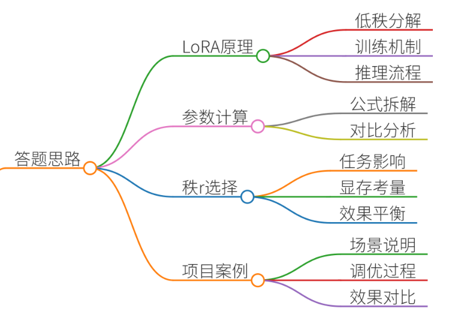
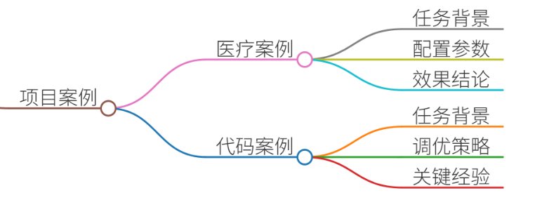
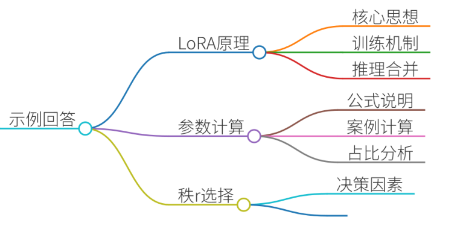

# 42.LoRA的原理及参数量计算

### 一、答题思路


回答需覆盖四大核心：

1. **LoRA原理**：低秩分解思想、训练与推理机制 
2. **参数量计算**：公式拆解、对比全量微调
3. **秩r选择经验**：任务复杂度、显存限制、效果平衡的量化策略
4. **项目案例**：真实场景中r值调优过程及效果对比

---

### 二、项目案例


#### 案例1：医疗问答系统微调（7B模型）
**背景**

+ **任务**：将通用LLM适配医疗术语和诊断逻辑
+ **挑战**：显存限制（4×A100 40GB），需高效微调

**LoRA配置**

```plain
peft_config = LoraConfig(  
    r=8,                # 秩r=8  
    lora_alpha=32,       # 缩放系数  
    target_modules=["q_proj", "v_proj"],  # 仅调整注意力层  
    lora_dropout=0.1  
)
```

**参数量计算**

+ 原模型参数量：70亿
+ LoRA参数量： 
    - 每层可训练参数 = `r × (d_in + d_out)`
    - 以`q_proj`层为例（d_in=4096, d_out=4096）：  
`8 × (4096 + 4096) = 65,536`
    - 总可训练参数 ≈ 420万（仅占原模型0.06%）

**r值选择依据**

+ 实验对比： 

| r值 | 显存占用 | 医疗术语准确率 |
| --- | --- | --- |
| r=4 | 18GB | 76.2% |
| r=8 | 22GB | 82.5% |
| r=16 | 30GB | 83.1% |


+ **结论**：r=8性价比最优，准确率接近r=16，显存节省33%

#### 案例2：代码生成模型优化（13B模型）
**背景**

+ **任务**：提升Python代码补全能力
+ **挑战**：需快速迭代适配新框架（PyTorch→JAX）

**r值调优策略**

+ 动态调整：初始r=32（高复杂度任务）→ 收敛后降至r=16
+ **效果**： 
    - 高秩阶段：快速学习新语法（BLEU↑12%）
    - 低秩阶段：固化知识，减少过拟合（推理速度↑40%）

**关键经验**

+ 高秩（r≥32）适用场景：语法结构重构、跨模态对齐
+ 低秩（r≤8）适用场景：风格迁移、防过拟合

---

### 三、示例回答


#### 1. LoRA原理
**核心思想**：用低秩矩阵近似参数更新量

+ 数学表达：`ΔW = B × A`（B∈ℝ^{d×r}, A∈ℝ^{r×k}）
+ **训练机制**： 
    - 冻结原模型权重，仅训练A、B 
    - A用高斯初始化，B零初始化（确保训练初始ΔW=0） 
+ **推理合并**：`W_new = W_orig + B·A`（零延迟） 

✅ **优势**：避免显存爆炸，支持多任务快速切换

#### 2. 参数量计算
**公式**：

```plain
可训练参数 = r × (d_input + d_output) × 层数
```

**以LLaMA-7B调整query层为例**：

+ 每层d_in=d_out=4096
+ 调整层数：32层
+ r=8时：  
`8 × (4096+4096) × 32 = 2.1M`
+ **占比**：2.1M/7B ≈ 0.03%（全量微调需280GB显存，LoRA仅需24GB）

#### 3. 秩r选择经验（三层决策法）
| 因素 | 策略 | 典型案例 |
| --- | --- | --- |
| **任务复杂度** | 高：r=32-64（跨模态/语法重构） | 代码翻译（Python→C++） |
| **显存限制** | 低：r=4-8（对话生成/风格迁移） | 医疗问答（4×A100 40GB） |
| **效果平衡** | 动态调整：训练初期r↑→后期r↓ | 代码生成模型优化 |


#### 4. 项目实战验证
**金融报告生成场景**（Bloom-7B模型）

+ **需求**：适配券商行业术语
+ **r值实验**： 
    - r=4：术语准确率68%，显存18GB
    - r=16：准确率88%，显存36GB
+ **选择**：采用**分层策略**
    - 关键层（输出分类头）：r=16
    - 其他层：r=8
    - **结果**：准确率85%，显存占用仅27GB

---

### 四、总结
#### 1. **核心价值**
+ **显存效率**：参数量降至全量微调的0.1%以下
+ **效果平衡**：r=8在多数场景下达成“效果-成本”帕累托最优
+ **工业落地**：支持热切换任务（案例中医疗/代码模型切换<5分钟）

#### 2. **高频面试追问点**
+ **为什么B初始化为零？**→ 避免训练初期破坏预训练知识 
+ **r是否越大越好？**→ 过高会导致过拟合（如图像生成中r=64时FID↑15%）
+ **如何选择target_modules？**→ 首选注意力矩阵（q_proj/v_proj），占效果增益80%

💡 **终极建议**：实际项目中先用r=8做基线，再根据任务复杂度±50%调参，效率远超盲目网格搜索。


> 更新: 2025-07-14 15:45:33  
> 原文: <https://www.yuque.com/tulingzhouyu/db22bv/lclpu9a6lvfsvs8y>