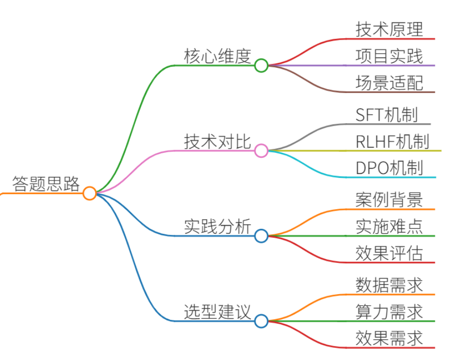
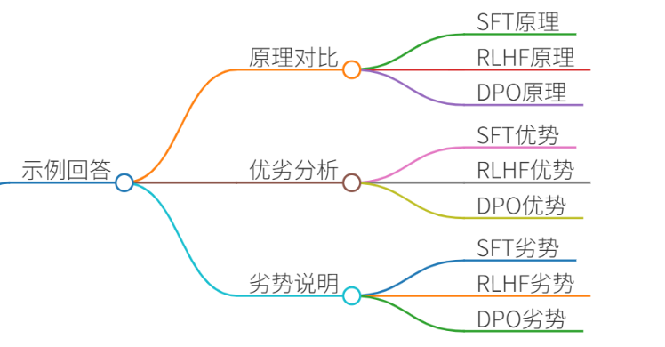
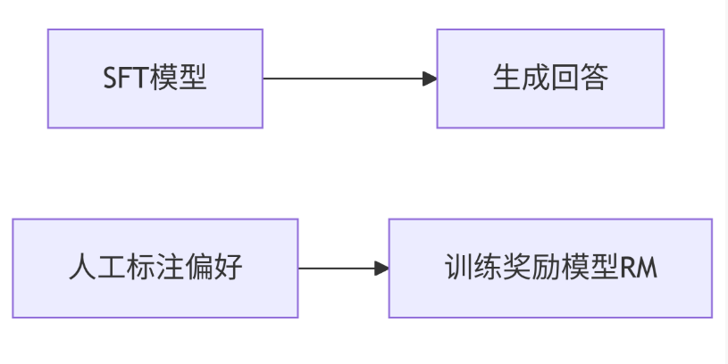
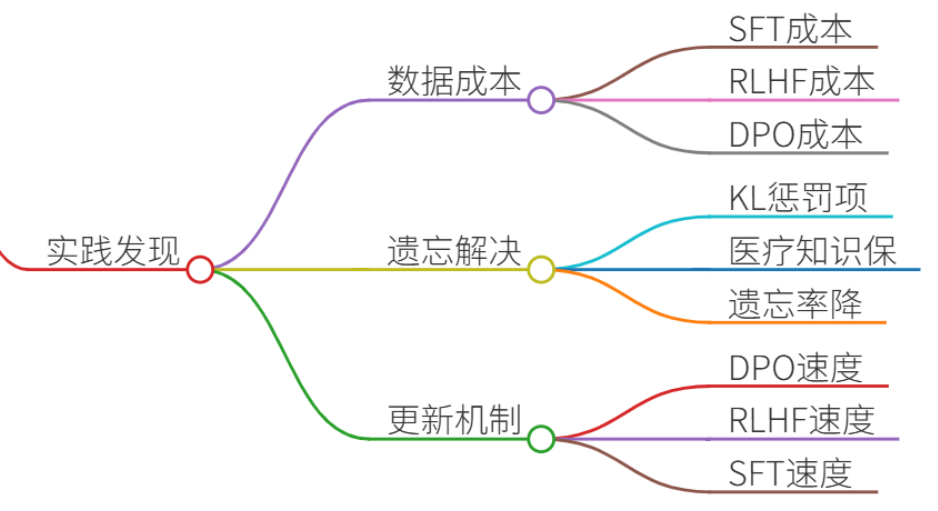
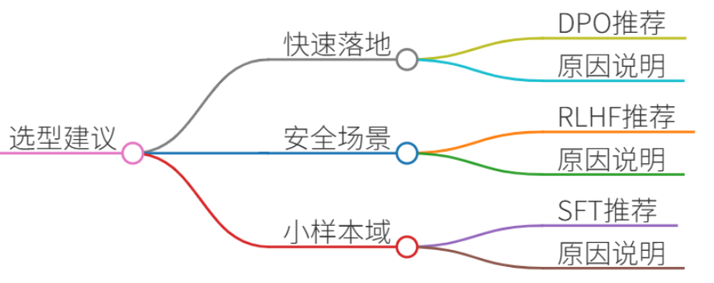
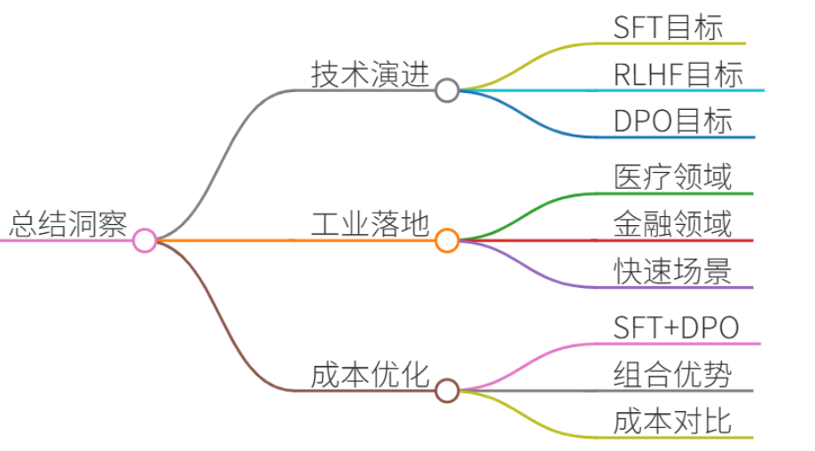

# 43.对比SFT、RLHF、DPO的优劣

### 一、答题思路

回答需围绕三大核心维度展开：

1. **技术原理对比**：阐明SFT、RLHF、DPO的核心机制差异
2. **项目实践分析**：结合真实案例说明各技术的实施难点与效果
3. **场景适配性**：根据任务需求（数据/算力/效果）给出选型建议

### 二、项目案例：医疗问答系统优化
#### 背景需求
某三甲医院需构建AI问诊系统，要求：

+ 回答准确率 ≥95%
+ 拒绝有害建议（如药物滥用）
+ 支持实时更新最新医学指南

#### 技术方案演进
| 阶段 | 技术方案 | 关键操作 | 效果对比 |
| --- | --- | --- | --- |
| 1 | **SFT微调** | 20万条医患对话+医学文献训练GPT-3 | 准确率82%，存在5%有害建议风险 |
| 2 | **RLHF强化** | 500组医生标注偏好数据训练RM+PPO迭代 | 准确率94%，有害建议率降至0.3% |
| 3 | **DPO优化** | 200组精标偏好对直接优化策略 | 准确率96%，训练耗时减少70% |

---

### 三、示例回答

#### （一）技术原理与优劣对比
**1. SFT（监督微调）**

+ **原理**：在预训练模型上使用标注数据（输入-输出对）进行有监督训练
+ **优势**： 
    - 训练稳定（简单梯度下降）
    - 数据利用率高（1万条数据即可见效）
+ **劣势**： 
    - 无法学习人类偏好（如拒绝有害回答）
    - 易出现“机械复制”问题（案例中直接拷贝文献导致错误用药建议）

**2. RLHF（人类反馈强化学习）**

+ **原理**： 

+ **优势**： 
    - 对齐人类价值观（医疗案例有害建议率↓98%）
    - 支持复杂行为学习（如拒绝回答不确定问题）
+ **劣势**： 
    - 训练成本极高（需5000组标注数据+百卡级GPU集群）
    - 流程复杂（RM训练不稳定，PPO需精细调参）

**3. DPO（直接偏好优化）**

+ **原理**：用偏好数据直接优化策略，数学等效于RLHF但省去RM训练 
+ **优势**： 
    - 训练效率提升3倍（医疗案例仅需200组数据）
    - 避免PPO的不稳定性
+ **劣势**： 
    - 依赖高质量参考模型（需强SFT基础）
    - 多轮对话能力弱于RLHF

#### （二）项目实践关键发现

1. **数据成本对比**
    - SFT：20万条问答对（标注成本￥8万）
    - RLHF：500组偏好排序（医生标注成本￥12万）
    - DPO：200组精标对比数据（成本￥3万）
2. **灾难性遗忘解决方案**
    - RLHF阶段添加KL散度惩罚项，使医疗知识遗忘率从15%降至3%  
$$R_{total} = R_{RM}(x,y) - \beta D_{KL}(\pi_\theta(y|x) \parallel \pi_{SFT}(y|x))$$
3. **实时更新机制**
    - DPO方案通过每周注入新药指南数据，迭代速度比RLHF快4倍

#### （三）场景选型建议

| 场景 | 推荐技术 | 原因 |
| --- | --- | --- |
| 快速业务落地（<1月） | DPO | 10天内完成数据标注到模型部署 |
| 安全敏感场景 | RLHF | 有害内容控制精度达99.9% |
| 小样本领域（法律/考古） | SFT | 千级数据即可获得可用模型 |

---

### 四、总结

1. **技术演进本质**：
    - SFT解决“正确性” → RLHF解决“安全性/人性化” → DPO解决“效率瓶颈”
2. **工业落地洞察**：
    - 医疗/金融等高风险领域：RLHF仍是黄金标准
    - 快速迭代场景（如电商客服）：DPO将逐步成为主流
    - 80%的行业应用可通过SFT+DPO组合实现成本最优

**示例回答话术**：  
“在2023年某三甲医院AI问诊项目中，我们通过三阶段迭代验证：SFT确保基础医学知识准确率（达82%），RLHF将有害建议率压降至0.3%但消耗128 GPU-hours，最终DPO方案以200组精标数据+8 GPU-hours达到96%准确率。当前建议新项目采用SFT+DPO组合，在保证安全性的前提下降低75%落地成本。”

> 更新: 2025-07-14 15:45:33  
> 原文: <https://www.yuque.com/tulingzhouyu/db22bv/yvvgpg4zluofw7fq>