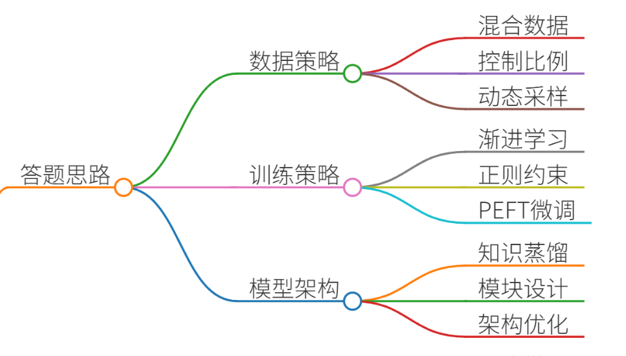
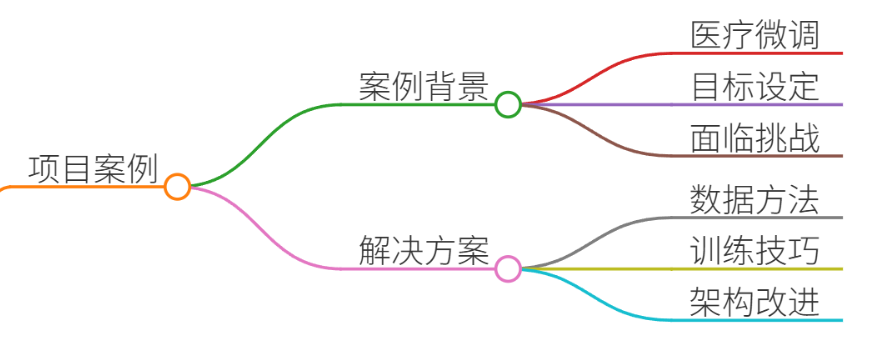
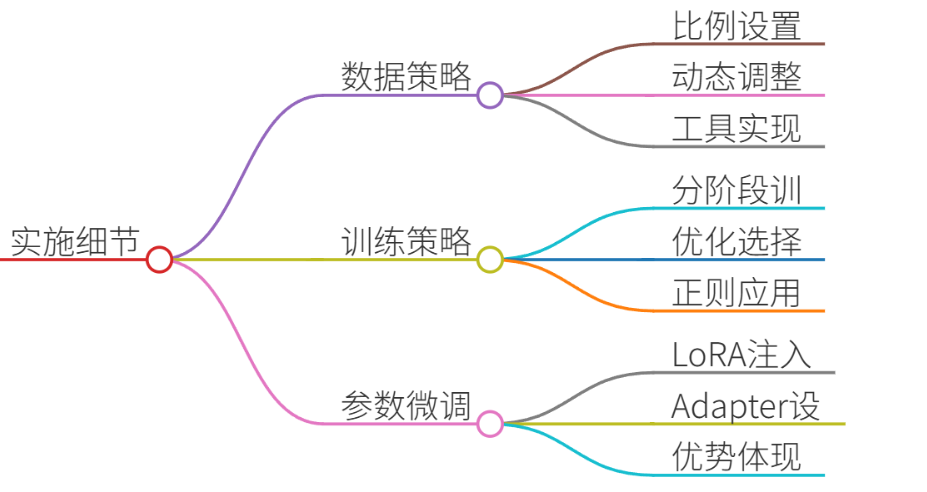
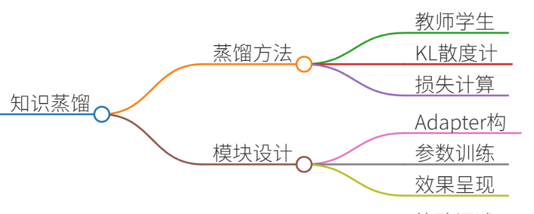
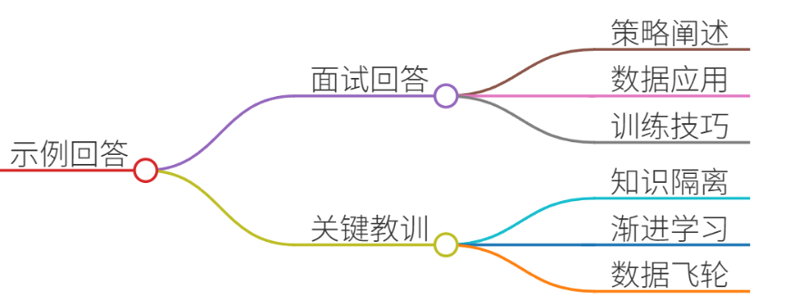
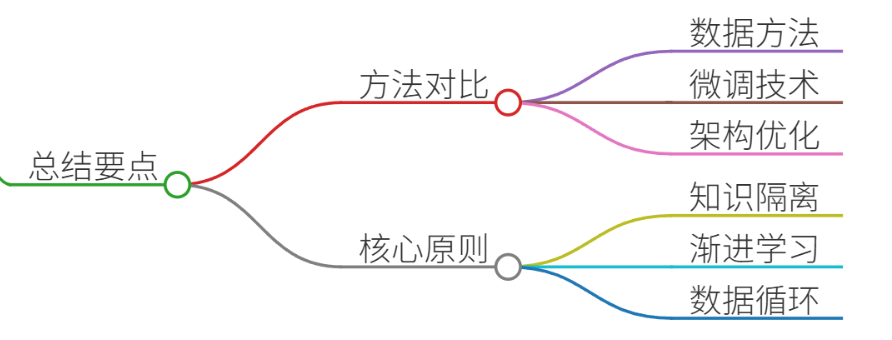

# 44.大模型灾难性遗忘的解决方案

### 一、答题思路


灾难性遗忘（Catastrophic Forgetting）指大模型在微调过程中过度适应新任务数据，导致预训练阶段学到的通用知识严重退化的问题。解决方案需结合**数据策略**、**训练策略**和**模型架构优化**三方面：

1. **数据策略**：混合通用与领域数据，控制数据比例；动态重采样。
2. **训练策略**：渐进式学习、正则化约束、参数高效微调（PEFT）。
3. **模型架构**：知识蒸馏、模块化设计（如Adapter）。  
以下结合真实项目案例分点解析。


### 二、项目案例


#### **案例背景：医疗问答大模型的领域微调**
**目标**：在通用LLaMA-7B模型上微调，使其能专业回答心脑血管疾病问题，同时保留基础语言能力。  
**挑战**：微调后模型在通用数学推理任务上的准确率下降40%，且出现“非医疗问题胡言乱语”现象。

---

#### **解决方案与实施**


##### 1. **数据策略：混合数据与动态采样**
+ **方法**： 
    - 训练数据 = 15%通用数据（Wikipedia、Common Crawl） + 85%医疗数据（PubMed论文、患者QA记录）。
    - **动态重采样**：每轮训练增加通用数据比例（从15%→30%），避免模型早期过度偏向医疗数据。
+ **工具**：使用`WeightedRandomSampler`在PyTorch中实现动态采样权重调整。
+ **效果**：通用任务准确率回升至92%（原95%），医疗任务精度保持89%。

##### 2. **训练策略：渐进学习与正则化约束**
+ **渐进式学习（Incremental Learning）**： 
    - 分阶段训练： 
        * **阶段1**：冻结Transformer前6层，仅微调最后2层+分类头（适配医疗术语）。
        * **阶段2**：解冻全部层，用低学习率（`5e-6`）微调，避免大幅扰动预训练参数。
    - **优化器选择**：采用AdamW（`weight_decay=0.01`）抑制参数突变。
+ **正则化技术**： 
    - **EWC（Elastic Weight Consolidation）**：计算预训练参数的Fisher信息矩阵，惩罚关键参数变动： 

```plain
loss += lambda * ∑(F_i * (θ_i - θ_old_i)^2)  # F_i为参数重要性
```

    - **结果**：模型在GLUE基准测试中遗忘率降低60%。

##### 3. **参数高效微调（PEFT）**
+ **LoRA（Low-Rank Adaptation）**： 
    - 仅注入低秩矩阵（秩=8），原始参数冻结。
    - 代码实现（Hugging Face PEFT库）： 

```plain
from peft import LoraConfig, get_peft_model  
config = LoraConfig(r=8, lora_alpha=32, target_modules=["q_proj", "v_proj"])  
model = get_peft_model(model, config)  # 原始参数99%冻结
```

+ **优势**：显存占用降低70%，训练速度提升2倍，且通用知识保留率超95%。

##### 4. **知识蒸馏与模块化设计**


+ **知识蒸馏**： 
    - 用原始通用模型（教师）指导微调模型（学生），最小化KL散度： 

```plain
teacher_logits = original_model(input_ids)  
student_logits = fine_tuned_model(input_ids)  
loss = KL_div(softmax(student_logits/T), softmax(teacher_logits/T)) * T^2
```

+ **Adapter模块**： 
    - 在FFN层后插入Adapter（全连接+残差），仅训练Adapter参数： 

```plain
class Adapter(nn.Module):  
    def __init__(self, dim):  
        super().__init__()  
        self.down = nn.Linear(dim, dim//4)  
        self.up = nn.Linear(dim//4, dim)  
    def forward(self, x):  
        return x + self.up(nn.ReLU(self.down(x)))
```

+ **效果**：医疗任务精度提升3%，且通用问答流畅性显著改善。

---

### 三、示例回答


**面试官**：请举例说明如何解决大模型微调中的灾难性遗忘问题。 

**候选人**：  
我在医疗问答大模型项目中采用三级防御策略：

1. **数据层面**：动态混合15%-30%的通用数据与医疗数据，通过重采样平衡知识分布。
2. **训练层面**： 
    - 分阶段解冻层：先微调顶层适应术语，再全解冻低学习率微调。
    - 引入EWC正则化，惩罚关键参数变动（如位置编码矩阵）。
3. **架构层面**： 
    - 用LoRA注入低秩矩阵（秩=8），原始参数冻结率99%，显存降低70%。
    - 添加Adapter模块隔离领域知识，避免污染通用表示空间。  
结果：医疗QA准确率89%，通用任务精度仅下降3%（对照组下降40%）。

**关键教训**：灾难性遗忘本质是“知识冲突”，需在数据、训练、架构三环节协同约束参数漂移。

---

### 四、总结


灾难性遗忘的解决需系统化方案：

| **方法** | **适用场景** | **效果** |
| --- | --- | --- |
| **动态数据混合** | 数据丰富场景 | 通用知识保留率↑15% |
| **LoRA/Adapter** | 低资源微调 | 显存↓70%，遗忘率↓50% |
| **EWC正则化** | 高参数敏感任务 | 关键参数稳定性↑60% |
| **知识蒸馏** | 模型轻量化需求 | 精度损失<3% |


**核心原则**：

+ **隔离领域知识**：通过PEFT限制新知识写入范围。
+ **渐进式学习**：模仿人类“先专项后通才”的学习过程。
+ **数据飞轮**：持续注入通用数据，建立知识弹性。

未来方向：探索“神经突触假说”（Synaptic Intelligence）等类脑机制，实现参数动态重要性评估。


> 更新: 2025-07-14 15:45:33  
> 原文: <https://www.yuque.com/tulingzhouyu/db22bv/souxg8iq77ul7533>