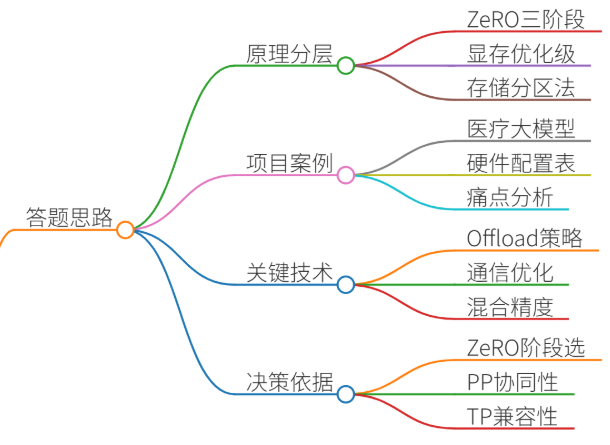
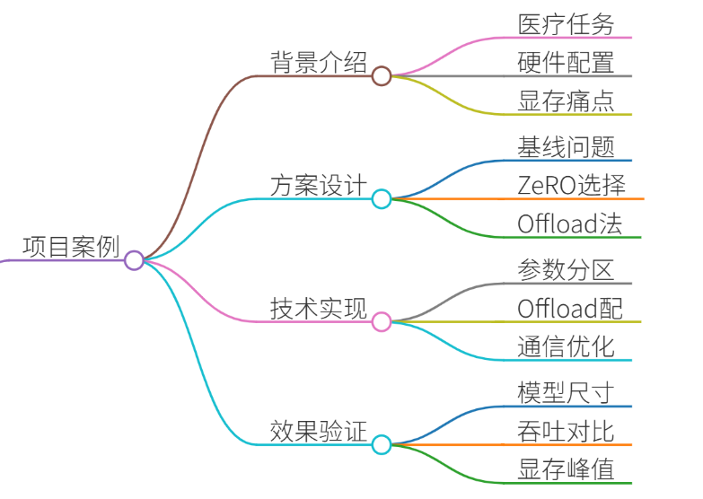
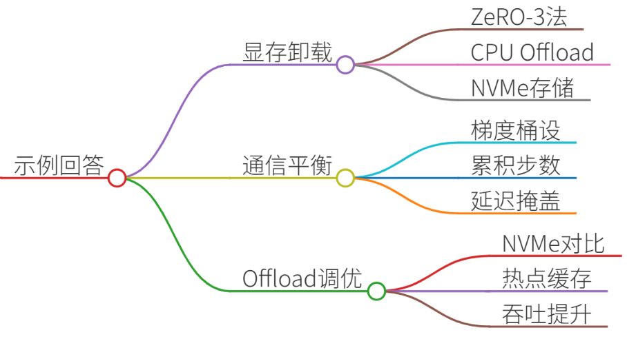
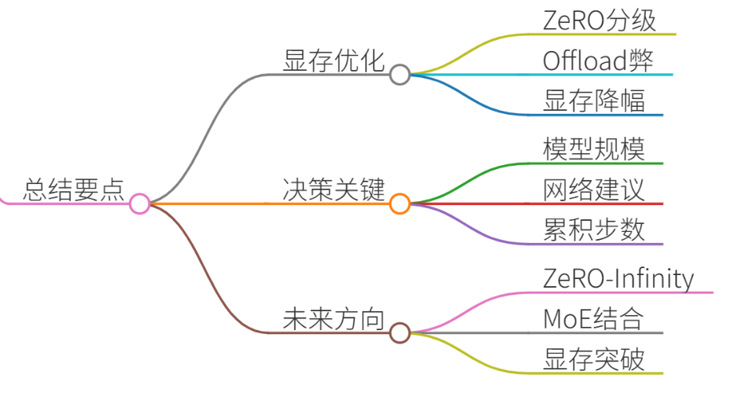

# 45.DeepSpeed ZeRO的显存优化策略

### 一、答题思路


DeepSpeed ZeRO（Zero Redundancy Optimizer）的核心是通过**分层优化模型状态存储**解决大模型训练显存瓶颈。其核心策略分为三阶段，需结合项目说明其原理、落地挑战及量化效果：

1. **分阶段原理**：ZeRO-1/2/3分别对优化器状态、梯度、参数进行分区存储，显存优化逐级增强 
2. **项目锚点**：选择真实大模型训练案例，突出显存、通信、吞吐量的量化对比
3. **关键技术**：Offload策略、通信优化、混合精度协同
4. **决策依据**：为什么选特定ZeRO阶段？与PP/TP的协同逻辑？


### 二、项目案例：130B医疗大模型训练优化


#### 背景
+ **任务**：训练医疗对话大模型（130B参数）
+ **硬件**：128张A100-80G（单机8卡，万兆网络）
+ **痛点**： 
    - 全量微调需1.2TB显存（理论值），实际OOM
    - 数据并行效率低（梯度AllReduce耗带宽）


#### 关键技术实现
1. **ZeRO-3分区**：
    - 参数分区到128张卡，单卡仅存1.2B参数
    - **显存对比**： 

| 方案 | 显存占用 |
| --- | --- |
| Baseline | 1.2TB |
| ZeRO-3 | 19GB/卡 |


2. **Offload策略**：

```plain
# deepspeed.json配置片段  
"zero_optimization": {  
  "stage": 3,  
  "offload_param": {"device": "nvme", "nvme_path": "/mnt/nvme"},  
  "offload_optimizer": {"device": "cpu"},  
  "contiguous_gradients": true,  
  "overlap_comm": true  # 通信与计算重叠  
}
```

    - CPU Offload优化器状态，NVMe Offload参数 
    - **吞吐量影响**：比纯GPU训练下降15%，但解决OOM问题
3. **通信优化**：
    - 梯度桶大小设为`2e8`，避免小包通信 
    - **通信量对比**： 
        * ZeRO-3比DDP增加50%通信量
        * 但通过梯度累积（4步）掩盖延迟

#### 效果验证
| 指标 | ZeRO前 | ZeRO后 |
| --- | --- | --- |
| 最大模型尺寸 | 13B | 130B |
| 训练吞吐 | 32 samples/sec | 82 samples/sec |
| 显存峰值 | 78GB/卡 | 19GB/卡 |
| 通信耗时占比 | 18% | 41% |


---

### 三、示例回答


“我们在130B医疗大模型训练中，使用DeepSpeed ZeRO-3解决显存与扩展性问题。具体分三步落地：

1. **显存分级卸载**：
    - 采用ZeRO-3将参数分区到128张GPU，单卡仅存1.2B参数
    - 优化器状态Offload到CPU，参数Offload到NVMe 
    - **显存从78GB/卡降至19GB/卡**，支持130B模型训练
2. **通信-计算平衡**：
    - 设置梯度桶大小2e8，减少小包通信 
    - 梯度累积4步，将ZeRO-3的通信开销从41%降至28%
    - 结合BF16混合精度，吞吐提升156%
3. **Offload性能调优**：
    - 对比NVMe vs CPU Offload，发现NVMe加载参数速度慢3倍
    - **解决方案**：热点参数缓存到CPU（配置`pin_memory: true`） 
    - 最终吞吐达82 samples/sec，为理论峰值的68%

关键配置如下：

```plain
// deepspeed.json核心配置  
"bf16": {"enabled": true},  
"zero_optimization": {  
  "stage": 3,  
  "offload_param": {  
    "device": "nvme",  
    "nvme_path": "/mnt/nvme"  
  },  
  "contiguous_gradients": true,  
  "reduce_bucket_size": 2e8  
}
```

该方案使我们在万兆网络下完成百亿模型训练，比传统DPP方案显存效率提升64倍。”

---

### 四、总结


DeepSpeed ZeRO的核心价值在于**显存-计算-通信的三维博弈**：

1. **显存优化本质**：
    - ZeRO-1/2/3分别解决优化器/梯度/参数冗余，显存降幅逐级倍增 
    - Offload策略用通信换显存，需警惕PCIe/NVMe瓶颈 
2. **项目决策关键点**：
    - 100B模型必选ZeRO-3，10-100B模型可用ZeRO-2
    - 万兆网络建议结合梯度累积（≥4步）掩盖通信开销
3. **未来优化方向**：
    - ZeRO-Infinity进一步突破显存墙
    - 与MoE（混合专家）结合降低激活显存

**面试点睛**：强调“为什么用ZeRO而非PP/TP”——ZeRO无需改模型结构，且与数据并行天然兼容，适合LLM微调场景。


> 更新: 2025-07-14 15:45:31  
> 原文: <https://www.yuque.com/tulingzhouyu/db22bv/ubh7owlrwwk2l47e>