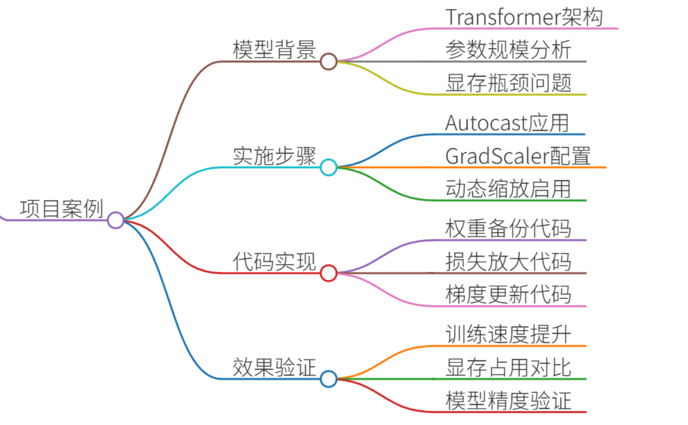
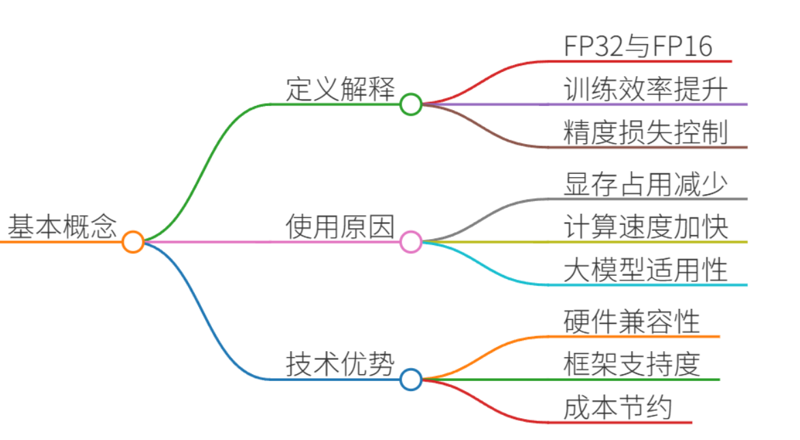
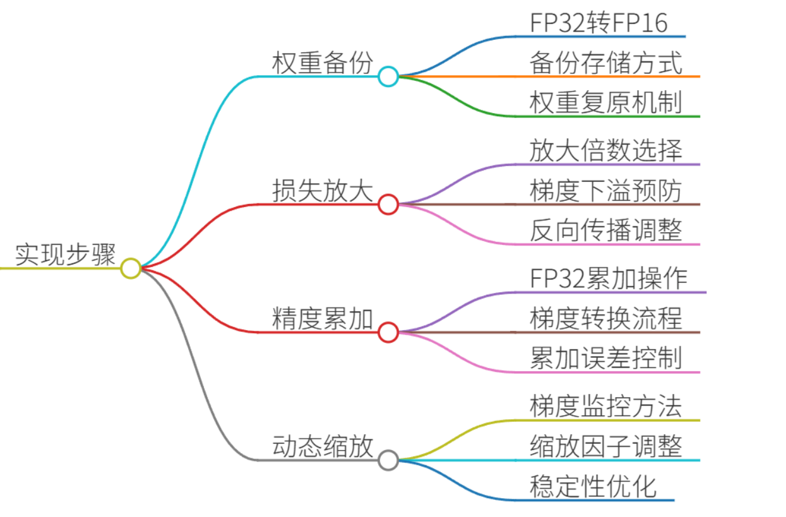
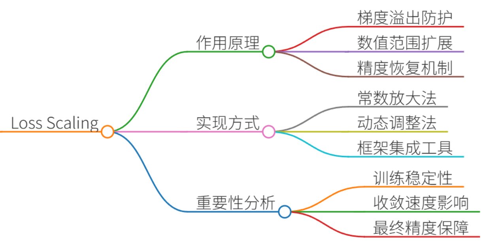
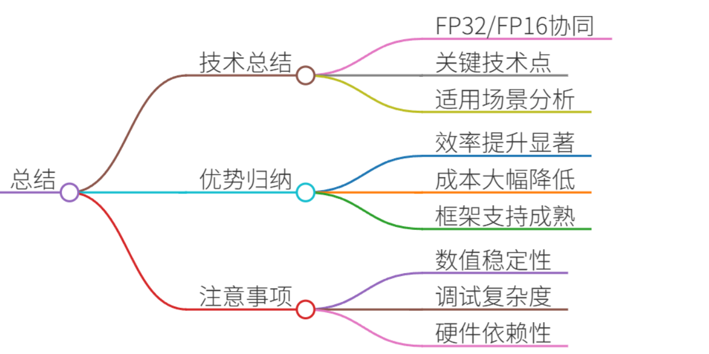

# 46.混合精度训练的实现步骤及Loss Scaling作用

### 一、答题思路
在回答混合精度训练的实现步骤及Loss Scaling作用时，可以按照以下思路进行：

1. **混合精度训练的基本概念**：首先解释什么是混合精度训练，为什么要使用混合精度训练。
2. **实现步骤**：详细描述混合精度训练的具体实现步骤，包括权重备份、损失放大、精度累加等技术点。
3. **Loss Scaling的作用**：解释Loss Scaling的作用及其重要性。
4. **真实项目案例**：结合一个真实的项目案例，具体说明混合精度训练的实现过程和Loss Scaling的应用。
5. **总结**：总结混合精度训练的优势和注意事项。

### 二、项目案例


假设我们有一个大型的自然语言处理（NLP）项目，需要训练一个基于Transformer架构的语言模型。由于模型的参数量非常大，训练过程中显存占用较高，容易导致训练效率低下甚至训练失败。因此，我们决定采用混合精度训练来优化训练过程。

### 三、示例回答
#### 1. 混合精度训练的基本概念


混合精度训练是一种在深度学习模型训练过程中同时使用单精度（FP32）和半精度（FP16）浮点数的技术。其主要目的是通过减少显存占用和加快计算速度来提高训练效率，同时尽量避免精度损失。

#### 2. 实现步骤


混合精度训练的实现步骤主要包括以下几个方面：

1. **权重备份（Weight Backup）**：
    - 在训练开始前，将模型的权重从FP32格式备份到FP16格式。这样可以在前向传播和反向传播过程中使用FP16进行计算，减少显存占用。
    - 由于FP16的数值范围较小，容易发生溢出或下溢，因此需要保留FP32格式的权重备份，以便在需要时恢复权重。
2. **损失放大（Loss Scaling）**：
    - 由于FP16的数值范围较小，直接计算损失函数可能会导致梯度下溢（即梯度值变为0）。为了避免这种情况，需要对损失函数进行放大。
    - 具体做法是在计算损失函数时，将损失值乘以一个较大的常数（如2^16），然后再进行反向传播。这样可以确保梯度值不会因为FP16的数值范围限制而变为0。
    - 反向传播完成后，需要将梯度值除以相同的常数，以恢复原始的梯度值。
3. **精度累加（Precision Accumulated）**：
    - 在反向传播过程中，梯度的累加操作需要使用FP32格式，以保证精度。
    - 具体做法是在计算梯度时，先将FP16格式的梯度转换为FP32格式，然后进行累加操作，最后再将累加结果转换回FP16格式。
4. **动态损失缩放（Dynamic Loss Scaling）**：
    - 为了进一步提高训练的稳定性和效率，可以使用动态损失缩放技术。
    - 动态损失缩放会根据梯度的值动态调整损失放大的倍数。如果梯度值较大，则适当减小损失放大的倍数；如果梯度值较小，则适当增大损失放大的倍数。
    - 这样可以在保证梯度值不溢出的前提下，尽可能提高计算效率。

#### 3. Loss Scaling的作用


Loss Scaling的主要作用是防止在混合精度训练过程中梯度下溢。由于FP16的数值范围较小，直接计算损失函数可能会导致梯度值变为0，从而无法进行有效的参数更新。通过损失放大，可以将损失值放大到一个安全的范围内，确保梯度值不会因为FP16的数值范围限制而变为0。反向传播完成后，再将梯度值恢复到原始的尺度，以保证参数更新的正确性。

#### 4. 真实项目案例
在我们的NLP项目中，具体实现混合精度训练的步骤如下：

1. **权重备份**：
    - 在训练开始前，使用`torch.cuda.amp`模块中的`autocast`上下文管理器将模型的权重从FP32格式备份到FP16格式。

```plain
from torch.cuda.amp import autocast, GradScaler

scaler = GradScaler()
```

2. **损失放大**：
    - 在计算损失函数时，使用`scaler.scale(loss)`将损失值放大。

```plain
with autocast():
    outputs = model(input_ids, attention_mask=attention_mask, labels=labels)
    loss = loss_fn(outputs, labels)
scaled_loss = scaler.scale(loss)
```

3. **精度累加**：
    - 在反向传播过程中，使用`scaler.step(optimizer)`进行梯度更新，并在更新前将梯度值从FP16转换回FP32格式。

```plain
scaled_loss.backward()
scaler.step(optimizer)
scaler.update()
```

4. **动态损失缩放**：
    - `GradScaler`会自动根据梯度的值动态调整损失放大的倍数，以确保训练的稳定性和效率。

```plain
scaler = GradScaler()
```

通过上述步骤，我们成功地实现了混合精度训练，并在训练过程中有效地防止了梯度下溢的问题。

#### 5. 总结


混合精度训练通过同时使用FP32和FP16浮点数，显著减少了显存占用和加快了计算速度，同时通过损失放大和精度累加等技术保证了训练的稳定性和精度。在实际项目中，混合精度训练已经成为训练大规模深度学习模型的标准方法之一。通过合理地应用混合精度训练，可以显著提高训练效率和模型性能，为深度学习模型的广泛应用提供了强有力的支持。

### 四、总结
混合精度训练是一种在深度学习模型训练过程中同时使用单精度（FP32）和半精度（FP16）浮点数的技术。其主要目的是通过减少显存占用和加快计算速度来提高训练效率，同时尽量避免精度损失。混合精度训练的实现步骤包括权重备份、损失放大、精度累加等技术点。Loss Scaling的作用是防止在混合精度训练过程中梯度下溢，确保梯度值不会因为FP16的数值范围限制而变为0。通过合理地应用混合精度训练，可以显著提高训练效率和模型性能，为深度学习模型的广泛应用提供了强有力的支持。


> 更新: 2025-07-14 15:45:31  
> 原文: <https://www.yuque.com/tulingzhouyu/db22bv/shltect7fimgaa12>