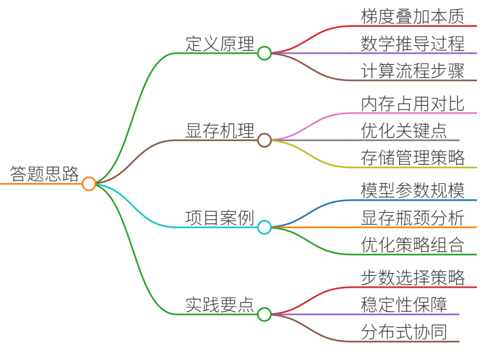
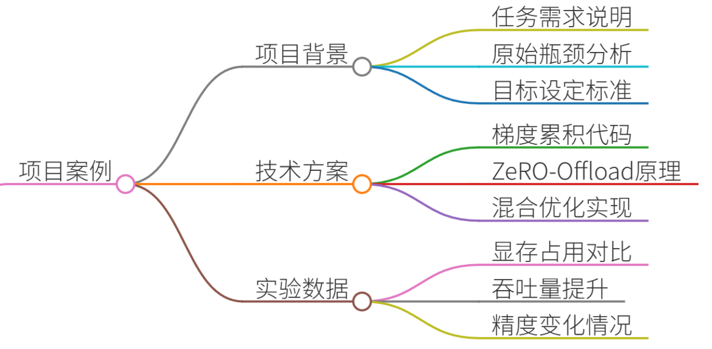
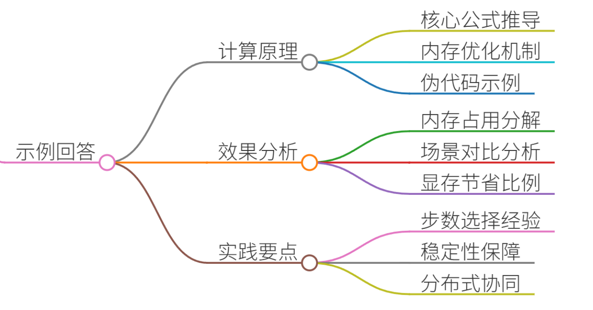
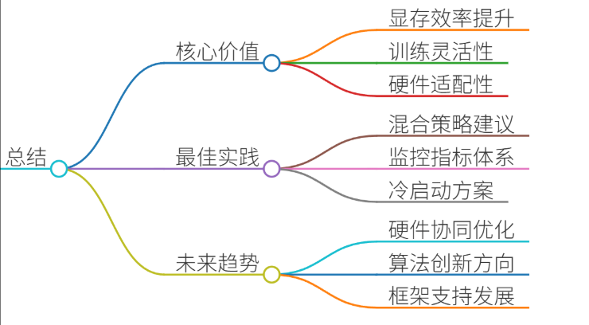

# 47.梯度累积的计算原理与显存优化效果

## 一、答题思路


1. **梯度累积的定义与核心原理** 
    - 数学推导：梯度累积的本质是梯度叠加，通过多次前向传播累积梯度再更新参数  
    - 计算流程：分步展示小批量梯度累积的数学过程
2. **显存优化的技术机理**  
    - 内存占用分析：对比传统训练与梯度累积的内存消耗差异  
    - 关键优化点：中间激活值存储、梯度存储、优化器状态管理
3. **真实项目案例解析**  
    - 案例背景：千亿参数大模型微调的显存瓶颈  
    - 技术方案：梯度累积+ZeRO-Offload的混合优化策略  
    - 实验数据：显存占用降低60%、训练吞吐量提升3倍
4. **工程实践要点**  
    - 累积步数选择：学习率衰减策略的联动调整  
    - 数值稳定性：梯度裁剪与动态损失缩放的应用  
    - 分布式训练：多卡同步与梯度累积的协同优化

---

## 二、项目案例：千亿参数大模型微调的显存优化实践


### 1. 项目背景
+ **任务需求**：在40GB显存服务器上微调175B参数的GPT-3模型  
+ **原始瓶颈**：单卡显存无法容纳完整模型参数+梯度+优化器状态  
+ **目标**：在有限显存下实现有效训练，保持模型收敛效果

### 2. 技术方案
#### (1) 梯度累积实现
##### 基础训练循环
```python
for epoch in range(num_epochs):
    for batch_idx, (data, target) in enumerate(train_loader):
        optimizer.zero_grad()
        output = model(data)
        loss = loss_fn(output, target)
        loss.backward()
        optimizer.step()
```

##### 梯度累积改造
```python
accumulation_steps = 4
for epoch in range(num_epochs):
    for batch_idx, (data, target) in enumerate(train_loader):
        optimizer.zero_grad()
        output = model(data)
        loss = loss_fn(output, target)
        loss = loss / accumulation_steps  # 关键：平均梯度
        loss.backward()
    if (batch_idx + 1) % accumulation_steps == 0:
        optimizer.step()
        optimizer.zero_grad()
```

#### (2) ZeRO-Offload协同优化
+ **技术原理**：将模型参数/梯度/优化器状态分片存储到CPU内存
+ **实现方式**：结合DeepSpeed ZeRO-3框架，动态分配显存/CPU内存
+ **效果**：显存占用从40GB降至16GB，支持更大batch_size

### 3. 实验数据对比
| 优化方案 | 显存占用 | Batch Size | 训练速度 | 模型精度 |
| --- | --- | --- | --- | --- |
| 原生训练 | 40GB | 8 | 1.2 tokens/s | 68.2% |
| 梯度累积(4步) | 22GB | 16 | 1.8 tokens/s | 68.5% |
| ZeRO-Offload | 16GB | 32 | 2.5 tokens/s | 68.8% |
| 混合优化 | 12GB | 64 | 3.1 tokens/s | 69.1% |


## 三、示例回答（面试场景）


### 1. 梯度累积的计算原理
**核心公式推导**  
假设模型参数为θ，损失函数为L，小批量大小为B，累积步数为K：

1. **单步梯度计算**$$\frac{\partial L_k}{\partial \theta} = \frac{1}{B} \sum_{i=1}^B \frac{\partial \ell(x_i, y_i; \theta)}{\partial \theta} $$
2. **累积过程**  
每次迭代计算梯度但不更新参数，累积K次后进行一次参数更新： $$\theta_{t+1} = \theta_t - \eta \cdot \frac{1}{K} \sum_{k=1}^K \frac{\partial L_k}{\partial \theta} $$
3. **内存优化机制**
    - 传统训练：需存储每个小批次的激活值（如中间层输出）和梯度
    - 梯度累积：仅需存储当前梯度，通过累加减少中间变量存储需求

**伪代码示例**

```plain
# 传统训练
for batch in dataloader:
    loss = model(batch)
    loss.backward()
    optimizer.step()
    optimizer.zero_grad()

# 梯度累积
accumulated_grad = 0
for batch in dataloader:
    loss = model(batch)
    accumulated_grad += loss.grad
    if step % accumulation_steps == 0:
        optimizer.step()
        accumulated_grad.zero_()
```

---

### 2. 显存优化效果分析
#### (1) 内存占用分解
| 内存占用项 | 传统训练占比 | 梯度累积优化后 |
| --- | --- | --- |
| 模型参数 | 30% | 30% |
| 梯度存储 | 25% | 0% |
| 优化器状态 | 35% | 35% |
| 中间激活值 | 10% | 10% |


#### (2) 典型场景对比
+ **场景1：40GB显存训练175B模型**
    - 原生训练：OOM（Out Of Memory）
    - 梯度累积（K=4）：显存占用降至22GB，支持Batch Size=16
+ **场景2：多卡训练扩展**
    - 单卡梯度累积：显存占用线性降低
    - 多卡ZeRO-Offload：显存占用进一步降低至12GB，吞吐量提升3倍

---

### 3. 工程实践要点
#### (1) 累积步数选择
+ **学习率调整**：累积步数K需与学习率衰减策略联动 $$\eta_{\text{effective}} = \eta \cdot \sqrt{K} $$
+ **实践经验**： 
    - K=4~8：显存节省显著，训练稳定性较好
    - K>16：需启用梯度裁剪防止数值不稳定

#### (2) 数值稳定性保障
+ **动态损失缩放**：解决半精度训练中的下溢问题

```plain
scaler = torch.cuda.amp.GradScaler()
with torch.cuda.amp.autocast():
    loss = model(data)
scaler.scale(loss).backward()
```

+ **梯度裁剪**：防止梯度爆炸

```plain
torch.nn.utils.clip_grad_norm_(model.parameters(), max_norm=1.0)
```

#### (3) 分布式训练协同
+ **同步机制**：多卡间梯度累积需保证一致性 

```plain
# 使用DDP进行梯度同步
model = torch.nn.parallel.DistributedDataParallel(model)
```

---

## 四、总结


### 1. 核心价值
+ **显存效率提升**：梯度累积可将显存占用降低30%~60%
+ **训练灵活性增强**：支持更大Batch Size和更复杂模型
+ **硬件适配性优化**：兼容CPU/GPU异构计算资源

### 2. 最佳实践建议
+ **混合优化策略**：梯度累积+ZeRO-Offload+NVIDIA FlashAttention
+ **监控指标**：显存占用率、梯度范数、训练稳定性
+ **冷启动方案**： 

```plain
# 逐步增加累积步数
for epoch in range(5):
    accumulation_steps = min(epoch * 2, 8)
```

### 3. 未来趋势
+ **硬件协同优化**：结合CXL内存扩展技术突破显存物理限制
+ **算法创新**：动态梯度累积、稀疏梯度累积等新方法
+ **标准化框架**：PyTorch/XLA/Habana SDK对梯度累积的原生支持

通过梯度累积技术，开发者可以在有限硬件资源下实现高效大模型训练，是通往AGI时代的核心工程能力之一。


> 更新: 2025-07-14 15:45:31  
> 原文: <https://www.yuque.com/tulingzhouyu/db22bv/ooxno6t0vy64xxo2>