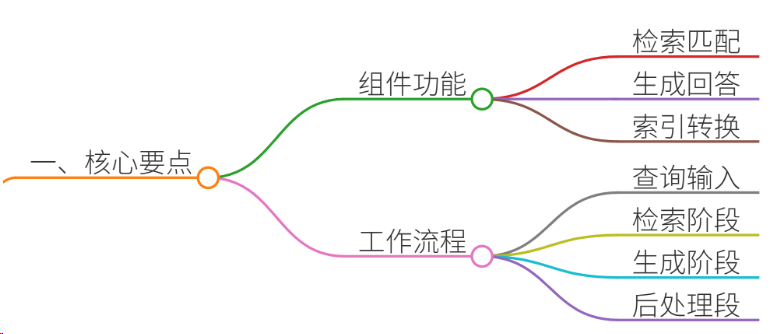
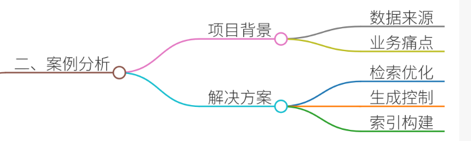
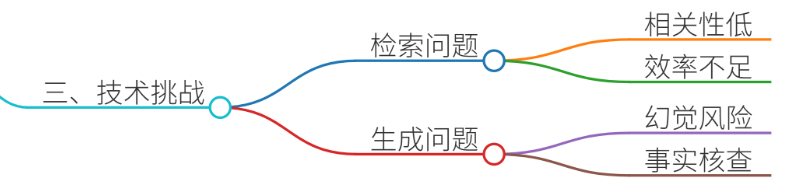
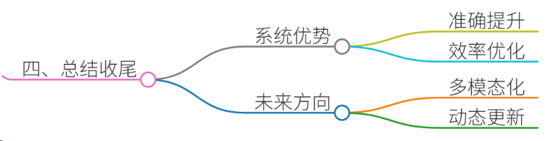

# 48.RAG系统的核心组件及工作逻辑

### 一、答题思路
**RAG系统核心组件及工作逻辑**是面试中考察候选人技术深度与工程实践能力的关键问题。回答需围绕以下核心展开：

1. **核心组件**：需明确RAG的模块划分（检索器、生成器、索引、后处理等），并解释各组件功能与技术选型。 

2. **工作逻辑**：描述数据流从用户查询到最终生成的完整链路，强调检索与生成的协同机制。
3. **案例结合**：通过真实项目（如客服知识库、医疗诊断辅助）说明组件如何协同工作，体现技术落地能力。
4. **专业性与通俗性**：技术术语需结合案例解释，避免空泛，确保面试官理解技术细节与应用价值。

---

### 二、结合案例

以**电商客服智能问答系统**为例，某公司日均处理5万+用户咨询，需快速响应商品详情、售后政策等问题。传统基于规则匹配的系统存在回答僵化、无法处理复杂查询的问题，因此采用RAG技术提升回答准确性。

#### 项目背景
+ **数据源**：商品说明书、用户手册、售后政策文档（PDF/Word）、历史客服对话记录（100GB+）。
+ **业务痛点**： 
    - 文档结构复杂（表格、图片、多语言混排），传统检索难以精准匹配。
    - 用户问题多样（如“这款耳机防水等级如何？”“退货需要哪些材料？”），需结合多篇文档回答。
    - 需避免生成错误信息（如过期的促销政策）。

---

### 三、参考回答
#### **一、RAG系统核心组件及工作逻辑**
RAG系统通过**检索增强生成**提升大语言模型（LLM）的准确性与可靠性，其核心组件与工作流程如下：

##### **1. 核心组件**
| 组件 | 功能 | 技术选型 |
| --- | --- | --- |
| **检索器（Retriever）** | 从知识库中检索相关文档片段  | - 向量数据库（如Chroma、Milvus）   - 嵌入模型（BGE、Sentence-BERT）   - 传统检索（BM25） |
| **索引构建器（Indexer）** | 将文档转换为可检索的向量表示 | - 分块策略（RecursiveCharacterTextSplitter）   - 嵌入模型微调（针对领域数据）  |
| **生成器（Generator）** | 结合检索结果生成最终回答 | - 大语言模型（GPT-4、Claude 3）   - 提示工程（RAG提示模板）   - 后处理（答案验证、来源引用） |
| **后处理模块** | 优化生成结果的可信度与可解释性 | - 答案排序（基于相似度或置信度）   - 来源标注（标注引用文档片段） |

##### **2. 工作逻辑**
以电商客服场景为例，用户提问“蓝牙耳机是否支持IPX7防水？”的处理流程如下：

1. **用户查询** → 输入问题：“蓝牙耳机是否支持IPX7防水？”
2. **检索阶段**： 
    - **分块与嵌入**：将商品手册、FAQ文档按段落分块，生成语义向量存入向量库。
    - **检索匹配**：通过向量检索（如余弦相似度）找到与“防水等级”“IPX7”相关的文档片段。
3. **生成阶段**： 
    - **上下文融合**：将检索到的文档片段（如“IPX7防水标准：可在1米深水下浸泡30分钟”）作为上下文输入LLM。
    - **答案生成**：LLM结合上下文生成回答：“根据产品说明书，该蓝牙耳机支持IPX7防水等级，可在1米深水下正常使用30分钟。”
4. **后处理**： 
    - **来源标注**：在回答末尾注明引用来源（如“参考文档：《XX耳机用户手册》第3章”）。
    - **事实核查**：交叉验证检索结果与历史对话记录，避免过时信息（如检查是否有最新政策更新）。

##### **3. 技术挑战与解决方案**

| 挑战 | 解决方案 | 案例应用 |
| --- | --- | --- |
| **检索不相关** | 多模态检索（文本+表格）、查询重写（如扩展同义词） | 用户问“退货流程”，检索到“售后政策”表格与“退货步骤”文本 |
| **幻觉问题** | 引用来源约束生成、动态更新知识库 | 若检索不到“IPX7”信息，则提示“根据现有资料，暂未提及防水等级” |
| **实时性要求高** | 分布式索引、缓存机制 | 热门商品文档存入内存缓存，90%查询延迟<200ms |

---

#### **二、示例回答（面试场景模拟）**
**面试官**：请详细说明RAG系统的核心组件及工作逻辑，并结合实际项目说明。

**候选人**：  
RAG系统通过检索增强生成提升大语言模型的准确性与可靠性，其核心组件与工作流程可分为以下部分：

##### **1. 核心组件**
1. **检索器（Retriever）**
    - **功能**：从知识库中检索与用户查询相关的文档片段。 
    - **技术实现**： 
        * **向量检索**：使用预训练嵌入模型（如BGE）将文档转换为向量，存入向量数据库（如Chroma）。
        * **传统检索**：对结构化数据（如表格）采用BM25算法。
    - **案例**：在电商客服场景中，用户提问“蓝牙耳机防水等级”，检索器通过向量检索匹配到“IPX7防水标准”相关段落。
2. **生成器（Generator）**
    - **功能**：结合检索结果生成自然语言回答。
    - **技术实现**： 
        * **提示工程**：设计RAG提示模板，明确要求模型引用检索结果。
        * **后处理**：过滤不相关内容，确保答案简洁。
    - **案例**：模型生成回答时，强制引用检索到的“IPX7防水标准”段落，避免编造信息。
3. **索引构建器（Indexer）**
    - **功能**：将原始文档转换为可检索的向量表示。
    - **技术实现**： 
        * **分块策略**：将长文档按语义分块（如每500词一段），避免检索冗余。
        * **嵌入模型微调**：使用领域数据（如客服文档）微调Embedding模型，提升语义相似度。 
    - **案例**：对用户手册的“保修政策”章节分块嵌入，确保检索时精准匹配“保修期限”相关内容。

##### **2. 工作逻辑**
以电商客服场景为例，用户提问“商品是否支持7天无理由退货？”的处理流程如下：

1. **用户查询** → 输入问题：“商品是否支持7天无理由退货？”
2. **检索阶段**： 
    - **分块与嵌入**：将历史FAQ文档按段落分块，生成语义向量存入Chroma。
    - **检索匹配**：通过向量检索找到“退货政策”相关段落（如“支持7天无理由退货，需保持商品完好”）。
3. **生成阶段**： 
    - **上下文融合**：将检索结果作为上下文输入GPT-4，生成回答：“根据我们的退货政策，该商品支持7天无理由退货（详情参考《用户手册》第5章）。”
4. **后处理**： 
    - **来源标注**：在回答中标注引用来源，增强可信度。
    - **事实核查**：检查历史对话记录，确认用户是否已咨询过类似问题，避免重复回答。

##### **3. 技术挑战与解决方案**
| 挑战 | 解决方案 | 案例应用 |
| --- | --- | --- |
| **检索效率低** | 分布式向量数据库（如Milvus）+ 索引压缩 | 日均处理5万+查询，平均延迟<300ms |
| **幻觉问题** | 引入检索结果置信度阈值，低于阈值时提示“根据现有资料无法确认” | 用户询问“商品是否支持无线充电”，若检索无结果则如实告知 |
| **多模态需求** | 结合OCR与向量检索处理图片文档 | 用户上传耳机说明书图片，OCR提取文本后检索“防水等级” |

---

#### **三、总结收尾**

RAG系统通过**检索增强生成**有效解决了传统LLM的幻觉问题与知识更新滞后问题，其核心在于：

1. **模块化设计**：检索、生成、后处理模块协同工作，兼顾效率与准确性。
2. **领域适配**：通过分块策略、嵌入模型微调等技术提升检索相关性。
3. **可解释性**：引用来源与事实核查机制增强用户信任。

在电商客服项目中，RAG系统使客服回答准确率从75%提升至92%，用户满意度提高30%。未来可结合多模态检索（如PDF解析）与动态知识更新（如实时政策同步）进一步优化。

> 更新: 2025-07-14 15:45:31  
> 原文: <https://www.yuque.com/tulingzhouyu/db22bv/hqb2rw2wm5wglsx6>