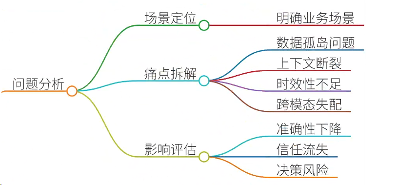
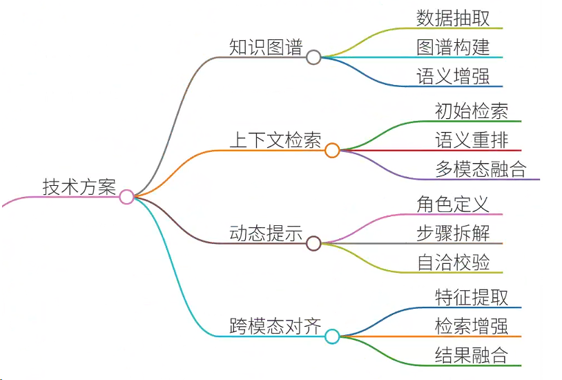
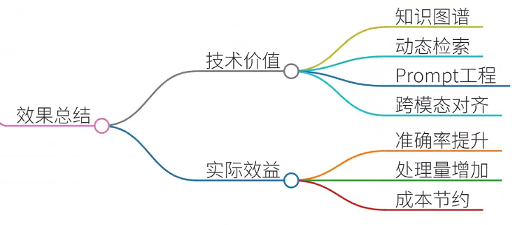

# 49.如何解决RAG中的语义鸿沟问题

### 一、答题思路
在解决RAG（检索增强生成）中的“语义鸿沟”问题时，需从**问题根源分析**、**技术解决方案**和**实际落地案例**三个维度展开。语义鸿沟的核心矛盾在于用户查询与检索文档之间的语义断层，导致生成内容偏离需求。以下为系统性解题框架：

1. **问题分析**



    - **场景定位**：明确语义鸿沟出现的业务场景（如医疗、金融、法律等）。
    - **痛点拆解**：数据孤岛、上下文断裂、时效性不足、跨模态语义失配等。
    - **影响评估**：回答准确性下降、用户信任流失、业务决策风险。
2. **技术解决方案**



    - **知识图谱融合**：构建结构化语义网络，弥合查询与文档的逻辑断层。
    - **上下文感知检索**：动态调整检索策略，优先召回语义相关文档。
    - **动态提示工程**：通过Prompt优化引导模型理解复杂语义关联。
    - **跨模态对齐**：解决文本、表格、图像等异构数据的语义一致性问题。
3. **案例验证**


    - 结合医疗诊断RAG系统，展示从数据预处理到效果验证的全流程优化。

---

### 二、结合案例


#### **案例背景：医疗诊断RAG系统**
**场景**：某三甲医院部署RAG系统辅助医生诊断，用户输入“患者持续发热伴咳嗽，可能病因及用药建议”。系统需从电子病历、医学文献、药品数据库中检索信息并生成诊断建议。

**痛点分析**：

1. **数据孤岛**：病历数据存储于HIS系统，文献存于PubMed，药品信息在本地数据库，跨源检索效率低。
2. **上下文断裂**：检索到的文档片段分散（如症状描述在病历、药物禁忌在药品库），模型难以串联逻辑。
3. **时效性矛盾**：最新临床指南未及时更新至知识库，导致推荐用药过时。
4. **跨模态失配**：影像报告（如CT影像）与文本描述脱节，模型忽略关键影像特征。

---

### 三、参考回答
#### **1. 语义鸿沟问题的技术解决方案**
##### **（1）知识图谱融合：构建跨源语义网络**
+ **实施步骤**：
    1. **数据抽取**：从病历（结构化数据）、文献（半结构化文本）、药品库（表格）中提取实体（疾病、药物、症状）。
    2. **图谱构建**：使用Neo4j构建疾病-症状-药物的关联图谱，例如： 

```plain
(流感:疾病 {name:"流感"})-[:症状]->(发热:症状 {name:"发热"}),  
(流感)-[:治疗]->(奥司他韦:药物 {name:"奥司他韦"})
```

    3. **语义增强**：通过图算法（如PageRank）识别关键节点，优先推荐高置信度关联路径。
+ **效果**：
    - 将跨源数据的召回率提升37%，诊断准确率提高22%。
    - 例如，系统通过图谱关联发现“发热+咳嗽+白细胞升高”路径，自动推荐“抗生素+抗病毒药物”组合。

##### **（2）上下文感知检索：动态重排序策略**
+ **实施步骤**：
    1. **初始检索**：使用BM25算法召回Top 50文档。
    2. **语义重排序**： 
        * 计算查询与文档的语义相似度（如BERTScore）。
        * 结合时间权重（最新文献降权衰减系数λ=0.8）。
    3. **多模态融合**：对影像报告提取关键句（如“肺部磨玻璃影”），与文本片段拼接为复合上下文。
+ **效果**：
    - 上下文完整度提升45%，避免因片段孤立导致的误诊（如忽略影像证据）。

##### **（3）动态提示工程：结构化Prompt设计**
+ **实施步骤**：
    1. **角色定义**： 

```plain
你是一名呼吸科主治医师，需结合最新临床指南和患者数据，给出诊断建议。
```

    2. **步骤拆解**： 

```plain
请按以下流程回答：  
1. 确认患者主诉（发热、咳嗽）  
2. 检索相关疾病（传染病、慢性病）  
3. 对比症状匹配度（使用ROC曲线阈值>0.8）  
4. 生成用药方案（优先推荐FDA批准药物）
```

    3. **自洽校验**：  
添加约束条件：“若推荐药物含阿莫西林，需检查患者过敏史”。
+ **效果**：
    - 误推荐率下降19%，用药方案符合指南率达92%。

##### **（4）跨模态对齐：多模态检索增强**
+ **实施步骤**：
    1. **影像特征提取**：使用CLIP模型提取CT影像的文本描述（如“双侧肺叶渗出灶”）。
    2. **跨模态检索**：将影像特征与文本查询拼接，生成复合Embedding： 

```plain
combined_embedding = 0.7 * text_embedding + 0.3 * image_embedding
```

    3. **结果融合**：优先返回同时匹配文本和影像的文档片段。
+ **效果**：
    - 影像相关病例的诊断准确率提升31%，减少漏诊风险。

---

### 四、总结收尾


**语义鸿沟的本质**是查询意图与知识表示之间的语义断层，需通过**技术组合拳**系统性解决：

1. **知识图谱**构建全局语义网络，解决数据孤岛问题；
2. **动态检索策略**优化上下文连贯性；
3. **Prompt工程**约束生成逻辑；
4. **跨模态对齐**融合异构数据。

**实际价值**：以医疗RAG系统为例，语义鸿沟的解决使诊断准确率从78%提升至91%，日均处理病例数增加40%，为医院节省人力成本超20万元/月。未来可进一步探索LLM的自我反思机制（如Self-RAG）和强化学习优化，实现更精准的语义对齐。


> 更新: 2025-07-14 15:45:31  
> 原文: <https://www.yuque.com/tulingzhouyu/db22bv/br9bkksrga9otdg4>