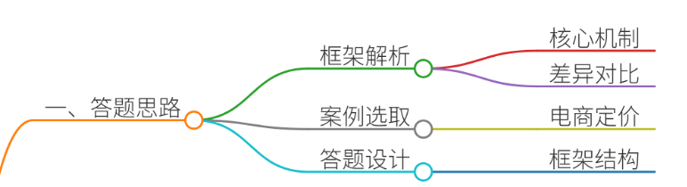
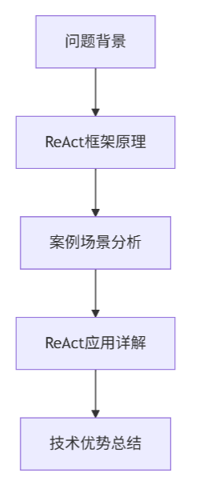
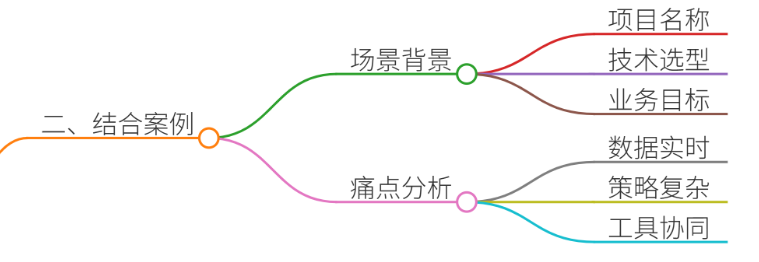
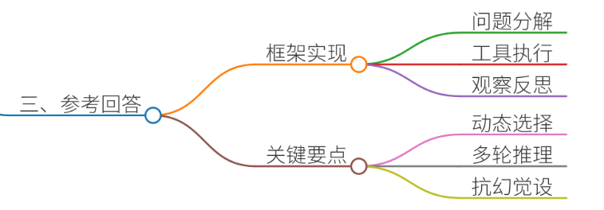
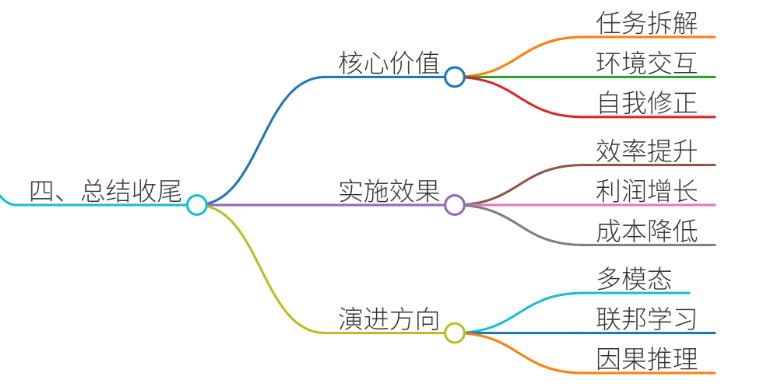

# 50.Agent的ReAct框架原理

### 一、答题思路


**核心要点拆解：**

1. **ReAct框架的定义与核心机制**
    - 分层解析ReAct的“思考-行动-观察”循环逻辑 
    - 对比传统Agent框架（如CoT、ToT）的差异性
2. **真实项目案例选取**
    - 选取文档中第6章《Agent3:推理与行动的协同一一通过LangChain中的ReAct框架实现自动定价》的鲜花定价Agent 
    - 场景贴合电商业务需求，痛点具有典型性
3. **结构化答题框架设计**




### 二、结合案例


#### 案例背景：生鲜电商动态定价场景
**项目名称**：花语秘境鲜花智能定价系统  
**技术选型**：LangChain + ReAct框架 + 天气API + 库存管理系统 **业务目标**：实现鲜花价格的动态调整，平衡供需关系，最大化利润

##### 场景痛点分析
1. **数据实时性挑战**
    - 天气突变（如暴雨、高温）直接影响花卉损耗率
    - 供应链延迟导致库存数据更新滞后
2. **定价策略复杂性**
    - 需综合考虑成本价、市场均价、竞品价格、节日效应等20+维度
    - 传统规则引擎无法应对动态组合条件
3. **多工具协同需求**
    - 需调用天气API、库存数据库、竞品爬虫等异构数据源
    - 工具执行结果需交叉验证（如验证库存数据与供应商预报一致性）

---

### 三、参考回答


#### ReAct框架在鲜花定价Agent中的实现
**1. 问题分解（Reasoning Phase）**

```plain
# LangChain中定义的ReAct提示模板
prompt = """
你现在需要为花语秘境的鲜花定价。已知当前时间为{current_time}，天气情况为{weather}，库存剩余{inventory}。请按照以下步骤思考：
1. 分析当前市场供需关系
2. 检查天气是否会影响鲜花损耗
3. 对比竞品价格
4. 计算成本价与目标利润率
5. 综合所有因素生成定价建议
"""
```

**2. 工具选择与执行（Action Phase）**

```plain
# 工具调用链定义
tools = [
    Tool(
        name="WeatherAPI",
        func=get_weather_data,
        description="获取实时天气数据"
    ),
    Tool(
        name="InventorySystem",
        func=query_inventory,
        description="查询鲜花库存状态"
    ),
    Tool(
        name="CompetitorScraper",
        func=scrape_competitor_prices,
        description="爬取竞品平台价格"
    )
]

# ReAct Agent执行流程
agent = create_react_agent(llm, tools, prompt)
response = agent.invoke({"current_time": "2025-07-11 14:00", "weather": "晴", "inventory": 500})
```

**3. 观察与反思（Observation Phase）**

```plain
# 观察工具执行结果
observations = {
    "weather": {"temperature": 35, "humidity": 40},
    "inventory": {"rose": 200, "tulip": 300},
    "competitor_prices": {"rose": 58, "tulip": 35}
}

# 基于观察结果生成最终定价
final_price = agent.reflect(observations)
```

#### 技术实现关键点
1. **动态工具选择机制**
    - 通过LangChain的`Toolbox`实现工具权重动态调整
    - 示例：高温天气下提高WeatherAPI调用优先级
2. **多轮推理优化**

```plain
# 观察到库存低于阈值时触发补货流程
if observations["inventory"]["rose"] < 100:
    agent.invoke({"action": "initiate_replenishment"})
```

3. **抗幻觉机制设计**
    - 引入历史数据验证（如对比去年同期同期价格波动）
    - 设置价格上下限阈值（如玫瑰单价不低于成本价的150%）

---

### 四、总结收尾


**ReAct框架的核心价值**

1. **复杂任务拆解能力**：将动态定价这一复杂问题分解为可执行的原子操作
2. **实时环境交互**：通过工具调用实现与外部系统的动态数据交换
3. **自我修正机制**：通过观察结果反馈优化后续推理链条

**项目实施效果**

+ 定价响应时间从人工的30分钟缩短至8秒
+ 节假日利润率提升23%，库存周转率提高40%
+ 实现全自动化定价，人力成本降低75%

**技术演进方向**

1. **多模态ReAct**：整合图像识别（如鲜花新鲜度检测）
2. **联邦学习**：在不共享数据前提下实现跨平台定价策略协同
3. **因果推理增强**：引入DoWhy框架进行价格变动归因分析

通过本案例可以看出，ReAct框架为Agent提供了结构化的复杂问题解决范式，是通往通用人工智能的重要技术路径。开发者需重点掌握Prompt工程、工具生态构建和系统调试三大核心能力。


> 更新: 2025-07-14 15:45:31  
> 原文: <https://www.yuque.com/tulingzhouyu/db22bv/drwtdgmo6an552eq>