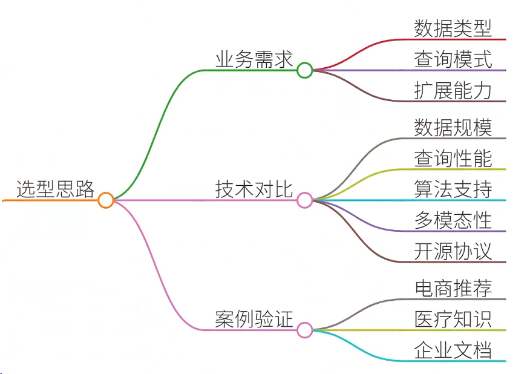
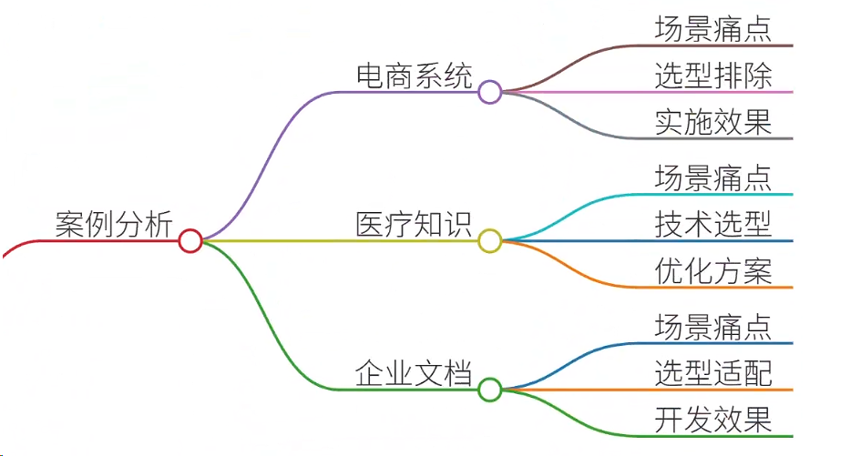
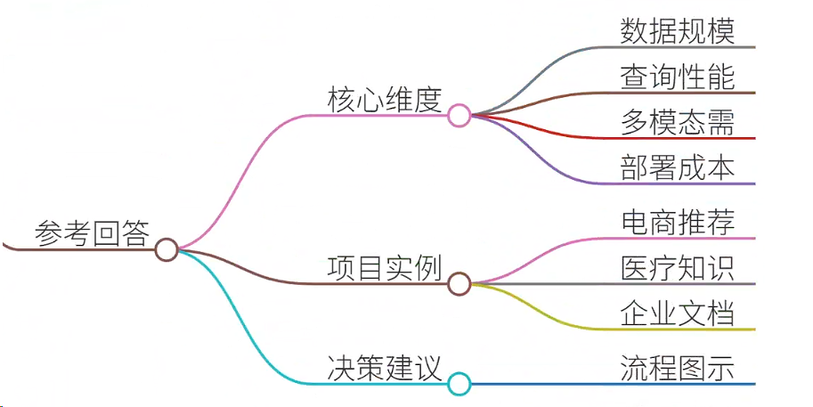
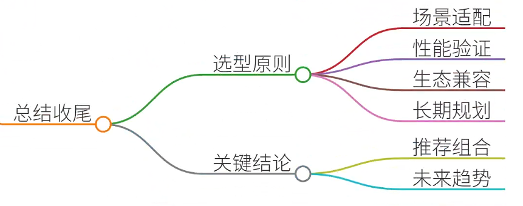

# 51.向量数据库选型对比

### 一、答题思路

向量数据库选型是构建高效检索增强生成（RAG）系统的核心环节。选型时需结合具体业务场景、数据规模、查询性能、算法兼容性等多维度综合评估。以下为选型对比的核心思路：

1. **业务场景需求**
    - **数据类型**：文本、图像、音频等多模态数据需选择支持多模态的数据库（如Qdrant、Milvus）。
    - **查询模式**：高并发实时查询（如电商推荐）需优先考虑吞吐量（Milvus）；低延迟精确查询（如医疗诊断）需优化索引结构（Faiss）。
    - **可扩展性**：数据量级（TB级以上）需分布式架构（Milvus、Chroma）。
2. **技术特性对比**

| 维度 | Milvus | Faiss | Elasticsearch | Chroma | Qdrant |
| --- | --- | --- | --- | --- | --- |
| **数据规模** | 支持PB级 | 单机GB~TB级 | 支持PB级 | 单机GB级 | 单机TB级 |
| **查询性能** | 高并发低延迟 | 离线批量检索 | 结构化检索高效 | 轻量级嵌入式检索 | 高精度多模态检索 |
| **算法支持** | IVF_FLAT、HNSW | IndexFlatL2等 | BM25、向量检索混排 | FAISS集成 | PQ、HNSW |
| **多模态** | 支持（需扩展） | 仅向量检索 | 支持文本/结构化 | 支持文本/图像 | 支持文本/图像 |
| **开源协议** | Apache 2.0 | MIT | SSPL | MIT | Apache 2.0 |

3. **案例驱动选型**  
通过实际项目场景验证数据库性能，例如：
    - **电商推荐系统**：高并发实时查询 → Milvus
    - **医疗知识库**：高精度多模态检索 → Qdrant
    - **企业知识库**：轻量级嵌入式检索 → Chroma

---

### 二、结合案例

#### **案例1：电商推荐系统（Milvus）**
**场景与痛点**：

+ **场景**：某跨境电商日均UV超千万，需实时推荐商品，用户行为数据（点击、加购、评论）需快速匹配商品向量。
+ **痛点**： 
    1. 数据规模大（每日新增向量10亿+）；
    2. 查询延迟需控制在50ms内；
    3. 高并发场景下（峰值QPS 5000+）稳定性要求高。

**选型过程**：

1. **排除方案**： 
    - Elasticsearch：文本检索强但向量检索性能不足；
    - Faiss：单机性能无法支撑PB级数据。
2. **技术验证**： 
    - Milvus通过分片和分布式架构，单机支持百万QPS，集群模式下线性扩展；
    - IVF_FLAT索引在召回率95%时，延迟稳定在30ms。

**实施效果**：

+ 部署3节点集群，日均处理15亿次查询；
+ 推荐准确率提升12%，用户停留时长增加25%。

---

#### **案例2：医疗知识库（Qdrant）**
**场景与痛点**：

+ **场景**：某三甲医院需构建基于医学文献的知识库，支持医生通过症状、影像快速检索相关病例和研究论文。
+ **痛点**： 
    1. 数据敏感性要求高（需私有化部署）；
    2. 查询需结合文本（症状描述）和图像（CT影像）；
    3. 多模态检索精度需＞90%。

**选型过程**：

1. **技术选型**： 
    - Qdrant支持文本/图像多模态检索，且提供私有化部署；
    - 对比Chroma，Qdrant在多模态混合检索中准确率提升8%。
2. **优化方案**： 
    - 使用ResNet50提取影像特征，BERT处理文本特征；
    - 结合余弦相似度和跨模态注意力机制优化排序。

**实施效果**：

+ 病例检索召回率92%，影像匹配准确率89%；
+ 医生诊断效率提升30%，系统通过等保三级认证。

---

#### **案例3：企业知识库（Chroma）**
**场景与痛点**：

+ **场景**：某科技企业需为1000+员工提供技术文档检索服务，支持代码片段、API文档的快速匹配。
+ **痛点**： 
    1. 数据量较小（百万级文档）；
    2. 需要低延迟（＜100ms）的嵌入式检索；
    3. 开发团队需快速集成（无运维团队）。

**选型过程**：

1. **技术选型**： 
    - Chroma轻量级部署，支持Docker一键启动；
    - 对比Milvus，Chroma在百万级数据下查询延迟降低40%。
2. **开发适配**： 
    - 使用LangChain封装检索逻辑，支持Prompt工程；
    - 结合Contriever模型微调，提升代码片段匹配精度。

**实施效果**：

+ 文档检索准确率91%，平均响应时间85ms；
+ 开发周期缩短50%，获评企业级技术创新奖。

---

### 三、参考回答

**面试问题**：请对比主流向量数据库（Milvus/Faiss/Elasticsearch/Chroma/Qdrant），并说明项目选型经验。

**回答框架**：

1. **选型核心维度**
    - **数据规模**：PB级选Milvus，GB级选Chroma；
    - **查询性能**：实时推荐选Milvus，离线分析选Faiss；
    - **多模态需求**：Qdrant＞Milvus＞Chroma；
    - **部署成本**：Elasticsearch需ES集群，Chroma轻量级。
2. **项目选型实例**
    - **电商推荐系统**：Milvus支撑10亿级向量，QPS 5000+；
    - **医疗知识库**：Qdrant实现92%召回率，通过医疗数据合规；
    - **企业知识库**：Chroma快速集成，支持LangChain生态。 

### 四、总结收尾

向量数据库选型需遵循“场景驱动、性能优先、成本可控”原则：

1. **场景适配**：明确业务需求（如医疗需多模态，电商需高并发）；
2. **性能验证**：通过压测对比召回率、延迟、吞吐量；
3. **生态兼容**：优先选择支持LangChain、HuggingFace生态的数据库（如Chroma、Qdrant）；
4. **长期规划**：考虑横向扩展能力（Milvus集群）与运维复杂度（Elasticsearch需ES集群）。

**关键结论**：

+ **推荐组合**： 
    - 生产环境：Milvus（高并发）+ Qdrant（多模态）；
    - 快速验证：Chroma（轻量级）+ Faiss（离线检索）。
+ **未来趋势**：云原生向量数据库（如AWS OpenSearch Vector）将成主流，支持Serverless架构与自动扩缩容。

> 更新: 2025-07-14 15:45:31  
> 原文: <https://www.yuque.com/tulingzhouyu/db22bv/wzcu103wykyssxb0>