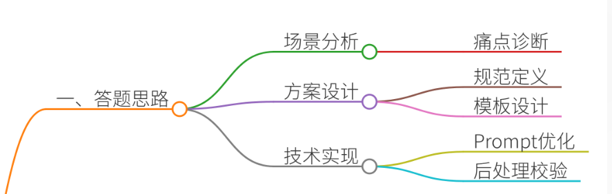
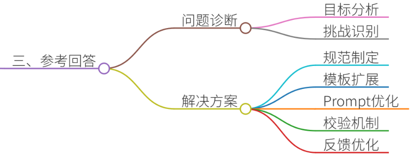
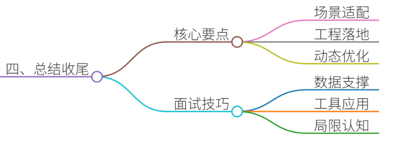

# 52.大模型输出格式如何控制

### 一、答题思路
在回答“大模型输出格式控制”问题时，需结合项目经验，从**场景痛点分析→解决方案设计→技术实现路径→效果验证优化**四个维度展开。重点突出对业务需求的理解、工程化落地能力以及对大模型特性的把控。以下为结构化思路：



### 二、结合案例


#### **案例背景：某电商智能客服系统输出格式失控问题**
**场景**：某电商平台上线基于大模型的智能客服系统，初期用户反馈“回答内容杂乱”“关键信息分散”“格式不统一”，导致客服效率下降，用户投诉率上升。  
**痛点**：

1. **格式不一致**：部分回答使用Markdown表格，部分为纯文本，用户阅读成本高；
2. **信息遗漏**：关键商品参数（如尺寸、保修期）未结构化展示；
3. **可读性差**：长文本段落冗长，缺乏分点说明；
4. **维护困难**：开发团队需频繁手动调整回复模板，迭代效率低。

---

### 三、参考回答


#### **1. 问题诊断与需求分析**
+ **业务目标**：提升客服回答的**结构化程度**和**信息密度**，降低用户理解成本；
+ **技术挑战**：大模型自由生成的特性导致格式难以约束，需平衡**灵活性**与**规范性**。

#### **2. 解决方案设计**
##### **（1）定义输出规范**
+ **格式标准**：制定JSON Schema，强制要求回答包含`answer_type`（文本/表格/代码）、`key_info`（核心参数）、`answer_body`（正文）字段；
+ **分级策略**： 
    - **简单问题**：直接返回JSON格式；
    - **复杂问题**：生成Markdown表格或分步骤说明。

##### **（2）设计可扩展模板**
+ **占位符机制**：在Prompt中嵌入动态占位符，例如： 

```plain
"请以JSON格式返回结果，包含字段：{{answer_type}}, {{key_info}}, {{answer_body}}。"
```

+ **条件逻辑控制**：根据问题类型切换模板，例如： 

```plain
如果用户询问商品参数，则生成表格；  
如果用户要求代码示例，则使用代码块包裹。
```

##### **（3）Prompt工程优化**
+ **角色设定**：明确大模型为“结构化信息助手”，任务为“生成符合电商规范的客服回答”；
+ **示例引导**：提供多组格式正确的范例，例如： 

```plain
{  
  "answer_type": "表格",  
  "key_info": {  
    "型号": "X1000",  
    "价格": "¥999",  
    "保修期": "1年"  
  },  
  "answer_body": "推荐型号X1000，性价比高..."  
}
```

+ **思维链提示**：要求大模型分步骤生成内容，例如： 

```plain
第一步：提取商品参数  
第二步：组织表格结构  
第三步：生成自然语言描述
```

##### **（4）后处理校验与修正**
+ **Schema验证**：通过JSON Schema校验生成结果，拦截格式错误；
+ **规则引擎**：设置敏感词过滤、数据对齐等规则；
+ **人工复核**：对异常回答进行标注，反向优化Prompt模板。

##### **（5）动态反馈优化**
+ **用户行为分析**：统计用户对不同格式回答的点击率、停留时长；
+ **在线学习**：定期用高满意度回答更新Prompt模板库。

---

### 四、总结收尾


**核心要点**：

1. **场景化设计**：输出格式需贴合业务需求（如客服场景强调简洁清晰）；
2. **工程化落地**：Prompt工程+后处理校验是控制格式的核心手段；
3. **动态优化**：通过用户反馈持续迭代模型输出能力。

**面试加分技巧**：

+ 结合具体项目数据（如格式正确率提升20%）；
+ 提及工具链（如LangChain的Agent框架、PromptPerfect优化工具）；
+ 强调对大模型局限性的认知（如无法完全替代人工校验）。

通过此案例，可充分展现候选人对大模型输出控制的系统性思考与落地能力。


> 更新: 2025-07-14 15:45:31  
> 原文: <https://www.yuque.com/tulingzhouyu/db22bv/cre946xrbixa3nty>