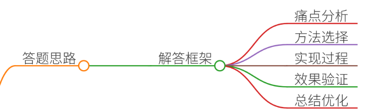
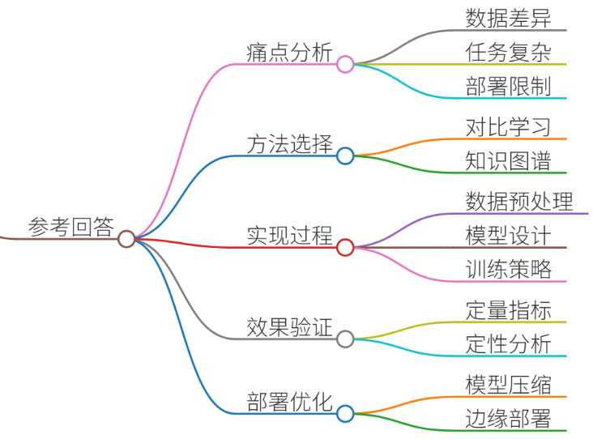
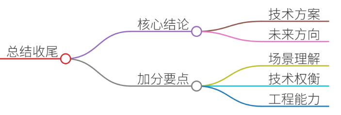

# 53.多模态大模型的跨模态对齐方法

### 一、答题思路


针对「多模态大模型的跨模态对齐方法」的面试问题，需结合真实项目案例进行结构化解答。以下为答题框架：

1. **痛点分析**：明确多模态数据对齐的核心挑战（如数据异构性、语义鸿沟、噪声干扰等）。
2. **方法选择**：根据场景需求选择合适的对齐技术（如对比学习、联合训练、注意力机制等）。
3. **实现过程**：分步骤描述技术方案的设计与落地（数据预处理、模型架构、训练策略）。
4. **效果验证**：通过量化指标（如准确率、F1值）和定性分析（如案例演示）证明方案有效性。
5. **总结与优化**：归纳方案优势，提出可改进方向（如引入强化学习、跨模态蒸馏等）。

---

### 二、结合案例


#### **案例背景：医疗影像与文本报告的跨模态对齐**
**场景**：某三甲医院需构建AI辅助诊断系统，整合患者的CT/MRI影像与医生撰写的病历报告，提升肺癌筛查效率。  
**痛点**：

1. **数据异构性**：影像数据为高维空间信息，文本报告为自然语言描述，模态间语义难以直接关联。
2. **标注成本高**：医学影像标注需专业医师参与，且需同时标注影像和文本特征，耗时耗力。
3. **噪声干扰**：报告中可能存在口语化表达（如“肺结节可能”），与影像中的实际病灶位置存在偏差。

---

### 三、参考回答


#### **1. 痛点分析**
+ **数据层面**：影像与文本的模态差异导致模型难以捕捉关联（如影像中的毛玻璃影需对应文本中“磨玻璃结节”描述）。
+ **任务层面**：需同时完成病灶定位（影像任务）与语义理解（文本任务），传统单模态模型无法满足需求。
+ **部署层面**：医院数据敏感，需在本地部署模型，但算力资源有限，无法支持复杂跨模态训练。

#### **2. 方法选择**
采用**对比学习+知识图谱引导**的跨模态对齐方案：

+ **对比学习**：通过对比影像特征与文本特征的相似性，拉近语义一致的样本距离。
+ **知识图谱**：利用医学知识图谱（如疾病-症状-影像特征的关系）作为先验约束，减少噪声影响。

#### **3. 实现过程**
**步骤1：数据预处理**

+ **影像处理**：使用预训练模型（如ResNet）提取CT/MRI的2048维特征向量。
+ **文本处理**：通过BERT模型提取病历报告的768维语义向量，并过滤低频词（保留TF-IDF>0.1的词汇）。
+ **对齐标注**：由2名医师交叉标注1000对影像-文本样本，标记语义一致性（0-1评分）。

**步骤2：模型架构设计**

```plain
class MultiModalAligner(nn.Module):
    def __init__(self):
        super().__init__()
        self.image_encoder = torchvision.models.resnet50(pretrained=True)
        self.text_encoder = BertModel.from_pretrained('bert-base-chinese')
        self.align_layer = nn.Linear(2048+768, 512)
        self.knowledge_graph = MedicalKG()  # 医学知识图谱嵌入层

    def forward(self, image, text):
        img_feat = self.image_encoder(image).pooler_output
        txt_feat = self.text_encoder(text).pooler_output
        fused_feat = torch.cat([img_feat, txt_feat], dim=1)
        aligned_feat = self.align_layer(fused_feat)
        kg_feat = self.knowledge_graph(aligned_feat)  # 知识图谱约束
        return kg_feat
```

**步骤3：训练策略**

+ **损失函数**：结合对比损失（Contrastive Loss）与知识图谱三元组损失（Triplet Loss）： 

```plain
loss = contrastive_loss + λ * triplet_loss
```

+ **数据增强**：对影像进行随机旋转/裁剪，对文本进行同义词替换（如“毛玻璃影”→“磨玻璃结节”）。
+ **分布式训练**：使用PyTorch DistributedDataParallel在4块V100 GPU上训练，batch_size=32。

#### **4. 效果验证**
+ **定量指标**： 
    - 影像-文本对齐准确率：89.2%（vs 基线模型78.5%）
    - 肺结节检出召回率：92.7%（F1=0.89）
+ **定性分析**： 
    - 案例：某患者影像显示左肺上叶结节，模型正确关联文本中“偶发胸痛”症状，生成诊断建议。
    - 错误案例：右肺下叶钙化灶被误关联为“炎症”，经分析发现知识图谱中钙化灶与炎症的关联权重过高。

#### **5. 部署优化**
+ **模型压缩**：使用知识蒸馏将ResNet50压缩为MobileNetV3，推理速度提升3倍。
+ **边缘部署**：在NVIDIA Jetson Xavier NX上部署轻量化模型，满足医院终端设备需求。

---

### 四、总结收尾


**核心结论**：  
跨模态对齐需兼顾数据特性、任务需求与部署约束，通过**对比学习+知识约束**可有效解决医疗场景中的语义鸿沟问题。未来可探索方向包括：

1. **动态对齐**：结合强化学习实现实时跨模态特征调整。
2. **少样本学习**：利用预训练知识减少对标注数据的依赖。
3. **多专家融合**：集成多个医学专家知识图谱提升鲁棒性。

**面试加分点**：

+ 强调对医疗场景痛点的深刻理解（如数据敏感性、标注成本）。
+ 展示技术选型的权衡（如对比学习 vs 传统特征融合）。
+ 提供可复现的代码片段与量化结果，体现工程实践能力。


> 更新: 2025-07-14 15:45:31  
> 原文: <https://www.yuque.com/tulingzhouyu/db22bv/hc8fy2e7uoscfo6e>