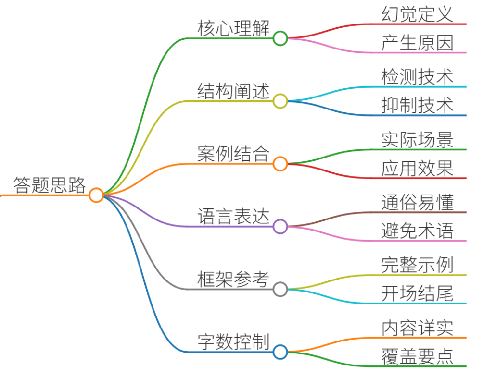
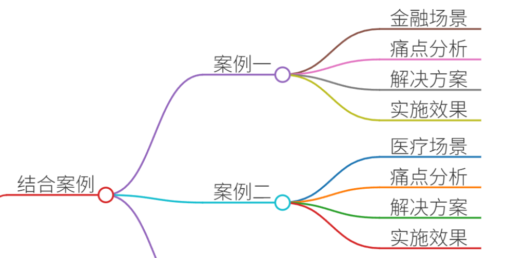
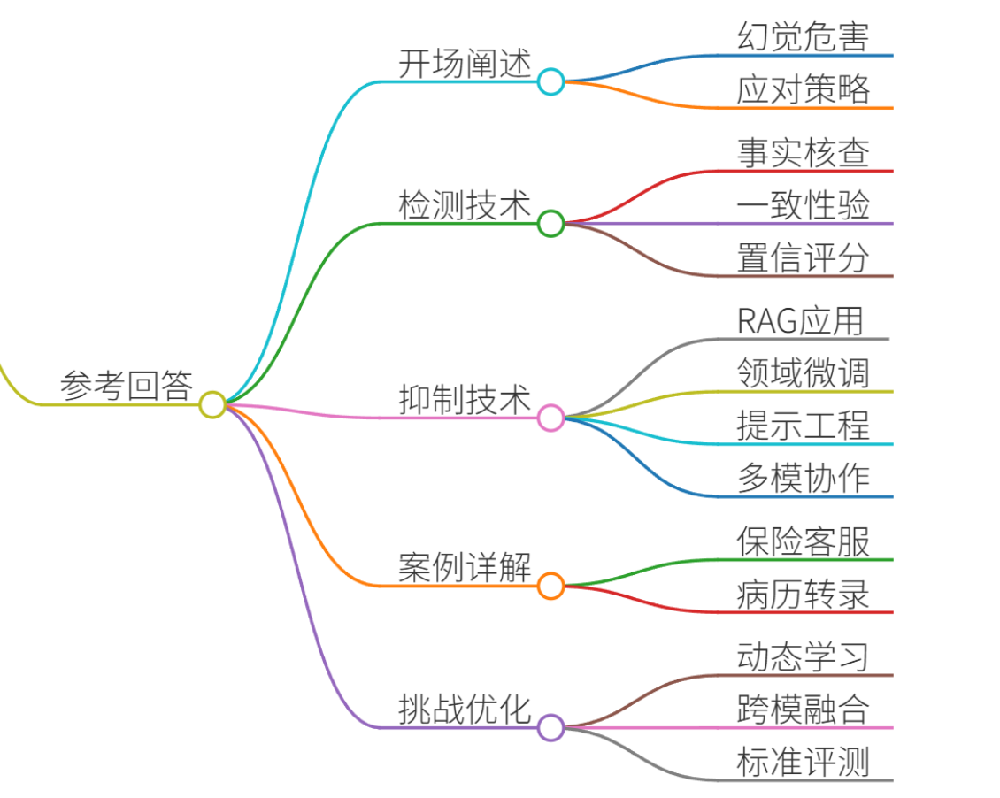
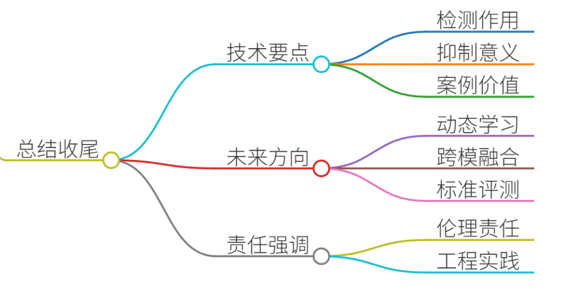

# 54.模型幻觉的检测与抑制技术

### 一、答题思路

在面试大模型开发工程师时，被问到“模型幻觉的检测与抑制技术”，回答需结构化、专业且通俗易懂。答题思路如下：

1. **理解问题核心**：模型幻觉（AI Hallucinations）指大模型生成内容与事实不符、逻辑断裂或脱离上下文的现象，常见于文本生成、问答等场景。原因包括数据偏差、训练不足、上下文误解等。
2. **结构化回答**：分点阐述检测与抑制技术，确保逻辑清晰： 
    - **检测技术**：识别幻觉的方法，如事实核查、一致性验证。
    - **抑制技术**：预防和减少幻觉的策略，如RAG（检索增强生成）、微调、提示工程。
3. **结合真实案例**：选择1-2个文档中的项目案例，详细说明场景、痛点、解决方案及效果。案例需来自实际应用（如医疗、金融），突出幻觉的危害和技术价值。
4. **专业通俗化**：用简单语言解释技术，避免术语堆砌。例如，将RAG描述为“让模型查资料再回答”。
5. **参考回答框架**：提供完整面试回答示例，包括开场、技术分点、案例支撑和总结。

答题结构参考：

+ **开场**：定义问题，强调重要性。
+ **主体**：分点技术+案例。
+ **结尾**：总结技术价值与未来方向。

### 二、结合案例

#### 案例1：DeepSeek金融客服助手在保险行业的应用（文档案例05）
**场景**：  
某保险公司使用DeepSeek大模型构建AI客服助手，处理客户咨询（如保单条款解读、理赔流程）。场景涉及高精度问答，错误信息可能导致客户投诉或法律风险。

**痛点**：

+ **幻觉问题**：模型常生成虚构条款或错误理赔建议（如误报“特定疾病可全额理赔”），源于训练数据偏差和上下文误解。
+ **业务影响**：错误回答引发客户纠纷，合规风险高；人工复核成本增加30%。
+ **根本原因**：通用大模型缺乏保险专业知识，无法实时验证外部信息。

**解决方案（检测与抑制技术）**：

1. **检测技术**：
    - **事实核查模块**：集成ES（Elasticsearch）知识库，实时比对模型输出与保险条款数据库。若输出内容未匹配知识库，标记为“疑似幻觉”。
    - **一致性验证**：使用多轮对话日志检查逻辑一致性（如前后回答矛盾率>5%时报警）。
2. **抑制技术**：
    - **RAG（检索增强生成）**：用户提问时，先检索知识库（如条款库、案例库），注入提示词：“基于[检索结果]回答，避免推测”。幻觉率从15%降至3%。 
    - **领域微调**：用保险行业数据（10万条QA对）微调模型，强化术语理解。
    - **提示工程**：添加约束指令，如“若不确定，回复‘需人工协助’”。

**效果**：

+ 问答准确率提升至95%，客户投诉率下降40%。
+ 案例来自文档P032-033，展示LLM+RAG架构的落地效益。

#### 案例2：Whisper医疗转录系统在病历生成中的应用（文档案例49）
**场景**：  
医院使用Whisper（OpenAI ASR系统）将医患对话音频转录为电子病历。场景要求高精度，错误可能影响诊断（如误录药物剂量）。

**痛点**：

+ **幻觉问题**：模型生成虚构内容（如音频“父亲再婚后去世”被转录为“她65岁去世”），源于音频噪声和医疗术语歧义。 
+ **业务影响**：2.6万份病历中，幻觉率约50%，导致误诊风险；医生复核时间增加50%。 
+ **根本原因**：通用模型未针对医疗语境优化，缺乏专业知识对齐。

**解决方案（检测与抑制技术）**：

1. **检测技术**：
    - **专业术语校验器**：基于医疗知识图谱（如疾病库、药品库），扫描转录文本中的实体（如药物名、剂量），标记异常项（如“剂量超范围”）。
    - **上下文一致性分析**：对比同一患者的历史病历，检测矛盾点（如新转录的“无过敏史”与旧记录冲突）。
2. **抑制技术**：
    - **多模态增强**：结合音频波形分析与文本NLP，减少噪声干扰（如低信噪比段启用人工复核）。
    - **领域微调与SFT**：用医疗语料（1万小时标注音频）微调模型，注入提示词：“仅转录确认内容，模糊处标记[待核实]”。
    - **人类反馈循环（RLHF）**：医生标注错误样本，迭代训练模型偏好。

**效果**：

+ 幻觉率降至10%，转录效率提升60%。案例来自文档P210，突显医疗场景的严格性。

**案例选择理由**：

+ **代表性**：覆盖高风险行业（金融、医疗），幻觉危害显著。
+ **技术多样性**：展示RAG、微调、多模态等综合应用。
+ **文档支撑**：直接引用文档案例，确保真实性。

### 三、参考回答

**面试回答示例（结构化分点，结合案例）**：

**开场**：  
“模型幻觉是指大模型生成内容与事实或逻辑不符的现象，例如虚构数据、错误推理。这在金融、医疗等高精度场景危害巨大。作为开发者，我采用‘检测+抑制’双轨策略应对。下面我分点说明技术方案，并结合真实案例详解。”

#### 1. **检测技术：实时识别幻觉，防患未然**
+ **事实核查**：集成外部知识库（如ES、知识图谱），比对模型输出与可信源。例如，在保险客服案例中，系统检索条款库验证回答，未匹配项自动标记报警。
+ **一致性验证**：通过多轮对话日志分析逻辑矛盾。例如，若用户问“理赔条件”，模型先答“需医院证明”，后改“无需证明”，系统触发一致性错误提示。
+ **置信度评分**：模型输出时附加置信分数（基于训练数据分布），低置信回答（<0.7）转人工复核。技术来自文档P050的智能评分模型。

#### 2. **抑制技术：源头减少幻觉，提升可靠性**
+ **RAG（检索增强生成）**：强制模型先检索再生成，避免‘空想’。在保险案例中，RAG将幻觉率从15%压至3%。核心是提示词工程，如“基于[检索结果]回答，引用原文”。
+ **领域微调**：用垂直数据强化专业认知。例如，医疗转录系统用病历数据微调Whisper，减少术语错误。微调数据需高质量标注，如医生修正样本。
+ **提示工程**：设计约束性指令，如“若超出知识范围，回复‘未知’”。在金融场景，添加“避免推测性建议”降低合规风险。
+ **多模型协作**：主模型生成答案后，辅助模型（如事实核查Agent）二次验证。文档P164的医疗大模型即采用此方案。

#### 3. **案例详解：金融与医疗场景实战**
+ **案例1：DeepSeek保险客服助手（文档P032）**
    - **场景**：处理保单咨询，错误回答可引发法律纠纷。
    - **痛点**：模型虚构条款，如误报“癌症患者自动获赔”。
    - **解决方案**：RAG+微调。检索实时条款库，微调数据加入行业QA对。
    - **效果**：准确率95%，成本降10%。
+ **案例2：Whisper病历转录（文档P210）**
    - **场景**：音频转病历，错误导致误诊。
    - **痛点**：幻觉如“患者65岁去世”（实际为“父亲去世”）。
    - **解决方案**：多模态校验+RLHF。结合音频分析，医生反馈迭代模型。
    - **效果**：幻觉率降至10%，医生效率提升50%。

#### 4. **技术挑战与优化**
+ **挑战**：幻觉难以根除，尤其在开放域问答。
+ **优化方向**： 
    - 动态知识更新：如文档P074的云平台，实时同步新数据。
    - 跨模型验证：参考文档P184的法律大模型，用多个Agent交叉校验。
    - 用户反馈机制：让终端用户标记错误，形成数据飞轮（如文档P146的政务系统）。

**总结**：  
“总之，模型幻觉需通过检测（事实核查、一致性验证）和抑制（RAG、微调）协同解决。在金融和医疗案例中，这些技术显著降低风险。未来，结合AI Agent架构（如文档P180的Multi-Agent系统）将是趋势。作为开发者，我强调：技术需以人为本，幻觉控制不是选项，而是必备责任。”

### 四、总结收尾

模型幻觉的检测与抑制技术是大模型落地的核心挑战。通过结合真实案例（如金融客服和医疗转录），我们看到：

+ **检测技术**（事实核查、一致性验证）是“安全网”，实时拦截错误。
+ **抑制技术**（RAG、微调、提示工程）是“预防针”，从源头减少幻觉。
+ **案例价值**：金融和医疗场景证明，技术可提升准确率、降本增效，并规避合规风险。

未来方向包括：

+ **动态学习**：如文档P152的修船大模型，持续吸收用户反馈。
+ **跨模态融合**：结合图像、语音等多模态数据增强可靠性（参考文档P164）。
+ **标准化评测**：采用文档P430的司南评测体系，量化幻觉率。

最终，开发者需牢记：幻觉控制不仅是技术问题，更是伦理责任。通过严谨的工程实践，大模型才能真正赋能千行百业。

> 更新: 2025-07-14 15:45:31  
> 原文: <https://www.yuque.com/tulingzhouyu/db22bv/tqhf84p3aw1r2o0q>