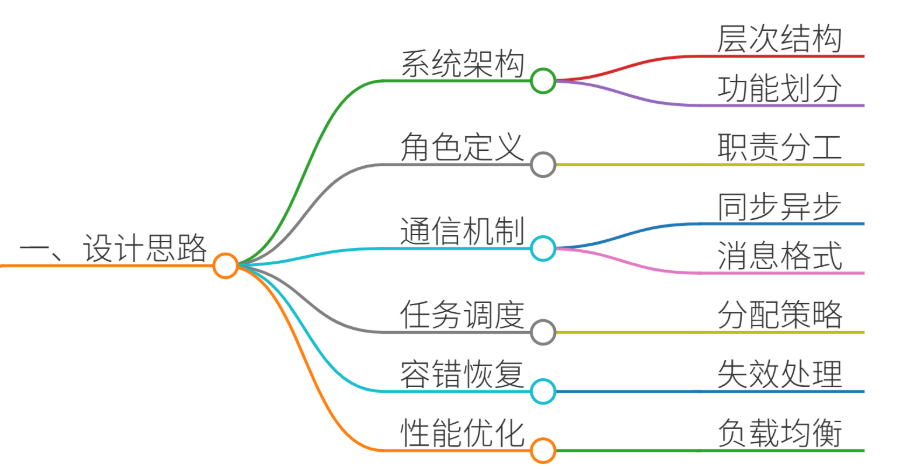
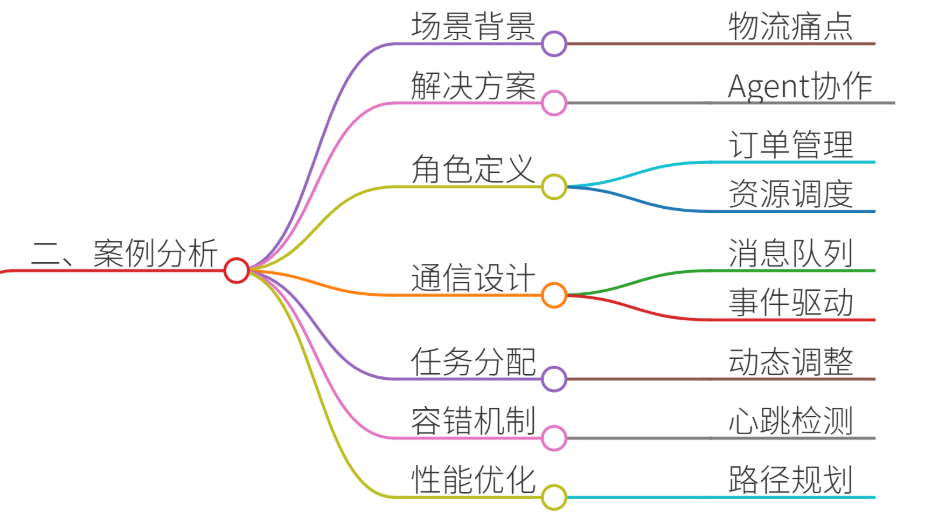
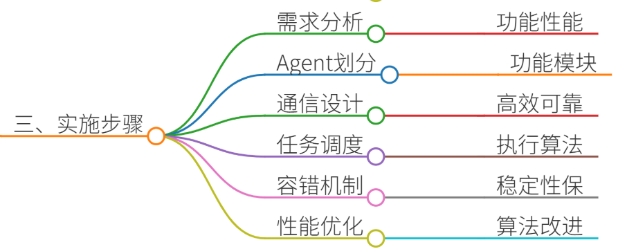
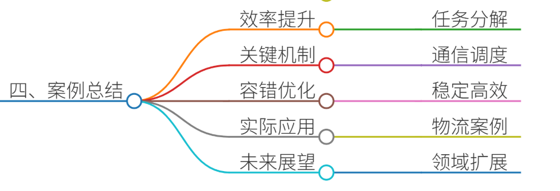

# 55.如何设计一个多Agent协作系统架构

### 一、答题思路

在设计多Agent协作系统架构时，需要从以下几个方面进行考虑：

1. **系统架构设计**：明确系统的层次结构，包括Agent的类型、功能划分、通信机制等。
2. **Agent角色定义**：每个Agent的职责和功能，如何协作完成任务。
3. **通信机制**：Agent之间的信息传递方式，包括同步/异步通信、消息格式等。
4. **任务分配与调度**：如何将任务分配给不同的Agent，并协调它们的执行。
5. **容错与恢复**：系统在部分Agent失效时的处理机制。
6. **性能优化**：如何提高系统的整体性能，包括负载均衡、资源管理等。

### 二、结合案例

#### 案例背景：智能物流仓储系统
**场景描述**： 某大型电商公司需要优化其仓储物流系统，以提高订单处理效率和减少错误率。现有的系统存在以下痛点：

1. **订单处理效率低**：人工分拣和调度效率低下，尤其是在高峰期。
2. **错误率高**：人工操作容易出错，导致订单配送错误。
3. **资源利用率低**：仓储设备和人力资源分配不均，部分区域闲置，部分区域超负荷。
4. **动态调整能力差**：系统难以快速响应突发订单或设备故障。

**解决方案**： 设计一个多Agent协作的智能物流仓储系统，通过多个Agent协同工作，实现自动化订单处理、资源调度和错误检测。

#### Agent角色定义：
1. **订单管理Agent**：负责接收和处理订单信息，将订单分解为具体的任务。
2. **资源调度Agent**：负责仓储设备和人力资源的调度，确保资源的高效利用。
3. **路径规划Agent**：为仓储机器人和分拣设备规划最优路径，减少移动时间。
4. **错误检测Agent**：实时监控订单处理过程，检测并纠正错误。
5. **监控Agent**：监控系统运行状态，及时发现并处理异常。

#### 通信机制：
+ **消息队列**：Agent之间通过消息队列进行异步通信，确保消息的可靠传递。
+ **事件驱动**：系统采用事件驱动架构，Agent根据事件触发相应的行为。

#### 任务分配与调度：
+ **动态任务分配**：订单管理Agent根据订单优先级和资源状态，动态分配任务给其他Agent。
+ **负载均衡**：资源调度Agent实时监控各区域的负载情况，动态调整资源分配。

#### 容错与恢复：
+ **心跳检测**：监控Agent定期检测各Agent的运行状态，发现异常时启动恢复机制。
+ **任务重试**：错误检测Agent在发现错误时，自动触发任务重试或重新分配。

#### 性能优化：
+ **路径优化**：路径规划Agent使用A*算法或Dijkstra算法，规划最优路径。
+ **资源预测**：资源调度Agent根据历史数据预测未来的资源需求，提前进行调整。

### 三、参考回答

在设计多Agent协作系统架构时，可以按照以下步骤进行：

1. **需求分析**：明确系统的功能和性能需求，例如订单处理速度、错误率、资源利用率等。
2. **Agent划分**：根据功能需求，将系统划分为多个Agent，每个Agent负责特定的功能。
3. **通信设计**：设计Agent之间的通信机制，确保信息传递的高效和可靠。
4. **任务调度**：设计任务分配和调度算法，确保任务的高效执行。
5. **容错机制**：设计系统的容错和恢复机制，确保系统的稳定性。
6. **性能优化**：通过算法优化和资源管理，提高系统的整体性能。

以智能物流仓储系统为例：

1. **订单管理Agent**接收订单后，将其分解为具体的分拣和配送任务。
2. **资源调度Agent**根据当前资源状态，分配仓储机器人和分拣设备。
3. **路径规划Agent**为机器人规划最优路径，减少移动时间。
4. **错误检测Agent**实时监控订单处理过程，发现错误时自动纠正。
5. **监控Agent**监控系统运行状态，发现异常时启动恢复机制。

通过多Agent的协同工作，系统能够高效处理订单，减少错误率，并动态调整资源分配，适应突发需求。

### 四、总结收尾

多Agent协作系统架构通过将复杂任务分解为多个子任务，并由专门的Agent负责执行，能够显著提高系统的效率和可靠性。在智能物流仓储系统中，多Agent协作不仅解决了订单处理效率低、错误率高的问题，还通过动态资源调度和路径优化，提高了资源利用率和系统响应速度。

未来，随着人工智能和物联网技术的发展，多Agent协作系统将在更多领域得到应用，例如智能制造、智慧城市等。通过不断优化Agent的协作机制和算法，可以进一步提升系统的性能和适应性，为各行各业带来更大的价值。

**总结要点**：

1. 多Agent协作系统通过任务分解和专门化，提高效率和可靠性。
2. 通信机制和任务调度是关键，确保Agent之间的高效协作。
3. 容错和性能优化机制保障系统的稳定性和高性能。
4. 实际案例（如智能物流仓储系统）展示了多Agent协作的实际效果和优势。
5. 未来多Agent协作系统将在更多领域发挥重要作用。

> 更新: 2025-07-14 15:45:30  
> 原文: <https://www.yuque.com/tulingzhouyu/db22bv/xg5omh56utn7rckl>