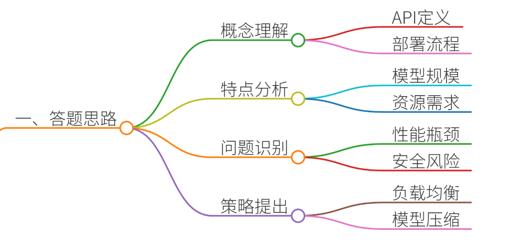
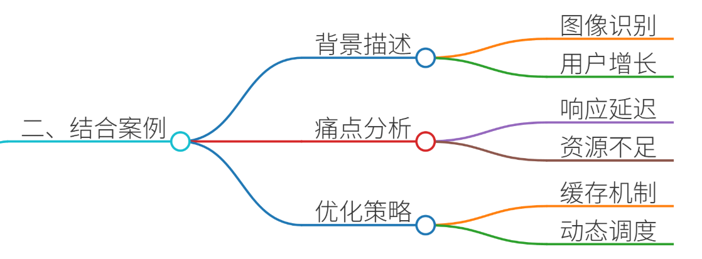
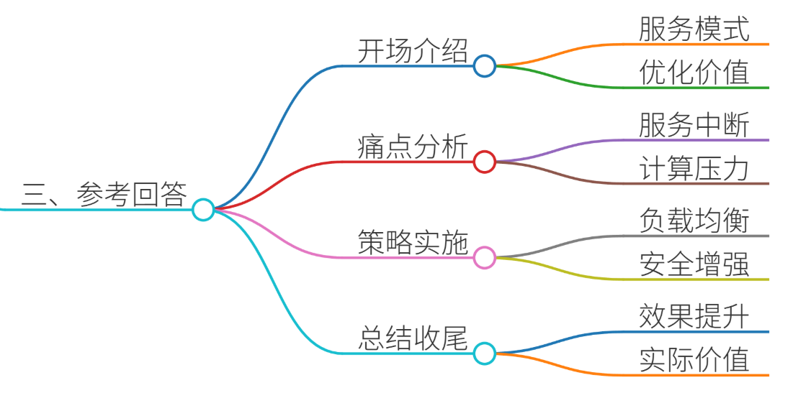

# 56.大模型API服务部署优化

### 一、答题思路

在面试大模型开发工程师时，面试官可能会问到“大模型API服务部署优化”这一问题。为了回答这个问题，我们需要从以下几个方面进行结构化解答：

1. **理解API服务部署的基本概念**：首先，需要明确API服务部署的基本概念，包括API的定义、作用、部署流程等。
2. **分析大模型API服务的特点**：大模型API服务与传统API服务有所不同，需要分析其特点，如模型规模、计算资源需求、响应时间等。
3. **识别部署优化中的关键问题**：在部署大模型API服务时，可能会遇到哪些关键问题，如性能瓶颈、资源管理、安全性等。
4. **提出具体的优化策略**：针对识别出的问题，提出具体的优化策略，如负载均衡、缓存机制、模型压缩等。
5. **结合真实项目案例进行说明**：通过具体案例，详细说明如何应用这些优化策略，以及实施后的效果。

### 二、结合案例

#### 案例背景
假设我们有一个基于深度学习的大模型API服务，用于图像识别。该服务在初期部署后，随着用户量的增加，出现了响应时间延长、服务器负载过高等问题。我们需要对API服务进行优化，以提升用户体验和系统稳定性。

#### 痛点分析
1. **性能瓶颈**：随着用户请求的增加，服务器的处理能力达到上限，导致响应时间延长。
2. **资源管理**：大模型需要大量的计算资源，如何高效利用和管理这些资源成为一个挑战。
3. **安全性**：API服务需要保证数据的安全性和隐私保护，防止未授权访问和数据泄露。

#### 优化策略
1. **负载均衡**：通过负载均衡技术，将用户请求分发到多个服务器，避免单点过载。
2. **缓存机制**：引入缓存机制，将常用的请求结果缓存起来，减少重复计算，提高响应速度。
3. **模型压缩**：对大模型进行压缩，减少模型大小和计算量，提升推理速度。
4. **资源调度**：采用动态资源调度策略，根据负载情况动态调整计算资源，提高资源利用率。
5. **安全性增强**：加强API的安全防护，采用HTTPS加密传输，设置访问控制策略，防止未授权访问。

### 三、参考回答

在回答面试官的问题时，可以按照以下结构进行：

1. **开场介绍**：简要介绍大模型API服务的基本概念和重要性。
2. **痛点分析**：详细描述在部署大模型API服务时遇到的具体问题和痛点。
3. **优化策略**：逐一介绍所采取的优化策略，并结合案例详细说明实施过程和效果。
4. **总结收尾**：总结优化工作的整体效果，强调优化策略的重要性和实际应用价值。

#### 具体回答
**开场介绍**：

“大模型API服务是指通过API接口将大模型的能力提供给外部应用调用的一种服务模式。随着大模型在各个领域的广泛应用，如何高效、稳定地部署和优化这些API服务，成为了我们面临的重要挑战。”

**痛点分析**：

“在我们的项目中，随着用户量的增加，API服务的响应时间逐渐变长，服务器负载过高，甚至出现了服务中断的情况。这不仅影响了用户体验，也对系统的稳定性构成了威胁。”

**优化策略**：

“为了解决这些问题，我们采取了以下优化策略：

1. **负载均衡**：我们引入了负载均衡器，将用户请求分发到多个服务器上，避免了单点过载的问题。通过负载均衡，我们成功地分散了流量，提升了系统的整体处理能力。
2. **缓存机制**：我们在API服务中引入了缓存机制，将常用的请求结果缓存起来。这样，当用户再次发起相同的请求时，可以直接从缓存中获取结果，避免了重复计算，大大提升了响应速度。通过缓存机制，我们减少了服务器的计算压力，提升了系统的响应速度。
3. **模型压缩**：我们对大模型进行了压缩处理，减少了模型的大小和计算量。通过模型压缩，我们不仅提升了推理速度，还降低了服务器的资源消耗。模型压缩后，我们在相同的硬件资源下，能够处理更多的请求。
4. **资源调度**：我们采用了动态资源调度策略，根据实时的负载情况动态调整计算资源。在高峰期，增加计算资源以满足需求；在低谷期，减少资源以节约成本。通过资源调度，我们提高了资源利用率，降低了运营成本。
5. **安全性增强**：我们加强了API的安全防护，采用了HTTPS加密传输，设置了访问控制策略，防止了未授权访问和数据泄露。通过安全性增强，我们保护了用户数据的安全，提升了系统的整体安全性。”

**总结收尾**：

“通过上述优化策略的实施，我们成功地解决了大模型API服务中的性能瓶颈、资源管理和安全性问题。系统响应时间显著缩短，服务器负载得到了有效控制，用户体验得到了极大提升。这些优化策略不仅在技术上具有重要意义，也在实际应用中展现了巨大的价值。”

### 四、总结收尾

在回答面试官的问题时，不仅要详细说明优化策略和实施过程，还要强调这些策略的实际效果和价值。通过具体案例的说明，可以让面试官更直观地了解你的技术能力和解决问题的思路。最后，总结优化工作的整体效果，强调优化策略的重要性和实际应用价值，给面试官留下深刻的印象。

> 更新: 2025-07-14 15:45:30  
> 原文: <https://www.yuque.com/tulingzhouyu/db22bv/gd4tl8xv7gf64kle>